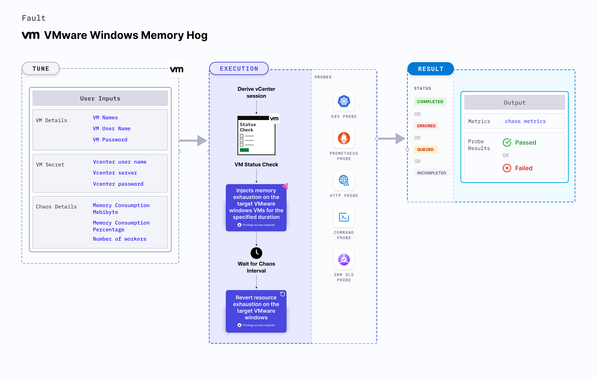

VMware Windows Memory hog applies stress on the Memory resources on Windows OS based VMware VM.
- It checks the performance of the application running on the VMware Windows VMs.



## Use cases

- VMware Windows Memory hog determines the resilience of an application when stress is applied on the Memory resources of a VMware Windows virtual machine.
- VMware Windows Memory hog simulates the situation of lack of Memory for processes running on the application, which degrades their performance. 
- It verifies the autopilot functionality of services or application on the VM.

:::note
- Kubernetes > 1.16 is required to execute this fault.
- Execution plane should be connected to vCenter and host vCenter on port 443. 
- VMware tool should be installed on the target VM with remote execution enabled.
- Adequate vCenter permissions should be provided to access the hosts and the VMs.
- The VM should be in a healthy state before and after injecting chaos.
- Kubernetes secret has to be created that has the Vcenter credentials in the `CHAOS_NAMESPACE`. 
- Ensure installation of [Testlimit](https://learn.microsoft.com/en-us/sysinternals/downloads/testlimit) on the target VM, a prerequisite for this experiment. Execute the fault using the built-in Administrator user to ensure permissions for memory stress testing. [Instructions to enable the built-in Administrator in Windows](https://learn.microsoft.com/en-us/windows-hardware/manufacture/desktop/enable-and-disable-the-built-in-administrator-account?view=windows-11).

- VM credentials can be passed as secrets or as a chaos enginer environment variable.

```yaml
apiVersion: v1
kind: Secret
metadata:
  name: vcenter-secret
  namespace: litmus
type: Opaque
stringData:
    VCENTERSERVER: XXXXXXXXXXX
    VCENTERUSER: XXXXXXXXXXXXX
    VCENTERPASS: XXXXXXXXXXXXX
```

:::

## Fault tunables

   <h3>Mandatory fields</h3>
    <table>
      <tr>
        <th> Variables </th>
        <th> Description </th>
        <th> Notes </th>
      </tr>
      <tr>
        <td> VM_NAME </td>
        <td> Name of the target VM. </td>
        <td> For example, <code>win-vm-1</code> </td>
      </tr>
      <tr>
          <td> VM_USER_NAME </td>
          <td> Username of the target VM.</td>
          <td> For example, <code>vm-user</code>. </td>
      </tr>
      <tr>
          <td> VM_PASSWORD </td>
          <td> User password for the target VM. </td>
          <td> For example, <code>1234</code>. Note: You can take the password from secret as well. </td>
      </tr>
    </table>
    <h3>Optional fields</h3>
    <table>
      <tr>
        <th> Variables </th>
        <th> Description </th>
        <th> Notes </th>
      </tr>
      <tr>
        <td> MEMORY_CONSUMPTION </td>
        <td> Amount of Memory to consume in MB. </td>
        <td> Default: 0. For more information, go to <a href="#memory-consumption"> memory consumption.</a></td>
      </tr>
      <tr>
        <td> MEMORY_PERCENTAGE </td>
        <td> Percentage of total Memory to consume. </td>
        <td> Default: 50. For more information, go to <a href="#memory-percentage"> memory percentage.</a></td>
      </tr>
      <tr>
        <td> TOTAL_CHAOS_DURATION </td>
        <td> Duration that you specify, through which chaos is injected into the target resource (in seconds).</td>
        <td> Default: 60s. For more information, go to <a href="../common-tunables-for-all-faults#duration-of-the-chaos"> duration of the chaos. </a></td>
      </tr>
      <tr>
        <td> RAMP_TIME </td>
        <td> Period to wait before and after injecting chaos (in seconds). </td>
        <td> For example, 30 s. For more information, go to <a href="../common-tunables-for-all-faults#ramp-time"> ramp time. </a></td>
      </tr>
      <tr>
        <td> SEQUENCE </td>
        <td> Sequence of chaos execution for multiple instances. </td>
        <td> Default: parallel. Supports serial and parallel sequence. For more information, go to <a href="../common-tunables-for-all-faults#sequence-of-chaos-execution"> sequence of chaos execution.</a></td>
      </tr>
    </table>

### Memory consumption
The `MEMORY_CONSUMPTION` environment variable applies stress on the target Windows VM for a specific duration.

Use the following example to specify Memory consumption:

[embedmd]:# (./static/manifests/vmware-windows-memory-hog/vm-memory-hog-consumption.yaml yaml)
```yaml
apiVersion: litmuschaos.io/v1alpha1
kind: ChaosEngine
metadata:
  name: engine-nginx
spec:
  engineState: "active"
  chaosServiceAccount: litmus-admin
  experiments:
  - name: vmware-windows-memory-hog
    spec:
      components:
        env:
        # Name of the VM
        - name: VM_NAME
          value: 'test-vm-01'
       # Memory consumption in MB
        - name: MEMORY_CONSUMPTION 
          value: '1024'
```

### Memory percentage
The `MEMORY_PERCENTAGE` environment variable applies stress on the target Windows VM for a specific duration. It consumes the specified percentage of the total Memory resources.

Use the following example to specify Memory percentage:

[embedmd]:# (./static/manifests/vmware-windows-memory-hog/vm-memory-hog-percentage.yaml yaml)

```yaml
apiVersion: litmuschaos.io/v1alpha1
kind: ChaosEngine
metadata:
  name: engine-nginx
spec:
  engineState: "active"
  chaosServiceAccount: litmus-admin
  experiments:
  - name: vmware-windows-memory-hog
    spec:
      components:
        env:
        # Name of the VM
        - name: VM_NAME
          value: 'test-vm-01'
       # Memory percentage to consume
        - name: MEMORY_PERCENTAGE 
          value: '50'
```
