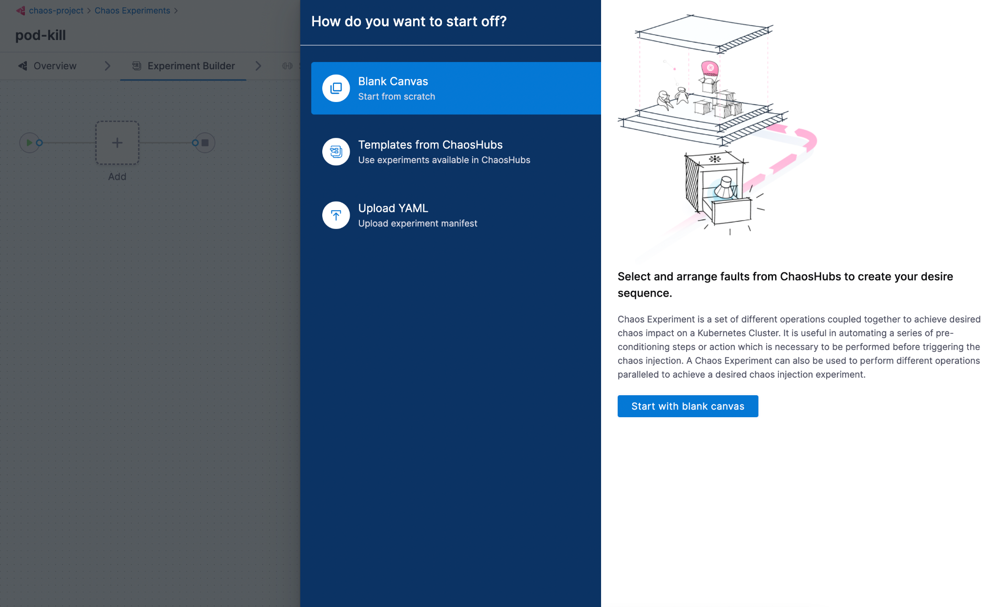
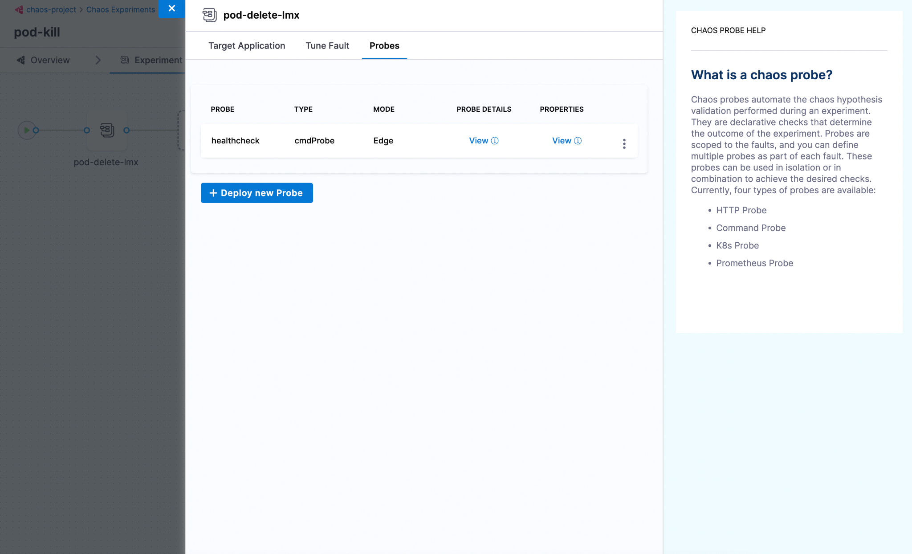
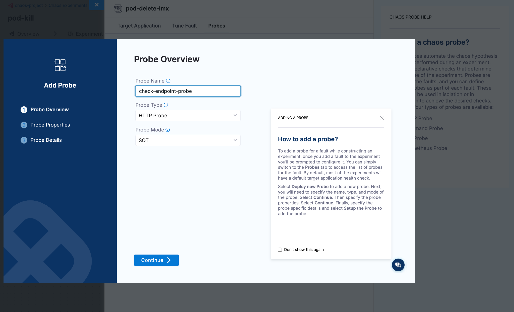
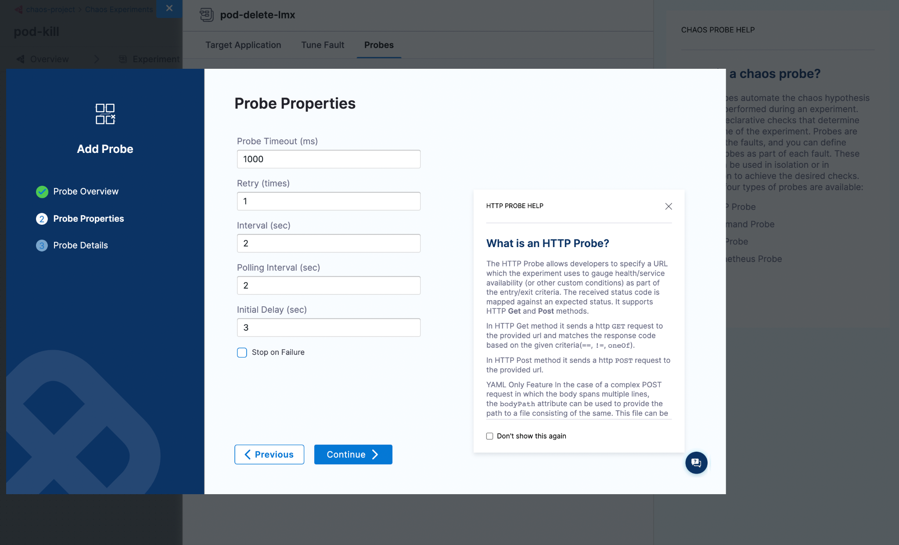
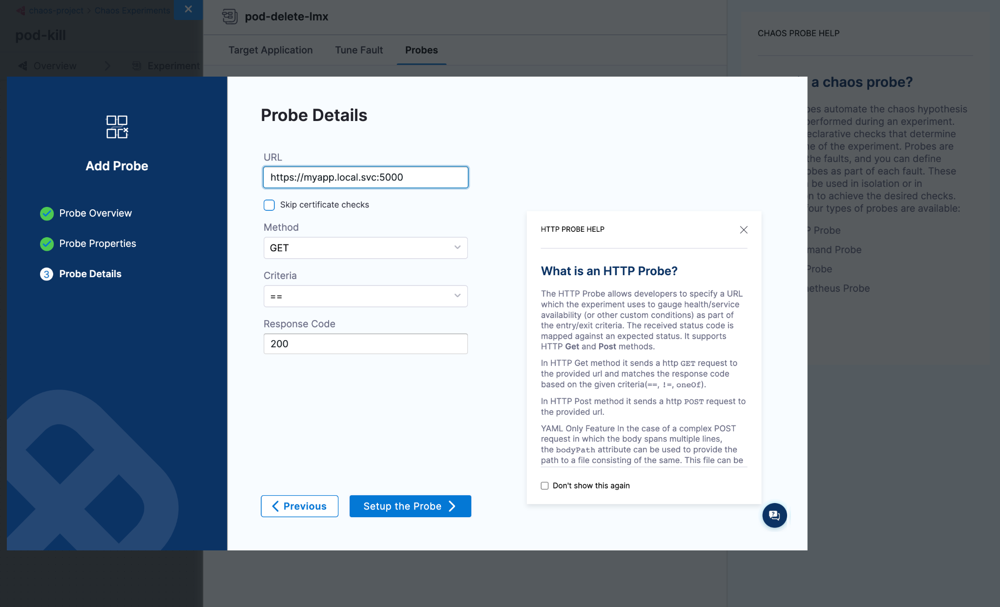
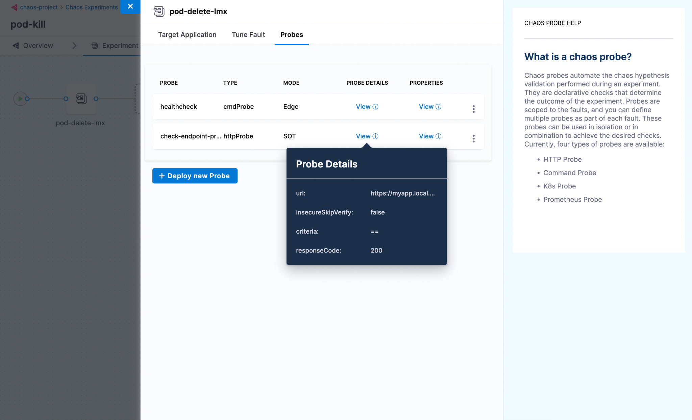

A probe explores the behavior of a system in a chaotic or unpredictable manner and helps validate the declarative hypothesis set by the user. The goal of a chaos probe is to understand the underlying patterns and laws that govern the behavior of these systems, and to use that understanding to predict or control their behavior.

## Before You Begin

- [Probe Overview](/docs/chaos-engineering/technical-reference/probes/overview)
- [Chaos Faults](/docs/chaos-engineering/technical-reference/faults)

## Prerequisites

- To configure and setup a probe inside a fault there should be an active chaos infrastructure to schedule the chaos experiment in.
- Enterprise Hub connectivity status should be active

## Requirements

- Probe requires the Chaos Experiment Read/Write access to be able to schedule/navigate to the probe addition UI.
- Probe requires at least the Chaos Infra Read access to be able to select a Chaos Infrastructure while creating an experiment.
- Probe requires at least the Chaos Hub Read access to be able to select faults from Chaos Hub while creating an experiment.

## Step 1: Navigate to Chaos Experiment Creation

Navigate to the Create Experiment View by clicking the `+ New Experiment` button and provide a name, description and tag for your experiment.

Choose the active chaos infrastructure on which this experiment would be scheduled. This step is required so that we can proceed to the fault selection step where probes can be configured.


And then click on `Start with blank canvas` once you see the start off drawer pop out.



## Step 2: Select a fault

Click on the `+` icon to open the fault selection drawer and choose the fault which you would like to execute in your chaos experiment based on the hypothesis decided.

Once a fault is clicked a Tuning drawer opens up with the fault name as a title, navigate to the last tab which says `Probes`. A default health check command probe should already be present. You can either add or replace the existing probe with a new one by clicking on the `+ Deploy new Probe` button.



## Step 3: Add Probe

Once the `Add Probe` modal opens up, provide a name for your probe, the type of the probe from a selection of HTTP, Command, Kuberentes and Prometheus Probe followed by the mode in which the probe will run.



Provide the necessary probe attributes, since we chose HTTP Probe, we can see attributes related to HTTP, like URL, Method, Criteria, etc along with the common probe properties.




## Step 4: Save the probe

Once done, click on `Setup the Probe >` and your newly configured probe should be saved and appended to the manifest already. To view the configurations just saved, hover over `View` of the respective section.



## Using YAML

The entire manifest is available as YAML also, which can be accessed by switching over to the YAML view in Chaos Studio.

```yaml
kind: Workflow
apiVersion: argoproj.io/v1alpha1
spec:
 templates:
    - name: pod-delete-lmx
     inputs:
       artifacts:
         - name: pod-delete-lmx
           path: /tmp/chaosengine-pod-delete-lmx.yaml
           raw:
             data: |
               apiVersion: litmuschaos.io/v1alpha1
               kind: ChaosEngine
               spec:
                 experiments:
                   - name: pod-delete
                     spec:
                       probe:
                         - name: healthcheck
                           type: cmdProbe
                           mode: Edge
                           runProperties:
                             probeTimeout: 180
                             retry: 0
                             interval: 1
                             stopOnFailure: true
                           cmdProbe/inputs:
                             command: ./healthcheck -name pod-level
                             source:
                               image: chaosnative/go-runner:ci
                               inheritInputs: true
                             comparator:
                               type: string
                               criteria: contains
                               value: "[P000]"
                         - name: check-endpoint-probe
                           type: httpProbe
                           mode: SOT
                           httpProbe/inputs:
                             url: https://myapp.local.svc:5000
                             insecureSkipVerify: false
                             method:
                               get:
                                 criteria: ==
                                 responseCode: "200"
                           runProperties:
                             probeTimeout: 1000
                             interval: 2
                             retry: 1
                             probePollingInterval: 2
                             initialDelaySeconds: 3
                             stopOnFailure: false
```
