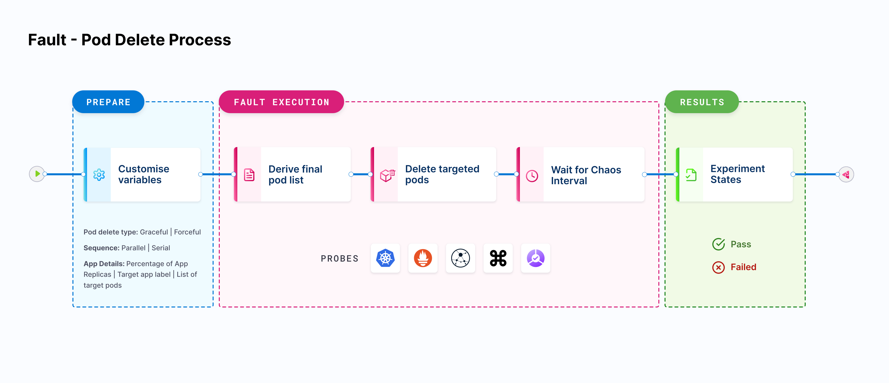

## Declarative hypothesis

Declarative Hypothesis in a cloud-native chaos engineering environment is a way of specifying the expected outcome of a chaos experiment before it is run. It is a statement that defines the expected result of the experiment, and is used to guide the experiment's design and implementation. This can be done as a part of defining the fault specs in the respective Chaos Engine which can be validated by the Chaos Operator.

This hypothesis serves as a way to ensure that the experiment is well-defined and that the results can be easily understood. It also helps to ensure that the experiment is repeatable and that the results can be compared across different runs.

Declarative Hypotheses in Chaos engineering can be written in a simple, clear and concise manner, it should be **specific, measurable, achievable, relevant and time-bound (SMART)**. The steady state and declarative hypothesis set by the user should directly map with the SLOs.

## Probe



Probes are pluggable checks that can be defined within the Chaos Engine for any Chaos Experiment. The experiment pods execute these checks based on the mode they are defined in & factor their success as necessary conditions in determining the verdict of the experiment (along with the standard in-built checks).

A probe explores the behavior of a system in a chaotic or unpredictable manner and helps validate the declarative hypothesis set by the user. The goal of a chaos probe is to understand the underlying patterns and laws that govern the behavior of these systems, and to use that understanding to predict or control their behavior.

A probe, with its spec defined in the Chaos Engine, is triggered by the Chaos Runner once the Chaos Engine starts executing and spawning Chaos Jobs with the probe configuration.

### Types

CE facilitates four types of probes.

- **HTTP Probe**: To query health/downstream URIs
- **Command Probe**: To execute any user-desired health-check function implemented as a shell command
- **Kubernetes Probe**: To perform CRUD operations against native & custom Kubernetes resources
- **Prometheus Probe**: To execute PromQL queries and match prometheus metrics for specific criteria

Each type of probe has its own advantages and disadvantages, and the choice of probe depends on the specific requirements of the experiment and the system being tested.

These probes can be used in isolation or in several combinations to achieve the desired checks. While the HTTP Probe and Kubernetes Probe are fully declarative in the way they are conceived, the cmdProbe expects the user to provide a shell command to implement checks that are highly specific to the application use case. Prometheus Probe expects the user to provide a PromQL query along with Prometheus service endpoints to check for specific criteria.

### Mode

The probe mode refers to the way in which a probe checks the system's health during a chaos experiment. The probes can be set up to run in different modes:

- **SoT**: Executed at the Start of Test as a pre-chaos check
- **EoT**: Executed at the End of Test as a post-chaos check
- **Edge**: Executed both, before and after the chaos
- **Continuous**: The probe is executed continuously, with a specified polling interval during the chaos injection.
- **OnChaos**: The probe is executed continuously, with a specified polling interval strictly for chaos duration of chaos

## Default probe

By default, each fault imported in Chaos Studio would have a health check command probe configured in Edge mode. A Health check probes helps to ensure that the application remains available and responsive to user requests even in the event of unexpected failures. By regularly checking the health of the containers, Kubernetes can automatically take action if a container is not healthy, such as restarting or removing the container, to maintain the availability and responsiveness of the application.

It is mandatory to have at least one probe configured in a Chaos Experiment to validate user defined/default checks against the application.

## Who should use probes?

Chaos probes are used by developers, quality assurance engineers, and system administrators to monitor the health, test the resilience, execute custom user-desired checks/functions, to perform CRUD operations, etc depending on the type of the probe, usually against the applications under chaos running on a Kubernetes cluster.

By injecting known failures into the system, they can identify and fix issues before they occur in production. Probes can be used to test scenarios such as network partitioning, pod failures, and node failures, it can also be used to test the behavior of applications during such scenarios.

In general, anyone responsible for maintaining and deploying applications in a Kubernetes cluster, especially in a production environment, should consider using chaos probes to proactively identify and fix issues in their applications.


## Why use probes?

By injecting known failures into the system, chaos probes can identify and fix issues before they occur in production. This can help ensure that the application remains available and responsive to user requests even in the event of unexpected failures.

Without using chaos probes, it would be difficult to identify and fix issues related to the resiliency and fault-tolerance of an application. In a production environment, it is hard to predict when and how failures will occur, and it can be difficult to test for all possible scenarios. By using chaos probes, it is possible to simulate different types of failures and test how the application behaves under different conditions.

Additionally, Chaos probes also help in understanding the behavior of the application during such scenarios and fine tuning the application for better resiliency.

In summary, chaos probes provide a way to proactively identify and fix issues in an application, and can help ensure that the application remains available and responsive to user requests even in the event of unexpected failures. Without using chaos probes, it would be difficult to fully test and understand the resiliency and fault-tolerance of an application.

### Common use cases

Some common use cases of probes include:

1. Network partitioning: Testing how an application behaves when network connectivity is lost between different components.
2. Pod failures: Testing how an application behaves when a pod in a Kubernetes cluster is terminated or becomes unavailable.
3. Node failures: Testing how an application behaves when a node in a Kubernetes cluster is terminated or becomes unavailable.
4. Resource exhaustion: Testing how an application behaves when resources such as CPU or memory are exhausted.
5. Latency injection: Testing how an application behaves when network latency is increased.
6. Configuration change: Testing how an application behaves when the configuration is changed.
7. Identifying bottlenecks: Identifying the bottlenecks in the system and making sure that the system can handle such scenarios.
8. Testing disaster recovery: Testing the disaster recovery plan and making sure that the system can recover from an unexpected failure.
9. Testing application scalability: Testing the scalability of the application and making sure that the system can handle more traffic.
10. Testing Kubernetes components: Testing the behavior of Kubernetes components like apiserver, etcd, controller manager and kubelet.

These are some of the common use cases where chaos probes can be used but it can also be used in other scenarios as well depending on the requirements of the application and the system.

## Effects on the resilience score

In a chaos experiment, the probe success percentage refers to the percentage of successful probes out of the total number of probes run during a chaos experiment. The value depends on the successful outcome of the probe criteria based on the type and mode selected. There are two possible values of probe success percentage for each of the probe criterias, either `0`(if the criteria assertion fails) or `100`(if the criteria assertion passes).

The probe success percentage for each of the probes mentioned in the fault plays an important role in determining the final Resilience Score of the experiment. The Resilience Score of a Chaos Experiment is calculated by this formula:

```
Σ(Weights(fault) x Probe Percentage(fault)) / Σ Weights(fault)
```

It is an important metric in evaluating the results of a chaos experiment and can be used to identify which parts of the system are most affected by the chaos injection and where improvements need to be made. It also helps to understand the behavior of the application during the chaos scenario and fine tune the application for better resiliency.


## Probe status and deriving inferences

The chaos experiments run the probes defined in the ChaosEngine and update their stage-wise success in the ChaosResult custom resource, with details including the overall **probeSuccessPercentage** (a ratio of successful checks v/s total probes) and failure step, where applicable. The success of a probe is dependent on whether the expected status/results are met and also on whether it is successful in all the experiment phases defined by the probe’s execution mode. For example, probes that are executed in “Edge” mode, need the checks to be successful both during the pre-chaos & post-chaos phases to be declared as successful.

The pass criteria for an experiment is the logical conjunction of all probes defined in the ChaosEngine and an inbuilt entry/exit criteria. Failure of either indicates a failed hypothesis and is deemed experiment failure.


## Probe chaining

:::info YAML only feature
This feature can only be defined using the YAML manifest for now.
:::

Probe chaining enables reuse of probe a result represented by the template function `{{ .<probeName>.probeArtifact.Register}})` in subsequent "downstream" probes defined in the ChaosEngine. Note that the order of execution of probes in the experiment depends purely on the order in which they are defined in the ChaosEngine.

Probe chaining is currently supported only for Command Probe. Following is an example of probe chaining, where the result of the first probe is being used in the command of the second probe.

```yaml
probe:
  - name: "probe1"
    type: "cmdProbe"
    cmdProbe/inputs:
      command: "<command>"
      comparator:
        type: "string"
        criteria: "equals"
        value: "<value-for-criteria-match>"
      source: "inline"
    mode: "SOT"
    runProperties:
      probeTimeout: 5
      interval: 5
      retry: 1
  - name: "probe2"
    type: "cmdProbe"
    cmdProbe/inputs:
      ## probe1's result being used as one of the args in probe2
      command: "<command> {{ .probe1.ProbeArtifacts.Register }} <arg2>"
      comparator:
        type: "string"
        criteria: "equals"
        value: "<value-for-criteria-match>"
      source: "inline"
    mode: "SOT"
    runProperties:
      probeTimeout: 5
      interval: 5
      retry: 1
```
