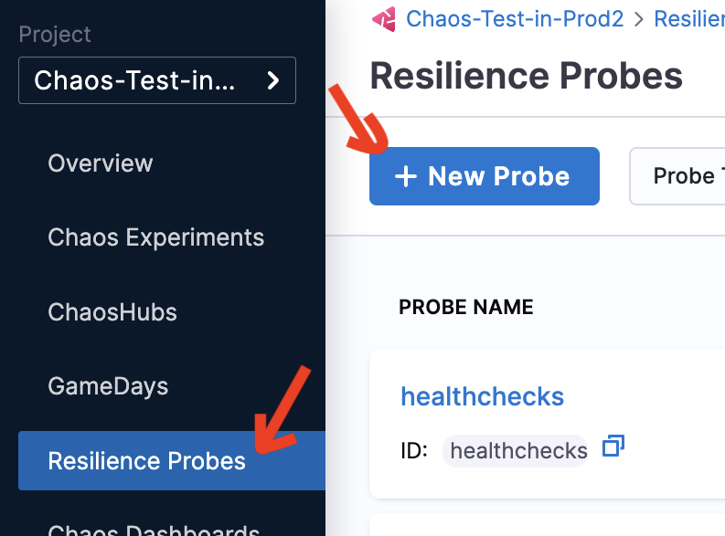
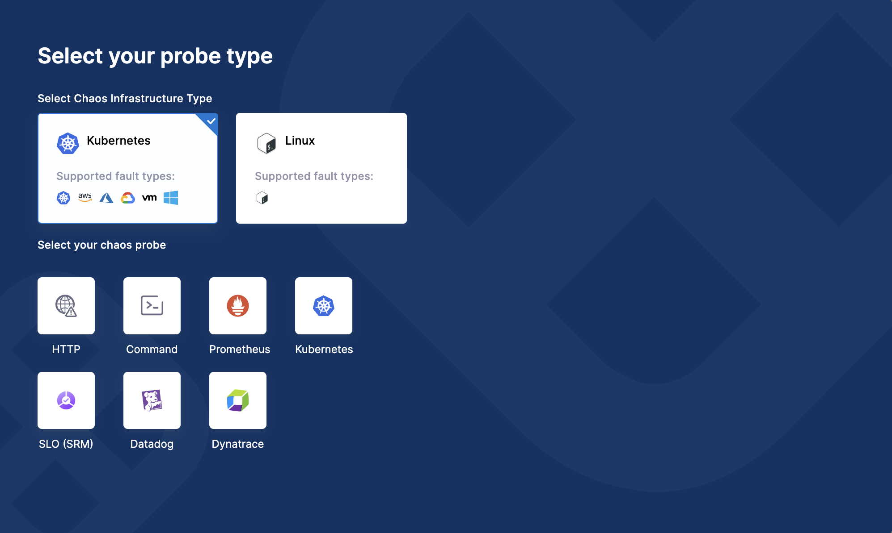
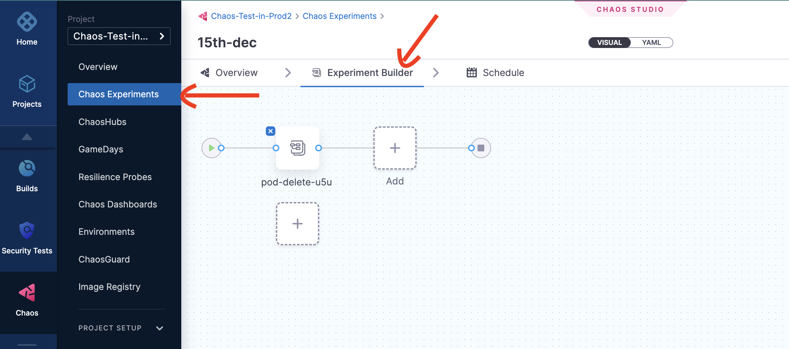
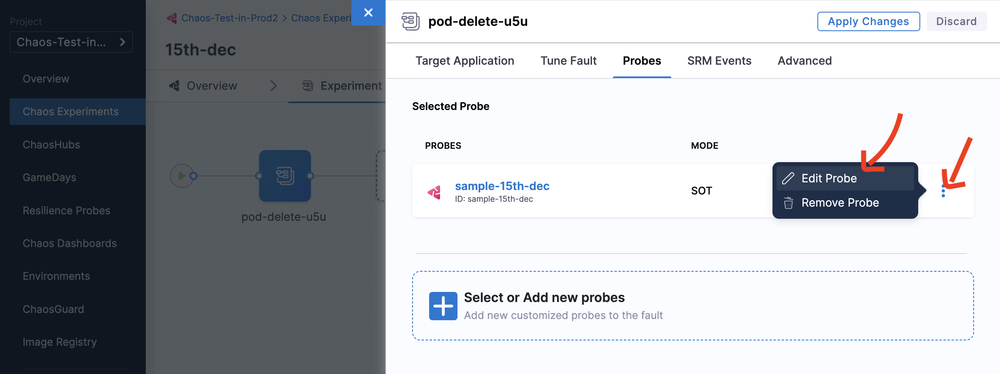
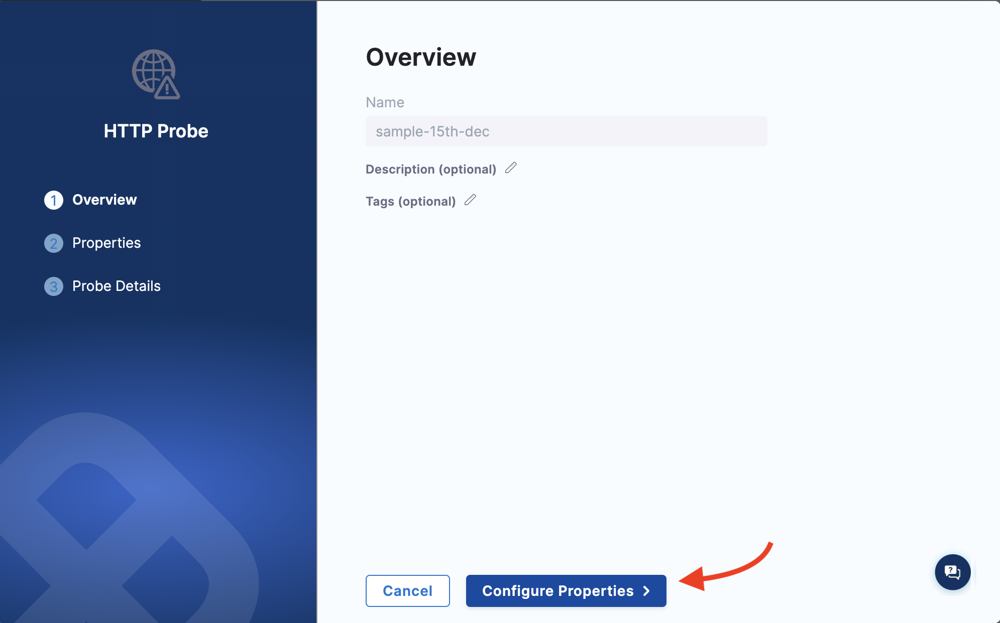
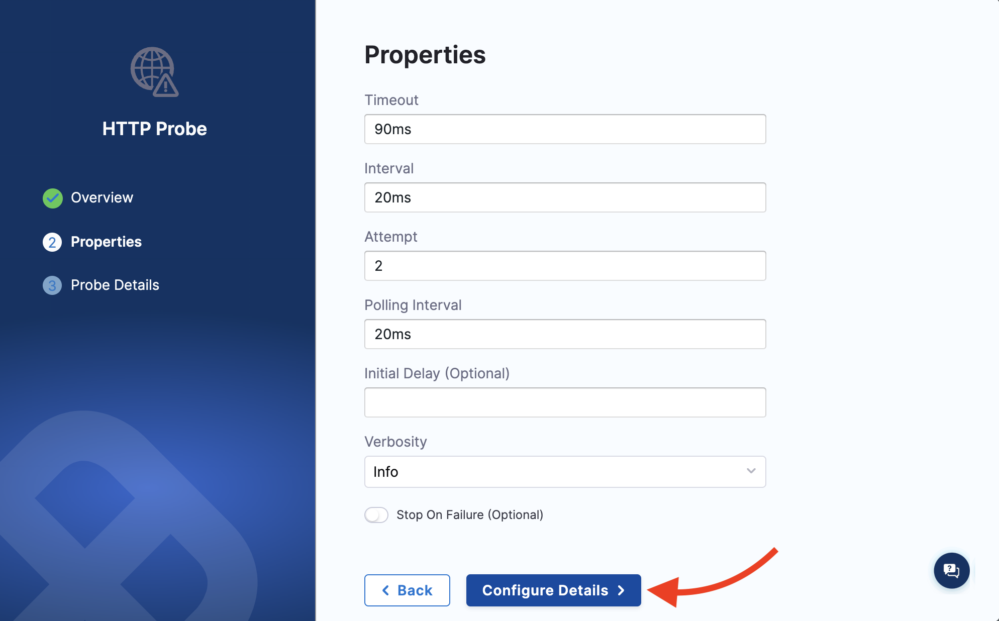
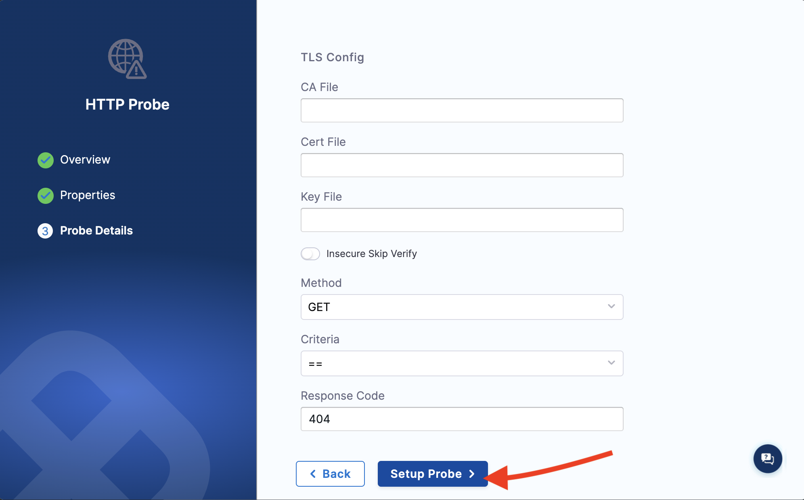
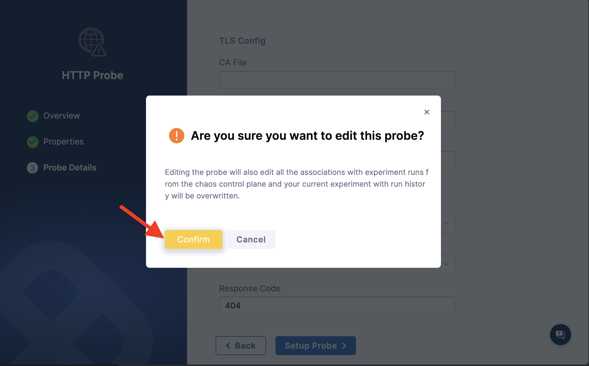

## Before you begin

- [Probes overview](./overview)
- [Configure probes](../../configure-chaos-experiments/probes/configure-and-add-probe)

This section discusses various operations that can be performed on [resilience probes](./overview).

## Create resilience probes

### Step 1: Navigate to Resilience Probes
Navigate to **Resilience Probes** and click **New Probe**.

### Step 2: Select the infrastructure and type
HCE allows you to create probes for two infrastructures, namely, Kubernetes and Linux. The type of probes allowed on each of these infrastructures is listed below.

| Kubernetes | Linux     |
|------------|-----------|
| HTTP       | HTTP      |
| Command    | Command   |
| Datadog    | Datadog   |
| Dynatrace  | Dynatrace |
| SLO        |           |
| Prometheus |           |
| Kubernetes |           |

### Step 3: Enter relevant parameters

Based on the type of probe you select, enter the values to set up the probe.

**You can:**
- Use any number of probes within a chaos experiment.
- Use the same probes for two faults within the same chaos experiment.
- Use Kubernetes-based probes for Kubernetes experiments.
- Use Linux-based probes for Linux experiments.

**You can't:**
- Repeat the same probe multiple times in the same fault in the same experiment.

## Known limitations
Command probes in the **Source** mode is only available for Linux on the self-managed platform (SMP).

## Update resilience probes
You can update (or edit) a probe from within an experiment or from the **Resilience Probes** tab.

:::tip
Resilience probe names act as unique identifiers for a probe, which means you can't edit them. If you manually add the name of a probe in the manifest, this same name should be entered in the annotation as ID. 
:::

### Step 1: Navigate to Chaos experiment
* Choose the experiment whose resilience probe/s you wish to update. Navigate to the **Experiment builder** section of the experiment.

### Step 2: Select Probes
* Select **Probes** and click the three-dot menu next to the actual probe, and click **Edit probe**.

### Step 3: Edit the probe

* When you click on **Edit probe**, the page navigates to the probe settings. You can't edit the name, but you can edit the **Description** and **Tags**.

* Click **Configure properties** which takes you to the next page. You can edit the fields in this page. After updating the values, click **Configure details**.

* This will take you to the next page where you can edit some more details, and click **Setup probe**.

* Click **Confirm** to apply your changes to the resilience probes.

## Resilience probes status matrix
Probe status is the single source of truth when executing a chaos experiment. The probe status in a chaos experiment can be in 4 different states.

- **AWAITED**: A probe status is in ‘awaited’ state until the fault is being executed, that is, the fault is still running. Once it has completed execution, it can be in the ‘passed’, ‘failed’ or ‘N/A’ state.
- **PASSED**: A probe status is considered ‘passed’ when the success criteria is met. 
- **FAILED**: A probe status is considered ‘failed’ when the success criteria is not met.
- **RUNNING**: A probe status is considered 'running' when the probe is currently in execution.
- **N/A**: A probe status is in the ‘N/A’ state when the result of the fault could not be determined.

## Chaos hub support

Not available yet

## Force delete resilience probes

When a probe is force deleted, it will not be available for use. You will lose history of that probe, but experiment runs that used the probe will contain the history of the probe.
Once the probe is deleted, information pertaining to the probe reference is also deleted from all the manifest references, that is, the probe is removed from the probeRef annotation. This ensures that the next possible run will not schedule the probe.

## Resilience probes support
Resilience probes are supported by the following features:
- Resilience Tab
- Chaos Studio
- Experiments/Run Reports
- Linux and Kubernetes experiments
- GameDays
- Sandbox environment

## Default/System resilience probes

- You can create system (default probes) at the project level **only once**. 
- Once you create a default probe, you can't delete or disable or update it.
- If you have more that one resilience probe in your chaos experiment, you can disable, delete or update the system probe. 
- Default probes are a part of resilience probes and are entered as annotations in the experiment manifest.

## Image registry support
- You can configure the image registry to be used with the default probes. If you haven't configured a probe yet, the experiment will use default image registry. 
- HCE doesn't provide image registry support at the moment for default probes.

## Legacy probes support (Backward compatibility)
Users can still use legacy probes.

## Audit integration

There are no audit events for resilience probes.

## Access control permissions division

ACL is mapped to the experiment ACL. 

## License

Resilience probes are not a part of any subscription, and hence you don't have any limit on the number of probes you can create. With respect to usability, 1,000 probes can be executed in a month.