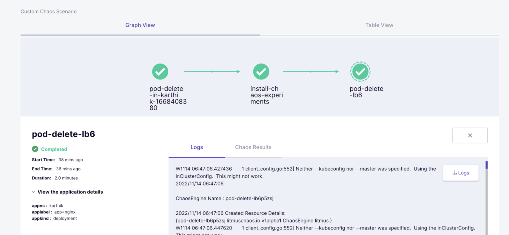

To run chaos experiments on specific namespaces, follow the below mentioned steps.

1. Install CE in cluster mode

- Install CE in cluster mode with the given installation manifest. 
- Restrict `litmus-admin` service account to certain target namespaces.

2. Delete `litmus-admin` ClusterRole and ClusterRoleBinding
- Once CE is up and running in cluster mode, delete the `litmus-admin` ClusterRole and ClusterRoleBinding to restrict the chaos scope in all namespaces.

```bash
$> kubectl delete clusterrole litmus-admin
````

```
clusterrole.rbac.authorization.k8s.io "litmus-admin" deleted
```

```bash
$> kubectl delete clusterrolebinding litmus-admin
````

```
clusterrolebinding.rbac.authorization.k8s.io "litmus-admin" deleted
```

3. Create Role and RoleBinding in all target namespaces

This allows specific namespaces for chaos operations. Create Role and RoleBinding in these specific namespaces (say `namespaceA` and `namespaceB`). 

The manifest for `role-1.yaml` in `namespaceA` will look as shown below.

```yaml
apiVersion: rbac.authorization.k8s.io/v1
kind: Role
metadata:
  name: namespaceA-chaos
  namespace: litmus
  labels:
    name: namespaceA-chaos
    app.kubernetes.io/part-of: litmus
rules:
  # Create and monitor the experiment & helper pods
  - apiGroups: [""]
    resources: ["pods"]
    verbs: ["create","delete","get","list","patch","update", "deletecollection"]
  # Performs CRUD operations on the events inside chaosengine and chaosresult
  - apiGroups: [""]
    resources: ["events"]
    verbs: ["create","get","list","patch","update"]
  # Fetch configmaps details and mount it to the experiment pod (if specified)
  - apiGroups: [""]
    resources: ["configmaps"]
    verbs: ["get","list",]
  # Track and get the runner, experiment, and helper pods log 
  - apiGroups: [""]
    resources: ["pods/log"]
    verbs: ["get","list","watch"]  
  # for creating and managing to execute comands inside target container
  - apiGroups: [""]
    resources: ["pods/exec"]
    verbs: ["get","list","create"]
  # deriving the parent/owner details of the pod(if parent is anyof {deployment, statefulset, daemonsets})
  - apiGroups: ["apps"]
    resources: ["deployments","statefulsets","replicasets", "daemonsets"]
    verbs: ["list","get"]
  # deriving the parent/owner details of the pod(if parent is deploymentConfig)  
  - apiGroups: ["apps.openshift.io"]
    resources: ["deploymentconfigs"]
    verbs: ["list","get"]
  # deriving the parent/owner details of the pod(if parent is deploymentConfig)
  - apiGroups: [""]
    resources: ["replicationcontrollers"]
    verbs: ["get","list"]
  # deriving the parent/owner details of the pod(if parent is argo-rollouts)
  - apiGroups: ["argoproj.io"]
    resources: ["rollouts"]
    verbs: ["list","get"]
  # for configuring and monitor the experiment job by the chaos-runner pod
  - apiGroups: ["batch"]
    resources: ["jobs"]
    verbs: ["create","list","get","delete","deletecollection"]
  # for creation, status polling and deletion of litmus chaos resources used within a chaos workflow
  - apiGroups: ["litmuschaos.io"]
    resources: ["chaosengines","chaosexperiments","chaosresults"]
    verbs: ["create","list","get","patch","update","delete"]
---
apiVersion: rbac.authorization.k8s.io/v1
kind: RoleBinding
metadata:
  name: namespaceA-chaos
  namespace: litmus
  labels:
    name: namespaceA-chaos
    app.kubernetes.io/part-of: litmus
roleRef:
  apiGroup: rbac.authorization.k8s.io
  kind: Role
  name: namespaceA-chaos
subjects:
- kind: ServiceAccount
  name: litmus-admin
  namespace: litmus
```

The manifest for `role-2.yaml` in `namespaceB` will look as shown below.

```yaml
apiVersion: rbac.authorization.k8s.io/v1
kind: Role
metadata:
  name: namespaceB-chaos
  namespace: namespaceB
  labels:
    name: namespaceB-chaos
    app.kubernetes.io/part-of: litmus
rules:
  # Create and monitor the experiment & helper pods
  - apiGroups: [""]
    resources: ["pods"]
    verbs: ["create","delete","get","list","patch","update", "deletecollection"]
  # Performs CRUD operations on the events inside chaosengine and chaosresult
  - apiGroups: [""]
    resources: ["events"]
    verbs: ["create","get","list","patch","update"]
  # Fetch configmaps details and mount it to the experiment pod (if specified)
  - apiGroups: [""]
    resources: ["configmaps"]
    verbs: ["get","list",]
  # Track and get the runner, experiment, and helper pods log 
  - apiGroups: [""]
    resources: ["pods/log"]
    verbs: ["get","list","watch"]  
  # for creating and managing to execute comands inside target container
  - apiGroups: [""]
    resources: ["pods/exec"]
    verbs: ["get","list","create"]
  # deriving the parent/owner details of the pod(if parent is anyof {deployment, statefulset, daemonsets})
  - apiGroups: ["apps"]
    resources: ["deployments","statefulsets","replicasets", "daemonsets"]
    verbs: ["list","get"]
  # deriving the parent/owner details of the pod(if parent is deploymentConfig)  
  - apiGroups: ["apps.openshift.io"]
    resources: ["deploymentconfigs"]
    verbs: ["list","get"]
  # deriving the parent/owner details of the pod(if parent is deploymentConfig)
  - apiGroups: [""]
    resources: ["replicationcontrollers"]
    verbs: ["get","list"]
  # deriving the parent/owner details of the pod(if parent is argo-rollouts)
  - apiGroups: ["argoproj.io"]
    resources: ["rollouts"]
    verbs: ["list","get"]
  # for configuring and monitor the experiment job by the chaos-runner pod
  - apiGroups: ["batch"]
    resources: ["jobs"]
    verbs: ["create","list","get","delete","deletecollection"]
  # for creation, status polling and deletion of litmus chaos resources used within a chaos workflow
  - apiGroups: ["litmuschaos.io"]
    resources: ["chaosengines","chaosexperiments","chaosresults"]
    verbs: ["create","list","get","patch","update","delete"]
---
apiVersion: rbac.authorization.k8s.io/v1
kind: RoleBinding
metadata:
  name: namespaceB-chaos
  namespace: namespaceB
  labels:
    name: namespaceB-chaos
    app.kubernetes.io/part-of: litmus
roleRef:
  apiGroup: rbac.authorization.k8s.io
  kind: Role
  name: namespaceB-chaos
subjects:
- kind: ServiceAccount
  name: litmus-admin
  namespace: litmus
```

:::info
The rolebinding subjects point to the `litmus-admin` service account only (in CE namespace). 
:::

#### Create the roles

```bash
$> kubectl apply -f role-1.yaml
````

```role.rbac.authorization.k8s.io/namespaceA-chaos created```
```rolebinding.rbac.authorization.k8s.io/namespaceA-chaos created```

```bash
$> kubectl apply -f role-2.yaml
```

```role.rbac.authorization.k8s.io/namespaceB-chaos created```
```rolebinding.rbac.authorization.k8s.io/namespaceB-chaos created```

4. Create Role and RoleBinding in all target namespaces

Create a Role and RoleBinding in the chaos namespace as well. This will be used by chaos runner pod to launch experiment. 

5. Verify the chaos execution on different namespaces

Run an experiment, say pod-delete in both the namespaces to verify if these namespaces have the permission to run experiments.

For namespaceA:



For namespaceA:


You are able to run chaos on the target namespaces (`namespaceA` and `namespaceB`). Now, you can check to see if namespace `test` can be used to run chaos experiments.

For `test` namespace:

The experiment fails to run and experiment pod logs.

```
time="2022-11-14T06:47:47Z" level=info msg="Experiment Name: pod-delete"
time="2022-11-14T06:47:47Z" level=info msg="[PreReq]: Getting the ENV for the pod-delete experiment"
time="2022-11-14T06:47:49Z" level=info msg="[PreReq]: Updating the chaos result of pod-delete experiment (SOT)"
time="2022-11-14T06:47:51Z" level=info msg="The application information is as follows" Namespace=test Label="app=nginx" Chaos Duration=30
time="2022-11-14T06:47:51Z" level=info msg="[Status]: Verify that the AUT (Application Under Test) is running (pre-chaos)"
time="2022-11-14T06:47:51Z" level=info msg="[Status]: Checking whether application containers are in ready state"
time="2022-11-14T06:50:53Z" level=error msg="Application status check failed, err: Unable to find the pods with matching labels, err: pods is forbidden: User \"system:serviceaccount:litmus:litmus-admin\" cannot list resource \"pods\" in API group \"\" in the namespace \"test\""
```


You have successfully restricted CE to run chaos on certain namespaces instead of all namespaces.
