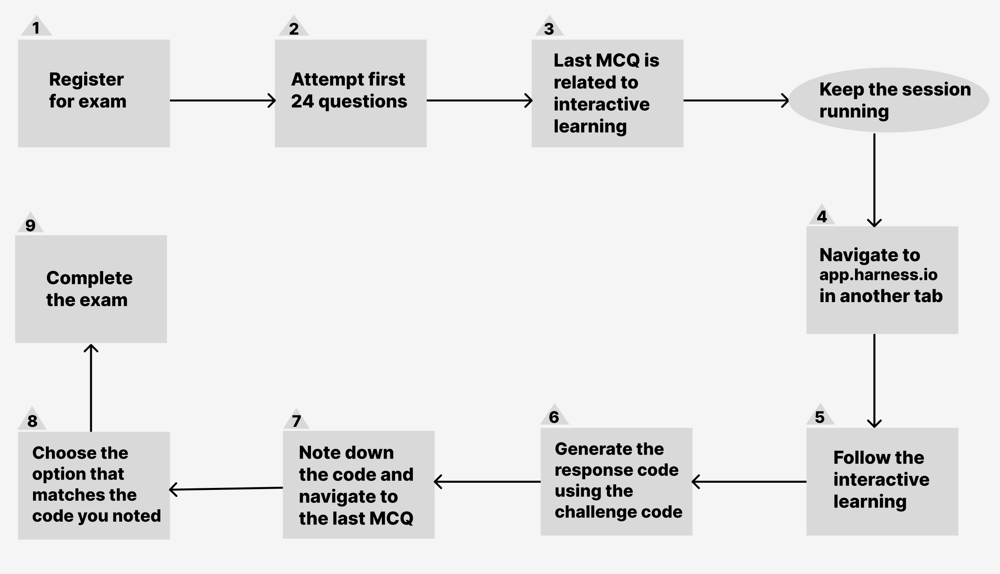
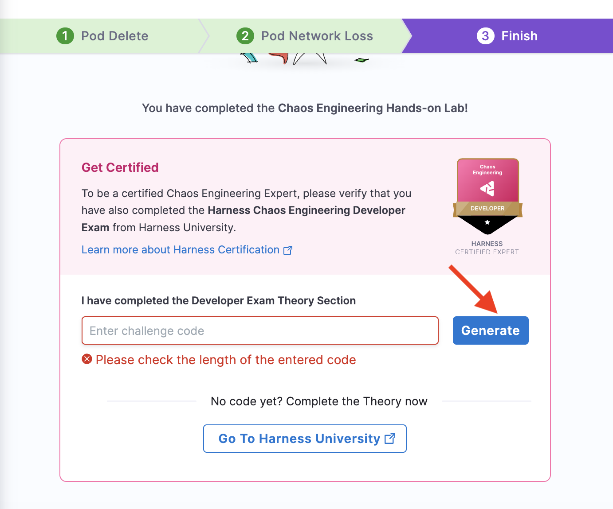
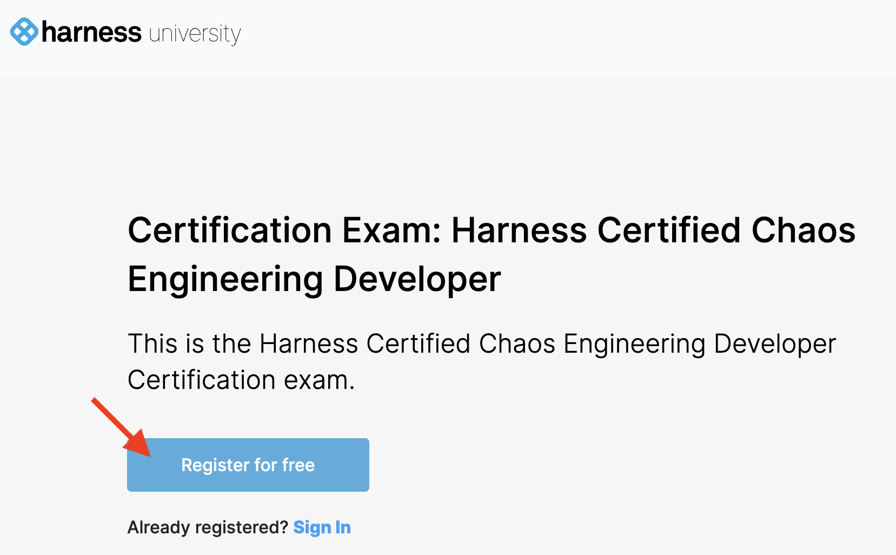
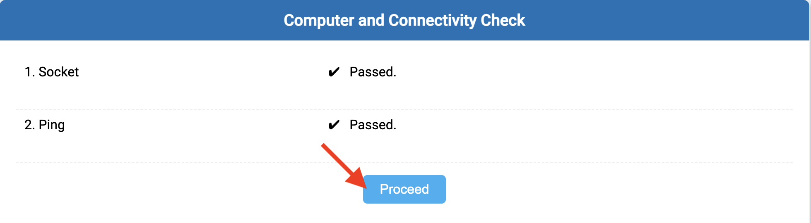

This tutorial will guide you through the process of registering for and completing the Harness Chaos Developer exam certification.

Before you start, make sure to review the following resources:
- [Chaos Engineering overview](/docs/chaos-engineering/onboarding/hce-onboarding.md)
- [Run chaos experiments in sandbox](/docs/chaos-engineering/onboarding/certifications/run-experiments-in-sandbox.md)

## Obtaining Developer Certification

The diagram below outlines the steps involved in obtaining the Harness Chaos Engineering Developer certification.

:::tip
In the diagram above, steps 4 (navigate to app.harness.io) and 1 (register for exam) can be performed in either order. You may choose to start with interactive learning before registering for the exam.
:::

## Developer Certification Exam

1. [Execute the Podtato head application in sandbox](/docs/chaos-engineering/onboarding/certifications/run-experiments-in-sandbox.md)
  - Before attempting the Harness Chaos Engineering Developer certification exam, make sure to run the Podtato Head application in the sandbox environment. Refer to the

2. Access Harness University
  - Go to [Harness University on developer hub](https://developer.harness.io/university/chaos-engineering?lvl=developer) or click **Go to Harness University**.

   

3. Register or sign in

  - Click **Register for free** to create a new account or **Sign In** if you already have an account.

    

4. Create an Account or Sign In

  - If you're registering for the first time, click **Sign up** and provide the necessary details. If you already have an account, click **Sign in**.

    

5. Register for the exam

  - Click **Register for exam** to begin the process.

    

6. Check Basic Connectivity

  - Basic connectivity will be checked. Click **Proceed** to continue.

   

7. Agree to Terms and Conditions

  - Review the terms and conditions, then click **Agree and Continue**.

    

8. Start the Exam

  - Click **I am ready to begin** to start the exam.

    

9. Enter the Code

  - Choose the options that best fit the questions. At the end of the exam, a code will be displayed on the screen. Enter this code into the sandbox environment.

    

10. Generate the Code

  - After entering the code, click **Generate**.

    

11. Submit Your Exam

  - The code generated will match one of the options on the Harness University exam page. Select the generated code and click **Submit exam**.

    

That's it! The screen will determine and display your results. All the best!