This tutorial guides you through an interactive session where you'll use the sample application **Podtato head** to execute a chaos experiment and enhance the application's resilience.

## Prerequisites

Before you start the tutorial, ensure you have a Harness account. Follow [these](#create-a-harness-account) steps to create one. Review the [onboarding flow diagram](/docs/chaos-engineering/training/certification) to understand the process for obtaining the Harness Developer Certification.

### Create a Harness account

1. Navigate to [app.harness.io](https://app.harness.io/auth/#/signin) and click **Sign up**.

	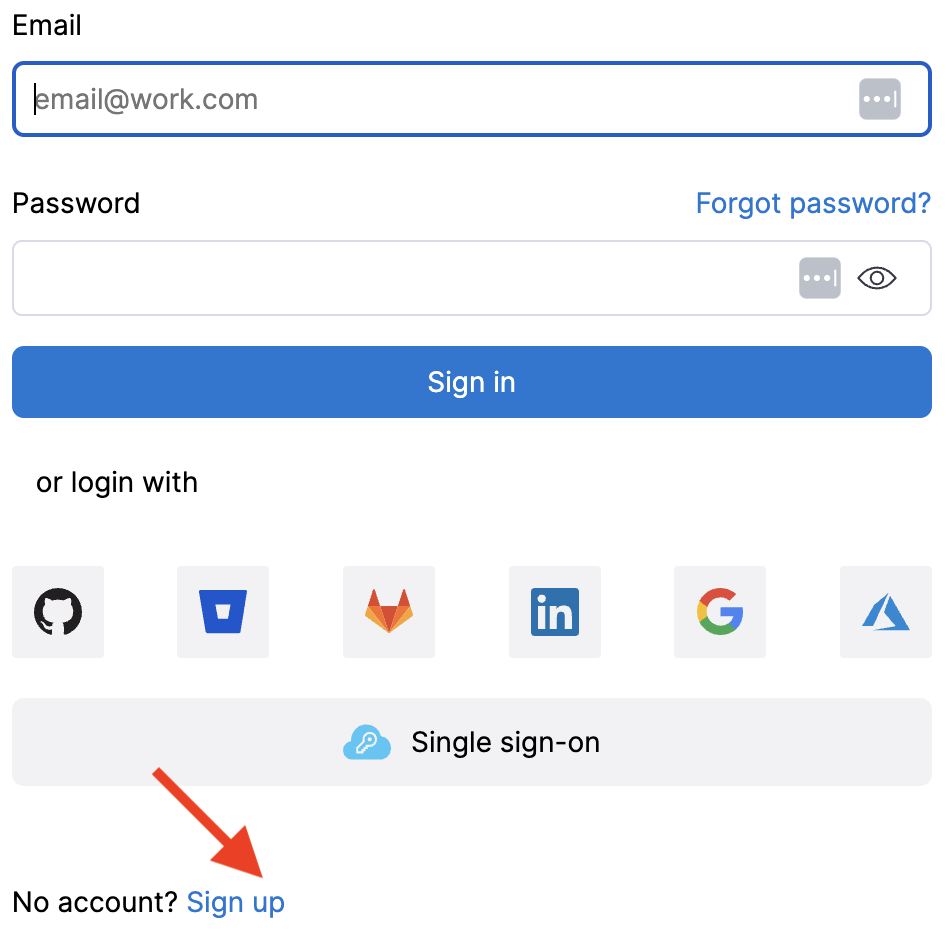

2. Select **Sign up with Email** and enter your work email and password.

	

3. You will receive a verification email. Follow the link to access the page with various modules.

	

## High-level flow of control in a sandbox

The diagram below illustrates the high-level flow of control in a sandbox environment:

## Execute pod delete on the Podtato head app

After creating an account with Harness, select **Get Started** in the **Chaos Engineering** module.

### Create a sandbox

1. On the chaos module landing page, select **Create Sandbox**. Note that this is a **Zero Risk** operation!

	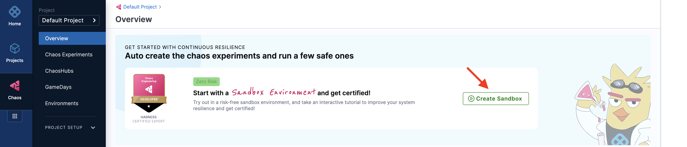

2. This action creates a new environment where chaos experiments can be executed.

	

3. This takes you to the **Interactive learning** tab, where you click **Start**.

	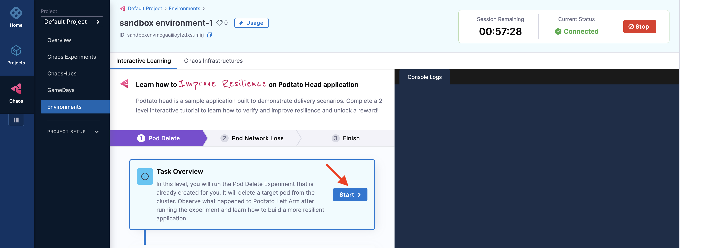

:::note
* Once you create a sandbox, it can't be deleted.
* All users within a sandbox can share the same sandbox.
* The first time you create a sandbox, the session starts automatically. Subsequent sessions must be explicitly started (Click **Start**).
* You are allocated 20 sessions (each 60 minutes) valid for 30 days from sandbox creation date.
* You can **Stop** and **Restart** the session,with unused time being added to your quota.
:::

### Execute pod delete experiment

1. The experiment execution starts by creating the necessary clusters in the environment (that you created earlier). Once the clusters are ready, the sandbox creates the pod delete experiment. Click Next.

	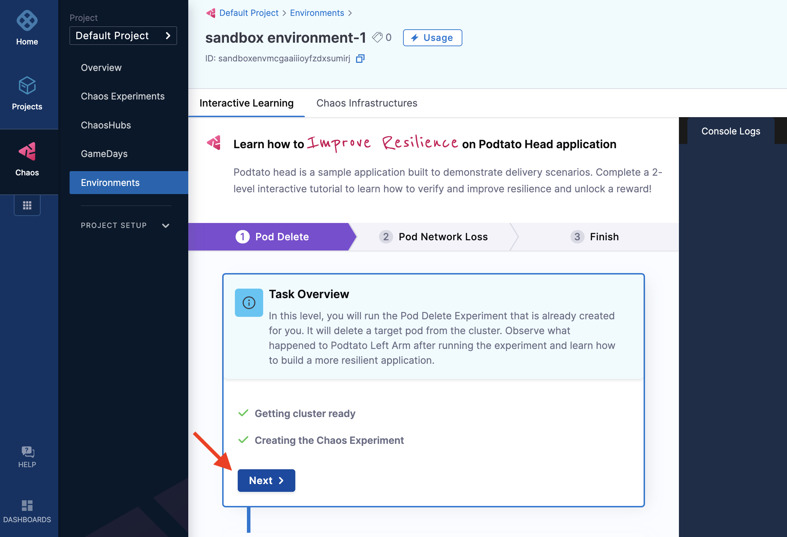

2. Click **Run** to execute the pod delete experiment. The experiment creates resilience probes to check the availability of the Podtato app's left arm, which will be deleted during the experiment.

	

3. The experiment deletes a pod (specifically, the left arm pod) and displays the resilience of the Podtato Head application.

	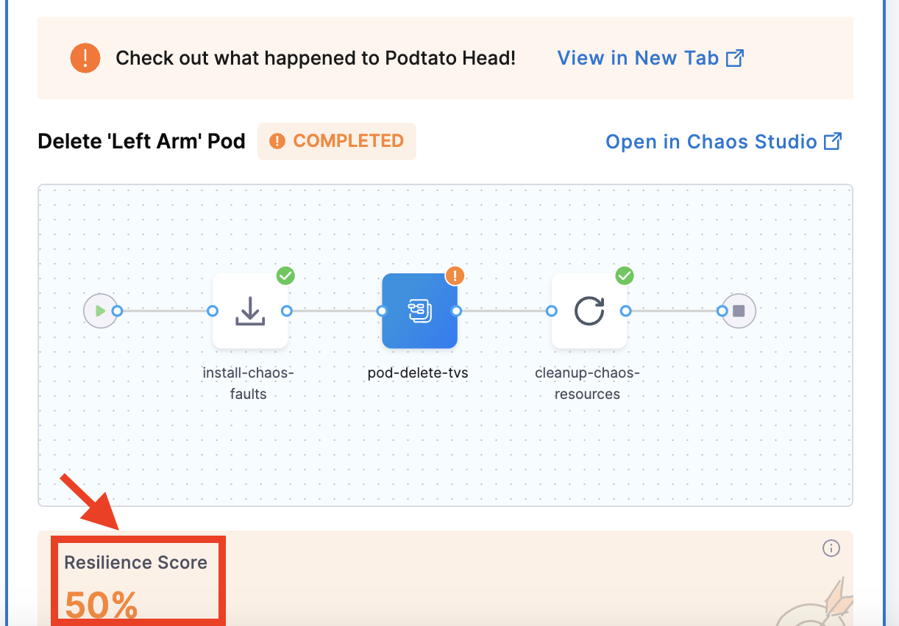

:::note
The resilience score of 50 indicates that the experiment configured two probes with equal weight. If one probe fails, the score is 50.
:::

4. This result shows that the Podtato Head app is not yet resilient. Click **Next** to proceed with configuring the application for improved resilience.

	

:::tip
* You can re-run the experiment.
* You can scale up the Podtato head app only once.
* You can delete the Podtato head left arm only once.
* You can re-run the experiment.
* The pod network loss experiment can only be executed after completing the pod delete experiment.
* Rollbacks to previous steps or experiments are not possible.
:::

### Re-run to build resilience

1. You will see two commands on the screen. Click **Run** to execute these commands, which will create two replicas of the pod, enhancing its availability. This way, even if one pod is deleted, the application will continue functioning smoothly.

	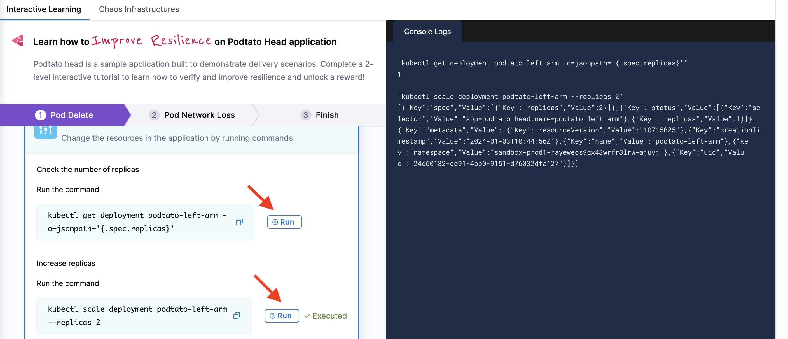

2. Click **Next**. Once the application is configured, select **Run** to re-run the experiment.

	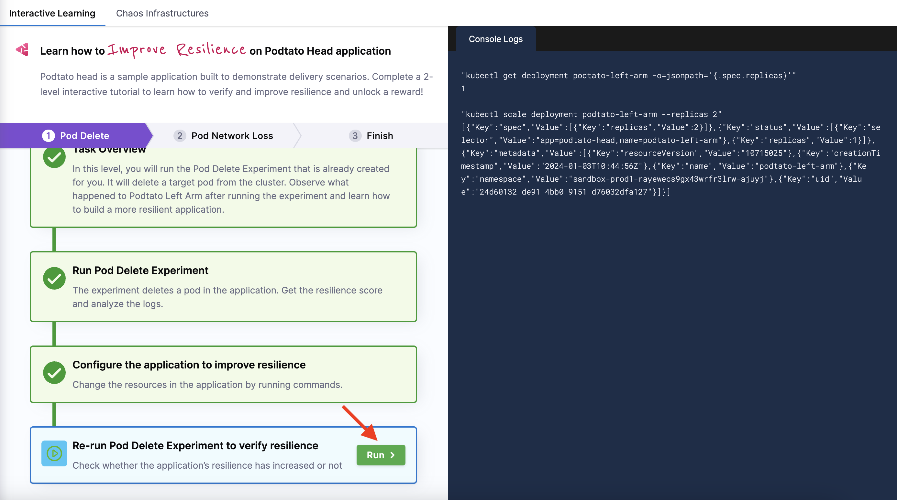

3. The pod delete experiment will be executed again. This time, you will see a resilience score of 100 %, indicating that the application remains functional even when a pod is deleted.

	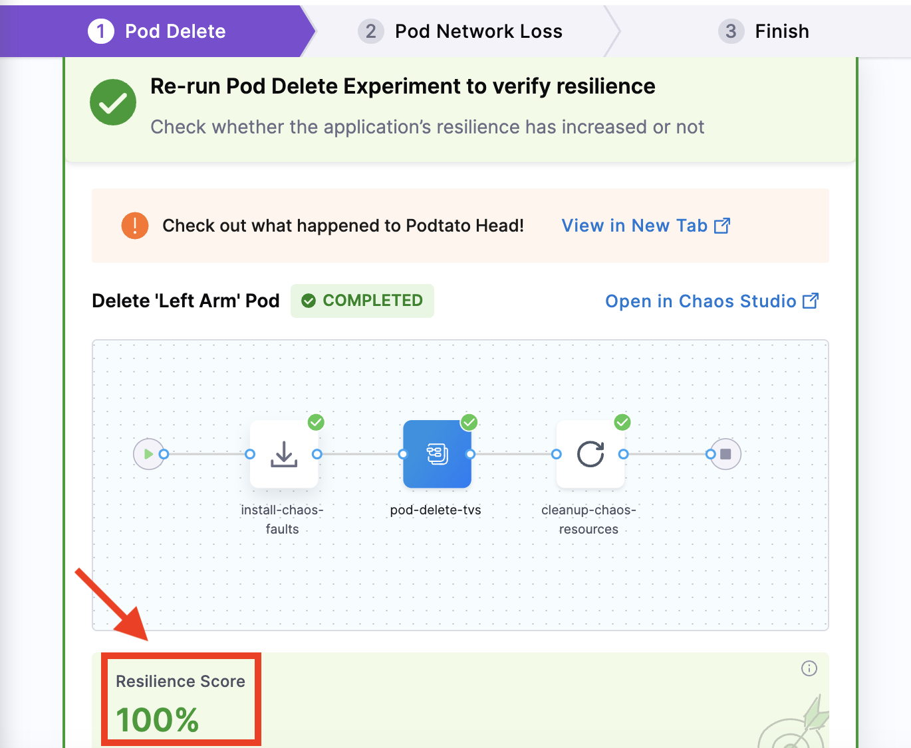

:::note
A resilience score of 100 % means both probes, which were configured with equal weight, passed.

	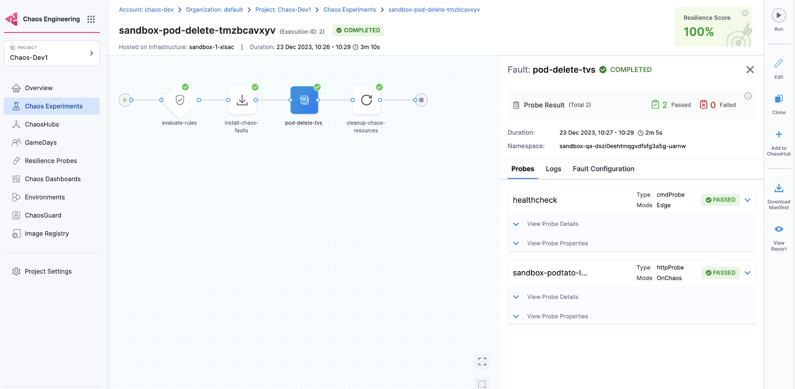
:::

4. Click **Next** to proceed with the next experiment (pod network loss).

	

:::tip
Click **Run** to re-execute the sandbox session if you run out of time.

	
:::

### Perform the same steps for the next experiment

1. After completing the pod delete experiment, you can execute the pod network loss experiment. Follow the same steps as for the pod delete experiment. This experiment configures a probe to check the availability of the Podtato app's left arm, which is targeted.

	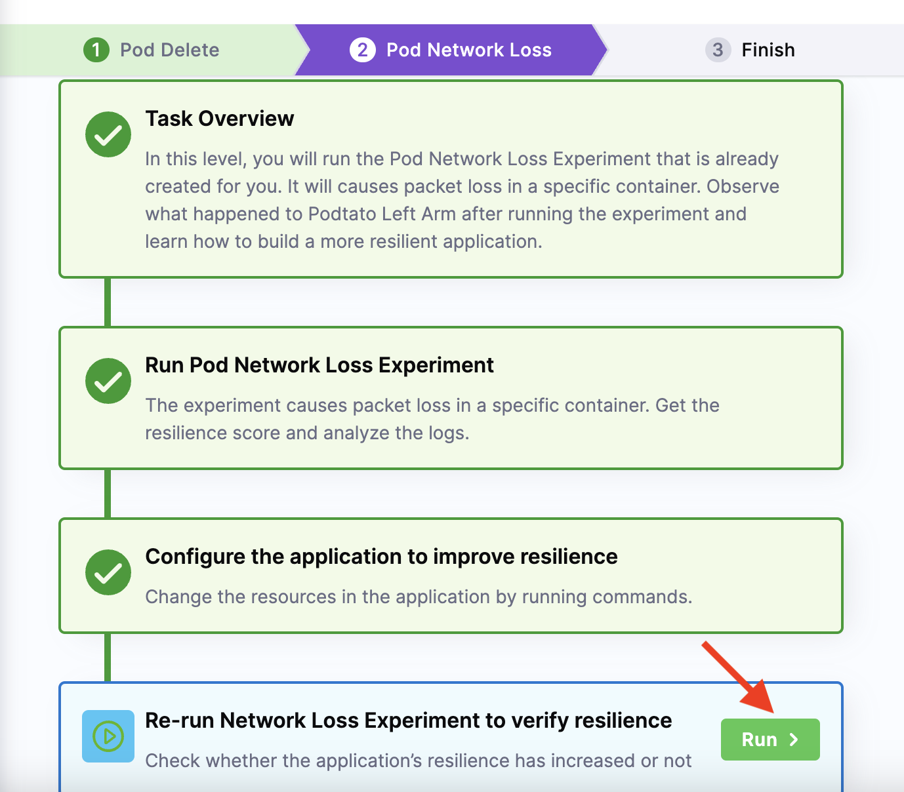

2. Click **Next** to move to the last step of the hands-on lab.

	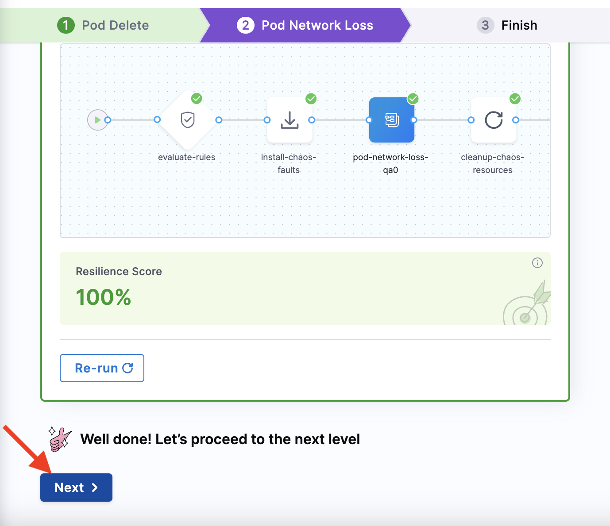

3. You have now completed the chaos hands-on lab by executing two experiments and improving the resilience of the Podtato Head application. Click **Go to Harness University** or follow [this](/docs/chaos-engineering/training/certification) tutorial to obtain the developer certification.

	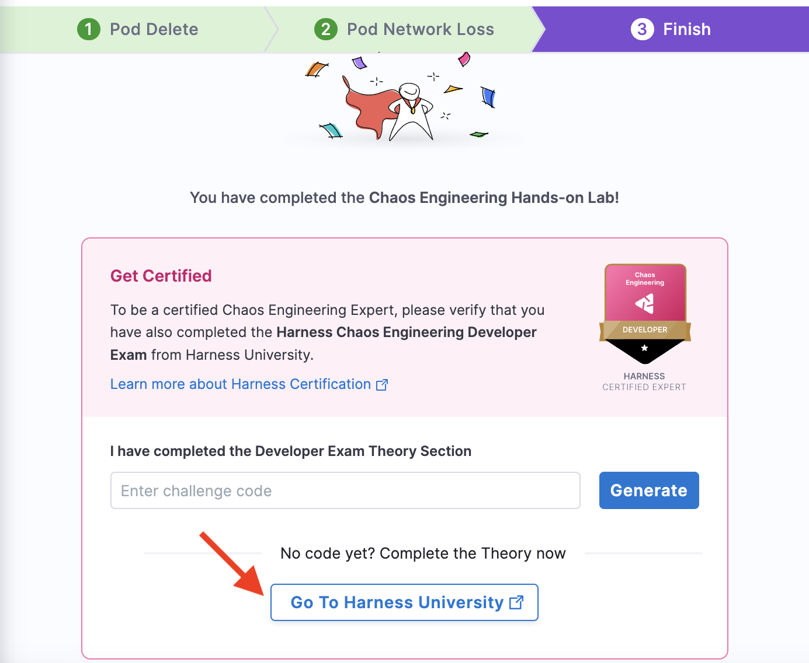

## Create other experiments in sandbox

In addition to executing **pod delete** and **pod network loss** experiments, you can create other experiments in the sandbox.

- Navigate to your sandbox and select **Chaos Experiments** to view the experiments you've executed or are currently running.

	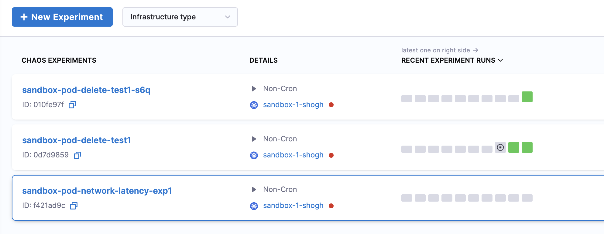

- Select **New experiment** and follow the steps to [create an experiment](/docs/chaos-engineering/features/experiments/construct-and-run-custom-chaos-experiments).

## Next steps
* [Harness Chaos Engineering Developer Certification](/docs/chaos-engineering/training/certification)