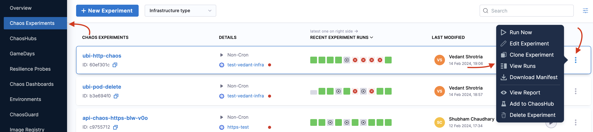
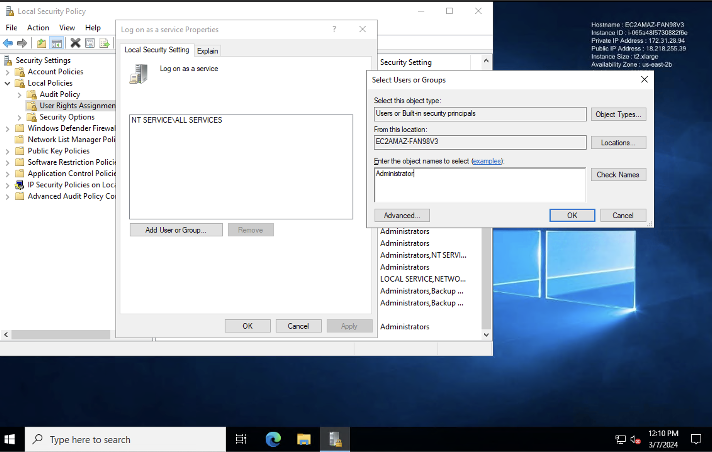
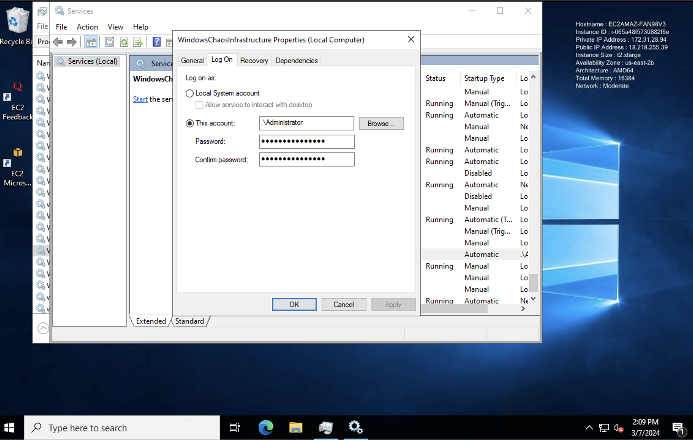

This section walks you through some common pain points and their workarounds.

## Kubernetes infrastructure troubleshooting

#### Unable to connect to Kubernetes infrastructure server

Most times, chaos infrastructure errors are due to issues with the chaos infrastructure setup.

##### Workaround

If you are unable to connect to the Kubernetes infrastructure server, try the following:

* Use **ping** on the subscriber or any other pod to test if the response times for app.harness.io or another URL are reasonable and consistent.
* Use traceroute on app.harness.io to check the network route.
* Use **nslookup** to confirm that the DNS resolution is working for app.harness.io.
* Connect using the IP address for app.harness.io (you can get the IP address using `nslookup`). For example, `http://35.23.123.321/#/login`.
* Check for local network issues, such as proxy errors or NAT license limits.
* For some cloud platforms, like AWS EC2, ensure that the security groups allow outbound traffic on HTTPS 443.

#### Connection to Kubernetes infrastructure fails after applying the manifest

After you apply the manifest, and try to connect to the Kubernetes infrastructure, it fails to connect (that is, the status is **PENDING**). In this case, one of the following may be the cause of the failure:
1. Unable to connect to the Kubernetes infrastructure server (that is, app.harness.io): Refer to [unable to connect](#unable-to-connect-to-kubernetes-infrastructure-server) to resolve the issue.
2. One of the infrastructure pods (one of **subscriber** or **chaos-exporter** or **workflow-controller** or **chaos-operator-ce** pods) is not yet in the **RUNNING** state: In this case, follow the commands mentioned below:

##### Debug

1. Check the status of your chaos infrastructure on your cluster

    ```
    kubectl get pods -n <namespace_name>
    ```

1. Check the chaos infrastructure logs
    ```
    kubectl logs -f <pod-name> -n <namespace_name>
    ```
    1. If the chaos infrastructure is not in a healthy state,

          ```
          kubectl describe pods <pod-name> -n <namespace_name>
          ```
Check the logs of all pods in the namespace.

## Probe related troubleshooting

### Environment variable and secret usage references in source mode of command probe

You can use secrets and environment variables in the [**source mode**](/docs/chaos-engineering/features/resilience-probes/cmd-probe#source-mode) of the command probe using the manifest in the following manner:

```yaml
source:
  env:
  - name: name
    value: test
  volumes:
  - name: volume-secret
    secrets:
    - name: vm-credentials
  volumeMount:
  - name: volume-secret
    mountPath: /etc/volume-secret
 ```

## Fault and experiment related troubleshooting

### Memory stress fault stressng flag usage

When a memory stress fault (such as [Linux memory stress](TO-DO) or [Linux CPU stress](TO_DO)) is executed, the fault utilizes all of the available resources in the target system, thereby simulating an out of memory scenario.
You can use another fault parameter, `stressNGFlags` to provide flexibility in the parameters passed to the VM.

#### Workaround

The `stressNGFlags` can be used in the following manner:

[embedmd]:# (./static/manifests/stressng-flag.yaml yaml)

```yaml
apiVersion: litmuschaos.io/v1alpha1
kind: LinuxChaosExperiment
metadata:
  name: linux-memory-stress-dev
  labels:
    experimentID: "f7e4a412-74ef-4a0a-9b94-d894afb24be9"
    experimentRunID: "9caeb3ca-b6f3-4e82-b96b-97d57428ef59"
    context: linux-memory-stress
    name: linux-memory-stress-dev
spec:
  experimentId: "f7e4a412-74ef-4a0a-9b94-d894afb24be9"
  experimentRunId: "9caeb3ca-b6f3-4e82-b96b-97d57428ef59"
  cleanupPolicy: retain
  steps:
  - - name: task-1
  tasks:
  - name: task-1
    taskType: "chaos"
    weight: 10
    chaosInfra: "b8d4e0e6-e883-48ad-8b6c-1886bf6edc21"
    definition:
      chaos:
        experiment: linux-memory-stress
        stressChaos/inputs:
          duration: 30s
          workers: 1
          memory: 5m
          stressNGFlags: "--vm-populate"
```

:::tip
The `--vm-populate` in the above manifest populates the memory, thereby stressing it. It is an example to demonstrate how you can utilize the `stressNGFlags` flag attribute.
:::

### Executing an experiment moves it to a QUEUED state

When you execute an experiment but it moves to the `Queued` state, it means the [Chaos manager](TO_DO) was unable to send the experiment to the [subscriber](TO_DO).

It could be due to a variety of reasons, such as:

1. The subscriber is unable to reach the chaos control plane (chaos K8s IFS).
2. The chaos control plane components (chaos-manager and chaos K8s IFS) were unable to create the experiment.

#### Debug

1. Check the subscriber's health; if the subscriber isn't active, it can't fetch the tasks to create the experiment. In such a case, check the logs of the subscriber and restart the subscriber pod.
2. In case you are using SMP (self-managed platform), check the logs of the control plane components, such as Chaos Manager and chaos K8s IFS.
3. If you are a SaaS customer, contact [Harness support](mailto:support@harness.io).

### While executing an experiment, it directly moves to the ERROR state and the execution data for the run is absent

If you execute a chaos experiment but it directly moves to the ERROR state without providing any execution data, it means that the experiment was successfully sent to the subscriber, but the subscriber failed to start the experiment.

It could be due to a variety of reasons, such as:

1. Lack of relevant permissions for the subscriber while creating the experiment on the Kubernetes cluster.
2. The experiment name is too long, and it can't be applied to the Kubernetes cluster due to the need to adhere to certain Kubernetes policies.
3. Incorrect syntax of the chaos experiment may not allow the subscriber to start the experiment.

#### Debug

- Check the logs of the subscriber, which will display the actual issue/error.
- Check the logs of workflow-controller to identify any errors.
- Execute the following commands that elaborates on the error events:

  ```
  kubectl get workflow -n namespace
  ```

  - Fetch the workflow that is in the **FAILED** state. Next, execute the below command:

  ```
  kubectl describe workflow <workflow_name> -n namespace
  ```

### Executed an experiment, but the UI shows one run without any state for it. (similar to a pending workflow)

If the UI shows one run of the experiment but doesn't show the state (such as **QUEUED** or **ERROR**), this means the experiment was successfully sent to the execution plane, and the subscriber was able to apply the experiment to the cluster, but the workflow controller couldn't start the experiment.

To verify the earlier statement:
1. Go to **Chaos Experiments** in the UI and navigate to the experiment you created.

    

2. Select the `⋮` icon and select **View runs**. Navigate to the specific run, select the `⋮` icon, and then select **View Run Report**.

    

3. If you don't see the **experiment run ID** in the **Run details**, it means the experiment run couldn't start, since an ID is generated after an experiment run begins.

It could be due to a variety of reasons, such as:

1. The experiment name is too long, and when the workflow controller tries to create a run for it by adding a hash, the name exceeds the threshold value.
2. The experiment doesn't have a label as an instance ID.
3. Workflow has a label instance ID but doesn't match the instance ID available in the workflow controller ConfigMap.

#### Debug

1. As the first step, check the workflow controller logs.

    1. If the logs suggest that the experiment run name exceeds the limit, change/reduce the length of the experiment name.

2. If the experiment doesn't have a label as an instance ID (aka infrastructure ID), check if you deployed the experiment manually or generated it from the UI (frontend).
    1. The manifest generated from the UI will always have a label with it. If you don't see a label, use the infrastructure ID of the chaos infrastructure on which you run the experiment. Also report the issue to [Harness Support](mailto:support@harness.io).
    2. If you are using an API to generate the manifest, check the manifest for any erroneous values.

3. If the workflow has a label instance ID but it doesn't match the instance ID available in the workflow controller configmap:
    1. Compare both the instance IDs of the experiment and the configmap. If they don't match:
      1. Verify that the instance ID from the configmap is correct. The instance ID and the infra ID should match.
        1. If they don't match, it means you have not applied the Kubernetes infrastructure manifest correctly.
        2. If the instance ID matches the infra ID, it means the experiment has the wrong label. In such a case, you can update the label instance ID with the infrastructure ID.

### Started executing an experiment, but one of the experiment step nodes is in a PENDING state

If you execute an experiment but one of the nodes in the experiment is in a `PENDING` state, it means that the experiment was successfully sent to the execution plane, the workflow controller started the experiment, and the experiment pods were created, but the pod could not start.

This could be because there weren't adequate resources to facilitate the pod's start.

#### Debug

You can describe the pending workflow pod (the pod associated with the experiment begins with the same name as the experiment) using the command:

```
kubectl describe pod <pod-name> -n <namespace>
```

The events section of the result of executing the earlier command will help determine whether the issue is related to memory/CPU. If so, you can free the required memory/CPU.

### After injecting chaos, the experiment aborts, and probes fail continuously, how can this be addressed?

If you inject chaos into your application, but the experiment gets aborted due to continuous probe failure, you can:

#### Workaround
1. Add 1 to 2 s of initial delay (**Initial Delay** is the field name while configuring the resilience probes); and
2. Provide multiple attempts (**Attempt** is the field name in resilience probes).

### Live logs of an experiment result in an error

#### Debug
If you try to access the live logs of your experiment run but you receive an error instead or nothing shows up:

* Check the sidecar container of the experiment pod to know the status of the container.

## Windows chaos infrastructure troubleshooting

### While installing Windows chaos infrastructure, service was created but in the Stopped state

**Error Message:**
Service 'WindowsChaosInfrastructure' cannot be started due to the following error: Cannot start service WindowsChaosInfrastructure on computer '.'.

Solution:

- **Verify User Credentials:** Ensure that the user credentials (-AdminPass) used for installation are correct and have the necessary permissions
- **Set User Password:** If the user account lacks a password, set one using the following command:

```
C:\Users\Administrator>net user Administrator MyPassword@123
```

**(Method-1) Grant Logon as a Service Permission:**

1. Open Local Security Policy.
2. Navigate to User Rights Assignment.

    

3. Find "_Log on as a service_" and add the user to this policy.

    

4. Apply and save the changes.

Start the Service: Restart the WindowsChaosInfrastructure service from the Services tab in Task Manager.

Check Logs: If the issue persists, refer to the log file at `C:\\HCE\Logs` for more details.

**(Method-2) Grant Logon as a Service Permission:**

If the Windows Chaos Infrastructure service is created but fails to start due to login permission issues for the user account, you can resolve this by manually granting login permissions:

1. Open Task Manager.

    

  - Press Ctrl + Shift + Esc to open the Task Manager or search Task Manager.
  - Switch to the "Services" tab.

2. Locate the service.

    

  - Find the "WindowsChaosInfrastructure" service.
  - Right-click on the service and select "Open Services".

3. Modify Service Properties:

  - In the Services window, locate "WindowsChaosInfrastructure" again.
  - Right-click on it and choose "Properties".
  - Go to the "_Log On_" tab.

4. Provide User Credentials.

    

  - Enter the credentials of the user account that should run the service.
  - Select **Apply**. You should receive a confirmation that the account has been granted logon as a service right.

5. Start the Service: Apply the changes and start the service. The service should now enter a running state.

### Windows chaos infrastructure installation failed with "The Specified Service Already Exists"

**Error Message:**
The specified service already exists.

#### Solution

- Run the uninstallation script. Use the provided script to remove the previous installation.
- Manually remove the previous installation:
  - Delete the service using the command `sc delete WindowsChaosInfrastructure`.
  - Remove the chaos directory, typically located at `C:\\HCE`.
- Reinstall: After cleanup, re-run the installation script.

### Windows infrastructure installation failed with "Account name is invalid"

**Error Message:**
The account name is invalid or does not exist, or the password is invalid for the account name specified.

#### Solution

- Verify account name: Ensure that the account name provided in the `-AdminUser` flag is correct and exists on the system.
- Correct Syntax: Use the correct syntax, for example, `.\Administrator` for the local administrator account.

### Windows infrastructure service fails to create with error or Exit Code 216

#### Solution

**Check Windows version:** The error indicates incompatibility with the Windows version. Currently, only 64-bit versions are supported. Support for 32-bit versions is planned for future releases.

### Windows infrastructure default command fails with "Could not create SSL/TLS secure channel"

#### Solution

Force TLS 1.2: Add the following line to the beginning of your command to force PowerShell to use TLS 1.2:

```
[Net.ServicePointManager]::SecurityProtocol = [Net.SecurityProtocolType]::Tls12
```

For example:

```
powershell -Command "& { [Net.ServicePointManager]::SecurityProtocol = [Net.SecurityProtocolType]::Tls12; Invoke-WebRequest -Uri 'https://app.harness.io/public/shared/tools/chaos/windows/1.32.0/install.ps1' -OutFile 'install.ps1' -UseBasicParsing; .\install.ps1 -AdminUser '.\uditgaurav' -AdminPass 'password@123' -InfraId '59cedc73-c544-432a-99e7-ec20b2fc73c0' -AccessKey 'ow03gxzvkjdck9ws5jjmznu2gzx7h0ep' -ServerUrl 'https://shubhamch.pr2.harness.io/chaos/mserver/api' }"
```

This modification forces PowerShell to use TLS 1.2 for secure connections, thereby resolving the SSL/TLS issue.

For further assistance, please refer to the [documentation](TO_DO) or contact [Harness Support](mailto:support@harness.io).
