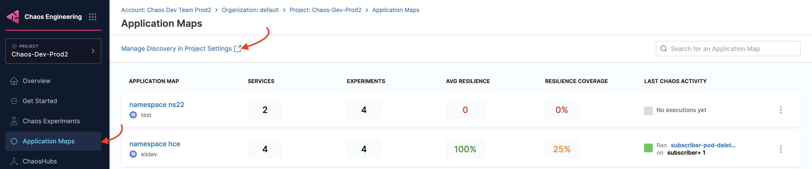

This topic describes how application maps are used in the context of Harness chaos engineering.

### Before you begin

- [Service discovery](/docs/platform/service-discovery/)
- [How Harness CE leverages Service Discovery?](/docs/chaos-engineering/use-harness-ce/service-discovery#how-does-harness-ce-leverage-discovered-services)
- [Create Discovery Agent](/docs/platform/service-discovery/customize-agent#create-discovery-agent)
- [What is Application Map?](/docs/platform/application-map)

### Create Application Map

Go to [create an application map](/docs/platform/application-map#create-application-map) and follow the steps, except, navigate to **Chaos** module, and select **Project Settings**, and then select **Discovery**.

:::info note
Alternatively, navigate to **Chaos** module -> **Application Maps** -> **Manage Discovery in Project Settings**. This also leads you to the page in step 2.

    
:::

In the step where you select one or more discovered services, choose a specific service on which you want to inject chaos, and click **Next**.

    

:::info note
- To view chaos-enabled experiment map, navigate to **Chaos** module and select **Application Maps**.

    

- To manually associate the experiment as a part of an application map, specify the tag `applicationmap=<application map identity>` in the experiment.
:::

## Next Steps

- [Edit Application Map](/docs/platform/application-map#edit-application-map)
- [Delete Application Map](/docs/platform/application-map#delete-application-map)

