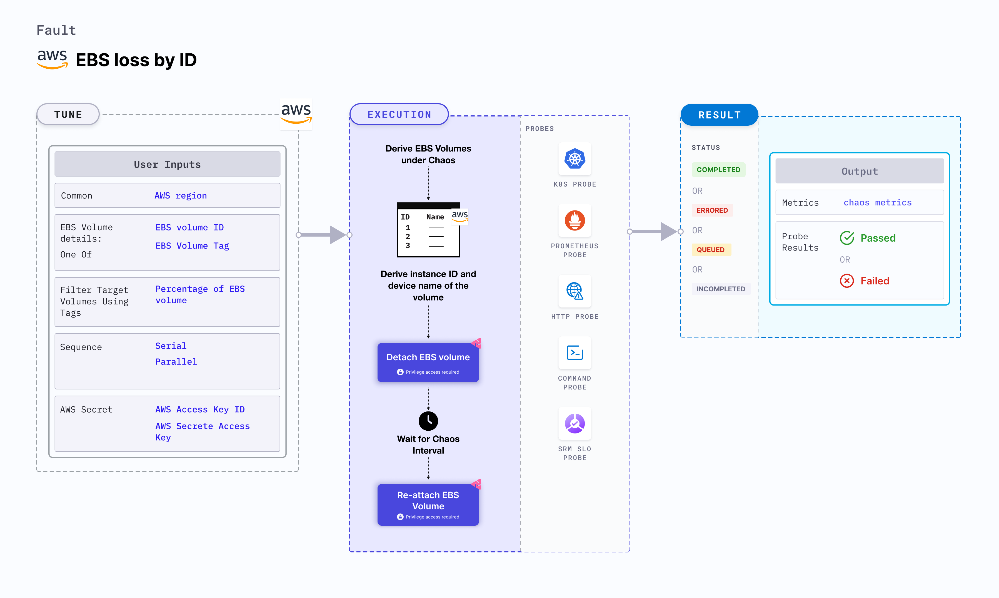

EBS (Elastic Block Store) loss by ID disrupts the state of EBS volume by detaching it from the node (or EC2) instance using volume ID for a certain duration. In case of EBS persistent volumes, the volumes can self-attach, and the re-attachment step can be skipped.



## Use cases
EBS loss by ID tests the deployment sanity (replica availability and uninterrupted service) and recovery workflows of the application pod.

### Prerequisites
- Kubernetes >= 1.17
- Appropriate AWS access to attach or detach an EBS volume for the instance.
- The EBS volume should be attached to the instance.
- The Kubernetes secret should have AWS access configuration (key) in the `CHAOS_NAMESPACE`. Below is a sample secret file:
  ```yaml
  apiVersion: v1
  kind: Secret
  metadata:
    name: cloud-secret
  type: Opaque
  stringData:
    cloud_config.yml: |-
      # Add the cloud AWS credentials respectively
      [default]
      aws_access_key_id = XXXXXXXXXXXXXXXXXXX
      aws_secret_access_key = XXXXXXXXXXXXXXX
  ```

:::tip
HCE recommends that you use the same secret name, that is, `cloud-secret`. Otherwise, you will need to update the `AWS_SHARED_CREDENTIALS_FILE` environment variable in the fault template with the new secret name and you won't be able to use the default health check probes.
:::

Below is an example AWS policy to execute the fault.

```json
{
    "Version": "2012-10-17",
    "Statement": [
        {
            "Effect": "Allow",
            "Action": [
                "ec2:AttachVolume",
                "ec2:DetachVolume"
            ],
            "Resource": "*"
        },
        {
            "Effect": "Allow",
            "Action": "ec2:DescribeVolumes",
            "Resource": "*"
        },
        {
            "Effect": "Allow",
            "Action": [
                "ec2:DescribeInstanceStatus",
                "ec2:DescribeInstances"
            ],
            "Resource": "*"
        }
    ]
}
```

:::info note
- Refer to [AWS named profile for chaos](/docs/chaos-engineering/use-harness-ce/chaos-faults/aws/security-configurations/aws-switch-profile) to use a different profile for AWS faults and [superset permission or policy](/docs/chaos-engineering/use-harness-ce/chaos-faults/aws/security-configurations/policy-for-all-aws-faults) to execute all AWS faults.
- Go to the [common tunables](/docs/chaos-engineering/use-harness-ce/chaos-faults/common-tunables-for-all-faults) and [AWS-specific tunables](/docs/chaos-engineering/use-harness-ce/chaos-faults/aws/aws-fault-tunables) to tune the common tunables for all faults and AWS-specific tunables.
:::

### Mandatory tunables
   <table>
      <tr>
        <th> Tunable </th>
        <th> Description </th>
        <th> Notes </th>
      </tr>
      <tr>
        <td> EBS_VOLUME_ID </td>
        <td> Comma-separated list of volume IDs subject to EBS detach. </td>
        <td> For example, <code>ebs-vol-1,ebs-vol-2</code>. For more information, go to <a href="#detach-volumes-by-id"> detach volumes by ID.</a></td>
      </tr>
      <tr>
        <td> REGION </td>
        <td> Region name for the target volumes.</td>
        <td> For example, <code>us-east-1</code>. </td>
      </tr>
    </table>

### Optional tunables
  <table>
      <tr>
        <th> Tunable </th>
        <th> Description </th>
        <th> Notes </th>
      </tr>
      <tr>
        <td> TOTAL_CHAOS_DURATION </td>
        <td> Duration that you specify, through which chaos is injected into the target resource (in seconds). </td>
        <td> Default: 30 s. For more information, go to <a href="/docs/chaos-engineering/use-harness-ce/chaos-faults/common-tunables-for-all-faults#duration-of-the-chaos"> duration of the chaos. </a></td>
      </tr>
      <tr>
            <td> AWS_SHARED_CREDENTIALS_FILE </td>
            <td> Path to the AWS secret credentials. </td>
            <td> Default: <code>/tmp/cloud_config.yml</code>. </td>
        </tr>
      <tr>
        <td> CHAOS_INTERVAL </td>
        <td> Time interval between the attachment and detachment of the volumes (in seconds). </td>
        <td> Default: 30 s. For more information, go to <a href="/docs/chaos-engineering/use-harness-ce/chaos-faults/common-tunables-for-all-faults#chaos-interval"> chaos interval.</a></td>
      </tr>
      <tr>
        <td> SEQUENCE </td>
        <td> Sequence of chaos execution for multiple volumes.</td>
        <td> Default: parallel. Supports serial sequence as well. For more information, go to <a href="/docs/chaos-engineering/use-harness-ce/chaos-faults/common-tunables-for-all-faults#sequence-of-chaos-execution"> sequence of chaos execution.</a></td>
      </tr>
      <tr>
        <td> RAMP_TIME </td>
        <td> Period to wait before and after injecting chaos (in seconds). </td>
        <td> For example, 30 s. For more information, go to <a href="/docs/chaos-engineering/use-harness-ce/chaos-faults/common-tunables-for-all-faults#ramp-time"> ramp time. </a></td>
      </tr>
    </table>

### Detach volumes by ID

Comma-separated list of volume IDs subject to EBS detach. Tune it by using the `EBS_VOLUME_ID` environment variable.

The following YAML snippet illustrates the use of this environment variable:

[embedmd]:# (./static/manifests/ebs-loss-by-id/ebs-volume-id.yaml yaml)
```yaml
# contains EBS volume ID
apiVersion: litmuschaos.io/v1alpha1
kind: ChaosEngine
metadata:
  name: engine-nginx
spec:
  engineState: "active"
  chaosServiceAccount: litmus-admin
  experiments:
  - name: ebs-loss-by-id
    spec:
      components:
        env:
        # ID of the EBS volume
        - name: EBS_VOLUME_ID
          value: 'ebs-vol-1'
        # region for the EBS volume
        - name: REGION
          value: 'us-east-1'
        - name: TOTAL_CHAOS_DURATION
          VALUE: '60'
```