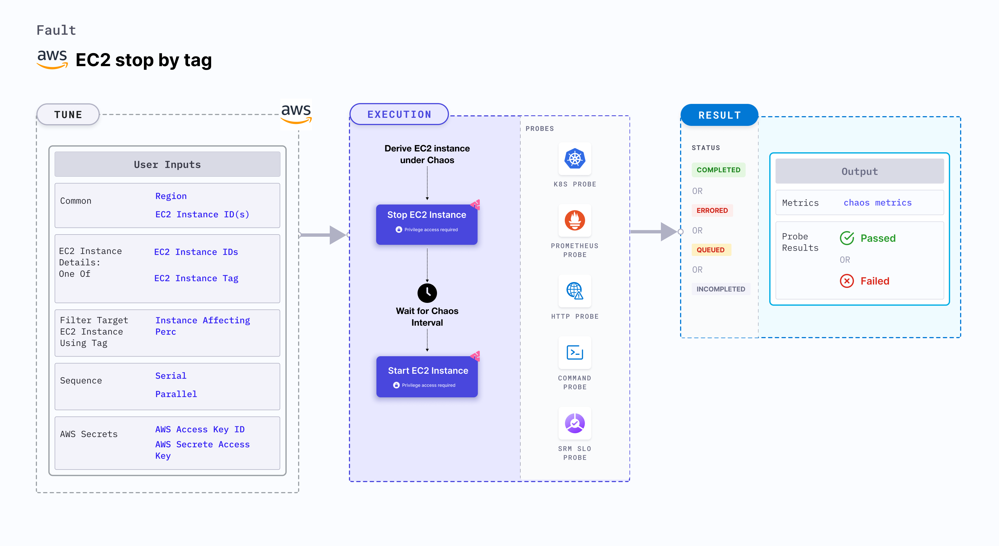

EC2 stop by tag stops an EC2 instance using the provided tag and brings back the instance after a specific duration. When the `MANAGED_NODEGROUP` environment variable is enabled, the fault will not try to start the instance after chaos. Instead, it checks for the addition of a new node instance to the cluster.



## Use cases
EC2 stop by tag:
- Determines the performance of the application (or process) running on the EC2 instance.
- Determines the resilience of an application to unexpected halts in the EC2 instance by validating its failover capabilities.

### Prerequisites
- Kubernetes >= 1.17
- Appropriate AWS access to stop and start an EC2 instance.
- The EC2 instances should be in a healthy state.
- The Kubernetes secret should have the AWS access configuration(key) in the `CHAOS_NAMESPACE`. Below is the sample secret file.
  ```yaml
  apiVersion: v1
  kind: Secret
  metadata:
    name: cloud-secret
  type: Opaque
  stringData:
    cloud_config.yml: |-
      # Add the cloud AWS credentials respectively
      [default]
      aws_access_key_id = XXXXXXXXXXXXXXXXXXX
      aws_secret_access_key = XXXXXXXXXXXXXXX
  ```

:::tip
HCE recommends that you use the same secret name, that is, `cloud-secret`. Otherwise, you will need to update the `AWS_SHARED_CREDENTIALS_FILE` environment variable in the fault template with the new secret name and you won't be able to use the default health check probes.
:::

Below is an example AWS policy to execute the fault.

```json
{
    "Version": "2012-10-17",
    "Statement": [
        {
            "Effect": "Allow",
            "Action": [
                "ec2:StartInstances",
                "ec2:StopInstances",
                "ec2:DescribeInstanceStatus",
                "ec2:DescribeInstances"
            ],
            "Resource": "*"
        },
        {
            "Effect": "Allow",
            "Action": [
                "autoscaling:DescribeAutoScalingInstances"
            ],
            "Resource": "*"
        }
    ]
}
```

:::info note
- Go to [AWS named profile for chaos](/docs/chaos-engineering/use-harness-ce/chaos-faults/aws/security-configurations/aws-switch-profile) to use a different profile for AWS faults and the [superset permission/policy](/docs/chaos-engineering/use-harness-ce/chaos-faults/aws/security-configurations/policy-for-all-aws-faults) to execute all AWS faults.
- Go to the [common tunables](/docs/chaos-engineering/use-harness-ce/chaos-faults/common-tunables-for-all-faults) and [AWS-specific tunables](/docs/chaos-engineering/use-harness-ce/chaos-faults/aws-fault-tunables) to tune the common tunables for all faults and AWS-specific tunables.
:::

### Mandatory tunables
  <table>
      <tr>
        <th> Tunable </th>
        <th> Description </th>
        <th> Notes </th>
      </tr>
      <tr>
        <td> EC2_INSTANCE_TAG </td>
        <td> Instance Tag to filter the target EC2 instance.</td>
        <td> Provided as <code>key:value</code> ex: <code>team:devops</code>. For more information, go to <a href="#target-single-instance"> instance tag.</a></td>
      </tr>
      <tr>
        <td> REGION </td>
        <td> The region name of the target instance.</td>
        <td> For more information, go to <a href="#target-single-instance"> region.</a></td>
      </tr>
    </table>

### Optional tunables

   <table>
      <tr>
        <th> Tunable </th>
        <th> Description </th>
        <th> Notes </th>
      </tr>
      <tr>
        <td> INSTANCE_AFFECTED_PERC </td>
        <td> Percentage of total EC2 instances to target. Provide numeric values only. </td>
        <td> Defaults to 0 (corresponds to 1 instance). For more information, go to <a href="#target-percent-of-instances"> instance affected percentage.</a></td>
      </tr>
      <tr>
        <td> TOTAL_CHAOS_DURATION </td>
        <td> Duration that you specify, through which chaos is injected into the target resource (in seconds). </td>
        <td> Default: 30 s. For more information, go to <a href="/docs/chaos-engineering/use-harness-ce/chaos-faults/common-tunables-for-all-faults#duration-of-the-chaos"> duration of the chaos. </a></td>
      </tr>
      <tr>
        <td> CHAOS_INTERVAL </td>
        <td> The interval (in sec) between successive instance termination.</td>
        <td> Default: 30 s. For more information, go to <a href="/docs/chaos-engineering/use-harness-ce/chaos-faults/common-tunables-for-all-faults#chaos-interval"> chaos interval.</a></td>
      </tr>
      <tr>
        <td> MANAGED_NODEGROUP </td>
        <td> Set to <code>enable</code> if the target instance is the part of self-managed nodegroups. </td>
        <td> Defaults to <code>disable</code>. </td>
      </tr>
      <tr>
            <td> AWS_SHARED_CREDENTIALS_FILE </td>
            <td> Path to the AWS secret credentials. </td>
            <td> Default: <code>/tmp/cloud_config.yml</code>. </td>
        </tr>
      <tr>
        <td> SEQUENCE </td>
        <td> It defines sequence of chaos execution for multiple instance.</td>
        <td> Defaults to parallel. Supports serial and parallel. For more information, go to <a href="/docs/chaos-engineering/use-harness-ce/chaos-faults/common-tunables-for-all-faults#sequence-of-chaos-execution"> sequence of chaos execution.</a></td>
      </tr>
      <tr>
        <td> RAMP_TIME </td>
        <td> Period to wait before and after injecting chaos (in seconds).  </td>
        <td> For example, 30 s. For more information, go to <a href="/docs/chaos-engineering/use-harness-ce/chaos-faults/common-tunables-for-all-faults#ramp-time"> ramp time. </a></td>
      </tr>    
    </table>

:::warning
If the target EC2 instance is a part of a self-managed nodegroup, ensure that you drain the target node if any application is running on it. Cordon the target node before running the fault so that the fault pods do not schedule on it.
:::

### Target single instance

Random EC2 instance that is stopped. Tune it by using the `EC2_INSTANCE_TAG` tag and `REGION` region.

The following YAML snippet illustrates the use of this environment variable:

[embedmd]:# (./static/manifests/ec2-stop-by-tag/instance-tag.yaml yaml)
```yaml
# target the EC2 instances with matching tag
apiVersion: litmuschaos.io/v1alpha1
kind: ChaosEngine
metadata:
  name: engine-nginx
spec:
  engineState: "active"
  chaosServiceAccount: litmus-admin
  experiments:
  - name: ec2-terminate-by-tag
    spec:
      components:
        env:
        # tag of the EC2 instance
        - name: EC2_INSTANCE_TAG
          value: 'key:value'
        # region for the EC2 instance
        - name: REGION
          value: 'us-east-1'
```

### Target percent of instances

Percentage of EC2 instances to stop, based on the `EC2_INSTANCE_TAG` tag and `REGION` region. Tune it by using the `INSTANCE_AFFECTED_PERC` environment variable.

The following YAML snippet illustrates the use of this environment variable:

[embedmd]:# (./static/manifests/ec2-stop-by-tag/instance-affected-percentage.yaml yaml)
```yaml
# percentage of EC2 instances, needs to terminate with provided tags
apiVersion: litmuschaos.io/v1alpha1
kind: ChaosEngine
metadata:
  name: engine-nginx
spec:
  engineState: "active"
  chaosServiceAccount: litmus-admin
  experiments:
  - name: ec2-terminate-by-tag
    spec:
      components:
        env:
        # percentage of EC2 instance filtered by tags
        - name: INSTANCE_AFFECTED_PERC
          value: '100'
        # tag of the EC2 instance
        - name: EC2_INSTANCE_TAG
          value: 'key:value'
        # region for the EC2 instance
        - name: REGION
          value: 'us-east-1'
```