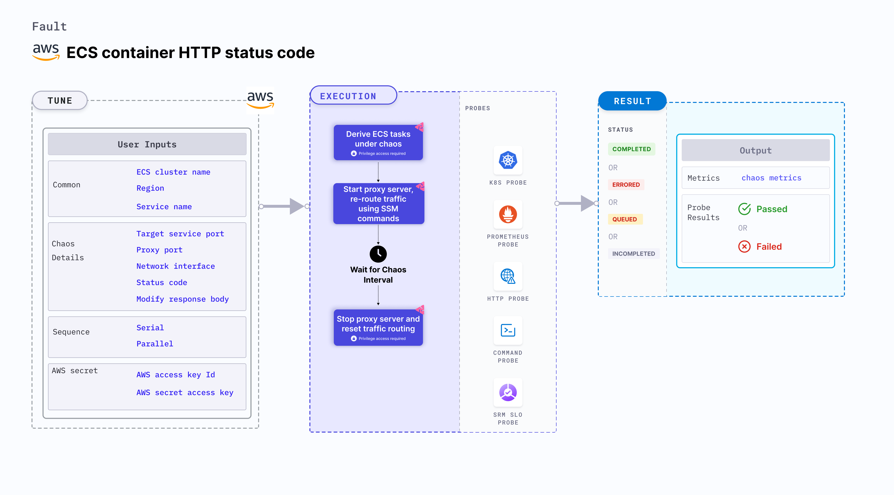

ECS container HTTP status code injects HTTP chaos that affects the request (or response) by modifying the status code (or the body or the headers) by starting a proxy server and redirecting the traffic through the proxy server on the target ECS containers.
- This experiment induces chaos within a container and depends on an EC2 instance. Typically, these are prefixed with ["ECS container"](/docs/chaos-engineering/use-harness-ce/chaos-faults/aws/ec2-and-serverless-faults#ec2-backed-faults) and involve direct interaction with the EC2 instances hosting the ECS containers.



## Use cases
ECS container HTTP status code:
- Tests the ECS task container resilience to erroneous code HTTP responses from the application server.
- Simulates unavailability of specific API services (503, 404), unavailability of specific APIs for(or from) a given microservice (TBD or Path Filter) (404).
- Simulates unauthorized requests for 3rd party services (401 or 403), and API malfunction (internal server error) (50x) on ECS task container.


### Prerequisites
- Kubernetes >= 1.17
- ECS container metadata is enabled (disabled by default). To enable it, refer to this [docs](https://docs.aws.amazon.com/AmazonECS/latest/developerguide/container-metadata.html). If your task is running from before, you may need to restart it to get the metadata directory.
- ECS cluster running with the desired tasks and containers and familiarity with ECS service update and deployment concepts.
- Access to the ECS cluster instances with the necessary permissions to update the start and stop timeouts for containers. Refer to [systems manager docs](https://docs.aws.amazon.com/systems-manager/latest/userguide/setup-launch-managed-instance.html).
- Backup and recovery mechanisms to handle potential failures during the testing process.
- You and the ECS cluster instances have a role with the required AWS access to perform the SSM and ECS operations.
- Kubernetes secret with AWS Access Key ID and Secret Access Key credentials in the `CHAOS_NAMESPACE`. Below is the sample secret file:

```yaml
apiVersion: v1
kind: Secret
metadata:
  name: cloud-secret
type: Opaque
stringData:
  cloud_config.yml: |-
    # Add the cloud AWS credentials respectively
    [default]
    aws_access_key_id = XXXXXXXXXXXXXXXXXXX
    aws_secret_access_key = XXXXXXXXXXXXXXXXXXXXXXXXXXXXXXXXXXXX
```

:::tip
HCE recommends that you use the same secret name, that is, `cloud-secret`. Otherwise, you will need to update the `AWS_SHARED_CREDENTIALS_FILE` environment variable in the fault template with the new secret name and you won't be able to use the default health check probes.
:::

Below is an example AWS policy to execute the fault.

```json
{
    "Version": "2012-10-17",
    "Statement": [
        {
            "Effect": "Allow",
            "Action": [
                "ssm:GetDocument",
                "ssm:DescribeDocument",
                "ssm:GetParameter",
                "ssm:GetParameters",
                "ssm:SendCommand",
                "ssm:CancelCommand",
                "ssm:CreateDocument",
                "ssm:DeleteDocument",
                "ssm:GetCommandInvocation",
                "ssm:UpdateInstanceInformation",
                "ssm:DescribeInstanceInformation"
            ],
            "Resource": "*"
        },
        {
            "Effect": "Allow",
            "Action": [
                "ec2messages:AcknowledgeMessage",
                "ec2messages:DeleteMessage",
                "ec2messages:FailMessage",
                "ec2messages:GetEndpoint",
                "ec2messages:GetMessages",
                "ec2messages:SendReply"
            ],
            "Resource": "*"
        },
        {
            "Effect": "Allow",
            "Action": [
                "ECS Container:DescribeInstanceStatus",
                "ECS Container:DescribeInstances"
            ],
            "Resource": [
                "*"
            ]
        }
    ]
}
```

:::info note
- You can pass the VM credentials as secrets or as a `ChaosEngine` environment variable.
- The ECS container should be in a healthy state before and after introducing chaos.
- Refer to the [superset permission or policy](/docs/chaos-engineering/use-harness-ce/chaos-faults/aws/security-configurations/policy-for-all-aws-faults) to execute all AWS faults.
- Refer to the [common attributes](/docs/chaos-engineering/use-harness-ce/chaos-faults/common-tunables-for-all-faults) to tune the common tunables for all the faults.
- Refer to [AWS named profile for chaos](/docs/chaos-engineering/use-harness-ce/chaos-faults/aws/security-configurations/aws-switch-profile) to use a different profile for AWS faults.
:::

### Mandatory tunables
   <table>
        <tr>
            <th> Tunable </th>
            <th> Description </th>
            <th> Notes </th>
        </tr>
        <tr>
          <td> REGION </td>
          <td> The AWS region ID where the ECS Container instance has been created. </td>
          <td> For example, <code>us-east-1</code>. </td>
        </tr>
        <tr>
            <td> TARGET_SERVICE_PORT </td>
            <td> Port of the service to target. </td>
            <td> Default: port 80. For more information, go to <a href="#target-service-port"> target service port.</a></td>
        </tr>
        <tr>
            <td> STATUS_CODE </td>
            <td> Modified status code for the HTTP response. If no value is provided, a random value is selected from the list of supported values. Multiple values can be provided as comma-separated values, and a random value from the list is selected.</td>
            <td>  Supported values: [200, 201, 202, 204, 300, 301, 302, 304, 307, 400, 401, 403, 404, 500, 501, 502, 503, 504]. Default: random status code. </td>
        </tr>
        <tr>
            <td> MODIFY_RESPONSE_BODY </td>
            <td> Whether to modify the body as per the status code provided.</td>
            <td> If true, then the body is replaced by a default template for the status code. Defaults to true. </td>
        </tr>
    </table>

### Optional tunables
  <table>
    <tr>
            <th> Tunable </th>
            <th> Description </th>
            <th> Notes </th>
        </tr>
        <tr>
            <td> TOTAL_CHAOS_DURATION </td>
            <td> Duration that you specify, through which chaos is injected into the target resource (in seconds). </td>
            <td> Default: 30 s. For more information, go to <a href="/docs/chaos-engineering/use-harness-ce/chaos-faults/common-tunables-for-all-faults#duration-of-the-chaos"> duration of the chaos. </a></td>
        </tr>
        <tr>
            <td> CHAOS_INTERVAL </td>
            <td> Time interval between two successive instance terminations (in seconds). </td>
            <td> Default: 30 s. For more information, go to <a href="/docs/chaos-engineering/use-harness-ce/chaos-faults/common-tunables-for-all-faults#chaos-interval"> chaos interval.</a></td>
        </tr>
        <tr>
            <td> AWS_SHARED_CREDENTIALS_FILE </td>
            <td> Provide the path for aws secret credentials.</td>
            <td> Defaults to <code>/tmp/cloud_config.yml</code>. </td>
        </tr>
        <tr>
          <td> CLUSTER_NAME </td>
          <td> Name of the target ECS cluster</td>
          <td> Single name supported For example, <code>demo-cluster</code>. For more information, go to <a href="#agent-stop"> cluster name.</a></td>
        </tr>
        <tr>
          <td> TASK_REPLICA_AFFECTED_PERC </td>
          <td> Percentage of total tasks that are targeted. </td>
          <td> Default: 100. For more information, go to <a href="#ecs-task-replica-affected-percentage"> ECS task replica affected percentage.</a></td>
      </tr>
        <tr>
          <td> SERVICE_NAME </td>
          <td> Target ECS service name. </td>
          <td> For example, <code>app-svc</code>. For more information, go to <a href="#ecs-service-name"> ECS service name.</a></td>
        </tr>
        <tr>
          <td> TASK_REPLICA_ID </td>
          <td> Comma-separated target task replica IDs. </td>
          <td> `SERVICE_NAME` and `TASK_REPLICA_ID` are mutually exclusive. If both the values are provided, `SERVICE_NAME` takes precedence. For more information, go to <a href="#ecs-task-replica-ids"> ECS task replica ID.</a></td>
        </tr>
        <tr>
            <td> SEQUENCE </td>
            <td> It defines the sequence of chaos execution for multiple instances. </td>
            <td> Default: parallel. Supports serial and parallel. For more information, go to <a href="/docs/chaos-engineering/use-harness-ce/chaos-faults/common-tunables-for-all-faults#sequence-of-chaos-execution"> sequence of chaos execution.</a></td>
        </tr>
        <tr>
            <td> RAMP_TIME </td>
            <td> Period to wait before and after injection of chaos (in seconds). </td>
            <td> For example, 30 s. For more information, go to <a href="/docs/chaos-engineering/use-harness-ce/chaos-faults/common-tunables-for-all-faults#ramp-time"> ramp time. </a></td>
        </tr>
        <tr>
            <td> INSTALL_DEPENDENCY </td>
            <td> Select to install dependencies used to run the network chaos. It can be either True or False. </td>
            <td> If the dependency already exists, you can turn it off. Defaults to True.</td>
        </tr>
        <tr>
            <td> PROXY_PORT </td>
            <td> Port where the proxy will be listening for requests.</td>
            <td> Default: 20000. For more information, go to <a href="#proxy-port"> proxy port.</a></td>
        </tr>
        <tr>
          <td> NETWORK_INTERFACE </td>
          <td> Network interface to be used for the proxy.</td>
          <td> Default: `eth0`. For more information, go to <a href="#network-interface"> network interface.</a></td>
        </tr>
    </table>

### Target service port

Service port that is targeted. Tune it by using the `TARGET_SERVICE_PORT` environment variable.

The following YAML snippet illustrates the use of this environment variable:

[embedmd]:# (./static/manifests/ecs-container-http-status-code/target-service-port.yaml yaml)
```yaml
## provide the port of the targeted service
apiVersion: litmuschaos.io/v1alpha1
kind: ChaosEngine
metadata:
  name: engine-nginx
spec:
  engineState: "active"
  chaosServiceAccount: litmus-admin
  experiments:
  - name: ecs-container-http-status-code
    spec:
      components:
        env:
        # provide the port of the targeted service
        - name: TARGET_SERVICE_PORT
          value: "80"
```

### Modifying the response status code

Response body that is modified. Tune it by using the `RESPONSE_BODY` environment variable.

:::info note
`HTTP_CHAOS_TYPE` should be provided as `status_code`.
:::

The following YAML snippet illustrates the use of this environment variable:

[embedmd]:# (./static/manifests/ecs-container-http-status-code/status-code.yaml yaml)
```yaml
## provide the headers as a map
apiVersion: litmuschaos.io/v1alpha1
kind: ChaosEngine
metadata:
  name: engine-nginx
spec:
  engineState: "active"
  chaosServiceAccount: litmus-admin
  experiments:
  - name: ecs-container-http-status-code
    spec:
      components:
        env:
        # modified status code for the http response
        # if no value is provided, a random status code from the supported code list will selected
        # if multiple comma-separated values are provided, then a random value
        # from the provided list will be selected
        # if an invalid status code is provided, the fault will fail
        # supported status code list:
        # [200, 201, 202, 204, 300, 301, 302, 304, 307, 400, 401, 403, 404, 500, 501, 502, 503, 504]
        - name: STATUS_CODE
          value: '500'
        # whether to modify the body as per the status code provided
        - name: "MODIFY_RESPONSE_BODY"
          value: "true"
        # provide the port of the targeted service
        - name: TARGET_SERVICE_PORT
          value: "80"
```

### Proxy port

Port where the proxy server listens for requests. Tune it by using the `PROXY_PORT` environment variable.

The following YAML snippet illustrates the use of this environment variable:

[embedmd]:# (./static/manifests/ecs-container-http-status-code/proxy-port.yaml yaml)
```yaml
# provide the port for proxy server
apiVersion: litmuschaos.io/v1alpha1
kind: ChaosEngine
metadata:
  name: engine-nginx
spec:
  engineState: "active"
  chaosServiceAccount: litmus-admin
  experiments:
  - name: ecs-container-http-status-code
    spec:
      components:
        env:
        # provide the port for proxy server
        - name: PROXY_PORT
          value: '8080'
        # provide the port of the targeted service
        - name: TARGET_SERVICE_PORT
          value: "80"
```

### Network interface

Network interface used for the proxy. Tune it by using the `NETWORK_INTERFACE` environment variable.

The following YAML snippet illustrates the use of this environment variable:

[embedmd]:# (./static/manifests/ecs-container-http-status-code/network-interface.yaml yaml)
```yaml
## provide the network interface for proxy
apiVersion: litmuschaos.io/v1alpha1
kind: ChaosEngine
metadata:
  name: engine-nginx
spec:
  engineState: "active"
  chaosServiceAccount: litmus-admin
  experiments:
  - name: ecs-container-http-status-code
    spec:
      components:
        env:
        # provide the network interface for proxy
        - name: NETWORK_INTERFACE
          value: "eth0"
        # provide the port of the targeted service
        - name: TARGET_SERVICE_PORT
          value: '80'
```

### Agent stop

Target agent that is stopped for a specific duration. Tune it by using the `CLUSTER_NAME` environment variable.

The following YAML snippet illustrates the use of this environment variable:

[embedmd]:# (./static/manifests/ecs-container-http-status-code/cluster-name.yaml yaml)
```yaml
# stops the agent of an ECS cluster
apiVersion: litmuschaos.io/v1alpha1
kind: ChaosEngine
metadata:
  name: engine-nginx
spec:
  engineState: "active"
  annotationCheck: "false"
  chaosServiceAccount: litmus-admin
  experiments:
  - name: ecs-agent-stop
    spec:
      components:
        env:
        # provide the name of ECS cluster
        - name: CLUSTER_NAME
          value: 'demo'
        - name: REGION
          value: 'us-east-2'
        - name: TOTAL_CHAOS_DURATION
          VALUE: '60'
```

### ECS task replica affected percentage

Number of tasks to target (in percentage). Tune it by using the `TASK_REPLICA_AFFECTED_PERC` environment variable.

The following YAML snippet illustrates the use of this environment variable:

[embedmd]:# (./static/manifests/ecs-container-http-status-code/task-replica-affected-perc.yaml yaml)
```yaml
# stop the tasks of an ECS cluster
apiVersion: litmuschaos.io/v1alpha1
kind: ChaosEngine
metadata:
  name: engine-nginx
spec:
  engineState: "active"
  annotationCheck: "false"
  chaosServiceAccount: litmus-admin
  experiments:
  - name: ecs-task-stop
    spec:
      components:
        env:
        # provide the name of ECS cluster
        - name: CLUSTER_NAME
          value: 'demo'
        - name: SERVICE_NAME
          vale: 'test-svc'
        - name: TASK_REPLICA_AFFECTED_PERC
          vale: '100'
        - name: REGION
          value: 'us-east-1'
        - name: TOTAL_CHAOS_DURATION
          VALUE: '60'
```

### ECS task replica IDs

Task replicas that have a specific ID which are to be stopped. Tune it by using the `TASK_REPLICA_ID` environment variable.

The following YAML snippet illustrates the use of this environment variable:

[embedmd]:# (./static/manifests/ecs-container-http-status-code/task-replica-id.yaml yaml)
```yaml
# stop the tasks of an ECS cluster
apiVersion: litmuschaos.io/v1alpha1
kind: ChaosEngine
metadata:
  name: engine-nginx
spec:
  engineState: "active"
  annotationCheck: "false"
  chaosServiceAccount: litmus-admin
  experiments:
  - name: ecs-task-stop
    spec:
      components:
        env:
        # provide the name of ECS cluster
        - name: CLUSTER_NAME
          value: 'demo'
        - name: TASK_REPLICA_ID
          vale: '1b751cf956e34e54b9d83b6a5c067f60,20d5041c044941dfb2126f1722d10558'
        - name: REGION
          value: 'us-east-1'
        - name: TOTAL_CHAOS_DURATION
          VALUE: '60'
```

### ECS service name

Service name whose tasks are stopped. Tune it by using the `SERVICE_NAME` environment variable.

The following YAML snippet illustrates the use of this environment variable:

[embedmd]:# (./static/manifests/ecs-container-http-status-code/service-name.yaml yaml)
```yaml
# stop the tasks of an ECS cluster
apiVersion: litmuschaos.io/v1alpha1
kind: ChaosEngine
metadata:
  name: engine-nginx
spec:
  engineState: "active"
  annotationCheck: "false"
  chaosServiceAccount: litmus-admin
  experiments:
  - name: ecs-task-stop
    spec:
      components:
        env:
        # provide the name of ECS cluster
        - name: CLUSTER_NAME
          value: 'demo'
        - name: SERVICE_NAME
          vale: 'test-svc'
        - name: REGION
          value: 'us-east-1'
        - name: TOTAL_CHAOS_DURATION
          VALUE: '60'
```