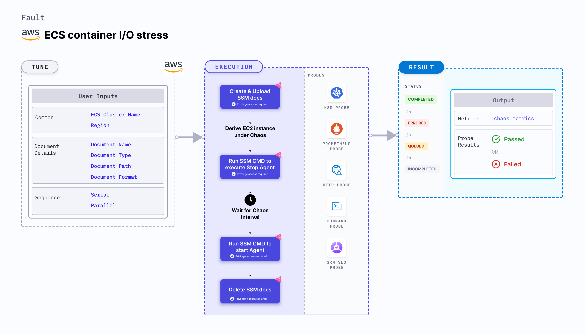

ECS container IO stress disrupts the state of infrastructure resources. It induces stress on the AWS ECS container using Amazon SSM Run command, which is carried out using SSM docs which is in-built into the fault.
- It causes I/O stress on the containers of the ECS task using the given `CLUSTER_NAME` environment variable for a specific duration.
- To select the Task Under Chaos (TUC), use the service name associated with the task. If you provide the service name along with the cluster name, all the tasks associated with the given service will be selected as chaos targets.
- It tests the ECS task sanity (service availability) and recovery of the task containers subject to I/O stress.
- This experiment induces chaos within a container and depends on an EC2 instance. Typically, these are prefixed with ["ECS container"](/docs/chaos-engineering/chaos-faults/aws/ec2-and-serverless-faults#ec2-backed-faults) and involve direct interaction with the EC2 instances hosting the ECS containers.



## Use cases
ECS container IO stress:
- Determines how a container recovers from a memory exhaustion.
- File system read and write evicts the application (task container) and impacts its delivery. These issues are also known as noisy-neighbour problems.
- Injecting a rogue process into a target container starves the main microservice process (typically pid 1) of the resources allocated to it (where the limits are defined). This slows down the application traffic or exhausts the resources leading to eviction of all task containers.

### Prerequisites
- Kubernetes >= 1.17
- ECS container metadata is enabled (disabled by default). To enable it, refer to this [docs](https://docs.aws.amazon.com/AmazonECS/latest/developerguide/container-metadata.html). If your task is running from before, you may need to restart it to get the metadata directory.
- You and the ECS cluster instances have a role with the required AWS access to perform the SSM and ECS operations. Refer to [systems manager docs](https://docs.aws.amazon.com/systems-manager/latest/userguide/setup-launch-managed-instance.html).
- Create a Kubernetes secret that has the AWS access configuration(key) in the `CHAOS_NAMESPACE`. Below is a sample secret file:

```yaml
apiVersion: v1
kind: Secret
metadata:
  name: cloud-secret
type: Opaque
stringData:
  cloud_config.yml: |-
    # Add the cloud AWS credentials respectively
    [default]
    aws_access_key_id = XXXXXXXXXXXXXXXXXXX
    aws_secret_access_key = XXXXXXXXXXXXXXX
```

:::tip
HCE recommends that you use the same secret name, that is, `cloud-secret`. Otherwise, you will need to update the `AWS_SHARED_CREDENTIALS_FILE` environment variable in the fault template with the new secret name and you won't be able to use the default health check probes.
:::

Below is an example AWS policy to execute the fault.

```json
{
    "Version": "2012-10-17",
    "Statement": [
        {
            "Sid": "VisualEditor0",
            "Effect": "Allow",
            "Action": [
                "ecs:UpdateContainerInstancesState",
                "ecs:RegisterContainerInstance",
                "ecs:ListContainerInstances",
                "ecs:DeregisterContainerInstance",
                "ecs:DescribeContainerInstances",
                "ecs:ListTasks",
                "ecs:DescribeClusters"

            ],
            "Resource": "*"
        },
        {
            "Effect": "Allow",
            "Action": [
                "ssm:GetDocument",
                "ssm:DescribeDocument",
                "ssm:GetParameter",
                "ssm:GetParameters",
                "ssm:SendCommand",
                "ssm:CancelCommand",
                "ssm:CreateDocument",
                "ssm:DeleteDocument",
                "ssm:GetCommandInvocation",
                "ssm:UpdateInstanceInformation",
                "ssm:DescribeInstanceInformation"
            ],
            "Resource": "*"
        },
        {
            "Effect": "Allow",
            "Action": [
                "ec2messages:AcknowledgeMessage",
                "ec2messages:DeleteMessage",
                "ec2messages:FailMessage",
                "ec2messages:GetEndpoint",
                "ec2messages:GetMessages",
                "ec2messages:SendReply"
            ],
            "Resource": "*"
        },
        {
            "Effect": "Allow",
            "Action": [
                "ec2:DescribeInstances"
            ],
            "Resource": [
                "*"
            ]
        }
    ]
}
```

:::info note
- The ECS container instance should be in a healthy state.
- It is recommended to use the same secret name, i.e. `cloud-secret`. Otherwise, you will need to update the `AWS_SHARED_CREDENTIALS_FILE` environment variable in the fault template and you may be unable to use the default health check probes.
- Refer to the [superset permission/policy](./security-configurations/policy-for-all-aws-faults.md) to execute all AWS faults.
- Refer to [AWS named profile for chaos](./security-configurations/aws-switch-profile.md) to know how to use a different profile for AWS faults.
- Refer to the [common attributes](/docs/chaos-engineering/chaos-faults/common-tunables-for-all-faults.md) and [AWS-specific tunables](./aws-fault-tunables.md) to tune the common tunables for all faults and aws specific tunables.
:::

### Mandatory tunables
  <table>
        <tr>
        <th> Variables </th>
        <th> Description </th>
        <th> Notes </th>
        </tr>
        <tr>
        <td> CLUSTER_NAME </td>
        <td> Name of the target ECS cluster. </td>
        <td> For example, <code>cluster-1</code>. </td>
        </tr>
        <tr>
        <td> REGION </td>
        <td> Region name of the target ECS cluster</td>
        <td> For example, <code>us-east-1</code>. </td>
        </tr>
    </table>

### Optional tunables
  <table>
    <tr>
      <th> Variables </th>
      <th> Description </th>
      <th> Notes </th>
    </tr>
    <tr>
        <td> TOTAL_CHAOS_DURATION </td>
        <td> Duration that you specify, through which chaos is injected into the target resource (in seconds). </td>
        <td> Default: 30 s. For more information, go to <a href="/docs/chaos-engineering/chaos-faults/common-tunables-for-all-faults#duration-of-the-chaos"> duration of the chaos. </a></td>
      </tr>
      <tr>
        <td> CHAOS_INTERVAL </td>
        <td> Interval between successive instance terminations (in seconds).</td>
        <td> Default: 30 s. For more information, go to <a href="/docs/chaos-engineering/chaos-faults/common-tunables-for-all-faults#chaos-interval"> chaos interval.</a></td>
      </tr>
    <tr>
      <td> AWS_SHARED_CREDENTIALS_FILE </td>
      <td> Path to the AWS secret credentials.</td>
      <td> Defaults to <code>/tmp/cloud_config.yml</code>. </td>
    </tr>
    <tr>
          <td> SERVICE_NAME </td>
          <td> Target ECS service name. </td>
          <td> For example, <code>app-svc</code>. For more information, go to <a href="#ecs-service-name"> ECS service name.</a></td>
        </tr>
    <tr>
      <td> FILESYSTEM_UTILIZATION_BYTES </td>
      <td> Memory consumed during I/O stress (in GB). </td>
      <td> Default: 1. For more information, go to <a href="#file-system-utilization-bytes"> file system utilization in bytes.</a></td>
    </tr>
    <tr>
      <td> FILESYSTEM_UTILIZATION_PERCENTAGE </td>
      <td> Memory consumed during I/O stress (in percentage). </td>
      <td> Default: 10. For more information, go to <a href="#file-system-utilization-percentage"> file system utilization in percentage.</a></td>
    </tr>
    <tr>
      <td> VOLUME_MOUNT_PATH </td>
      <td> Location that points to the volume mount path used in I/O stress.</td>
      <td> Default: <code>/tmp</code>. For more information, go to <a href="#mount-path"> volume mount path.</a></td>
    </tr>
    <tr>
      <td> NUMBER_OF_WORKERS </td>
      <td> Number of workers for memory stress.</td>
      <td> Default: 1. For more information, go to <a href="#workers-for-stress"> workers.</a></td>
    </tr>
    <tr>
        <td> SEQUENCE </td>
        <td> Sequence of chaos execution for multiple instances</td>
        <td> Default: parallel. Supports serial and parallel. For more information, go to <a href="/docs/chaos-engineering/chaos-faults/common-tunables-for-all-faults#sequence-of-chaos-execution"> sequence of chaos execution.</a></td>
      </tr>
      <tr>
        <td> RAMP_TIME </td>
        <td> Period to wait before and after injecting chaos (in seconds).  </td>
        <td> For example, 30 s. For more information, go to <a href="/docs/chaos-engineering/chaos-faults/common-tunables-for-all-faults#ramp-time"> ramp time. </a></td>
      </tr>
</table>

### File system utilization percentage

Amount of free space available in the ECS container (in percentage). Tune it by using the  `FILESYSTEM_UTILIZATION_PERCENTAGE` environment variable.

The following YAML snippet illustrates the use of this environment variable:

[embedmd]:# (./static/manifests/ecs-stress-chaos/filesystem-utilization-percentage.yaml yaml)
```yaml
# stress the i/o of the targeted pod with FILESYSTEM_UTILIZATION_PERCENTAGE of total free space
# it is mutually exclusive with the FILESYSTEM_UTILIZATION_BYTES.
# if both are provided then it will use FILESYSTEM_UTILIZATION_PERCENTAGE for stress
apiVersion: litmuschaos.io/v1alpha1
kind: ChaosEngine
metadata:
  name: engine-nginx
spec:
  engineState: "active"
  annotationCheck: "false"
  chaosServiceAccount: litmus-admin
  experiments:
  - name: ecs-container-io-stress
    spec:
      components:
        env:
        # percentage of free space of file system, need to be stressed
        - name: FILESYSTEM_UTILIZATION_PERCENTAGE
          value: '10' #in percentage
        - name: TOTAL_CHAOS_DURATION
          VALUE: '60'
```

### File system utilization bytes

Amount of free space available in the ECS container (in gigabytes). Tune it by using the  `FILESYSTEM_UTILIZATION_BYTES` environment variable.

The `FILESYSTEM_UTILIZATION_BYTES` and `FILESYSTEM_UTILIZATION_PERCENTAGE` environment variables are mutually exclusive. If values for both variables are provided, `FILESYSTEM_UTILIZATION_PERCENTAGE` takes precedence.

The following YAML snippet illustrates the use of this environment variable:

[embedmd]:# (./static/manifests/ecs-stress-chaos/filesystem-utilization-bytes.yaml yaml)
```yaml
# stress the i/o of the targeted pod with FILESYSTEM_UTILIZATION_PERCENTAGE of total free space
# it is mutually exclusive with the FILESYSTEM_UTILIZATION_BYTES.
# if both are provided then it will use FILESYSTEM_UTILIZATION_PERCENTAGE for stress
apiVersion: litmuschaos.io/v1alpha1
kind: ChaosEngine
metadata:
  name: engine-nginx
spec:
  engineState: "active"
  annotationCheck: "false"
  chaosServiceAccount: litmus-admin
  experiments:
  - name: ecs-container-io-stress
    spec:
      components:
        env:
        # size of io to be stressed
        - name: FILESYSTEM_UTILIZATION_BYTES
          value: '1' #in GB
        - name: TOTAL_CHAOS_DURATION
          VALUE: '60'
```

### Mount path

Location that points to the volume mount path used in I/O stress. Tune it by using the `VOLUME_MOUNT_PATH` environment variable.

The following YAML snippet illustrates the use of this environment variable:

[embedmd]:# (./static/manifests/ecs-stress-chaos/mount-path.yaml yaml)
```yaml
# provide the volume mount path, which needs to be filled
apiVersion: litmuschaos.io/v1alpha1
kind: ChaosEngine
metadata:
  name: engine-nginx
spec:
  engineState: "active"
  annotationCheck: "false"
  chaosServiceAccount: litmus-admin
  experiments:
  - name: ecs-container-io-stress
    spec:
      components:
        env:
        # path need to be stressed/filled
        - name: VOLUME_MOUNT_PATH
          value: '/some-dir-in-container'
        - name: TOTAL_CHAOS_DURATION
          VALUE: '60'
```

### Workers for stress

The number of workers on which you apply stress. Tune it by using the `NUMBER_OF_WORKERS` environment variable.

The following YAML snippet illustrates the use of this environment variable:

[embedmd]:# (./static/manifests/ecs-stress-chaos/io-number-of-workers.yaml yaml)
```yaml
# number of workers for the stress
apiVersion: litmuschaos.io/v1alpha1
kind: ChaosEngine
metadata:
  name: engine-nginx
spec:
  engineState: "active"
  annotationCheck: "false"
  chaosServiceAccount: litmus-admin
  experiments:
  - name: ecs-container-io-stress
    spec:
      components:
        env:
        # number of io workers
        - name: NUMBER_OF_WORKERS
          value: '4'
        - name: TOTAL_CHAOS_DURATION
          VALUE: '60'
```

### ECS service name

Service name whose tasks are stopped. Tune it by using the `SERVICE_NAME` environment variable.

The following YAML snippet illustrates the use of this environment variable:

[embedmd]:# (./static/manifests/ecs-stress-chaos/service-name.yaml yaml)
```yaml
# stop the tasks of an ECS cluster
apiVersion: litmuschaos.io/v1alpha1
kind: ChaosEngine
metadata:
  name: engine-nginx
spec:
  engineState: "active"
  annotationCheck: "false"
  chaosServiceAccount: litmus-admin
  experiments:
  - name: ecs-task-stop
    spec:
      components:
        env:
        # provide the name of ECS cluster
        - name: CLUSTER_NAME
          value: 'demo'
        - name: SERVICE_NAME
          vale: 'test-svc'
        - name: REGION
          value: 'us-east-1'
        - name: TOTAL_CHAOS_DURATION
          VALUE: '60'
```