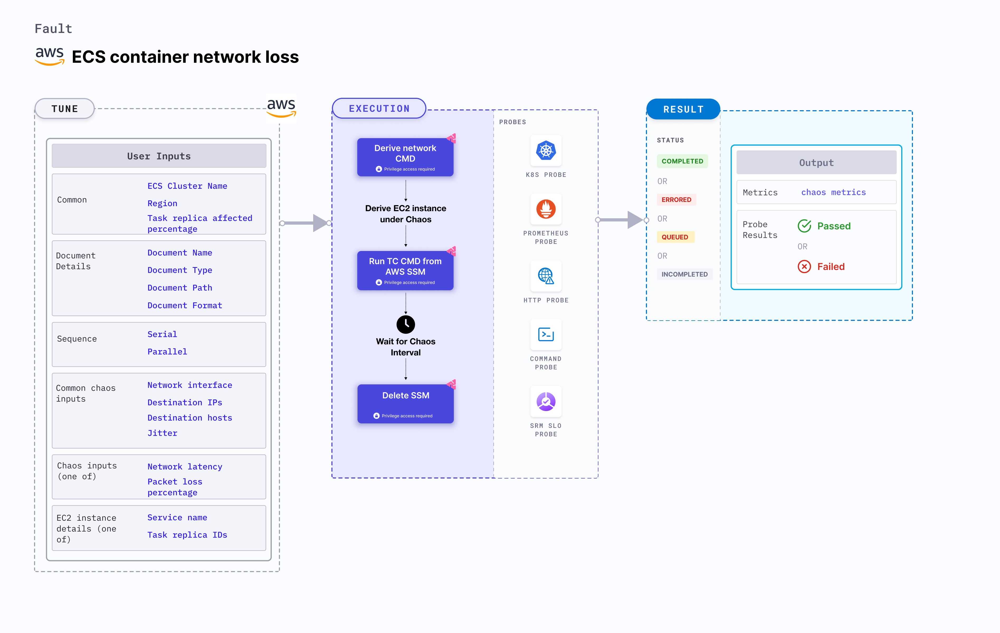

ECS container network loss disrupts the state of infrastructure resources.
- The fault induces chaos on the AWS ECS container using Amazon SSM Run command, which is carried out using SSM docs that comes in-built in the fault.
- It causes network disruption on containers of the ECS task in the cluster name.
- To select the Task Under Chaos (TUC), use the service name associated with the task. If you provide the service name along with cluster name, all the tasks associated with the given service will be selected as chaos targets.
- It tests the ECS task sanity (service availability) and recovery of the task containers subjected to network chaos.
- This experiment induces chaos within a container and depends on an EC2 instance. Typically, these are prefixed with ["ECS container"](/docs/chaos-engineering/use-harness-ce/chaos-faults/aws/ec2-and-serverless-faults#ec2-backed-faults) and involve direct interaction with the EC2 instances hosting the ECS containers.




## Use cases

- This fault degrades the network of the task container without the container being marked as unhealthy/ (or unworthy) of traffic. It simulates issues within the ECS task network or communication across services in different availability zones (or regions).
  - This can be resolved using middleware that switches traffic based on certain SLOs (or performance parameters).
  - This can also be resolved by highlighting the degradation using notifications (or alerts).
- It also determines the impact of the fault on the microservice.
The task may stall or get corrupted while waiting endlessly for a packet. The fault limits the impact (blast radius) to only the traffic you wish to test by specifying the service to find TUC (Task Under Chaos).
- It simulates degraded network with varied percentages of dropped packets between microservices, loss of access to specific third party (or dependent) services (or components), blackhole against traffic to a given AZ (failure simulation of availability zones), and network partitions (split-brain) between peer replicas for a stateful application.
- This fault helps improve the resilience of the services over time.

### Prerequisites
- Kubernetes >= 1.17
- The ECS container instance should be in a healthy state.
- Adequate AWS access to stop and start an EC2 instance.
- Create a Kubernetes secret that has the AWS access configuration(key) in the `CHAOS_NAMESPACE`. Below is a sample secret file:

```yaml
apiVersion: v1
kind: Secret
metadata:
  name: cloud-secret
type: Opaque
stringData:
  cloud_config.yml: |-
    # Add the cloud AWS credentials respectively
    [default]
    aws_access_key_id = XXXXXXXXXXXXXXXXXXX
    aws_secret_access_key = XXXXXXXXXXXXXXX
```

:::tip
HCE recommends that you use the same secret name, that is, `cloud-secret`. Otherwise, you will need to update the `AWS_SHARED_CREDENTIALS_FILE` environment variable in the fault template with the new secret name and you won't be able to use the default health check probes.
:::

Below is an example AWS policy to execute the fault.

```json
{
    "Version": "2012-10-17",
    "Statement": [
        {
            "Sid": "VisualEditor0",
            "Effect": "Allow",
            "Action": [
                "ecs:UpdateContainerInstancesState",
                "ecs:RegisterContainerInstance",
                "ecs:ListContainerInstances",
                "ecs:DeregisterContainerInstance",
                "ecs:DescribeContainerInstances",
                "ecs:ListTasks",
                "ecs:DescribeClusters"

            ],
            "Resource": "*"
        },
        {
            "Effect": "Allow",
            "Action": [
                "ssm:GetDocument",
                "ssm:DescribeDocument",
                "ssm:GetParameter",
                "ssm:GetParameters",
                "ssm:SendCommand",
                "ssm:CancelCommand",
                "ssm:CreateDocument",
                "ssm:DeleteDocument",
                "ssm:GetCommandInvocation",
                "ssm:UpdateInstanceInformation",
                "ssm:DescribeInstanceInformation"
            ],
            "Resource": "*"
        },
        {
            "Effect": "Allow",
            "Action": [
                "ec2messages:AcknowledgeMessage",
                "ec2messages:DeleteMessage",
                "ec2messages:FailMessage",
                "ec2messages:GetEndpoint",
                "ec2messages:GetMessages",
                "ec2messages:SendReply"
            ],
            "Resource": "*"
        },
        {
            "Effect": "Allow",
            "Action": [
                "ec2:DescribeInstances"
            ],
            "Resource": [
                "*"
            ]
        }
    ]
}
```

:::info note
- Refer to [AWS Named Profile For Chaos](/docs/chaos-engineering/use-harness-ce/chaos-faults/aws/security-configurations/aws-switch-profile) to know how to use a different profile for AWS faults.
- Refer to the [superset permission/policy](/docs/chaos-engineering/use-harness-ce/chaos-faults/aws/security-configurations/policy-for-all-aws-faults) to execute all AWS faults.
- Refer to the [common attributes](/docs/chaos-engineering/use-harness-ce/chaos-faults/common-tunables-for-all-faults) and [AWS-specific tunables](/docs/chaos-engineering/use-harness-ce/chaos-faults/aws/aws-fault-tunables) to tune the common tunables for all faults and aws specific tunables.
:::

### Mandatory tunables
  <table>
        <tr>
        <th> Variables </th>
        <th> Description </th>
        <th> Notes </th>
        </tr>
        <tr>
        <td> CLUSTER_NAME </td>
        <td> Name of the target ECS cluster</td>
        <td> For example, cluster-1 </td>
        </tr>
        <tr>
        <td> REGION </td>
        <td> The region name of the target ECS cluster</td>
        <td> For example, us-east-1 </td>
        </tr>
    </table>

### Optional tunables
  <table>
      <tr>
        <th> Variables </th>
        <th> Description </th>
        <th> Notes </th>
      </tr>
      <tr>
        <td> TOTAL_CHAOS_DURATION </td>
        <td> Duration that you specify, through which chaos is injected into the target resource (in seconds). </td>
        <td> Default: 30 s. For more information, go to <a href="/docs/chaos-engineering/use-harness-ce/chaos-faults/common-tunables-for-all-faults#duration-of-the-chaos"> duration of the chaos. </a></td>
      </tr>
      <tr>
        <td> CHAOS_INTERVAL </td>
        <td> The interval (in sec) between successive instance termination.</td>
        <td> Default: 30 s. For more information, go to <a href="/docs/chaos-engineering/use-harness-ce/chaos-faults/common-tunables-for-all-faults#chaos-interval"> chaos interval.</a></td>
      </tr>
      <tr>
        <td> AWS_SHARED_CREDENTIALS_FILE </td>
        <td> Provide the path for aws secret credentials</td>
        <td> Default: <code>/tmp/cloud_config.yml</code> </td>
      </tr>
      <tr>
        <td> NETWORK_PACKET_LOSS_PERCENTAGE </td>
        <td> Provide the value of loss in percentage	</td>
        <td> Default: 100. For more information, go to <a href="#network-loss"> network loss.</a></td>
      </tr>
      <tr>
        <td> DESTINATION_IPS </td>
        <td> IP addresses of the services or the CIDR blocks(range of IPs), the accessibility to which is impacted </td>
        <td> Comma-separated IP(S) or CIDR(S). If not provided, network chaos is induced for all IPs/destinations. For more information, go to <a href="#destination-ips-and-destination-hosts"> destination IPs.</a></td>
      </tr>
      <tr>
        <td> DESTINATION_HOSTS </td>
        <td> DNS Names of the services, the accessibility to which, is impacted </td>
        <td> If not provided, network chaos is induced for all IPs/destinations or DESTINATION_IPS if already defined. For more information, go to <a href="#destination-ips-and-destination-hosts"> destination hosts.</a></td>
      </tr>
      <tr>
        <td> NETWORK_INTERFACE  </td>
        <td> Name of ethernet interface considered for shaping traffic </td>
        <td> Default: <code>eth0</code>. For more information, go to <a href="#network-interface"> network interface.</a></td>
      </tr>
      <tr>
        <td> SEQUENCE </td>
        <td> It defines sequence of chaos execution for multiple instance</td>
        <td> Default: parallel. Supports serial and parallel. For more information, go to <a href="/docs/chaos-engineering/use-harness-ce/chaos-faults/common-tunables-for-all-faults#sequence-of-chaos-execution"> sequence of chaos execution.</a></td>
      </tr>
      <tr>
        <td> RAMP_TIME </td>
        <td> Period to wait before and after injecting chaos (in seconds).  </td>
        <td> For example, 30 s. For more information, go to <a href="/docs/chaos-engineering/use-harness-ce/chaos-faults/common-tunables-for-all-faults#ramp-time"> ramp time. </a></td>
      </tr>
    </table>


### Network loss

Network loss (in ms) to be injected in the target container. Tune it by using the `NETWORK_PACKET_LOSS_PERCENTAGE` environment variable.

The following YAML snippet illustrates the use of this environment variable:

[embedmd]:# (./static/manifests/ecs-network-chaos/network-loss.yaml yaml)
```yaml
# injects network loss for a certain chaos duration
apiVersion: litmuschaos.io/v1alpha1
kind: ChaosEngine
metadata:
  name: engine-nginx
spec:
  engineState: "active"
  annotationCheck: "false"
  chaosServiceAccount: litmus-admin
  experiments:
  - name: ecs-container-network-loss
    spec:
      components:
        env:
        # network loss to be injected
        - name: NETWORK_PACKET_LOSS_PERCENTAGE
          value: '100' #in ms
        - name: TOTAL_CHAOS_DURATION
          value: '60'
```

### Network interface

Name of the ethernet interface considered for shaping traffic. Tune it by using the `NETWORK_INTERFACE` environment variable. Its default value is `eth0`.

The following YAML snippet illustrates the use of this environment variable:

[embedmd]:# (./static/manifests/ecs-network-chaos/loss-network-interface.yaml yaml)
```yaml
# provide the network interface
apiVersion: litmuschaos.io/v1alpha1
kind: ChaosEngine
metadata:
  name: engine-nginx
spec:
  engineState: "active"
  annotationCheck: "false"
  chaosServiceAccount: litmus-admin
  experiments:
  - name: ecs-container-network-loss
    spec:
      components:
        env:
        # name of the network interface
        - name: NETWORK_INTERFACE
          value: 'eth0'
        - name: TOTAL_CHAOS_DURATION
          value: '60'
```


### Destination IPs and destination hosts

The network faults interrupt traffic for all the IPs/hosts by default. Tune the interruption of specific IPs/Hosts using `DESTINATION_IPS` and `DESTINATION_HOSTS` environment variables.

- `DESTINATION_IPS`: It contains the IP addresses of the services or pods or the CIDR blocks(range of IPs), the accessibility to which is impacted.
- `DESTINATION_HOSTS`: It contains the DNS Names/FQDN names of the services, the accessibility to which, is impacted.

The following YAML snippet illustrates the use of this environment variable:

[embedmd]:# (./static/manifests/ecs-network-chaos/loss-destination-ip-and-hosts.yaml yaml)
```yaml
# it inject the chaos for the egress traffic for specific ips/hosts
apiVersion: litmuschaos.io/v1alpha1
kind: ChaosEngine
metadata:
  name: engine-nginx
spec:
  engineState: "active"
  annotationCheck: "false"
  chaosServiceAccount: litmus-admin
  experiments:
  - name: ecs-container-network-loss
    spec:
      components:
        env:
        # supports comma-separated destination ips
        - name: DESTINATION_IPS
          value: '8.8.8.8,192.168.5.6'
        # supports comma-separated destination hosts
        - name: DESTINATION_HOSTS
          value: 'nginx.default.svc.cluster.local,google.com'
        - name: TOTAL_CHAOS_DURATION
          value: '60'
```
