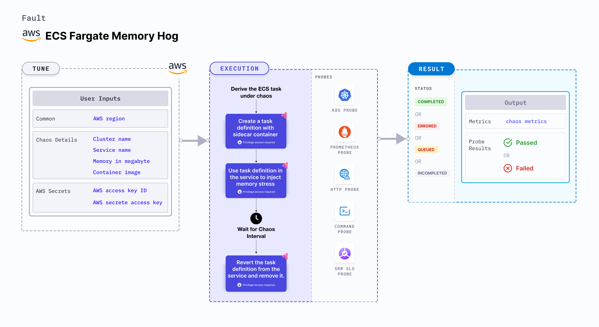

The ECS Fargate memory hog experiment enables you to intentionally increase the memory usage of an ECS task container for a defined period, allowing you to assess and test the container's performance under high memory utilization conditions or latency caused due to it.
This experiment primarily involves ECS Fargate and doesn't depend on EC2 instances. [They](/docs/chaos-engineering/use-harness-ce/chaos-faults/aws/ec2-and-serverless-faults#serverless-faults) focus on altering the state or resources of ECS containers without direct container interaction.



## Use cases
ECS Fargate memory hog:
- Tests the behavior of your ECS tasks subjected to memory stress, and validates the resilience and performance of your ECS tasks during the stress.
- Employes a sidecar container to augment the memory utilization of an ECS task, which may result in latency issues impacting the performance of the main container.
- Validates the behavior of your application and infrastructure during a heavy memory load, such as:
  - Testing the resilience of your system during stress, including verifying if the latency of the main container is increased and if the container fail to survive.

### Prerequisites
- Kubernetes >= 1.17
- ECS cluster running with the desired tasks and containers and familiarity with ECS service update and deployment concepts.
- Create a Kubernetes secret that has the AWS access configuration(key) in the `CHAOS_NAMESPACE`. Below is a sample secret file:

```yaml
apiVersion: v1
kind: Secret
metadata:
  name: cloud-secret
type: Opaque
stringData:
  cloud_config.yml: |-
    # Add the cloud AWS credentials respectively
    [default]
    aws_access_key_id = XXXXXXXXXXXXXXXXXXX
    aws_secret_access_key = XXXXXXXXXXXXXXX
```

:::tip
HCE recommends that you use the same secret name, that is, `cloud-secret`. Otherwise, you will need to update the `AWS_SHARED_CREDENTIALS_FILE` environment variable in the fault template with the new secret name and you won't be able to use the default health check probes.
:::

Below is an example AWS policy to execute the fault.

```json
{
    "Version": "2012-10-17",
    "Statement": [
        {
            "Effect": "Allow",
            "Action": [
                "ecs:DescribeTasks",
                "ecs:DescribeServices",
                "ecs:DescribeTaskDefinition",
                "ecs:RegisterTaskDefinition",
                "ecs:UpdateService",
                "ecs:ListTasks",
                "ecs:DeregisterTaskDefinition"
            ],
            "Resource": "*"
        },
        {
            "Effect": "Allow",
            "Action": [
                "iam:PassRole"
            ],
            "Resource": "*"
        }
    ]
}
```
:::info note
- Refer to [AWS named profile for chaos](/docs/chaos-engineering/use-harness-ce/chaos-faults/aws/security-configurations/aws-switch-profile) for how to use a different profile for AWS faults.
- The ECS containers should be in a healthy state before and after introducing chaos.
Refer to the [common attributes](/docs/chaos-engineering/use-harness-ce/chaos-faults/common-tunables-for-all-faults) and [AWS-specific tunables](/docs/chaos-engineering/use-harness-ce/chaos-faults/aws/aws-fault-tunables) to tune the common tunables for all faults and AWS-specific tunables.
- Refer to the [superset permission/policy](/docs/chaos-engineering/use-harness-ce/chaos-faults/aws/security-configurations/policy-for-all-aws-faults) to execute all AWS faults.
:::

### Mandatory tunables
  <table>
        <tr>
          <th> Tunable </th>
          <th> Description </th>
          <th> Notes </th>
        </tr>
        <tr>
          <td> CLUSTER_NAME </td>
          <td> Name of the target ECS cluster </td>
          <td> For example, <code>cluster-1</code>. </td>
        </tr>
        <tr>
          <td> SERVICE_NAME </td>
          <td> Name of the ECS service under chaos </td>
          <td> For example, <code>nginx-svc</code>. </td>
        </tr>
        <tr>
          <td> REGION </td>
          <td> Region name of the target ECS cluster</td>
          <td> For example, <code>us-east-1</code>. </td>
        </tr>
    </table>

### Optional tunables
  <table>
      <tr>
        <th> Tunable </th>
        <th> Description </th>
        <th> Notes </th>
      </tr>
      <tr>
        <td> TOTAL_CHAOS_DURATION </td>
        <td> Duration that you specify, through which chaos is injected into the target resource (in seconds) </td>
        <td> Default: 30s. For more information, go to <a href="/docs/chaos-engineering/use-harness-ce/chaos-faults/common-tunables-for-all-faults#duration-of-the-chaos"> duration of the chaos. </a></td>
      </tr>
      <tr>
        <td> CHAOS_INTERVAL </td>
        <td> Interval between successive instance terminations (in seconds)</td>
        <td> Default: 30s. For more information, go to <a href="/docs/chaos-engineering/use-harness-ce/chaos-faults/common-tunables-for-all-faults#chaos-interval"> chaos interval.</a></td>
      </tr>
      <tr>
        <td> AWS_SHARED_CREDENTIALS_FILE </td>
        <td> Path to the AWS secret credentials</td>
        <td> Defaults to <code>/tmp/cloud_config.yml</code>. </td>
      </tr>
      <tr>
        <td> MEMORY_IN_MEGABYTE </td>
        <td> Provide the memory in Megabytes to stress the ECS task. </td>
        <td> Default: 500. For more information, go to <a href="#memory-consumed-in-megabytes"> memory consumed in MB.</a> </td>
      </tr>
      <tr>
        <td> CONTAINER_IMAGE </td>
        <td> Provide stress image for the sidecar container. </td>
        <td> Default: nginx. For more information, go to <a href="#stress-container-image"> stress container image.</a> </td>
      </tr>
      <tr>
        <td> RAMP_TIME </td>
        <td> Period to wait before and after injecting chaos (in seconds)  </td>
        <td> For example, 30 s. For more information, go to <a href="/docs/chaos-engineering/use-harness-ce/chaos-faults/common-tunables-for-all-faults#ramp-time"> ramp time. </a></td>
      </tr>
    </table>


### Memory consumed in megabytes

ECS Fargate memory stress with a specified memory in Megabytes. Tune it by using the `MEMORY_IN_MEGABYTE` environment variable.

The following YAML snippet illustrates the use of this environment variable:

[embedmd]:# (./static/manifests/ecs-fargate-memory-hog/memory.yaml yaml)
```yaml
# Set container image for the target ECS task
apiVersion: litmuschaos.io/v1alpha1
kind: ChaosEngine
metadata:
  name: aws-nginx
spec:
  engineState: "active"
  annotationCheck: "false"
  chaosServiceAccount: litmus-admin
  experiments:
  - name: ecs-fargate-memory-hog
    spec:
      components:
        env:
        - name: MEMORY_IN_MEGABYTE
          value: '500'
        - name: REGION
          value: 'us-east-2'
        - name: TOTAL_CHAOS_DURATION
          VALUE: '60'
```

### Stress container image

ECS Fargate memory hog chaos with custom stress container image for sidecar container to inject chaos. Tune it by using the `CONTAINER_IMAGE` environment variable.

The following YAML snippet illustrates the use of this environment variable:

[embedmd]:# (./static/manifests/ecs-fargate-memory-hog/image.yaml yaml)
```yaml
# Set container image for the target ECS task
apiVersion: litmuschaos.io/v1alpha1
kind: ChaosEngine
metadata:
  name: aws-nginx
spec:
  engineState: "active"
  annotationCheck: "false"
  chaosServiceAccount: litmus-admin
  experiments:
  - name: ecs-fargate-memory-hog
    spec:
      components:
        env:
        - name: CONTAINER_IMAGE
          value: 'chaosnative/go-runner:ci'
        - name: MEMORY_IN_MEGABYTE
          value: '500'
        - name: REGION
          value: 'us-east-2'
        - name: TOTAL_CHAOS_DURATION
          VALUE: '60'
```
