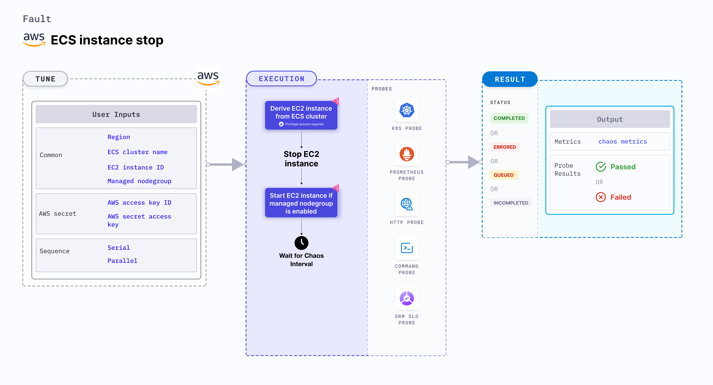

ECS instance stop induces stress on an AWS ECS cluster. It derives the instance under chaos from the ECS cluster.
- It causes EC2 instance to stop and get deleted from the ECS cluster for a specific duration.
- This experiment induces chaos within a container and depends on an EC2 instance. Typically, these are prefixed with ["ECS container"](/docs/chaos-engineering/use-harness-ce/chaos-faults/aws/ec2-and-serverless-faults#ec2-backed-faults) and involve direct interaction with the EC2 instances hosting the ECS containers.



## Use cases

EC2 instance stop breaks the agent that manages the task container on ECS cluster, thereby impacting its delivery. Killing the EC2 instance disrupts the performance of the task container.


### Prerequisites
- Kubernetes >= 1.17
- The ECS container instance should be in a healthy state.
- Adequate AWS access to stop and start an EC2 instance.
- Create a Kubernetes secret that has the AWS access configuration(key) in the `CHAOS_NAMESPACE`. Below is a sample secret file:

```yaml
apiVersion: v1
kind: Secret
metadata:
  name: cloud-secret
type: Opaque
stringData:
  cloud_config.yml: |-
    # Add the cloud AWS credentials respectively
    [default]
    aws_access_key_id = XXXXXXXXXXXXXXXXXXX
    aws_secret_access_key = XXXXXXXXXXXXXXX
```

:::tip
HCE recommends that you use the same secret name, that is, `cloud-secret`. Otherwise, you will need to update the `AWS_SHARED_CREDENTIALS_FILE` environment variable in the fault template with the new secret name and you won't be able to use the default health check probes.
:::

Below is an example AWS policy to execute the fault.

```json
{
    "Version": "2012-10-17",
    "Statement": [
        {
            "Sid": "VisualEditor0",
            "Effect": "Allow",
            "Action": [
                "ecs:ListContainerInstances",
                "ecs:DescribeContainerInstances"

            ],
            "Resource": "*"
        },
        {
            "Effect": "Allow",
            "Action": [
                "ec2:StartInstances",
                "ec2:StopInstances",
                "ec2:DescribeInstanceStatus",
                "ec2:DescribeInstances"
            ],
            "Resource": "*"
        },
        {
            "Effect": "Allow",
            "Action": [
                "autoscaling:DescribeAutoScalingInstances"
            ],
            "Resource": "*"
        }
    ]
}
```

:::info note
- Refer to [AWS Named Profile For Chaos](/docs/chaos-engineering/use-harness-ce/chaos-faults/aws/security-configurations/aws-switch-profile) to know how to use a different profile for AWS faults.
- Refer to the [superset permission/policy](/docs/chaos-engineering/use-harness-ce/chaos-faults/aws/security-configurations/policy-for-all-aws-faults) to execute all AWS faults.
- Refer to the [common attributes](/docs/chaos-engineering/use-harness-ce/chaos-faults/common-tunables-for-all-faults) and [AWS-specific tunables](/docs/chaos-engineering/use-harness-ce/chaos-faults/aws/aws-fault-tunables) to tune the common tunables for all faults and aws specific tunables.
:::

### Mandatory tunables
  <table>
        <tr>
        <th> Tunable </th>
        <th> Description </th>
        <th> Notes </th>
        </tr>
        <tr>
        <td> CLUSTER_NAME </td>
        <td> Name of the target ECS cluster</td>
        <td> For example, cluster-1 </td>
        </tr>
        <tr>
        <td> REGION </td>
        <td> The region name of the target ECS cluster</td>
        <td> For example, us-east-1 </td>
        </tr>
    </table>

### Optional tunables
  <table>
      <tr>
        <th> Tunable </th>
        <th> Description </th>
        <th> Notes </th>
      </tr>
      <tr>
        <td> TOTAL_CHAOS_DURATION </td>
        <td> Duration that you specify, through which chaos is injected into the target resource (in seconds). </td>
        <td> Default: 30s. For more information, go to <a href="/docs/chaos-engineering/use-harness-ce/chaos-faults/common-tunables-for-all-faults#duration-of-the-chaos"> duration of the chaos. </a></td>
      </tr>
      <tr>
        <td> CHAOS_INTERVAL </td>
        <td> The interval (in sec) between successive instance termination.</td>
        <td> Default: 30s. For more information, go to <a href="/docs/chaos-engineering/use-harness-ce/chaos-faults/common-tunables-for-all-faults#chaos-interval"> chaos interval.</a></td>
      </tr>
      <tr>
        <td> AWS_SHARED_CREDENTIALS_FILE </td>
        <td> Provide the path for aws secret credentials</td>
        <td> Defaults to <code>/tmp/cloud_config.yml</code> </td>
      </tr>
      <tr>
        <td> EC2_INSTANCE_ID </td>
        <td> Provide the target instance ID from ECS cluster</td>
        <td> If not provided will select randomly </td>
      </tr>
      <tr>
        <td> SEQUENCE </td>
        <td> It defines sequence of chaos execution for multiple instance</td>
        <td> Default value: parallel. Supports serial and parallel. For more information, go to <a href="/docs/chaos-engineering/use-harness-ce/chaos-faults/common-tunables-for-all-faults#sequence-of-chaos-execution"> sequence of chaos execution.</a></td>
        <td> Defaults to parallel. Supports serial sequence as well. </td>
      </tr>
      <tr>
        <td> RAMP_TIME </td>
        <td> Period to wait before and after injecting chaos (in seconds).  </td>
        <td> For example, 30 s. For more information, go to <a href="/docs/chaos-engineering/use-harness-ce/chaos-faults/common-tunables-for-all-faults#ramp-time"> ramp time. </a> </td>
      </tr>
    </table>


### ECS instance stop

ECS cluster instance that is to be stopped for a chaos duration. Tune it by using `EC2_INSTANCE_ID` environment variable. If not provided, it is selected at random.

The following YAML snippet illustrates the use of this environment variable:

[embedmd]:# (./static/manifests/ecs-instance-stop/instance-stop.yaml yaml)
```yaml
# stops the agent of an ECS cluster
apiVersion: litmuschaos.io/v1alpha1
kind: ChaosEngine
metadata:
  name: engine-nginx
spec:
  engineState: "active"
  annotationCheck: "false"
  chaosServiceAccount: litmus-admin
  experiments:
  - name: ecs-instance-stop
    spec:
      components:
        env:
        # provide the name of ECS cluster
        - name: CLUSTER_NAME
          value: 'demo'
        - name: EC2_INSTANCE_ID
          value: 'us-east-2'
        - name: TOTAL_CHAOS_DURATION
          VALUE: '60'
```
