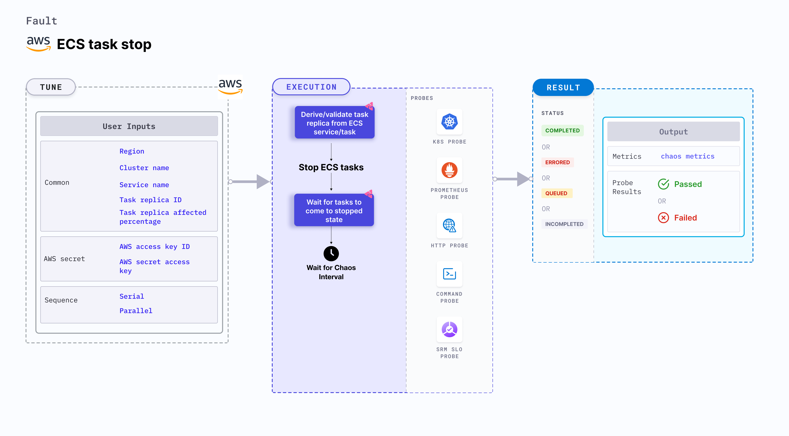

ECS task stop is an AWS fault that injects chaos to stop the ECS tasks based on the services or task replica ID and checks the task availability.
- This fault results in the unavailability of the application running on the tasks.
- This experiment is applicable to both serverless ECS tasks and those backed by EC2 instances. [These experiments](/docs/chaos-engineering/chaos-faults/aws/ec2-and-serverless-faults#ec2-backed-and-serverless-faults) generally involve task-level chaos or access restrictions without causing direct in-container or in-VM disruptions.



## Use cases

This fault determines the resilience of an application when ECS tasks unexpectedly stop due to task being unavailable.

### Prerequisites
- Kubernetes >= 1.17
- Sufficient AWS access to stop the ECS tasks.
- The target ECS tasks should be in a healthy state.
- Kubernetes secret that has the AWS access configuration (key) in the `CHAOS_NAMESPACE`. Below is a sample secret file:

```yaml
apiVersion: v1
kind: Secret
metadata:
  name: cloud-secret
type: Opaque
stringData:
  cloud_config.yml: |-
    # Add the cloud AWS credentials respectively
    [default]
    aws_access_key_id = XXXXXXXXXXXXXXXXXXX
    aws_secret_access_key = XXXXXXXXXXXXXXX
```

:::tip
HCE recommends that you use the same secret name, that is, `cloud-secret`. Otherwise, you will need to update the `AWS_SHARED_CREDENTIALS_FILE` environment variable in the fault template with the new secret name and you won't be able to use the default health check probes.
:::

Below is an example AWS policy to help execute the fault.

```json
{
    "Version": "2012-10-17",
    "Statement": [
        {
            "Sid": "VisualEditor0",
            "Effect": "Allow",
            "Action": [
                "ecs:ListServices",
                "ecs:ListTasks",
                "ecs:StopTask",
                "ecs:DescribeServices",
                "ecs:DescribeTasks"
            ],
            "Resource": "*"
        }
    ]
}
```

:::info note
- Refer to [AWS Named Profile For Chaos](/docs/chaos-engineering/use-harness-ce/chaos-faults/aws/security-configurations/aws-switch-profile) to know how to use a different profile for AWS faults.
- Refer to the [superset permission (or policy)](/docs/chaos-engineering/use-harness-ce/chaos-faults/aws/security-configurations/policy-for-all-aws-faults) to execute all AWS faults.
- Refer to the [common attributes](/docs/chaos-engineering/use-harness-ce/chaos-faults/common-tunables-for-all-faults) and [AWS-specific tunables](/docs/chaos-engineering/use-harness-ce/chaos-faults/aws/aws-fault-tunables) to tune the common tunables for all faults and aws specific tunables.
:::

### Mandatory tunables
  <table>
        <tr>
        <th> Tunable </th>
        <th> Description </th>
        <th> Notes </th>
        </tr>
        <tr>
        <td> CLUSTER_NAME </td>
        <td> Name of the target ECS cluster.</td>
        <td> For example, <code>cluster-1</code>. </td>
        </tr>
        <tr>
        <td> REGION </td>
        <td> Region name of the target ECS cluster. </td>
        <td> For example, <code>us-east-1</code>. </td>
        </tr>
        <tr>
        <td> SERVICE_NAME </td>
        <td> Target ECS service name. </td>
        <td> For example, <code>app-svc</code>. For more information, go to <a href="#ecs-service-name"> ECS service name.</a></td>
        </tr>
        <tr>
        <td> TASK_REPLICA_ID </td>
        <td> Comma-separated target task replica IDs. </td>
        <td> `SERVICE_NAME` and `TASK_REPLICA_ID` are mutually exclusive. If both the values are provided, `SERVICE_NAME` takes precedence. For more information, go to <a href="#ecs-task-replica-ids"> ECS task replica ID.</a></td>
        </tr>
    </table>


### Optional tunables
  <table>
      <tr>
        <th> Tunable </th>
        <th> Description </th>
        <th> Notes </th>
      </tr>
      <tr>
        <td> TOTAL_CHAOS_DURATION </td>
        <td> Duration to insert chaos (in seconds). </td>
        <td> Defaults: 30s. For more information, go to <a href="/docs/chaos-engineering/use-harness-ce/chaos-faults/common-tunables-for-all-faults#duration-of-the-chaos"> duration of the chaos. </a></td>
      </tr>
      <tr>
        <td> CHAOS_INTERVAL </td>
        <td> Time interval between two successive instance terminations (in seconds). </td>
        <td> Default: 30s. For more information, go to <a href="/docs/chaos-engineering/use-harness-ce/chaos-faults/common-tunables-for-all-faults#chaos-interval"> chaos interval.</a></td>
      </tr>
      <tr>
        <td> TASK_REPLICA_AFFECTED_PERC </td>
        <td> Percentage of total tasks that are targeted. </td>
        <td> Default: 100. For more information, go to <a href="#ecs-task-replica-affected-percentage"> ECS task replica affected percentage.</a></td>
      </tr>
      <tr>
        <td> SEQUENCE </td>
        <td> Sequence of chaos execution for multiple instances. </td>
        <td> Default: parallel. Supports serial and parallel. For more information, go to <a href="/docs/chaos-engineering/use-harness-ce/chaos-faults/common-tunables-for-all-faults#sequence-of-chaos-execution"> sequence of chaos execution.</a></td>
      </tr>
      <tr>
        <td> RAMP_TIME </td>
        <td> Period to wait before and after injecting chaos (in seconds).</td>
        <td> For example, 30 s. For more information, go to <a href="/docs/chaos-engineering/use-harness-ce/chaos-faults/common-tunables-for-all-faults#ramp-time"> ramp time. </a></td>
      </tr>
      <tr>
        <td> AWS_SHARED_CREDENTIALS_FILE </td>
        <td> Path to the AWS secret credentials. </td>
        <td> Defaults to <code>/tmp/cloud_config.yml</code>. </td>
      </tr>
    </table>


### ECS service name

Service name whose tasks are stopped. Tune it by using the `SERVICE_NAME` environment variable.

The following YAML snippet illustrates the use of this environment variable:

[embedmd]:# (./static/manifests/ecs-task-stop/task-stop-svc.yaml yaml)
```yaml
# stop the tasks of an ECS cluster
apiVersion: litmuschaos.io/v1alpha1
kind: ChaosEngine
metadata:
  name: engine-nginx
spec:
  engineState: "active"
  annotationCheck: "false"
  chaosServiceAccount: litmus-admin
  experiments:
  - name: ecs-task-stop
    spec:
      components:
        env:
        # provide the name of ECS cluster
        - name: CLUSTER_NAME
          value: 'demo'
        - name: SERVICE_NAME
          vale: 'test-svc'
        - name: REGION
          value: 'us-east-1'
        - name: TOTAL_CHAOS_DURATION
          VALUE: '60'
```

### ECS task replica IDs

Task replicas that have a specific ID which are to be stopped. Tune it by using the `TASK_REPLICA_ID` environment variable.

The following YAML snippet illustrates the use of this environment variable:

[embedmd]:# (./static/manifests/ecs-task-stop/task-stop-task.yaml yaml)
```yaml
# stop the tasks of an ECS cluster
apiVersion: litmuschaos.io/v1alpha1
kind: ChaosEngine
metadata:
  name: engine-nginx
spec:
  engineState: "active"
  annotationCheck: "false"
  chaosServiceAccount: litmus-admin
  experiments:
  - name: ecs-task-stop
    spec:
      components:
        env:
        # provide the name of ECS cluster
        - name: CLUSTER_NAME
          value: 'demo'
        - name: TASK_REPLICA_ID
          vale: '1b751cf956e34e54b9d83b6a5c067f60,20d5041c044941dfb2126f1722d10558'
        - name: REGION
          value: 'us-east-1'
        - name: TOTAL_CHAOS_DURATION
          VALUE: '60'
```

### ECS task replica affected percentage

Number of tasks to target (in percentage). Tune it by using the `TASK_REPLICA_AFFECTED_PERC` environment variable.

The following YAML snippet illustrates the use of this environment variable:

[embedmd]:# (./static/manifests/ecs-task-stop/task-stop-task-affected.yaml yaml)
```yaml
# stop the tasks of an ECS cluster
apiVersion: litmuschaos.io/v1alpha1
kind: ChaosEngine
metadata:
  name: engine-nginx
spec:
  engineState: "active"
  annotationCheck: "false"
  chaosServiceAccount: litmus-admin
  experiments:
  - name: ecs-task-stop
    spec:
      components:
        env:
        # provide the name of ECS cluster
        - name: CLUSTER_NAME
          value: 'demo'
        - name: SERVICE_NAME
          vale: 'test-svc'
        - name: TASK_REPLICA_AFFECTED_PERC
          vale: '100'
        - name: REGION
          value: 'us-east-1'
        - name: TOTAL_CHAOS_DURATION
          VALUE: '60'
```