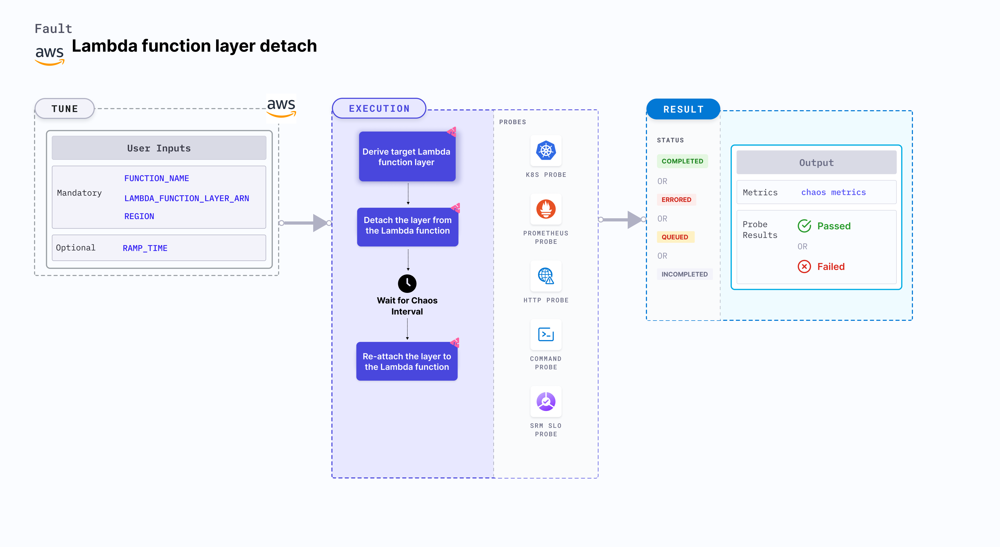

Lambda function layer detach is an AWS fault that detaches the Lambda layer associated with the function, thereby causing dependency-related issues or breaking the Lambda function that relies on the layer's content.



## Use cases
Lambda function layer detach:
- Tests how the Lambda function behaves without the dependencies provided by the layer, thereby identifying the unnecessary dependencies and reduce the layer's footprint.
- Debug runtime errors caused by a specific library in the layer.
- Detach a layer that adds unneeded dependencies or complexity to streamline the Lambda function's runtime.

### Prerequisites
- Kubernetes >= 1.17
- The Lambda layer must be attached to the target Lambda function.
- Lambda function must be up and running.
- Kubernetes secret must have the AWS access configuration (key) in the `CHAOS_NAMESPACE`. Below is a sample secret file:
  ```yaml
  apiVersion: v1
  kind: Secret
  metadata:
    name: cloud-secret
  type: Opaque
  stringData:
    cloud_config.yml: |-
      # Add the cloud AWS credentials respectively
      [default]
      aws_access_key_id = XXXXXXXXXXXXXXXXXXX
      aws_secret_access_key = XXXXXXXXXXXXXXX
  ```

:::tip
Harness CE recommends that you use the same secret name, that is, `cloud-secret`. Otherwise, you will need to update the `AWS_SHARED_CREDENTIALS_FILE` environment variable in the fault template with the new secret name and you won't be able to use the default health check probes.
:::

Below is an example AWS policy to execute the fault.

```json
{
    "Version": "2012-10-17",
    "Statement": [
        {
            "Effect": "Allow",
            "Action": [
                "lambda:UpdateFunctionConfiguration",
                "lambda:GetFunction",
                "lambda:DeleteLayerVersion",
                "lambda:GetLayerVersion",
                "lambda:ListLayerVersions",
            ],
            "Resource": "*"
        }
    ]
}
```

:::info note
- Go to [AWS named profile for chaos](/docs/chaos-engineering/use-harness-ce/chaos-faults/aws/security-configurations/aws-switch-profile) to use a different profile for AWS faults.
- Go to the [superset permission/policy](/docs/chaos-engineering/use-harness-ce/chaos-faults/aws/security-configurations/policy-for-all-aws-faults) to execute all AWS faults.
- Go to [common tunables](/docs/chaos-engineering/use-harness-ce/chaos-faults/common-tunables-for-all-faults) and [AWS-specific tunables](/docs/chaos-engineering/use-harness-ce/chaos-faults/aws/aws-fault-tunables) to tune the common tunables for all faults and AWS-specific tunables.
:::

### Mandatory tunables
   <table>
      <tr>
        <th> Tunable </th>
        <th> Description </th>
        <th> Notes </th>
      </tr>
      <tr>
        <td> FUNCTION_NAME </td>
        <td> Name of the target Lambda function. It supports a single function name.</td>
        <td> For example, <code>test-function</code>. </td>
      </tr>
      <tr>
        <td> LAMBDA_FUNCTION_LAYER_ARN </td>
        <td> Layer version that is identified by the unique ARN. </td>
        <td> Default: <code>$LATEST</code>. </td>
      </tr>
      <tr>
        <td> REGION </td>
        <td> Region name of the target Lambda function. </td>
        <td> For example, <code>us-east-2</code>. </td>
      </tr>
    </table>

### Optional tunables
  <table>
      <tr>
        <th> Tunable </th>
        <th> Description </th>
        <th> Notes </th>
      </tr>
      <tr>
        <td> TOTAL_CHAOS_DURATION </td>
        <td> Duration that you specify, through which chaos is injected into the target resource (in seconds).</td>
        <td> Default: 30 s. For more information, go to <a href="/docs/chaos-engineering/use-harness-ce/chaos-faults/common-tunables-for-all-faults#duration-of-the-chaos"> duration of the chaos. </a></td>
      </tr>
      <tr>
            <td> AWS_SHARED_CREDENTIALS_FILE </td>
            <td> Path to the AWS secret credentials. </td>
            <td> Default: <code>/tmp/cloud_config.yml</code>. </td>
        </tr>
      <tr>
        <td> CHAOS_INTERVAL </td>
        <td> Time interval between two successive deletions of reserved concurrency (in seconds).</td>
        <td> Default: 30 s. For more information, go to <a href="/docs/chaos-engineering/use-harness-ce/chaos-faults/common-tunables-for-all-faults#chaos-interval"> chaos interval.</a></td>
      </tr>
      <tr>
        <td> RAMP_TIME </td>
        <td> Period to wait before and after injecting chaos (in seconds). </td>
        <td> For example, 30 s. For more information, go to <a href="/docs/chaos-engineering/use-harness-ce/chaos-faults/common-tunables-for-all-faults#ramp-time"> ramp time. </a></td>
      </tr>
    </table>
