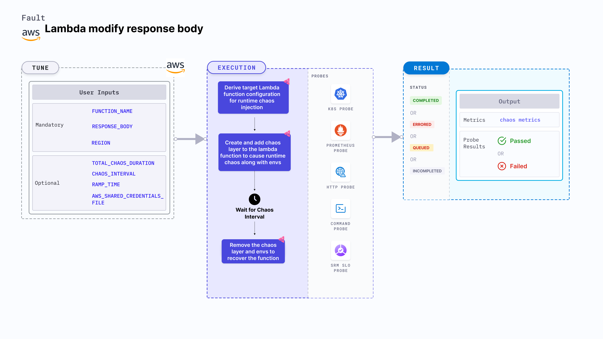

Lambda modify response body is an AWS fault that modifies the response body of a Lambda function at runtime, simulating unexpected output alterations. This interrupts the flow of the given function.

This faults helps you to proactively validate your function's resilience against unexpected response alterations, ensuring uninterrupted service delivery under unexpected conditions.



## Use cases
Lambda modify response body:
- Checks the performance of the application (or service) running with unexpected response.
- Diagnose and mitigate response inconsistencies in real-time, reducing service disruptions and enhancing overall system reliability.

### Prerequisites
- Kubernetes >= 1.17
- Access to operate AWS Lambda service.
- Lambda function must be up and running.
- Kubernetes secret must have the AWS access configuration(key) in the `CHAOS_NAMESPACE`. A secret file looks like this:
  ```yaml
  apiVersion: v1
  kind: Secret
  metadata:
    name: cloud-secret
  type: Opaque
  stringData:
    cloud_config.yml: |-
      # Add the cloud AWS credentials respectively
      [default]
      aws_access_key_id = XXXXXXXXXXXXXXXXXXX
      aws_secret_access_key = XXXXXXXXXXXXXXX
  ```

:::tip
Harness CE recommends that you use the same secret name, that is, `cloud-secret`. Otherwise, you will need to update the `AWS_SHARED_CREDENTIALS_FILE` environment variable in the fault template with the new secret name and you won't be able to use the default health check probes.
:::

Below is an example AWS policy to execute the fault.

```json
{
  "Version": "2012-10-17",
  "Statement": [
    {
      "Effect": "Allow",
      "Action": [
        "lambda:GetFunction",
        "lambda:GetFunctionConfiguration",
        "lambda:UpdateFunctionConfiguration",
        "lambda:ListVersionsByFunction",
        "lambda:ListLayers",
        "lambda:GetLayerVersion",
        "lambda:PublishLayerVersion",
        "lambda:DeleteLayerVersion"
      ],
      "Resource": "*"
    }
  ]
}
```

:::info note
- Go to [superset permission/policy](/docs/chaos-engineering/use-harness-ce/chaos-faults/aws/security-configurations/policy-for-all-aws-faults) to execute all AWS faults.
- Go to [common attributes](/docs/chaos-engineering/use-harness-ce/chaos-faults/common-tunables-for-all-faults) and [AWS-specific tunables](/docs/chaos-engineering/use-harness-ce/chaos-faults/aws/aws-fault-tunables) to tune the common tunables for all faults and AWS-specific tunables.
- Go to [AWS named profile for chaos](/docs/chaos-engineering/use-harness-ce/chaos-faults/aws/security-configurations/aws-switch-profile) to use a different profile for AWS faults.
- Currently, this chaos fault supports Lambda functions implemented in Python; support for additional languages will be added in future releases.
:::

### Mandatory Tunables
   <table>
      <tr>
        <th> Tunable </th>
        <th> Description </th>
        <th> Notes </th>
      </tr>
      <tr>
        <td> FUNCTION_NAME </td>
        <td> Function name of the target Lambda function. It support single function name.</td>
        <td> For example, <code>test-function</code> </td>
      </tr>
      <tr>
        <td> RESPONSE_BODY </td>
        <td> Provide the chaos response body for the function.</td>
        <td> For example, "hello, Chaos!!!". For more information, go to <a href="#response-body"> response-body.</a></td>
      </tr>
      <tr>
        <td> REGION </td>
        <td> The region name of the target lambda function</td>
        <td> For example, <code>us-east-2</code> </td>
      </tr>
    </table>

### Optional Tunables
  <table>
      <tr>
        <th> Tunable </th>
        <th> Description </th>
        <th> Notes </th>
      </tr>
      <tr>
        <td> TOTAL_CHAOS_DURATION </td>
        <td> Duration that you specify, through which chaos is injected into the target resource (in seconds). </td>
        <td> Default: 30 s. For more information, go to <a href="/docs/chaos-engineering/use-harness-ce/chaos-faults/common-tunables-for-all-faults#duration-of-the-chaos"> duration of the chaos. </a></td>
      </tr>
      <tr>
        <td> AWS_SHARED_CREDENTIALS_FILE </td>
        <td> Path to the AWS secret credentials. </td>
        <td> Default: <code>/tmp/cloud_config.yml</code>. </td>
      </tr>
      <tr>
        <td> CHAOS_INTERVAL </td>
        <td> The interval (in seconds) between successive instance termination.</td>
        <td> Default: 30 s. For more information, go to <a href="/docs/chaos-engineering/use-harness-ce/chaos-faults/common-tunables-for-all-faults#chaos-interval"> chaos interval.</a></td>
      </tr>
      <tr>
        <td> RAMP_TIME </td>
        <td> Period to wait before and after injection of chaos in seconds </td>
        <td> For example, 30 s. For more information, go to <a href="/docs/chaos-engineering/use-harness-ce/chaos-faults/common-tunables-for-all-faults#ramp-time"> ramp time. </a> </td>
      </tr>
    </table>


### Response Body

Updates the Lambda function response body to a custom chaos value. Tune it by using `RESPONSE_BODY` environment variable.

The following YAML snippet illustrates the use of this environment variable:

[embedmd]:# (./static/manifests/lambda-modify-response-body/response-body.yaml yaml)
```yaml
# contains the response body value for the lambda function
apiVersion: litmuschaos.io/v1alpha1
kind: ChaosEngine
metadata:
  name: engine-nginx
spec:
  engineState: "active"
  chaosServiceAccount: litmus-admin
  experiments:
  - name: lambda-modify-response-body
    spec:
      components:
        env:
        # provide the response body lambda function
        - name: RESPONSE_BODY
          value: 'hello, Chaos!!!'
        - name: FUNCTION_NAME
          value: 'chaos-function'
```
