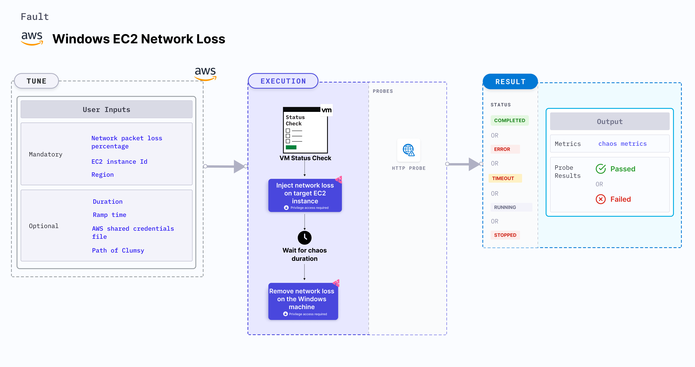

Windows EC2 network loss causes network packet loss on Windows VM for the target EC2 instance(s) using [Clumsy](https://jagt.github.io/clumsy/). It results in flaky access to the application. It checks the performance of the services running on the Windows VMs under the disrupted network loss conditions.



:::tip
When Clumsy is downloaded, the path is exported which is used while executing the experiment. 
:::

## Use cases

Windows EC2 network loss:
- Simulates issues within the host network (or microservice) communication across services in different hosts.
- Determines the impact of degradation while accessing a microservice.
- Limits the impact (blast radius) to the traffic that you wish to test by specifying the host or IP addresses, if the VM stalls or gets corrupted while waiting endlessly for a packet.
- Simulates a degraded network with varied percentages of dropped packets between microservices.
- Simulates loss of access to specific third party (or dependent) services (or components).
- Simulates network partitions (split-brain) between peer replicas for a stateful application.
- It may stall the EC2 instance or get corrupted waiting endlessly for a packet.
- It degrades the network without marking the EC2 instance as unhealthy (or unworthy) of traffic, which is resolved using a middleware that switches traffic based on SLOs (performance parameters).


## Prerequisites
- Ensure that the [prerequisites](/docs/chaos-engineering/use-harness-ce/chaos-faults/windows/prerequisites) are fulfilled before executing the experiment.
- Verify that [Clumsy](https://app.harness.io/public/shared/tools/chaos/windows/clumsy-0.3-win64-a.zip) is installed on the Windows VM.
- The EC2 instance should be in a healthy state.

### Mandatory tunables

   <table>
      <tr>
        <th> Tunable </th>
        <th> Description </th>
        <th> Notes </th>
      </tr>
      <tr>
          <td> EC2_INSTANCE_ID </td>
          <td> ID of the target EC2 instance. </td>
          <td> For example, <code>i-044d3cb4b03b8af1f</code>. For more information, go to <a href="/docs/chaos-engineering/use-harness-ce/chaos-faults/aws/ec2-cpu-hog#multiple-ec2-instances"> EC2 instance ID.</a></td>
        </tr>
      <tr>
        <td> NETWORK_PACKET_LOSS_PERCENTAGE </td>
        <td> The percentage of data packets lost during transmission. </td>
        <td> For example, 100. For more information, go to <a href="#network-packet-loss"> network packet loss. </a></td>
      </tr>
      <tr>
          <td> REGION </td>
          <td> The AWS region ID where the EC2 instance has been created. </td>
          <td> For example, <code>us-east-1</code>. </td>
        </tr>
    </table>

### Optional tunables
   <table>
      <tr>
        <th> Tunable </th>
        <th> Description </th>
        <th> Notes </th>
      </tr>
      <tr>
        <td> TOTAL_CHAOS_DURATION </td>
        <td> Duration that you specify, through which chaos is injected into the target resource (in seconds).</td>
        <td> Default: 60s. For more information, go to <a href="/docs/chaos-engineering/use-harness-ce/chaos-faults/common-tunables-for-all-faults#duration-of-the-chaos"> duration of the chaos. </a></td>
      </tr>
      <tr>
            <td> AWS_SHARED_CREDENTIALS_FILE </td>
            <td> Path to the AWS secret credentials.</td>
            <td> Default: <code>/tmp/cloud_config.yml</code>.</td>
        </tr>
      <tr>
          <td> PATH_OF_CLUMSY </td>
          <td> Path of the Clumsy tool in the VM. </td>
          <td> For example, <code>C:\\Program Files\\Clumsy\\</code>. For more information, go to <a href="#path-of-clumsy"> path of Clumsy. </a></td>
          </tr>
      <tr>
        <td> RAMP_TIME </td>
        <td> Period to wait before and after injecting chaos (in seconds). </td>
        <td> For example, 30 s. For more information, go to <a href="/docs/chaos-engineering/use-harness-ce/chaos-faults/common-tunables-for-all-faults#ramp-time"> ramp time. </a></td>
      </tr>
    </table>

### Network packet loss

The `NETWORK_PACKET_LOSS_PERCENTAGE` environment variable specifies the percentage of data packets lost during transmission.

Use the following example to specify network packet loss:

[embedmd]:# (./static/manifests/windows-ec2-network-loss/network-packet-loss.yaml yaml)
```yaml
apiVersion: litmuschaos.io/v1alpha1
kind: MachineChaosExperiment
metadata:
  name: windows-network-loss
spec:
  engineState: "active"
  chaosServiceAccount: litmus-admin
  experiments:
    infraType: windows
    steps:
      - - name: windows-network-loss
    tasks:
    - definition:
        chaos:
          env:
            - name: NETWORK_PACKET_LOSS_PERCENTAGE
              value: "100"
```

### Path of Clumsy

The `PATH_OF_CLUMSY` environment variable specifies the path of the Clumsy tool in the VM.

Use the following example to specify the path of Clumsy:

[embedmd]:# (./static/manifests/windows-ec2-network-loss/path-of-clumsy.yaml yaml)
```yaml
apiVersion: litmuschaos.io/v1alpha1
kind: MachineChaosExperiment
metadata:
  name: windows-network-loss
spec:
  engineState: "active"
  chaosServiceAccount: litmus-admin
  experiments:
    infraType: windows
    steps:
      - - name: windows-network-loss
    tasks:
    - definition:
      chaos:
        env:
       # Path of the Clumsy tool in the VM
        - name: PATH_OF_CLUMSY
          value: 'C:\\Program Files\\Clumsy\\'
```