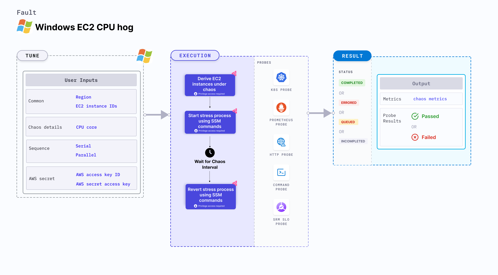

Windows EC2 Process Kill fault kills the target processes running on a Windows EC2 instance. This fault disrupts application-critical processes running on the instance by killing their underlying processes or threads.



## Use cases

- Simulate loss of processes on Windows EC2 instances to check the app resiliency
- Evaluate the impact of process loss on application performance.

### Prerequisites
- Kubernetes >= 1.17
- The EC2 instance must be in a healthy state.
- SSM agent must be installed and running on the target EC2 instance.
- SSM IAM role must be attached to the target EC2 instance(s).
- Kubernetes secret must have the AWS Access Key ID and Secret Access Key credentials in the `CHAOS_NAMESPACE`. Below is a sample secret file:
    ```yaml
    apiVersion: v1
    kind: Secret
    metadata:
      name: cloud-secret
    type: Opaque
    stringData:
      cloud_config.yml: |-
        # Add the cloud AWS credentials respectively
        [default]
        aws_access_key_id = XXXXXXXXXXXXXXXXXXX
        aws_secret_access_key = XXXXXXXXXXXXXXXXXXXXXXXXXXXXXXXXXXXX
    ```

:::tip
HCE recommends that you use the same secret name, that is, `cloud-secret`. Otherwise, you will need to update the `AWS_SHARED_CREDENTIALS_FILE` environment variable in the fault template with the new secret name and you won't be able to use the default health check probes.
:::

Below is an example AWS policy to execute the fault.

```json
{
    "Version": "2012-10-17",
    "Statement": [
        {
            "Effect": "Allow",
            "Action": [
                "ssm:GetDocument",
                "ssm:DescribeDocument",
                "ssm:GetParameter",
                "ssm:GetParameters",
                "ssm:SendCommand",
                "ssm:CancelCommand",
                "ssm:CreateDocument",
                "ssm:DeleteDocument",
                "ssm:GetCommandInvocation",
                "ssm:UpdateInstanceInformation",
                "ssm:DescribeInstanceInformation"
            ],
            "Resource": "*"
        },
        {
            "Effect": "Allow",
            "Action": [
                "ec2messages:AcknowledgeMessage",
                "ec2messages:DeleteMessage",
                "ec2messages:FailMessage",
                "ec2messages:GetEndpoint",
                "ec2messages:GetMessages",
                "ec2messages:SendReply"
            ],
            "Resource": "*"
        },
        {
            "Effect": "Allow",
            "Action": [
                "ec2:DescribeInstanceStatus",
                "ec2:DescribeInstances"
            ],
            "Resource": [
                "*"
            ]
        }
    ]
}
```

:::info note
- Go to the [common tunables](/docs/chaos-engineering/use-harness-ce/chaos-faults/common-tunables-for-all-faults) to tune the common tunables for all the faults.
- Go to [AWS named profile for chaos](/docs/chaos-engineering/use-harness-ce/chaos-faults/aws/security-configurations/aws-switch-profile) to use a different profile for AWS faults and the [superset permission/policy](/docs/chaos-engineering/use-harness-ce/chaos-faults/aws/security-configurations/policy-for-all-aws-faults) to execute all AWS faults.
:::

### Mandatory tunables

<table>
  <tr>
    <th> Tunable </th>
    <th> Description </th>
    <th> Notes </th>
  </tr>
  <tr>
    <td> EC2_INSTANCE_ID / EC2_INSTANCE_TAG </td>
    <td>ID or tag of the target EC2 instance(s).</td>
    <td>For example, <code>i-044d3cb4b03b8af1f</code> or a tag key-value. For more information, go to <a href="/docs/chaos-engineering/use-harness-ce/chaos-faults/aws/ec2-cpu-hog#multiple-ec2-instances">EC2 instance ID</a>.</td>
  </tr>
  <tr>
    <td> REGION </td>
    <td>The AWS region ID where the EC2 instance has been created.</td>
    <td>For example, <code>us-east-1</code>. For more information, go to <a href="/docs/chaos-engineering/use-harness-ce/chaos-faults/aws/aws-fault-tunables">region</a>.</td>
  </tr>
  <tr>
    <td> PROCESS_IDS / PROCESS_NAMES </td>
    <td>Process IDs or names of the target processes (comma-separated).</td>
    <td>For example, <code>183,253,857</code> or <code>notepad.exe,explorer.exe</code>. For more information, go to <a href="#process-ids">process IDs</a> or <a href="#process-names">process names</a>.</td>
  </tr>
</table>

### Optional tunables

<table>
  <tr>
    <th> Tunable </th>
    <th> Description </th>
    <th> Notes </th>
  </tr>
  <tr>
    <td> TOTAL_CHAOS_DURATION </td>
    <td>Duration for which chaos is injected (in seconds).</td>
    <td>Default: 60 s. For more information, go to <a href="/docs/chaos-engineering/use-harness-ce/chaos-faults/common-tunables-for-all-faults#duration-of-the-chaos">duration of the chaos</a>.</td>
  </tr>
  <tr>
    <td> INSTANCE_AFFECTED_PERC </td>
    <td>Percentage of instances to target (if using tags).</td>
    <td>Optional. For more information, go to <a href="/docs/chaos-engineering/use-harness-ce/chaos-faults/aws/aws-fault-tunables">instance affected perc</a>.</td>
  </tr>
  <tr>
    <td> FORCE </td>
    <td>Force kill the process.</td>
    <td>Default: disable. For example: <code>enable</code>. For more information, go to<a href="#force"> force </a>.</td>
  </tr>
  <tr>
    <td> INSTALL_DEPENDENCIES </td>
    <td>Install dependencies on the target instance.</td>
    <td>Default: true. For more information, go to <a href="/docs/chaos-engineering/use-harness-ce/chaos-faults/aws/aws-fault-tunables">install dependencies</a>.</td>
  </tr>
  <tr>
    <td> AWS_SHARED_CREDENTIALS_FILE </td>
    <td>Path to the AWS secret credentials.</td>
    <td>Default: <code>/tmp/cloud_config.yml</code>. For more information, go to <a href="/docs/chaos-engineering/use-harness-ce/chaos-faults/aws/aws-fault-tunables">AWS shared credentials file</a>.</td>
  </tr>
  <tr>
    <td> SEQUENCE </td>
    <td>Sequence of chaos execution for multiple instances.</td>
    <td>Default: parallel. Supports serial and parallel. For more information, go to <a href="/docs/chaos-engineering/use-harness-ce/chaos-faults/common-tunables-for-all-faults#sequence-of-chaos-execution">sequence of chaos execution</a>.</td>
  </tr>
  <tr>
    <td> RAMP_TIME </td>
    <td>Period to wait before and after injecting chaos (in seconds).</td>
    <td>Optional. For more information, go to <a href="/docs/chaos-engineering/use-harness-ce/chaos-faults/common-tunables-for-all-faults#ramp-time">ramp time</a>.</td>
  </tr>

</table>

#### Process IDs

The `PROCESS_IDS` environment variable specifies the processes that you want to kill by their IDs on a Windows EC2 instance.

[embedmd]:# (./static/manifests/windows-ec2-process-kill/process-ids.yaml yaml)
```yaml
---
# Kills processes by IDs on a Windows EC2 instance
apiVersion: litmuschaos.io/v1alpha1
kind: ChaosEngine
metadata:
  name: windows-ec2-process-kill
spec:
  engineState: "active"
  chaosServiceAccount: litmus-admin
  experiments:
    - name: windows-ec2-process-kill
      spec:
        components:
          env:
            - name: PROCESS_IDS
              value: '1234,5678'
```

#### Process Names

The `PROCESS_NAMES` environment variable specifies the processes that you want to kill by their Names on a Windows EC2 instance.

[embedmd]:# (./static/manifests/windows-ec2-process-kill/process-names.yaml yaml)
```yaml
---
# Kills processes by names on a Windows EC2 instance
apiVersion: litmuschaos.io/v1alpha1
kind: ChaosEngine
metadata:
  name: windows-ec2-process-kill
spec:
  engineState: "active"
  chaosServiceAccount: litmus-admin
  experiments:
    - name: windows-ec2-process-kill
      spec:
        components:
          env:
            - name: PROCESS_NAMES
              value: 'notepad,explorer'
```

#### Force

The `FORCE` environment variable specifies the force kill of the processes under chaos.


[embedmd]:# (./static/manifests/windows-ec2-process-kill/force.yaml yaml)
```yaml
---
# Kills processes by names with FORCE enabled on a Windows EC2 instance
apiVersion: litmuschaos.io/v1alpha1
kind: ChaosEngine
metadata:
  name: windows-ec2-process-kill
spec:
  engineState: "active"
  chaosServiceAccount: litmus-admin
  experiments:
    - name: windows-ec2-process-kill
      spec:
        components:
          env:
            - name: PROCESS_NAMES
              value: 'notepad'
            - name: FORCE
              value: 'enable'
```