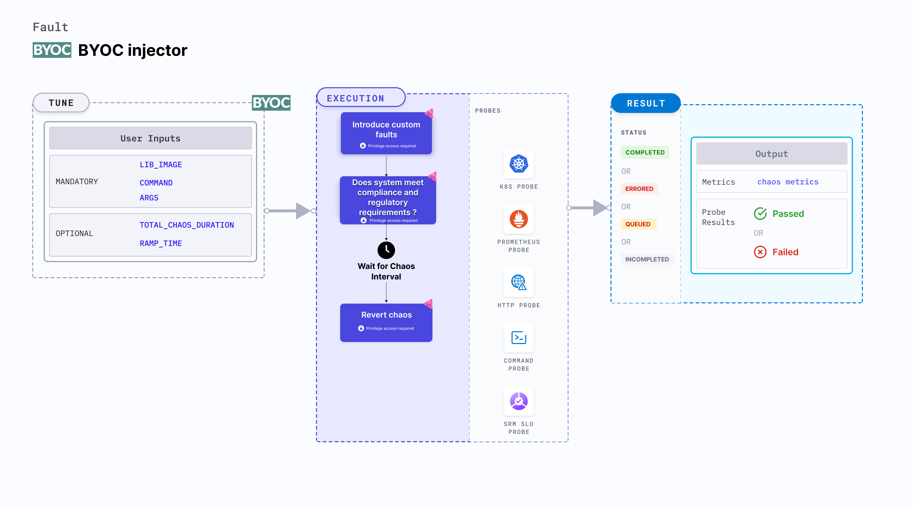

BYOC (Bring Your Own Chaos) injector enables the execution of custom chaos faults using a special helper pod. The BYOC injector is designed to be flexible and easy to use, allowing users to define their own chaos experiments using a simple YAML specification.



### Use cases

BYOC injector:
- Validates the resilience of an application by introducing custom faults in critical service dependencies and observing the impact on overall system functionality.
- Injects custom faults to simulate disaster scenarios, ensuring that the application's disaster recovery procedures are effective and efficient.
- Implements custom faults to verify that the system meets compliance and regulatory requirements under adverse conditions, such as data corruption or service outages.

### Prerequisites
- Kubernetes > 1.16

### Mandatory tunables

   <table>
      <tr>
        <th> Tunable </th>
        <th> Description </th>
        <th> Notes </th>
      </tr>
      <tr>
        <td> LIB_IMAGE </td>
        <td> Image of the helper pod that contains the business logic for the custom fault. </td>
        <td> For more information, go to <a href="#chaos-script-in-lib_image"> lib image </a></td>
      </tr>
      <tr>
        <td> COMMAND </td>
        <td> Command to execute in the helper pod. </td>
        <td> For more information, go to <a href="#chaos-script-contained-lib_image"> command </a></td>
      </tr>
      <tr>
        <td> ARGS </td>
        <td> Arguments to execute in the helper pod. </td>
        <td> For more information, go to <a href="#chaos-script-contained-lib_image"> args </a></td>
      </tr>
    </table>

### Optional tunables
   <table>
      <tr>
        <th> Tunable </th>
        <th> Description </th>
        <th> Notes </th>
      </tr>
      <tr>
        <td> TOTAL_CHAOS_DURATION </td>
        <td> Duration that you specify, through which chaos is injected into the target resource (in seconds). </td>
        <td> Defaults to 60s. For more information, go to <a href="/docs/chaos-engineering/use-harness-ce/chaos-faults/common-tunables-for-all-faults/#duration-of-the-chaos"> duration of the chaos.</a></td>
      </tr>
      <tr>
        <td> RAMP_TIME </td>
        <td> Period to wait before and after injecting chaos (in seconds). </td>
        <td> For example, 30s. For more information, go to <a href= "/docs/chaos-engineering/use-harness-ce/chaos-faults/common-tunables-for-all-faults#ramp-time">ramp time.</a></td>
      </tr>
    </table>

### Examples

BYOC injector supports two modes of execution:

1. `Chaos script contained LIB_IMAGE`: The chaos script is included in the `LIB_IMAGE`.
2. `Chaos script mounted as volume`: The script is not be included in the `LIB_IMAGE`. Instead, it is mounted as a volume inside the helper pod, and `COMMAND` and `ARGS` will be used to execute the script.

#### Chaos script in LIB_IMAGE

The `LIB_IMAGE` environment variable specifies the image of the helper pod that contains the business logic of the custom fault. Specify the `COMMAND` and `ARGS` for the helper pod to execute the custom fault.

The following YAML snippet illustrates the use of this environment variable:

[embedmd]: # "./static/manifests/byoc-injector/self-contained-lib-image.yaml yaml"

```yaml
# run a self-contained lib image experiment
apiVersion: litmuschaos.io/v1alpha1
kind: ChaosEngine
metadata:
  name: engine-nginx
spec:
  engineState: active
  terminationGracePeriodSeconds: 30
  chaosServiceAccount: litmus-admin
  experiments:
    - name: byoc-injector
      imagePullPolicy: Always
      args:
        - -c
        - ./experiments -name byoc-injector
      command:
        - /bin/bash
      spec:
        components:
          secrets:
            - name: aws-secret
              mountPath: /etc/secret
          env:
            - name: SSH_USER
              value: "ec2-user"
            - name: SSH_HOST
              value: "ec2-host.us-east-2.compute.amazonaws.com"
            - name: SSH_KEY
              value: "/etc/secret/key.pem"
            - name: INTERVAL
              value: "2"
            - name: DURATION
              value: "120"
            - name: LIB_IMAGE
              value: "<lib image with chaos script>"
            - name: COMMAND
              value: "/bin/sh"
            - name: ARGS
              value: "-c,sh script.sh"
```

#### Mounted chaos script

The script is not included in the `LIB_IMAGE`. Instead, it is mounted as a volume inside the helper pod, and `COMMAND` and `ARGS` will be used to execute the script.

The following YAML snippet illustrates the use of this environment variable:

[embedmd]: # "./static/manifests/byoc-injector/mounted-chaos-script.yaml yaml"

```yaml
# run a mounted chaos script experiment
apiVersion: litmuschaos.io/v1alpha1
kind: ChaosEngine
metadata:
  name: engine-nginx
spec:
  engineState: active
  terminationGracePeriodSeconds: 30
  chaosServiceAccount: litmus-admin
  experiments:
    - name: byoc-injector
      imagePullPolicy: Always
      args:
        - -c
        - ./experiments -name byoc-injector
      command:
        - /bin/bash
      spec:
        components:
          configMaps:
            # chaos script mounted as configMap
            - name: chaos-script
              mountPath: /etc/config
          secrets:
            - name: aws-secret
              mountPath: /etc/secret
          env:
            - name: SSH_USER
              value: "ec2-user"
            - name: SSH_HOST
              value: "ec2-host.us-east-2.compute.amazonaws.com"
            - name: SSH_KEY
              value: "/etc/secret/key.pem"
            - name: INTERVAL
              value: "2"
            - name: DURATION
              value: "120"
            - name: LIB_IMAGE
              value: "<lib image with ssh binary>"
            - name: COMMAND
              value: "/bin/sh"
            - name: ARGS
              value: "-c,sh /etc/config/script.sh"
```

### Configure the advanced tunables

Configure the following advanced tunables for the BYOC injector:

:::tip
Specify these tunables in the chaos engine.
:::

- `NodeSelector`: Map of key-value pairs. For the helper pod to be executed on the nodes with the corresponding labels, the `NodeSelector` field should be specified in the chaos engine.
- `Tolerations`: Tolerations for the helper pod to be executed on the nodes with the corresponding taints.
- `HostPID`: Whether the helper pod should share the PID namespace with the host.
- `ConfigMaps`: ConfigMaps that need to be mounted as volumes in the helper pod.
- `Secrets`: Secrets that need to be mounted as volumes in the helper pod.
- `HostFileVolumes`: Host file volumes that need to be mounted as volumes in the helper pod.
- `SecurityContext`: Security context for the helper pod.

The following YAML snippet illustrates the use of these advance tunables:

[embedmd]: # "./static/manifests/byoc-injector/advance-tunables.yaml yaml"

```yaml
# provide advanced tunables for the byoc-injector experiment
apiVersion: litmuschaos.io/v1alpha1
kind: ChaosEngine
metadata:
  name: engine-nginx
spec:
  engineState: active
  terminationGracePeriodSeconds: 30
  chaosServiceAccount: litmus-admin
  experiments:
    - name: byoc-injector
      imagePullPolicy: Always
      args:
        - -c
        - ./experiments -name byoc-injector
      command:
        - /bin/bash
      spec:
        components:
          # node selector to target a specific node
          nodeSelector:
            chaos-enabled: "true"
          # tolerations to target master nodes
          tolerations:
            - key: "node-role.kubernetes.io/master"
              operator: "Exists"
              effect: "NoSchedule"
          # hostPID to enable the hostPID
          hostPID: true
          # mounted configMaps
          configMaps:
            - name: chaos-script
              mountPath: /etc/config
          # mounted secrets
          secrets:
            - name: aws-secret
              mountPath: /etc/secret
          # hostFileVolumes to mount the host file
          hostFileVolumes:
            - mountPath: /run/containerd/containerd.sock
              name: socketPath
              nodePath: /run/containerd/containerd.sock
          # provide the security context
          securityContext:
            # pod security context to run the pod as root user
            podSecurityContext:
              runAsUser: 0
            # container security context to run the container in privileged mode
            containerSecurityContext:
              privileged: true
          env:
            - name: SSH_USER
              value: "ec2-user"
            - name: SSH_HOST
              value: "ec2-host.us-east-2.compute.amazonaws.com"
            - name: SSH_KEY
              value: "/etc/secret/key.pem"
            - name: INTERVAL
              value: "2"
            - name: DURATION
              value: "120"
            - name: LIB_IMAGE
              value: "<lib image with ssh binary>"
            - name: COMMAND
              value: "/bin/sh"
            - name: ARGS
              value: "-c,sh /etc/config/script.sh"
```