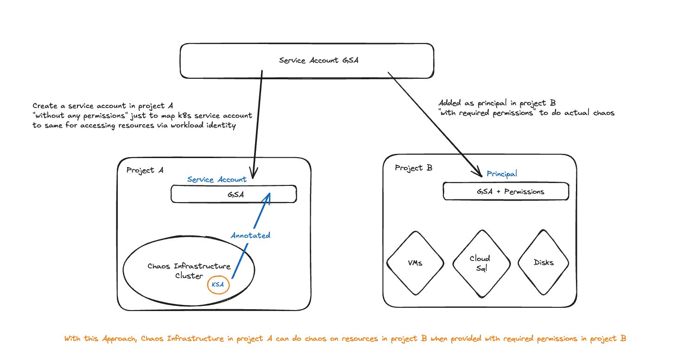

## Overview

This topic provides how to implement a cross-project failover for Google Cloud SQL instances using a Bring Your Own Chaos (BYOC) injector. The [BYOC injector](/docs/chaos-engineering/use-harness-ce/chaos-faults/byoc/) facilitates the simulation of failover scenarios to test the resilience and high availability of Cloud SQL instances across different projects.

---

## Prerequisites

Before proceeding, ensure the following prerequisites are met:

- Kubernetes > 1.16
- Service account should have editor access (or owner access) to the GCP project.
- `litmus-admin` Kubernetes secret should have appropriate permissions to perform Cloud SQL Failover.
  - cloudsql.instances.failover
  - cloudsql.instances.list
- Harness CE provides two ways of providing permissions to the `litmus-admin` Kubernetes secret: 
  - [Using Gcloud Service Account Secret](/docs/chaos-engineering/use-harness-ce/chaos-faults/gcp/security-configurations/prepare-secret-for-gcp/)
  - [Using Workload Identity](/docs/chaos-engineering/use-harness-ce/chaos-faults/gcp/gcp-iam-integration/)

---

## Mandatory tunables

   <table>
      <tr>
        <th> Tunable </th>
        <th> Description </th>
        <th> Notes </th>
      </tr>
      <tr>
        <td> LIB_IMAGE </td>
        <td> Image of the helper pod that contains the business logic for the custom fault. </td>
        <td> For more information, go to <a href="#chaos-script-in-lib_image"> lib image </a></td>
      </tr>
      <tr>
        <td> COMMAND </td>
        <td> Command to execute in the helper pod. </td>
        <td> For more information, go to <a href="#chaos-script-contained-lib_image"> command </a></td>
      </tr>
      <tr>
        <td> ARGS </td>
        <td> Arguments to execute in the helper pod. </td>
        <td> For more information, go to <a href="#chaos-script-contained-lib_image"> args </a></td>
      </tr>
    </table>

## Implementation

You can use one of the following ways to initiate failover on cloud SQL instances:

### Using GCP Rest APIs

Google Cloud Platform provides APIs for all its services, allowing users and developers to interact with them programmatically. This flexibility is crucial for specifying the `LIB_IMAGE` required for chaos injection, particularly when using BYOC. To implement this method, provide scripts in your preferred programming language and build a custom image. For more details, refer to the [documentation](https://cloud.google.com/sql/docs/mysql/admin-api/rest).

### Using gcloud Binary

The `gcloud` binary offers a range of commands designed for interacting with the Cloud SQL Service, including operations like listing, updating, deleting, and initiating failover. Refer to the [documentation](https://cloud.google.com/sdk/gcloud/reference/sql/instances) for more information. 

This method is advantageous since it caters to individuals with varying levels of technical expertise, even those without extensive knowledge of coding languages or APIs. By leveraging a combination of `LIB_IMAGE` (a Docker image containing `gcloud`) and `ARGS` to concatenate the necessary commands into a single directive, you can seamlessly implement this approach.

The choice of method depends on your preference. In this documentation, you will learn the second approach, that is, the `gcloud` binary. 

You will formulate a unified command for chaos injection, which can be specified within the `ARGS` tunable, alongside any image equipped with `gcloud`.

#### Construct the Command for Cloud SQL Failover

GCP provides a specific command for SQL failover, which requires two imputs (environment variables), which can be executed as follows:

```bash
gcloud sql instances failover "${CLOUD_SQL_INSTANCE_NAME}" --project="${CLOUD_SQL_PROJECT}" -q
```

where

- `CLOUD_SQL_INSTANCE_NAME`: is the name of the designated SQL Instance.
- `CLOUD_SQL_PROJECT`: is the name of the GCP Project in which the SQL instance is located.

To confirm the occurrence of chaos injection, verify the zone of the SQL instance before and after the chaos injection. This verification is crucial as the zone would change due to the chaos injection. To achieve this, use the following command:

```bash
gcloud sql instances describe "${CLOUD_SQL_INSTANCE_NAME}" --project "${CLOUD_SQL_PROJECT}" --format="get(gceZone)"
```

The command above provides a detailed description of the specificed SQL instance and displays the zone of the specific instance as a single output, which simplifies the output log for easy analysis.


The next step would be to integrate the commands described earlier, in a manner that allows you to do the following:
- Retrieve the zone of the target SQL instance before the chaos injection,
- Display this information in the logs, 
- Initiate a SQL failover,
- Retrieve the zone of the SQL instance again, and 
- Display this updated information in the logs. 

By following this approach, you can eliminate the need for manual verification through the GCP Console to observe the zone switch before and after the chaos injection. The combined command is:

```bash
‌before_zone=$(gcloud sql instances describe "${CLOUD_SQL_INSTANCE_NAME}"
    --project "${CLOUD_SQL_PROJECT}" --format="get(gceZone)") &&
    echo -e "Zone for the primary replica before failover
    ${before_zone}\n" && gcloud sql instances failover
    "${CLOUD_SQL_INSTANCE_NAME}" --project="${CLOUD_SQL_PROJECT}" -q
    && after_zone=$(gcloud sql instances describe
    "${CLOUD_SQL_INSTANCE_NAME}" --project "${CLOUD_SQL_PROJECT}"
    --format="get(gceZone)") && echo -e "\nZone for the primary
    replica after failover ${after_zone}"
```

To execute this command within chaos injection for real SQL failover scenarios, incorporate it within the `ARGS` tunable, as:

```bash
- name: ARGS
  value: before_zone=$(gcloud sql instances describe "${CLOUD_SQL_INSTANCE_NAME}"
    --project "${CLOUD_SQL_PROJECT}" --format="get(gceZone)") &&
    echo -e "Zone for the primary replica before failover
    ${before_zone}\n" && gcloud sql instances failover
    "${CLOUD_SQL_INSTANCE_NAME}" --project="${CLOUD_SQL_PROJECT}" -q
    && after_zone=$(gcloud sql instances describe
    "${CLOUD_SQL_INSTANCE_NAME}" --project "${CLOUD_SQL_PROJECT}"
    --format="get(gceZone)") && echo -e "\nZone for the primary
    replica after failover ${after_zone}"
```

#### Helper Pod Image - LIB_IMAGE

To execute this command successfully, specify an image for the `LIB_IMAGE` tunable. Considering that `harness/chaos-go-runner:main-latest` (a generic image utilized by Harness CE) already includes the `gcloud` binary, you can utilize the same image here.

```bash
- name: LIB_IMAGE
  value: docker.io/harness/chaos-go-runner:main-latest
  ```

#### Command to Execute in Helper Pod

The input to the `COMMAND` tunable depends on the image used in `LIB_IMAGE` tunable. 

- For shell script compatible image, the input would be `/bin/sh, -c`. 
- For bash script compatible image, the input would be `/bin/bash, -c`.
- For `harness/chaos-go-runner:main-latest` image which supports bash script, the input would be `/bin/bash, -c`.

:::tip
During experiment execution, the helper pod logs help understand the following:
- Zone of primary replica before SQL failover
- Chaos injection in progress
- Zone of primary replica after SQL failover

During experiment execution, the experiment pod logs help understand the following:
- Status checks that occur before and after chaos
- Chaos injection in progress
:::

### Check Status - Resilience Probes

Create [resilience probes](/docs/chaos-engineering/use-harness-ce/probes/) that help conduct status checks to verify the health of the infrastructure or application and its readiness to endure chaos injection. You can configure these status checks at different stages of the chaos experiment, such as Start of Test (SOT), End of Test (EOT), OnChaos, Continuous, and Edge (Start & End) of Chaos Injection.

:::tip
For this example, you can create a [command probe](/docs/chaos-engineering/use-harness-ce/probes/command-probe/) in the "Edge" mode as it allows you to verify the status of the SQL instance before and after chaos injection, ensuring that the SQL instance remains operational and healthy.
:::

This validation process is executed through the GCloud Console. Solely relying on manual checks via the console may not be the most efficient method.

You can use the `gcloud` command to fetch the status of the designated SQL instance by using the following command:

```bash
gcloud sql instances describe "${CLOUD_SQL_INSTANCE_NAME}" --project "${CLOUD_SQL_PROJECT}" --format="get(state)"
```

### Cross Project IAM Setup - WorkLoad Identity

You can use Workload Identity to understand how to configure a Google Cloud Platform (GCP) Service account so that it can be utilized by `litmus-admin` for conducting chaos experiments in other GCP Projects while still upholding control over permissions and access to resources.

Suppose the chaos infrastructure is located in `Project A`, and the target SQL instance is located in `Project B`. Let us call the service account to employ as `SA`.

You must establish the service account `SA` in `Project A` to facilitate its link to the Kubernetes service account `litmus-admin`, as specified in the [Harness CE documentation](/docs/chaos-engineering/use-harness-ce/chaos-faults/gcp/gcp-iam-integration/) and execute the Workload Identity mapping. 
Once the service account mapping is in place, the next step is to grant relevant permissions to the service account in other projects. You can accomplish this by designating the same service account as a `PRINCIPAL` in `Project B` and assigning a role with the necessary permissions as mentioned in the [prerequisites](#prerequisites).

  

Based on these changes, the manifest would look like below:

```yaml
apiVersion: litmuschaos.io/v1alpha1

kind: ChaosEngine

metadata:
  annotations:
    probeRef: '[{"mode":"Edge","probeID":"cloud-sql-healthcheck"}]'
  creationTimestamp: null
  generateName: byoc-injector-mv0
  labels:
    app.kubernetes.io/component: experiment-job
    app.kubernetes.io/part-of: litmus
    app.kubernetes.io/version: ci
    name: byoc-injector
    workflow_name: cloud-sql-instance-failover
    workflow_run_id: "{{ workflow.uid }}"
  namespace: "{{workflow.parameters.adminModeNamespace}}"
spec:
  appinfo: {}
  chaosServiceAccount: litmus-admin
  components:
    runner:
      nodeSelector:
        iam.gke.io/gke-metadata-server-enabled: "true"
      resources: {}
  engineState: active
  experiments:
    - args:
        - -c
        - ./experiments -name byoc-injector
      command:
        - /bin/bash
      image: docker.io/harness/chaos-go-runner:main-latest
      imagePullPolicy: Always
      name: byoc-injector
      spec:
        components:
          env:
            - name: TOTAL_CHAOS_DURATION
              value: "120"
            - name: LIB_IMAGE
              value: docker.io/harness/chaos-go-runner:main-latest
            - name: COMMAND
              value: /bin/bash, -c
            - name: CLOUD_SQL_INSTANCE_NAME
              value: ""
            - name: CLOUD_SQL_PROJECT
              value: ""
            - name: ARGS
              value: before_zone=$(gcloud sql instances describe "${CLOUD_SQL_INSTANCE_NAME}"
                --project "${CLOUD_SQL_PROJECT}" --format="get(gceZone)") &&
                echo -e "Zone for the primary replica before failover
                ${before_zone}\n" && gcloud sql instances failover
                "${CLOUD_SQL_INSTANCE_NAME}" --project="${CLOUD_SQL_PROJECT}" -q
                && after_zone=$(gcloud sql instances describe
                "${CLOUD_SQL_INSTANCE_NAME}" --project "${CLOUD_SQL_PROJECT}"
                --format="get(gceZone)") && echo -e "\nZone for the primary
                replica after failover ${after_zone}"
          nodeSelector:
            iam.gke.io/gke-metadata-server-enabled: "true"
          resources: {}
          securityContext:
            containerSecurityContext: {}
            podSecurityContext:
              runAsGroup: 0
              runAsUser: 2000
          statusCheckTimeouts: {}
        rank: 0
  jobCleanUpPolicy: delete
  terminationGracePeriodSeconds: 30
status:
  engineStatus: ""
  experiments: null
```