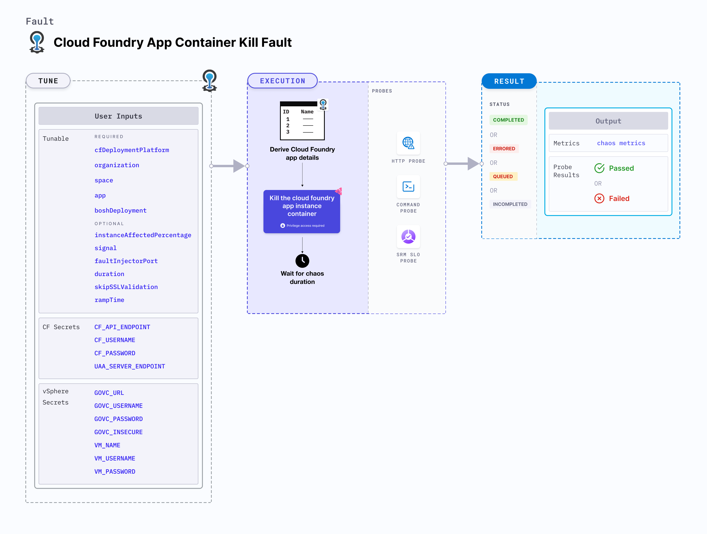

import CFAndBOSHSecrets from './shared/cf-and-bosh-secrets.md';
import VSphereSecrets from './shared/vsphere-secrets.md';

CF app container kill causes a Cloud Foundry app instance container to be killed (crash) and restarted.



## Use cases
CF app container kill:
- Checks resilience upon app instance crash due to container unavailability.
- Validates the effectiveness of disaster recovery and high availability of the app.

### Mandatory tunables
<table>
  <tr>
    <th> Tunable </th>
    <th> Description </th>
    <th> Notes </th>
  </tr>
  <tr>
    <td> deploymentModel </td>
    <td> The deployment model being used for Linux Chaos Infrastructure + Cloud Foundry Fault Injector. For more information, refer <a href="cf-chaos-components-and-their-deployment-architecture/#direct-installation-of-lci-in-the-tas-vms">here</a>.</td>
    <td> One of: <code>model-1</code>,<code>model-2</code>. No default value is assumed, if the tunable is not provided. For <code>model-1</code>, <code>boshDeployment</code> and <code>faultInjectorLocation</code> inputs are not required. </td>
  </tr>
  <tr>
    <td> organization </td>
    <td> Organization where the target app resides. </td>
    <td> For example, <code>dev-org</code> </td>
  </tr>
  <tr>
    <td> space </td>
    <td> Space where the target app resides. </td>
    <td> The space must reside within the given organization. For example, <code>dev-space</code> </td>
  </tr>
  <tr>
    <td> app </td>
    <td> The app to be stopped. </td>
    <td> The app must reside within the given organization and space. For example, <code>cf-app</code> </td>
  </tr>
</table>

### Optional tunables
<table>
  <tr>
    <th> Tunable </th>
    <th> Description </th>
    <th> Notes </th>
  </tr>
  <tr>
    <td> faultInjectorLocation </td>
    <td> Fault injector placement with respect to where the LCI is hosted. </td>
    <td> Default: <code>local</code>. Supports <code>local</code> and <code>vSphere</code>. For more information, go to <a href="#fault-injector-location"> Fault Injector location</a>. </td>
  </tr>
  <tr>
    <td> boshDeployment </td>
    <td> The bosh deployment under which the CF components are being managed. </td>
    <td> It can be obtained using the BOSH CLI command <code>bosh deployments</code>. For more information, go to <a href="#bosh-deployment"> BOSH deployment</a>. </td>
  </tr>
  <tr>
    <td> instanceAffectedPercentage </td>
    <td> Percentage of total number of app instances that will be targeted. </td>
    <td> Default: 0 (1 instance). For more information, go to <a href="#instance-affected-percentage"> instance affected percentage</a>. </td>
  </tr>
  <tr>
    <td> signal </td>
    <td> The signal to send while killing the container. Supports both names and corresponding numbers to denote a signal. </td>
    <td> Default: <code>SIGKILL</code>. For more information, go to <a href="#signal"> signal</a>. </td>
  </tr>
  <tr>
    <td> faultInjectorPort </td>
    <td> Local server port used by the fault-injector utility. </td>
    <td> Default: <code>50320</code>. If the default port is unavailable, a random port in the range of <code>50320-51320</code> is selected. For more information, go to <a href="#fault-injector-port"> fault injector port</a>. </td>
  </tr>
  <tr>
    <td> duration </td>
    <td> Duration through which chaos is injected into the target resource (in seconds). </td>
    <td> Default: 30s. For more information, go to <a href="/docs/chaos-engineering/use-harness-ce/chaos-faults/common-tunables-for-all-faults#duration-of-the-chaos"> chaos duration</a>. </td>
  </tr>
  <tr>
    <td> skipSSLValidation </td>
    <td> Skip SSL validation while invoking CF APIs. </td>
    <td> Supports <code>true</code> and <code>false</code>. Default: <code>false</code>. For more information, go to <a href="#skip-ssl-validation"> skip SSL validation</a>. </td>
  </tr>
  <tr>
    <td> rampTime </td>
    <td> Period to wait before and after injecting chaos (in seconds). </td>
    <td> Defaults to 0. </td>
  </tr>
</table>

<CFAndBOSHSecrets />

<VSphereSecrets />

### Signal
The `signal` input determines the signal to be sent while killing the container.
- It defaults to `SIGKILL`.
- It can be specified using the name (eg. `SIGKILL`) or the corresponding integer (eg. `9`).

The following YAML snippet illustrates the use of this environment variable:

[embedmd]:# (./static/manifests/cf-app-container-kill/signal.yaml yaml)
```yaml
# app container kill signal
apiVersion: litmuchaos.io/v1alpha1
kind: LinuxFault
metadata:
  name: cf-app-container-kill
  labels:
    name: app-container-kill
spec:
  cfAppContainerKill/inputs:
    duration: 30s
    faultInjectorLocation: vSphere
    app: cf-app
    organization: dev-org
    space: dev-space
    boshDeployment: cf
    signal: "15"
```

### Deployment Model
The `deploymentModel` input specifies the LCI deployment model with respect to its placement in the host TAS VM.
- It accepts one of: `model-1`, `model-2`.
- No default value is assumed if the input is not provided, but the experiment execution fails with an error.

The following YAML snippet illustrates the use of this environment variable:

[embedmd]:# (./static/manifests/cf-app-container-kill/deploymentModel.yaml yaml)
```yaml
# deployment model for LCI
apiVersion: litmuchaos.io/v1alpha1
kind: LinuxFault
metadata:
  name: cf-app-container-kill
  labels:
    name: app-container-kill
spec:
  cfAppContainerKill/inputs:
    duration: 30s
    faultInjectorLocation: vSphere
    app: cf-app
    organization: dev-org
    space: dev-space
    boshDeployment: cf
    deploymentModel: model-1
```

### BOSH deployment
The `boshDeployment` input determines the BOSH deployment name under which all the CF resources are being managed. It can be obtained using the BOSH CLI command `bosh deployments`.

The following YAML snippet illustrates the use of this environment variable:

[embedmd]:# (./static/manifests/cf-app-container-kill/boshDeployment.yaml yaml)
```yaml
# bosh deployment
apiVersion: litmuchaos.io/v1alpha1
kind: LinuxFault
metadata:
  name: cf-app-container-kill
  labels:
    name: app-container-kill
spec:
  cfAppContainerKill/inputs:
    duration: 30s
    faultInjectorLocation: vSphere
    app: cf-app
    organization: dev-org
    space: dev-space
    boshDeployment: cf
```

### Instance affected percentage
The `instanceAffectedPercentage` input specifies the percentage of total number of app instances that will be targeted. It defaults to 0 (1 instance).

The following YAML snippet illustrates the use of this environment variable:

[embedmd]:# (./static/manifests/cf-app-container-kill/instanceAffectedPercentage.yaml yaml)
```yaml
# instance affected percentage
apiVersion: litmuchaos.io/v1alpha1
kind: LinuxFault
metadata:
  name: cf-app-container-kill
  labels:
    name: app-container-kill
spec:
  cfAppContainerKill/inputs:
    duration: 30s
    faultInjectorLocation: vSphere
    app: cf-app
    organization: dev-org
    space: dev-space
    boshDeployment: cf
    instanceAffectedPercentage: 50
```

### Fault Injector location
The `faultInjectorLocation` input determines the fault injector placement with respect to where the LCI is hosted.
- It supports one of: 
  - `local`: LCI and fault injector are placed in the same machine.
  - `vSphere`: Fault injector is placed in a remote vSphere managed VM.

The following YAML snippet illustrates the use of this environment variable:

[embedmd]:# (./static/manifests/cf-app-container-kill/faultInjectorLocation.yaml yaml)
```yaml
# Fault Injector location
apiVersion: litmuchaos.io/v1alpha1
kind: LinuxFault
metadata:
  name: cf-app-container-kill
  labels:
    name: app-container-kill
spec:
  cfAppContainerKill/inputs:
    duration: 30s
    faultInjectorLocation: vSphere
    app: cf-app
    organization: dev-org
    space: dev-space
```

### Skip SSL validation
The `skipSSLValidation` input variable determines whether to skip SSL validation for calling the CF APIs.

The following YAML snippet illustrates the use of this environment variable:

[embedmd]:# (./static/manifests/cf-app-container-kill/skipSSLValidation.yaml yaml)
```yaml
# skip ssl validation for cf
apiVersion: litmuchaos.io/v1alpha1
kind: LinuxFault
metadata:
  name: cf-app-container-kill
  labels:
    name: app-container-kill
spec:
  cfAppContainerKill/inputs:
    duration: 30s
    faultInjectorLocation: vSphere
    app: cf-app
    organization: dev-org
    space: dev-space
    skipSSLValidation: true
```

### Fault injector port
The `faultInjectorPort` input variable determines the port used for the fault-injector local server.

The following YAML snippet illustrates the use of this environment variable:

[embedmd]:# (./static/manifests/cf-app-container-kill/faultInjectorPort.yaml yaml)
```yaml
# fault injector port
apiVersion: litmuchaos.io/v1alpha1
kind: LinuxFault
metadata:
  name: cf-app-container-kill
  labels:
    name: app-container-kill
spec:
  cfAppContainerKill/inputs:
    duration: 30s
    faultInjectorLocation: local
    app: cf-app
    organization: dev-org
    space: dev-space
    faultInjectorPort: 50331
```
