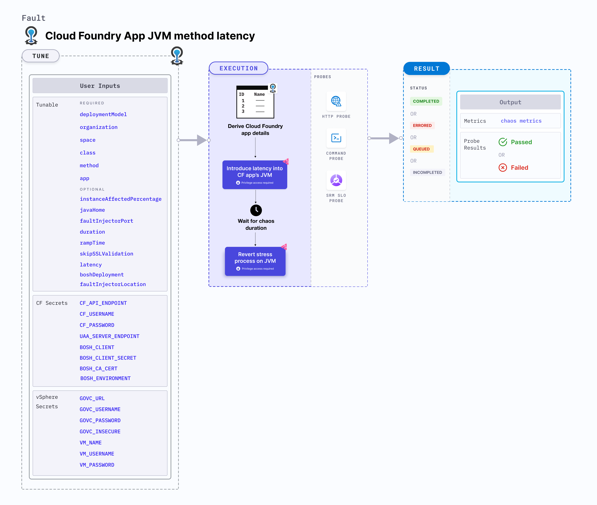

import CFAndBOSHSecrets from './shared/cf-and-bosh-secrets.md';
import VSphereSecrets from './shared/vsphere-secrets.md';

CF app JVM method latency injects latency into a method of a Java based Cloud Foundry app.



## Use cases
CF app JVM method latency:
- Mimics slow external services to test app behavior under load.
- Identifies performance bottlenecks by introducing controlled delays.
- Uncovers issues caused by tight timeout thresholds during development.
- Prepares your application to handle increased response times.

### Mandatory tunables
<table>
  <tr>
    <th>Tunable</th>
    <th>Description</th>
    <th>Notes</th>
  </tr>
  <tr>
    <td> deploymentModel </td>
    <td> The deployment model being used for Linux Chaos Infrastructure + Cloud Foundry Fault Injector. For more information, refer <a href="cf-chaos-components-and-their-deployment-architecture/#direct-installation-of-lci-in-the-tas-vms">here</a>.</td>
    <td> One of: <code>model-1</code>,<code>model-2</code>. No default value is assumed, if the tunable is not provided. For <code>model-1</code>, <code>boshDeployment</code> and <code>faultInjectorLocation</code> inputs are not required. </td>
  </tr>
  <tr>
    <td>organization</td>
    <td>Organization where the target app resides.</td>
    <td>For example, <code>dev-org</code>.</td>
  </tr>
  <tr>
    <td>space</td>
    <td>Space where the target app resides.</td>
    <td>The space must reside within the given organization. For example, <code>dev-space</code>.</td>
  </tr>
  <tr>
    <td>app</td>
    <td>The app in which chaos will be injected.</td>
    <td>The app must reside within the given organization and space. For example, <code>cf-app</code>.</td>
  </tr>
  <tr>
    <td>class</td>
    <td>The target Java class where the method lies. It should be provided in the format: <code>package-name.class-name</code></td>
    <td>For example, <code>Inventory</code></td>
  </tr>
  <tr>
    <td>method</td>
    <td>The target Java class method.</td>
    <td>For example, <code>AddToInventory</code></td>
  </tr>
</table>

### Optional tunables
<table>
  <tr>
    <th>Tunable</th>
    <th>Description</th>
    <th>Notes</th>
  </tr>
  <tr>
    <td>latency</td>
    <td>The latency to be injected to the method, in milliseconds.</td>
    <td>Default: <code>2000</code></td>
  </tr>
  <tr>
    <td> javaHome </td>
		<td> Value of the <code>JAVA_HOME</code> environment variable.</td>
		<td> Not required if the Java binary file path is added to the Linux <code>PATH</code> env or <code>JAVA_HOME</code> env is added to the Linux <code>PATH</code> env. </td>
  </tr>
  <tr>
		<td> instanceAffectedPercentage </td>
		<td> Percentage of total number of app instances that will be targeted. </td>
		<td> Default: 0 (1 instance). For more information, go to <a href="#instance-affected-percentage"> instance affected percentage</a>. </td>
	</tr>
    <tr>
		<td> faultInjectorPort </td>
		<td> Local server port used by the fault-injector utility. </td>
		<td> Default: <code>50320</code>. If the default port is unavailable, a random port in the range of <code>50320-51320</code> is selected. For more information, go to <a href="#fault-injector-port"> fault injector port</a>. </td>
	</tr>
	<tr>
		<td> duration </td>
		<td> Duration through which chaos is injected into the target resource (in seconds). </td>
		<td> Default: 30s. For more information, go to <a href="/docs/chaos-engineering/use-harness-ce/chaos-faults/common-tunables-for-all-faults#duration-of-the-chaos"> chaos duration</a>. </td>
	</tr>
	<tr>
		<td> skipSSLValidation </td>
		<td> Skip SSL validation while invoking CF APIs. </td>
		<td> Supports <code>true</code> and <code>false</code>. Default: <code>false</code>. For more information, go to <a href="#skip-ssl-validation"> skip SSL validation</a>. </td>
	</tr>
	<tr>
		<td> rampTime </td>
		<td> Period to wait before and after injecting chaos (in seconds). </td>
		<td> Defaults to 0. </td>
	</tr>
  <tr>
    <td> boshDeployment </td>
    <td> The bosh deployment under which the CF components are being managed. </td>
    <td> It can be obtained using the BOSH CLI command <code>bosh deployments</code>. For more information, go to <a href="#bosh-deployment"> BOSH deployment</a>. </td>
  </tr>
  <tr>
    <td> faultInjectorLocation </td>
    <td> Location of the fault injector with respect to the cloud foundry vms. </td>
    <td> Default: <code>local</code>. Supports <code>local</code> and <code>vSphere</code>. For more information, go to <a href="#fault-injector-location"> Fault Injector location</a>. </td>
  </tr>
</table>

<CFAndBOSHSecrets />

<VSphereSecrets />

## Fault Permissions
### List all applications the user or client has access to
**Required Roles (any one):**
-   `SpaceDeveloper` (in the app’s space)
-   `SpaceAuditor` (read-only role in the app’s space)
-   `OrgManager` or `OrgAuditor` (at the org level)

**Required OAuth Scopes (for tokens):**
-   `cloud_controller.read`
-   `cloud_controller.admin`
-   `cloud_controller.global_auditor`

### List all BOSH deployments
**Required Role:**
-   BOSH user with read permissions (typically `admin` or a user with `read` access to deployments)

**Required Auth:**
-   Valid BOSH UAA token with `bosh.read` scope

### Establish SSH session to a Diego Cell via BOSH SSH
**Required Role:**
-   BOSH user with SSH access permissions for the Diego Cell instance group

**Required Auth:**
-   BOSH UAA token with `bosh.ssh` or `bosh.admin` scope

### Use `cfdot` to list LRPs and locate app containers
**Required Role:**
-   Operator with SSH access to a cell and executable access to `cfdot`

**Required Auth:**
-   Requires `diego.read` scope in BOSH UAA or access to the Diego BBS with a trusted client certificate

### Use `ctr` (containerd CLI) to get container-level metadata and target PIDs
**Required Role:**
-   SSH-level access to the cell host and root access (or `sudo`) to interact with containerd

**Required Auth:**
-   None via API; local root or elevated user access is required

### Download Byteman artifacts into the target container
**Required Role:**
-   Root or privileged access to copy files into the app container’s namespace using tools like `nsenter` or `ctr`

**Required Auth:**
-   None via API; file access is performed locally via root privileges

### Inject JVM chaos using Byteman scripts inside target containers

**Required Role:**
-   Root access to attach Byteman agent and execute scripts within the JVM process namespace

**Required Auth:**
-   None via API; requires PID-level access to the target JVM and execution rights

### Remove injected chaos by clearing Byteman rules
**Required Role:**
-   Same as above — continued root-level access to the JVM process namespace

**Required Auth:**
-   None via API; local cleanup via script execution with appropriate permissions

---

### Deployment Model
The `deploymentModel` input specifies the LCI deployment model with respect to its placement in the host TAS VM.
- It accepts one of: `model-1`, `model-2`.
- No default value is assumed if the input is not provided, but the experiment execution fails with an error.

The following YAML snippet illustrates the use of this environment variable:

[embedmd]:# (./static/manifests/cf-app-jvm-method-latency/deploymentModel.yaml yaml)
```yaml
# deployment model for LCI
apiVersion: litmuchaos.io/v1alpha1
kind: LinuxFault
metadata:
  name: cf-app-jvm-method-latency
  labels:
    name: app-jvm-method-latency
spec:
  cfAppJVMChaos/inputs:
    duration: 30s
    faultInjectorLocation: vSphere
    app: cf-app
    organization: dev-org
    space: dev-space
    deploymentModel: model-1
```

### Class
The `class` input specifies the Java class whose method will be targeted. It shall be provided as: `package-name.class-name`.

The following YAML snippet illustrates the use of this input:

[embedmd]:# (./static/manifests/cf-app-jvm-method-latency/class.yaml yaml)
```yaml
# class
apiVersion: litmuchaos.io/v1alpha1
kind: LinuxFault
metadata:
  name: cf-app-jvm-method-latency
  labels:
    name: app-jvm-method-latency
spec:
  cfAppJVMChaos/inputs:
    class: com.appinventory.appinventory.appInventoryController
    duration: 30s
    app: cf-app
    organization: dev-org
    space: dev-space
    boshDeployment: cf
```

### BOSH deployment
The `boshDeployment` input determines the BOSH deployment name under which all the CF resources are managed. You can obtain it using the BOSH CLI command `bosh deployments`.

The following YAML snippet illustrates the use of this input:

[embedmd]:# (./static/manifests/cf-app-jvm-method-latency/boshDeployment.yaml yaml)
```yaml
# bosh deployment
apiVersion: litmuchaos.io/v1alpha1
kind: LinuxFault
metadata:
  name: cf-app-jvm-method-latency
  labels:
    name: app-jvm-method-latency
spec:
  cfAppJVMChaos/inputs:
    duration: 30s
    faultInjectorLocation: vSphere
    app: cf-app
    organization: dev-org
    space: dev-space
    boshDeployment: cf
```

### Instance affected percentage
The `instanceAffectedPercentage` input specifies the percentage of total number of app instances that will be targeted. It defaults to 0 (1 instance).

The following YAML snippet illustrates the use of this input:

[embedmd]:# (./static/manifests/cf-app-jvm-method-latency/instanceAffectedPercentage.yaml yaml)
```yaml
# instance affected percentage
apiVersion: litmuchaos.io/v1alpha1
kind: LinuxFault
metadata:
  name: cf-app-jvm-method-latency
  labels:
    name: app-jvm-method-latency
spec:
  cfAppJVMChaos/inputs:
    duration: 30s
    faultInjectorLocation: vSphere
    app: cf-app
    organization: dev-org
    space: dev-space
    boshDeployment: cf
    instanceAffectedPercentage: 50
```

### Fault injector location
The `faultInjectorLocation` input determines the location of the fault injector with respect to the infrastructure. It is the location where the fault-injector utility is executed.
- It can be local, that is, the same environment used by the infrastructure, or a remote machine.

The following YAML snippet illustrates the use of this input:

[embedmd]:# (./static/manifests/cf-app-jvm-method-latency/faultInjectorLocation.yaml yaml)
```yaml
# Fault Injector location
apiVersion: litmuchaos.io/v1alpha1
kind: LinuxFault
metadata:
  name: cf-app-jvm-method-latency
  labels:
    name: app-jvm-method-latency
spec:
  cfAppJVMChaos/inputs:
    duration: 30s
    faultInjectorLocation: vSphere
    app: cf-app
    organization: dev-org
    space: dev-space
```

### Skip SSL validation
The `skipSSLValidation` input variable determines whether to skip SSL validation for calling the CF APIs.

The following YAML snippet illustrates the use of this input:

[embedmd]:# (./static/manifests/cf-app-jvm-method-latency/skipSSLValidation.yaml yaml)
```yaml
# skip ssl validation for cf
apiVersion: litmuchaos.io/v1alpha1
kind: LinuxFault
metadata:
  name: cf-app-jvm-method-latency
  labels:
    name: app-jvm-method-latency
spec:
  cfAppJVMChaos/inputs:
    duration: 30s
    faultInjectorLocation: vSphere
    app: cf-app
    organization: dev-org
    space: dev-space
    skipSSLValidation: true
```

### Fault injector port
The `faultInjectorPort` input determines the port used for the fault-injector local server.

The following YAML snippet illustrates the use of this input:

[embedmd]:# (./static/manifests/cf-app-jvm-method-latency/faultInjectorPort.yaml yaml)
```yaml
# fault injector port
apiVersion: litmuchaos.io/v1alpha1
kind: LinuxFault
metadata:
  name: cf-app-jvm-method-latency
  labels:
    name: app-jvm-method-latency
spec:
  cfAppJVMChaos/inputs:
    duration: 30s
    faultInjectorLocation: local
    app: cf-app
    organization: dev-org
    space: dev-space
    faultInjectorPort: 50331
```
