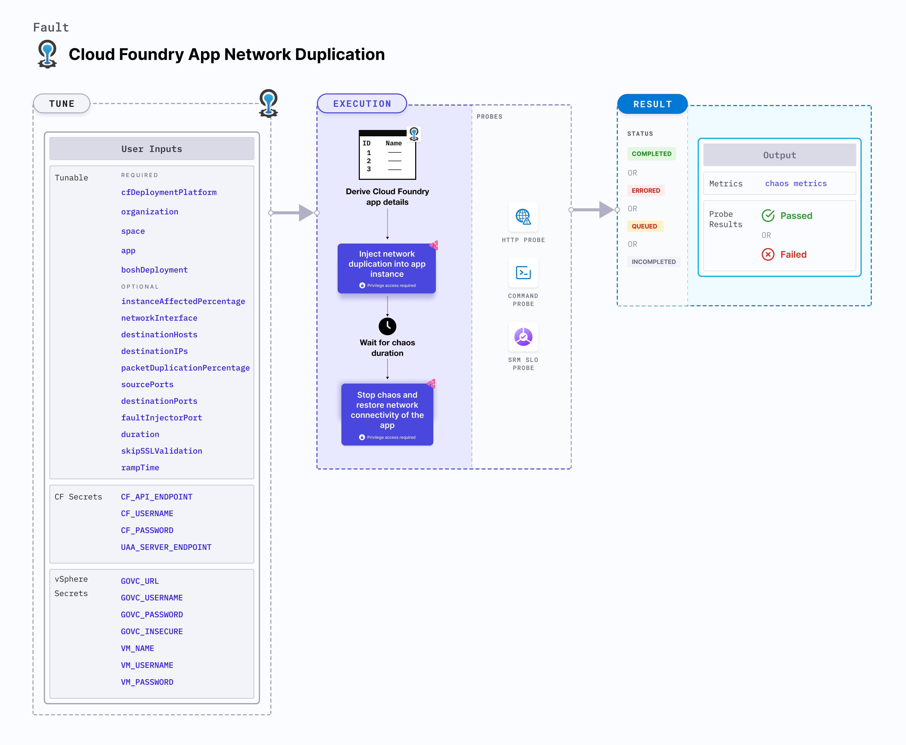

import CFAndBOSHSecrets from './shared/cf-and-bosh-secrets.md';
import VSphereSecrets from './shared/vsphere-secrets.md';

CF app network duplication injects network duplication into a Cloud Foundry app instance.



## Use cases

CF app network duplication:

- Checks resilience upon app network packet duplication.
- Validates the effectiveness of disaster recovery and high availability of the app.

### Mandatory tunables

<table>
  <tr>
    <th> Tunable </th>
    <th> Description </th>
    <th> Notes </th>
  </tr>
  <tr>
    <td> cfDeploymentPlatform </td>
    <td> Deployment platform used for cloud foundry with respect to where the infrastructure is hosted. </td>
    <td> Supports <code>local</code> and <code>vSphere</code>. For more information, go to <a href="#cf-deployment-platform"> CF deployment platform</a>. </td>
  </tr>
  <tr>
    <td> organization </td>
    <td> Organization where the target app resides. </td>
    <td> For example, <code>dev-org</code> </td>
  </tr>
  <tr>
    <td> space </td>
    <td> Space where the target app resides. </td>
    <td> The space must reside within the given organization. For example, <code>dev-space</code> </td>
  </tr>
  <tr>
    <td> app </td>
    <td> The app to be stopped. </td>
    <td> The app must reside within the given organization and space. For example, <code>cf-app</code> </td>
  </tr>
  <tr>
    <td> boshDeployment </td>
    <td> The bosh deployment under which the CF components are being managed. </td>
    <td> It can be obtained using the BOSH CLI command <code>bosh deployments</code>. For more information, go to <a href="#bosh-deployment"> BOSH deployment</a>. </td>
  </tr>
</table>

### Optional tunables

<table>
  <tr>
    <th> Tunable </th>
    <th> Description </th>
    <th> Notes </th>
  </tr>
  <tr>
    <td> instanceAffectedPercentage </td>
    <td> Percentage of total number of app instances that will be targeted. </td>
    <td> Default: 0 (1 instance). For more information, go to <a href="#instance-affected-percentage"> instance affected percentage</a>. </td>
  </tr>
  <tr>
    <td> networkInterface </td>
    <td> The network interface used by the container. </td>
    <td> Default: <code>eth0</code> </td>
  </tr>
  <tr>
    <td> destinationHosts </td>
    <td> List of the target host names or keywords. For example, <code>google.com,litmuschaos.io</code>.</td>
    <td> If neither <code>destinationHosts</code> nor <code> destinationIPs</code> is present, the fault injects chaos for all host names or domains. </td>
  </tr>
  <tr>
    <td> destinationIPs </td>
    <td> List of the target IPs. For example, <code>1.1.1.1,8.8.8.8</code> </td>
    <td> If neither <code>destinationHosts</code> nor <code> destinationIPs</code> is provided, all host names or domains are targeted.</td>
  </tr>
  <tr>
    <td> packetDuplicationPercentage </td>
    <td> Percentage of packet duplication. For example, <code> 100 </code> </td>
    <td> Default: 100% </td>
  </tr>
  <tr>
    <td> sourcePorts </td>
    <td> Source ports to be filtered for chaos. For example: <code> 5000,8080 </code>. </td>
    <td> Alternatively, the ports can be whitelisted, that is, filtered to be exempt from chaos. Prepend a <code>!</code> to the list of ports to be exempted. For example, <code> !5000,8080 </code>. </td>
  </tr>
  <tr>
    <td> destinationPorts </td>
    <td> Destination ports to be filtered for chaos. For example: <code> 5000,8080 </code> </td>
    <td> Alternatively, the ports can be whitelisted, that is, filtered to be exempt from chaos. Prepend a <code>!</code> to the list of ports to be exempted. For example, <code> !5000,8080 </code>. </td>
  </tr>
  <tr>
    <td> faultInjectorPort </td>
    <td> Local server port used by the fault-injector utility. </td>
    <td> Default: <code>50320</code>. If the default port is unavailable, a random port in the range of <code>50320-51320</code> is selected. For more information, go to <a href="#fault-injector-port"> fault injector port</a>. </td>
  </tr>
  <tr>
    <td> duration </td>
    <td> Duration through which chaos is injected into the target resource (in seconds). </td>
    <td> Default: 30s. For more information, go to <a href="/docs/chaos-engineering/chaos-faults/common-tunables-for-all-faults#duration-of-the-chaos"> chaos duration</a>. </td>
  </tr>
  <tr>
    <td> skipSSLValidation </td>
    <td> Skip SSL validation while invoking CF APIs. </td>
    <td> Supports <code>true</code> and <code>false</code>. Default: <code>false</code>. For more information, go to <a href="#skip-ssl-validation"> skip SSL validation</a>. </td>
  </tr>
  <tr>
    <td> rampTime </td>
    <td> Period to wait before and after injecting chaos (in seconds). </td>
    <td> Defaults to 0. </td>
  </tr>
</table>

<CFAndBOSHSecrets />

<VSphereSecrets />

### Destination hosts

The `destinationHosts` input variable subjects the comma-separated names of the target hosts to chaos.

The following YAML snippet illustrates the use of this environment variable:

[embedmd]: # './static/manifests/cf-app-network-duplication/destination-hosts.yaml yaml'

```yaml
apiVersion: litmuchaos.io/v1alpha1
kind: LinuxFault
metadata:
  name: cf-app-network-duplication
  labels:
    name: app-network-duplication
spec:
  cfAppNetworkChaos/inputs:
    duration: 30s
    cfDeploymentPlatform: vSphere
    app: cf-app
    organization: dev-org
    space: dev-space
    destinationHosts: 'google.com'
```

### Destination IPs

The `destinationIPs` input variable subjects the comma-separated names of the target IPs to chaos.

The following YAML snippet illustrates the use of this environment variable:

[embedmd]: # './static/manifests/cf-app-network-duplication/destination-ips.yaml yaml'

```yaml
apiVersion: litmuchaos.io/v1alpha1
kind: LinuxFault
metadata:
  name: cf-app-network-duplication
  labels:
    name: app-network-duplication
spec:
  cfAppNetworkChaos/inputs:
    duration: 30s
    cfDeploymentPlatform: vSphere
    app: cf-app
    organization: dev-org
    space: dev-space
    destinationIPs: '1.1.1.1'
```

### Source and destination ports

By default, the network experiments disrupt traffic for all the source and destination ports. Tune the interruption of specific port(s) using `sourcePorts` and `destinationPorts` inputs, respectively.

- `sourcePorts`: Ports of the target application whose accessibility is impacted.
- `destinationPorts`: Ports of the destination services or pods or the CIDR blocks(range of IPs) whose accessibility is impacted.

The following YAML snippet illustrates the use of this environment variable:

[embedmd]: # './static/manifests/cf-app-network-duplication/source-and-destination-ports.yaml yaml'

```yaml
apiVersion: litmuchaos.io/v1alpha1
kind: LinuxFault
metadata:
  name: cf-app-network-duplication
  labels:
    name: app-network-duplication
spec:
  cfAppNetworkChaos/inputs:
    duration: 30s
    cfDeploymentPlatform: vSphere
    app: cf-app
    organization: dev-org
    space: dev-space
    destinationIPs: '1.1.1.1'
    sourcePorts: '8080,3000'
    destinationPorts: '5000,3000'
```

### Ignore Source and Destination Ports

By default, the network experiments disrupt traffic for all the source and destination ports. Ignore the specific ports using `sourcePorts` and `destinationPorts` inputs, respectively.

- `sourcePorts`: Provide source ports that are not subject to chaos as comma-separated values preceded by `!`.
- `destinationPorts`: Provide destination ports that are not subject to chaos as comma-separated values preceded by `!`.

The following YAML snippet illustrates the use of this environment variable:

[embedmd]: # './static/manifests/cf-app-network-duplication/ignore-source-and-destination-ports.yaml yaml'

```yaml
apiVersion: litmuchaos.io/v1alpha1
kind: LinuxFault
metadata:
  name: cf-app-network-duplication
  labels:
    name: app-network-duplication
spec:
  cfAppNetworkChaos/inputs:
    duration: 30s
    cfDeploymentPlatform: vSphere
    app: cf-app
    organization: dev-org
    space: dev-space
    destinationIPs: '1.1.1.1'
    sourcePorts: '!8080,3000'
    destinationPorts: '!5000,3000'
```

### Packet duplication percentage

The `packetDuplicationPercentage` input variable duplicates a specific percentage of the data packets.

The following YAML snippet illustrates the use of this environment variable:

[embedmd]: # './static/manifests/cf-app-network-duplication/packet-duplication-percentage.yaml yaml'

```yaml
apiVersion: litmuchaos.io/v1alpha1
kind: LinuxFault
metadata:
  name: cf-app-network-duplication
  labels:
    name: app-network-duplication
spec:
  cfAppNetworkChaos/inputs:
    duration: 30s
    cfDeploymentPlatform: vSphere
    app: cf-app
    organization: dev-org
    space: dev-space
    packetDuplicationPercentage: '50'
```

### BOSH deployment

The `boshDeployment` input determines the BOSH deployment name under which all the CF resources are being managed. It can be obtained using the BOSH CLI command `bosh deployments`.

The following YAML snippet illustrates the use of this environment variable:

[embedmd]: # './static/manifests/cf-app-network-duplication/boshDeployment.yaml yaml'

```yaml
# bosh deployment
apiVersion: litmuchaos.io/v1alpha1
kind: LinuxFault
metadata:
  name: cf-app-network-duplication
  labels:
    name: app-network-duplication
spec:
  cfAppNetworkChaos/inputs:
    duration: 30s
    cfDeploymentPlatform: vSphere
    app: cf-app
    organization: dev-org
    space: dev-space
    boshDeployment: cf
```

### Instance affected percentage

The `instanceAffectedPercentage` input specifies the percentage of total number of app instances that will be targeted. It defaults to 0 (1 instance).

The following YAML snippet illustrates the use of this environment variable:

[embedmd]: # './static/manifests/cf-app-network-duplication/instanceAffectedPercentage.yaml yaml'

```yaml
# instance affected percentage
apiVersion: litmuchaos.io/v1alpha1
kind: LinuxFault
metadata:
  name: cf-app-network-duplication
  labels:
    name: app-network-duplication
spec:
  cfAppNetworkChaos/inputs:
    duration: 30s
    cfDeploymentPlatform: vSphere
    app: cf-app
    organization: dev-org
    space: dev-space
    boshDeployment: cf
    instanceAffectedPercentage: 50
```

### CF deployment platform

The `cfDeploymentPlatform` input variable determines the deployment platform used for CF with respect to the infrastructure.

- The deployment platform can be local, that is, the same environment used by the infrastructure, or a remote machine.
- The deployment platform is where the fault-injector utility executes.

The following YAML snippet illustrates the use of this environment variable:

[embedmd]: # './static/manifests/cf-app-network-duplication/cfDeploymentPlatform.yaml yaml'

```yaml
# cf deployment platform
apiVersion: litmuchaos.io/v1alpha1
kind: LinuxFault
metadata:
  name: cf-app-network-duplication
  labels:
    name: app-network-duplication
spec:
  cfAppNetworkChaos/inputs:
    duration: 30s
    cfDeploymentPlatform: vSphere
    app: cf-app
    organization: dev-org
    space: dev-space
```

### Skip SSL validation

The `skipSSLValidation` input variable determines whether to skip SSL validation for calling the CF APIs.

The following YAML snippet illustrates the use of this environment variable:

[embedmd]: # './static/manifests/cf-app-network-duplication/skipSSLValidation.yaml yaml'

```yaml
# skip ssl validation for cf
apiVersion: litmuchaos.io/v1alpha1
kind: LinuxFault
metadata:
  name: cf-app-network-duplication
  labels:
    name: app-network-duplication
spec:
  cfAppNetworkChaos/inputs:
    duration: 30s
    cfDeploymentPlatform: vSphere
    app: cf-app
    organization: dev-org
    space: dev-space
    skipSSLValidation: true
```

### Fault injector port

The `faultInjectorPort` input variable determines the port used for the fault-injector local server.

The following YAML snippet illustrates the use of this environment variable:

[embedmd]: # './static/manifests/cf-app-network-duplication/faultInjectorPort.yaml yaml'

```yaml
# fault injector port
apiVersion: litmuchaos.io/v1alpha1
kind: LinuxFault
metadata:
  name: cf-app-network-duplication
  labels:
    name: app-network-duplication
spec:
  cfAppNetworkChaos/inputs:
    duration: 30s
    cfDeploymentPlatform: local
    app: cf-app
    organization: dev-org
    space: dev-space
    faultInjectorPort: 50331
```