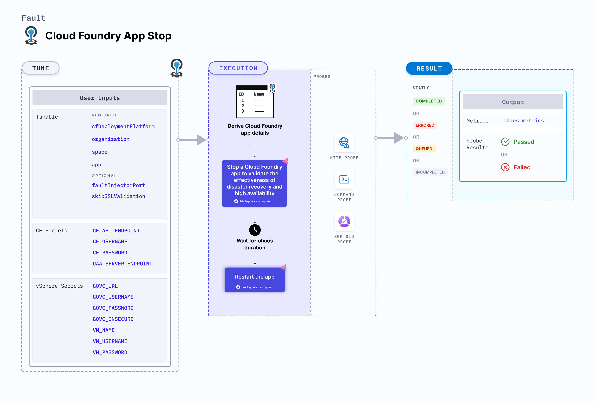

import CFSecrets from './shared/cf-secrets.md';
import VSphereSecrets from './shared/vsphere-secrets.md';

CF app stop fault stops a Cloud Foundry app and later starts it.



## Use cases
CF app stop:
- Checks resilience against abrupt stopping of the application components/microservices.
- Validates the effectiveness of disaster recovery and high availability of the app.

### Mandatory tunables
<table>
  <tr>
    <th> Tunable </th>
    <th> Description </th>
    <th> Notes </th>
  </tr>
  <tr>
    <td> cfDeploymentPlatform </td>
    <td> Deployment platform used for cloud foundry with respect to where the infrastructure is hosted. </td>
    <td> Supports <code>local</code> and <code>vSphere</code>. For more information, go to <a href="#cf-deployment-platform"> CF deployment platform.</a> </td>
  </tr>
  <tr>
    <td> organization </td>
    <td> Organization where the target app resides. </td>
    <td> For example, <code>dev-org</code> </td>
  </tr>
  <tr>
    <td> space </td>
    <td> Space where the target app resides. </td>
    <td> The space must reside within the given organization. For example, <code>dev-space</code> </td>
  </tr>
  <tr>
    <td> app </td>
    <td> The app to be stopped. </td>
    <td> The app must reside within the given organization and space. For example, <code>cf-app</code> </td>
  </tr>
</table>

### Optional tunables
<table>
  <tr>
    <th> Tunable </th>
    <th> Description </th>
    <th> Notes </th>
  </tr>
  <tr>
    <td> faultInjectorPort </td>
    <td> Local server port used by the fault-injector utility. </td>
    <td> Default: <code>50320</code>. If the default port is unavailable, a random port in the range of <code>50320-51320</code> is selected. For more information, go to <a href="#fault-injector-port"> fault injector port.</a></td>
  </tr>
  <tr>
    <td> duration </td>
    <td> Duration through which chaos is injected into the target resource (in seconds). </td>
    <td> Default: 30s. For more information, go to <a href="/docs/chaos-engineering/use-harness-ce/chaos-faults/common-tunables-for-all-faults#duration-of-the-chaos"> chaos duration.</a></td>
  </tr>
  <tr>
    <td> skipSSLValidation </td>
    <td> Skip SSL validation while invoking CF APIs. </td>
    <td> Supports <code>true</code> and <code>false</code>. Default: <code>false</code>. For more information, go to <a href="#skip-ssl-validation"> skip SSL validation.</a></td>
  </tr>
  <tr>
    <td> rampTime </td>
    <td> Period to wait before and after injecting chaos (in seconds). </td>
    <td> Defaults to 0. </td>
  </tr>
</table>

<CFSecrets />

<VSphereSecrets />

### CF deployment platform
The `cfDeploymentPlatform` input variable determines the deployment platform used for CF with respect to the infrastructure.
- The deployment platform can be local, that is, the same environment used by the infrastructure, or a remote machine.
- The deployment platform is where the fault-injector utility executes.

The following YAML snippet illustrates the use of this environment variable:

[embedmd]:# (./static/manifests/cf-app-stop/cfDeploymentPlatform.yaml yaml)
```yaml
# cf deployment platform
apiVersion: litmuchaos.io/v1alpha1
kind: LinuxFault
metadata:
  name: cf-app-stop
  labels:
    name: app-stop
spec:
  cfAppStop/inputs:
    duration: 30s
    cfDeploymentPlatform: vSphere
    app: cf-app
    organization: dev-org
    space: dev-space
```

### Skip SSL validation
The `skipSSLValidation` input variable determines whether to skip SSL validation for calling the CF APIs.

The following YAML snippet illustrates the use of this environment variable:

[embedmd]:# (./static/manifests/cf-app-stop/skipSSLValidation.yaml yaml)
```yaml
# skip ssl validation for cf
apiVersion: litmuchaos.io/v1alpha1
kind: LinuxFault
metadata:
  name: cf-app-stop
  labels:
    name: app-stop
spec:
  cfAppStop/inputs:
    duration: 30s
    cfDeploymentPlatform: vSphere
    app: cf-app
    organization: dev-org
    space: dev-space
    skipSSLValidation: true
```

### Fault injector port
The `faultInjectorPort` input variable determines the port used for the fault-injector local server.

The following YAML snippet illustrates the use of this environment variable:

[embedmd]:# (./static/manifests/cf-app-stop/faultInjectorPort.yaml yaml)
```yaml
# fault injector port
apiVersion: litmuchaos.io/v1alpha1
kind: LinuxFault
metadata:
  name: cf-app-stop
  labels:
    name: app-stop
spec:
  cfAppStop/inputs:
    duration: 30s
    cfDeploymentPlatform: local
    app: cf-app
    organization: dev-org
    space: dev-space
    faultInjectorPort: 50331
```
