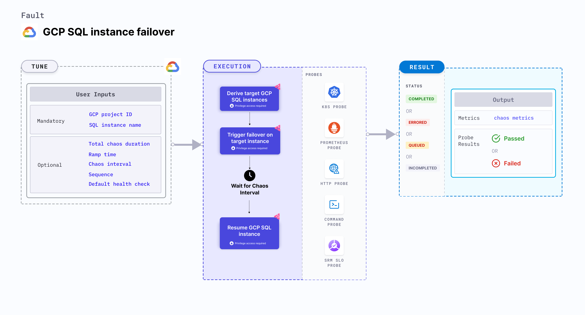

GCP SQL Instance Failover disrupts the state of GCP SQL instance filtered using a name and project ID by triggering failover on the SQL instance.



## Use cases

GCP SQL instance failover fault:
- Determines the resilience of the GKE infrastructure.
- Determines how quickly an SQL Instance can recover when a failover on one of the replicas is triggered.

### Prerequisites
- Kubernetes > 1.16
- Service account should have editor access (or owner access) to the GCP project.
- High Availability should be enabled on target GCP SQL Instance
- Kubernetes secret should have the GCP service account credentials in the default namespace. Refer [generate the necessary credentials in order to authenticate your identity with the Google Cloud Platform (GCP)](/docs/chaos-engineering/use-harness-ce/chaos-faults/gcp/security-configurations/prepare-secret-for-gcp) docs for more information.

```yaml
apiVersion: v1
kind: Secret
metadata:
  name: cloud-secret
type: Opaque
stringData:
  type:
  project_id:
  private_key_id:
  private_key:
  client_email:
  client_id:
  auth_uri:
  token_uri:
  auth_provider_x509_cert_url:
  client_x509_cert_url:
```

### Mandatory tunables
   <table>
      <tr>
        <th> Tunable </th>
        <th> Description </th>
        <th> Notes </th>
      </tr>
      <tr>
        <td> GCP_PROJECT_ID </td>
        <td> Id of the GCP project containing the SQL Instance. </td>
        <td> Target SQL Instance should belong to this GCP project. For more information, go to <a href="#failover-sql-instance-by-name"> GCP project ID.</a></td>
      </tr>
      <tr>
        <td> SQL_INSTANCE_NAME </td>
        <td>Name of the target GCP SQL Instance. </td>
        <td> For more information, go to <a href="#failover-sql-instance-by-name">SQL INSTANCE NAME.</a></td>
      </tr>
    </table>

### Optional tunables
   <table>
      <tr>
        <th> Tunable </th>
        <th> Description </th>
        <th> Notes </th>
      </tr>
      <tr>
        <td> TOTAL_CHAOS_DURATION </td>
        <td> Duration that you specify, through which chaos is injected into the target resource (in seconds). </td>
        <td> Defaults to 30s. For more information, go to <a href="/docs/chaos-engineering/use-harness-ce/chaos-faults/common-tunables-for-all-faults#duration-of-the-chaos">duration of the chaos.</a></td>
      </tr>
       <tr>
        <td> CHAOS_INTERVAL </td>
        <td> Time interval between two successive chaos iterations (in seconds). </td>
        <td> Defaults to 30s. For more information, go to <a href="/docs/chaos-engineering/use-harness-ce/chaos-faults/common-tunables-for-all-faults#chaos-interval">chaos interval.</a></td>
      </tr>
      <tr>
        <td> SEQUENCE </td>
        <td> Sequence of chaos execution for multiple target disks. </td>
        <td> Defaults to parallel. It supports serial sequence as well. For more information, go to <a href="/docs/chaos-engineering/use-harness-ce/chaos-faults/common-tunables-for-all-faults#sequence-of-chaos-execution">sequence of chaos execution. </a></td>
      </tr>
      <tr>
        <td> RAMP_TIME </td>
        <td> Period to wait before and after injecting chaos (in seconds).</td>
        <td> For example, 30s. For more information, go to <a href="/docs/chaos-engineering/use-harness-ce/chaos-faults/common-tunables-for-all-faults#ramp-time">ramp time. </a></td>
      </tr>
      <tr>
      <td>DEFAULT_HEALTH_CHECK</td>
      <td>Determines if you wish to run the default health check which is present inside the fault. </td>
      <td> Default: 'true'. For more information, go to <a href="/docs/chaos-engineering/use-harness-ce/chaos-faults/common-tunables-for-all-faults#default-health-check"> default health check.</a></td>
      </tr>
    </table>

### IAM permissions

Listed below are the IAM permissions leveraged by the fault:
- `cloudsql.instances.failover`
- `cloudsql.instances.list`

### Failover SQL Instance by name

The name of SQL Instance subject to Failover. It triggers failover on the sql instances with the provided name under `SQL_INSTANCE_NAME` within the `GCP_PROJECT_ID` project. It waits for the failover to complete & target instance to come in RUNNING state again in different zone.

**GCP project ID**: The project ID which is a unique identifier for a GCP project. Tune it by using the `GCP_PROJECT_ID` environment variable.

The following YAML snippet illustrates the use of this environment variable:

[embedmd]:# (./static/manifests/gcp-sql-instance-failover/gcp-sql-instance-failover.yaml yaml)
```yaml
apiVersion: litmuschaos.io/v1alpha1
kind: ChaosEngine
metadata:
  name: engine-nginx
spec:
  engineState: "active"
  chaosServiceAccount: litmus-admin
  experiments:
    - name: gcp-sql-instance-failover
      image: docker.io/harness/chaos-go-runner:main-latest
      imagePullPolicy: Always
      args:
        - -c
        - ./experiments -name gcp-sql-instance-failover
      command:
        - /bin/bash
      components:
        env:
          - name: TOTAL_CHAOS_DURATION
            value: "30"
          - name: SQL_INSTANCE_NAME
            value: "test-sql-instance"
          - name: GCP_PROJECT_ID
            value: "sample-project-id"
          - name: DEFAULT_HEALTH_CHECK
            value: "false"
```
