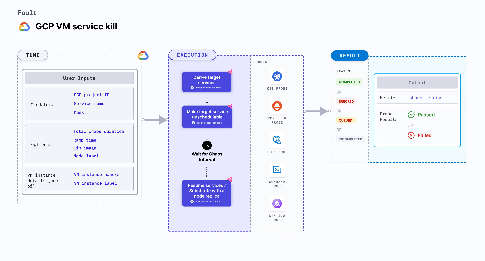

GCP VM service kill fault stops a given service for specified duration. As a consequence, the node becomes unschedulable and it transitions to **NotReady** state.
- GCP VM service kill stops a target service on a node to make it unschedulable for a specific duration.
- The node reverts to its original state and services resume after a specific duration. Sometimes, a new node replica may substitute the existing one.



## Use cases
GCP VM service kill fault assesses a GKE node's resilience by evaluating the service operating on it.

### Prerequisites
- Kubernetes > 1.23
- Cordon the node specified in the <code>VM_INSTANCE_NAMES</code> environment variable (the node for which the target service is killed) before executing the chaos fault. This ensures that the fault resources aren't scheduled on it or subject to eviction. You can achieve this using the following steps:
  - Get node names against the applications pods using command <code>kubectl get pods -o wide</code>.
  - Cordon the node using command <code>kubectl cordon &lt;nodename&gt;</code>.
- The target nodes should be in the ready state before and after injecting chaos.
- Adequate GCP permissions to do `gcloud ssh` on the VM instance.
- The VM instances should be in a healthy state.
- Kubernetes secret should have the GCP service account credentials in the default namespace. Refer [generate the necessary credentials in order to authenticate your identity with the Google Cloud Platform (GCP)](/docs/chaos-engineering/use-harness-ce/chaos-faults/gcp/security-configurations/prepare-secret-for-gcp) docs for more information.

```yaml
apiVersion: v1
kind: Secret
metadata:
  name: cloud-secret
type: Opaque
stringData:
  type:
  project_id:
  private_key_id:
  private_key:
  client_email:
  client_id:
  auth_uri:
  token_uri:
  auth_provider_x509_cert_url:
  client_x509_cert_url:
```
### Mandatory tunables
   <table>
      <tr>
        <th> Tunable </th>
        <th> Description </th>
        <th> Notes </th>
      </tr>
      <tr>
        <td> SERVICE_NAME </td>
        <td> Name of the target service to stop on node. </td>
        <td> For example, <code>containerd</code>. For more information, go to <a href = "#target-service">service name.</a></td>
      </tr>
      <tr>
        <td> GCP_PROJECT_ID </td>
        <td> Id of the GCP project that belong to the VM instances. </td>
        <td> All the VM instances must belong to a single GCP project. For more information, go to <a href="#target-gcp-instances">GCP project ID. </a></td>
      </tr>
      <tr>
        <td> VM_INSTANCE_NAMES </td>
        <td> Name of the target VM instances. </td>
        <td> Provide the name of the target instance. For more information, go to <a href="#target-gcp-instances">target GCP instances. </a></td>
      </tr>
    </table>

### Optional tunables
   <table>
      <tr>
        <th> Tunable </th>
        <th> Description </th>
        <th> Notes </th>
      </tr>
      <tr>
        <td> TOTAL_CHAOS_DURATION </td>
        <td> Duration that you specify, through which chaos is injected into the target resource (in seconds). </td>
        <td> Default: 60s. For more information, go to <a href = "/docs/chaos-engineering/use-harness-ce/chaos-faults/common-tunables-for-all-faults/#duration-of-the-chaos">duration of the chaos.</a></td>
      </tr>
      <tr>
        <td> LIB_IMAGE </td>
        <td> Image used to inject chaos. </td>
        <td> Default value is the experiment image. For more information, go to <a href = "/docs/chaos-engineering//chaos-faults/common-tunables-for-all-faults#image-used-by-the-helper-pod">image used by the helper pod.</a></td>
      </tr>
      <tr>
        <td> MASK </td>
        <td> Mask the target service like containerd.</td>
        <td> Supports 'enable' and 'disable'. For more information, go to <a href = "#mask">service mask details.</a></td>
      </tr>
      <tr>
        <td> NODE_LABEL </td>
        <td> Node label used to filter the target node if <code>TARGET_NODE</code> environment variable is not set. </td>
        <td> It is mutually exclusive with the <code>TARGET_NODE</code> environment variable. If both are provided, the fault uses <code>TARGET_NODE</code>. For more information, go to <a href="/docs/chaos-engineering/use-harness-ce/chaos-faults/kubernetes/node/common-tunables-for-node-faults/#target-nodes-with-labels">node label.</a></td>
      </tr>
      <tr>
        <td> RAMP_TIME </td>
        <td> Period to wait before injecting chaos (in seconds). </td>
        <td> For example, 30 s. For more information, go to <a href = "/docs/chaos-engineering/use-harness-ce/chaos-faults/common-tunables-for-all-faults/#ramp-time">ramp time.</a></td>
      </tr>
      <tr>
      <td>DEFAULT_HEALTH_CHECK</td>
      <td>Determines if you wish to run the default health check which is present inside the fault. </td>
      <td> Default: 'true'. For more information, go to <a href="/docs/chaos-engineering/use-harness-ce/chaos-faults/common-tunables-for-all-faults#default-health-check"> default health check.</a></td>
      </tr>
    </table>

### Target GCP instances
It selects the target instance using`VM_INSTANCE_NAMES` tunable in the given `GCP_PROJECT_ID` project.

**GCP project ID**: The project ID which is a unique identifier for a GCP project. Tune it by using the `GCP_PROJECT_ID` environment variable.

The following YAML snippet illustrates the use of this environment variable:

[embedmd]:# (./static/manifests/gcp-vm-service-kill/gcp-instance.yaml yaml)
```yaml
## details of the GCP instance
apiVersion: litmuschaos.io/v1alpha1
kind: ChaosEngine
metadata:
  name: engine-nginx
spec:
  engineState: "active"
  chaosServiceAccount: litmus-admin
  experiments:
  - name: gcp-vm-service-kill
    spec:
      components:
        env:
        # comma-separated list of vm instance names
        - name: VM_INSTANCE_NAMES
          value: 'instance-01'
        # GCP project ID to which vm instance belongs
        - name: GCP_PROJECT_ID
          value: 'project-id'
```

### Target service

Name of the target service to kill onxd the specified VM instance. Tune it by using the `SERVICE_NAME` environment variable.

The following YAML snippet illustrates the use of this environment variable:

[embedmd]:# (./static/manifests/gcp-vm-service-kill/target-service.yaml yaml)
```yaml
# kill the target service on the target VM instance
apiVersion: litmuschaos.io/v1alpha1
kind: ChaosEngine
metadata:
  name: engine-nginx
spec:
  engineState: "active"
  annotationCheck: "false"
  chaosServiceAccount: litmus-admin
  experiments:
  - name: gcp-vm-service-kill
    spec:
      components:
        env:
        # name of the target node
        - name: SERVICE_NAME
          value: 'containerd'
        - name: VM_INSTANCE_NAMES
          VALUE: 'instance-01'
```

### Mask

You can also mask a service before stopping it. Tune it by using the `MAKE` environment variable with value `enable` to apply mask on the service.

The following YAML snippet illustrates the use of this environment variable:

[embedmd]:# (./static/manifests/gcp-vm-service-kill/mask-service.yaml yaml)
```yaml
# mask a service before stopping it
apiVersion: litmuschaos.io/v1alpha1
kind: ChaosEngine
metadata:
  name: engine-nginx
spec:
  engineState: "active"
  annotationCheck: "false"
  chaosServiceAccount: litmus-admin
  experiments:
  - name: gcp-vm-service-kill
    spec:
      components:
        env:
        - name: MASK
          value: 'enable'
        - name: SERVICE_NAME
          VALUE: 'containerd'
```
