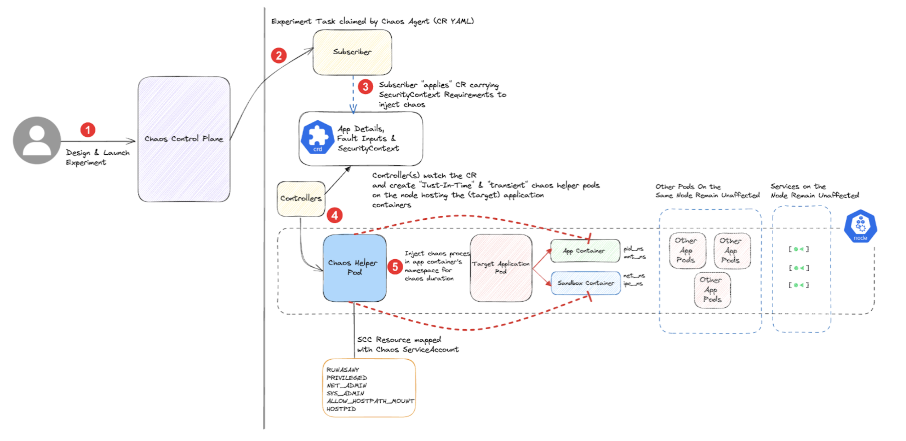
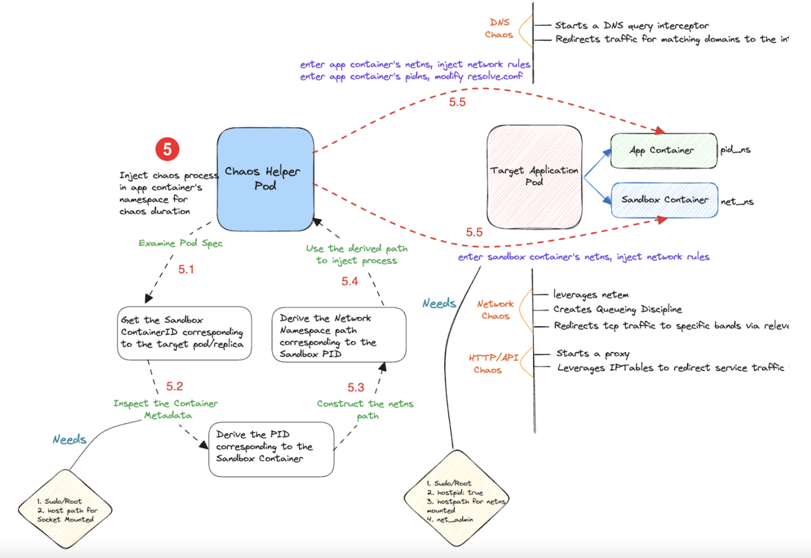
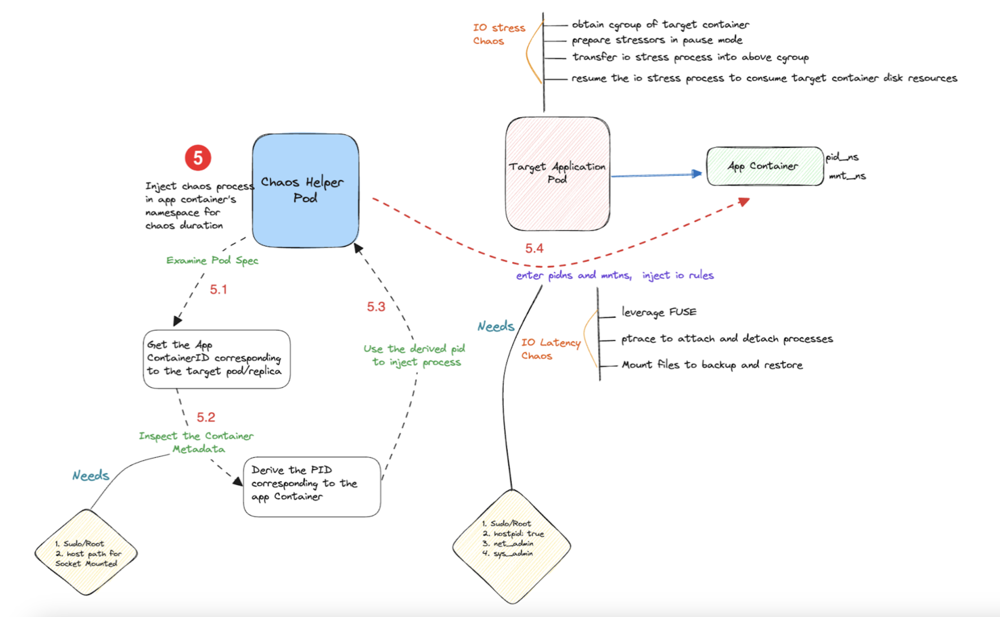
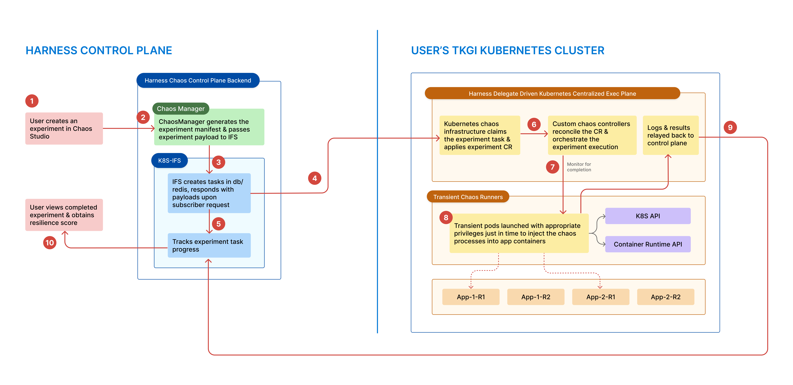

This topic describes the following:
- Classification of Kubernetes-based faults.
- How each category of fault works, the APIs they use, and examples.
    - [Pod faults](#pod-faults-microservices-based-faults)
    - [Node faults](#node-faults-infrastructure-based-faults)
    - [Cloud-based faults](#cloud-based-faults-aws-gcp-azure)
- [Flow of control in Kubernetes faults](#flow-of-control-in-kubernetes-based-faults)
- [Deployment modes](#deployment-modes-of-kubernetes-chaos-infrastructure)

HCE supports three categories of faults that you can execute using the Kubernetes chaos agent. They are listed below.
1. **[Pod faults](#pod-faults-microservices-based-faults)** (also known as microservices-based faults)
2. **[Node faults](#node-faults-infrastructure-based-faults)** (also known as infrastructure-based faults)
3. **[Cloud-based faults](#cloud-based-faults-aws-gcp-azure)**

Each of these categories is discussed in detail below.

Pod faults and node faults are native Kubernetes-based targets whereas cloud-based targets use chaos agents to remotely execute chaos on targets outside the cluster, such as cloud resources.

:::tip
Kubernetes chaos agent also supports executing faults on remote targets that use mechanisms such as SSH, vCenter APIs, and so on against cloud APIs.
:::

## Pod faults (microservices-based faults)

These faults act on application [workloads]( https://kubernetes.io/docs/concepts/workloads/) (that include single-run pods) using the namespace, label selectors, and workload names as the filters to identify the target. You can define the blast radius of the fault through pod percentages (that is, the number of candidate pods to target in case multiple replicas fit the filter criteria) and container names.

Some of these faults use purely the Kubernetes API. In such cases, a Go client in the chaos pod uses the in-cluster configuration through a mounted service account token to carry out some Kubernetes CRUD operations (for example, [pod delete](/docs/chaos-engineering/use-harness-ce/chaos-faults/kubernetes/pod/pod-delete), [pod scale](/docs/chaos-engineering/use-harness-ce/chaos-faults/kubernetes/pod/pod-autoscaler), [service load](/docs/chaos-engineering/use-harness-ce/chaos-faults/kubernetes/pod/pod-io-stress), and so on).

Along with the Kubernetes API, many other faults use runtime APIs to extract the container PIDs and inject chaos in the target container's network, pid and mnt namespaces (for example, [pod network loss](/docs/chaos-engineering/use-harness-ce/chaos-faults/kubernetes/pod/pod-network-loss), [pod CPU hog](/docs/chaos-engineering/use-harness-ce/chaos-faults/kubernetes/pod/pod-cpu-hog), [pod IO latency](/docs/chaos-engineering/use-harness-ce/chaos-faults/kubernetes/pod/pod-io-latency), and so on.)

The diagram below describes how the chaos fault is executed against microservices, that is, application workloads.

Described below are the flow of control in two chaos faults:

[DNS chaos fault](/docs/chaos-engineering/use-harness-ce/chaos-faults/kubernetes/pod/pod-dns-error)

[IO stress chaos fault](/docs/chaos-engineering/use-harness-ce/chaos-faults/kubernetes/pod/pod-io-stress)

### Flow of control in Kubernetes-based faults

When you create a Kubernetes experiment with the target details, the fault tunables, and the probes, the following actions take place:
1. The respective Kubernetes chaos infrastructure (that is, the subscriber) fetches the task from the chaos control plane and creates the experiment custom resource on the cluster.
2. The cluster controllers parse the inputs from the experiment resource and launch transient pods to carry out the chaos business logic.
3. These transient chaos pods use a dedicated chaos service account (that is mapped to an appropriate role and security policy) to inject the fault processes against the target.
4. The chaos actions typically invoke either or a combination of the Kubernetes API, container runtime API, and cloud APIs.
5. Logs of these chaos pods are streamed to a log server in the chaos control plane for analysis.
6. The experiment custom resource is patched with the appropriate status and probe results are read and relayed back to the control plane by the subscriber.

The diagram below describes the interaction between the Harness control plane and the TKGi Kubernetes cluster.

## Node faults (infrastructure-based faults)

These faults inject chaos into:
- Cluster node objects,
- Kubernetes system services running on them (for example, `kubelet`, `containerd`, `docker`),
- Volumes attached to these nodes.

By nature, these faults have a higher blast radius and impact multiple microservice instances during their execution. They are typically executed with discretion, especially in shared testbeds to prevent disruptions and noisy-neighbour issues.

They help determine the overall system resilience (for example, [node drain](/docs/chaos-engineering/use-harness-ce/chaos-faults/kubernetes/node/node-drain), [node restart](/docs/chaos-engineering/use-harness-ce/chaos-faults/kubernetes/node/node-restart), [node CPU hog](/docs/chaos-engineering/use-harness-ce/chaos-faults/kubernetes/node/node-cpu-hog), [Kubelet service kill](/docs/chaos-engineering/use-harness-ce/chaos-faults/kubernetes/node/kubelet-service-kill), and so on).

Most of these faults use only the Kubernetes API.

## Cloud-based faults ([AWS](/docs/chaos-engineering/use-harness-ce/chaos-faults/aws/), [GCP](/docs/chaos-engineering/use-harness-ce/chaos-faults/gcp/), [Azure](/docs/chaos-engineering/use-harness-ce/chaos-faults/azure/))

These faults disrupt the state of cloud resources, deprive resources, or manipulate the network settings of cloud resources. These cloud resources are either self-managed infrastructure components such as compute instances, storage volumes (for example, ec2 shutdown, ebs detach, and so on) or managed services such as ECS, RDS, Lambda, and so on (for example, task scale, rds failover, Lambda timeout, az-loss, and so on).

The transient chaos pods leverage the respective cloud provider SDK to inject chaos and consume cloud credentials (of account users that are mapped to an appropriate IAM role) through the Kubernetes secrets to authenticate their API requests.

The diagram below describes how a chaos fault is executed in cloud-based chaos faults.

## Deployment modes of Kubernetes chaos infrastructure

You can deploy the Kubernetes chaos infrastructure (or agent) in two modes:
1. **Cluster-scope**
2. **Namespace-scope**

### Cluster scope mode

In this mode, the [subscriber](/docs/chaos-engineering/use-harness-ce/chaos-faults/kubernetes/tkgi/tkgi-deployment#subscriber), [controllers](/docs/chaos-engineering/use-harness-ce/chaos-faults/kubernetes/tkgi/tkgi-deployment#custom-controllers) and the [transient chaos pods](/docs/chaos-engineering/use-harness-ce/chaos-faults/kubernetes/tkgi/tkgi-deployment#transient-chaos-pods) use the service accounts that are mapped to ClusterRoles.

This allows the following:

- The subscriber performs a cluster-wide asset discovery, that is, lists all the namespaces and the workloads within them.
- The chaos pods inject faults against workloads across namespaces.
- Perform [node faults](/docs/chaos-engineering/use-harness-ce/chaos-faults/kubernetes/classification#node-faults-infrastructure-based-faults) type chaos experiments also (as the node object is a cluster-scoped resource) in addition to [pod faults](/docs/chaos-engineering/use-harness-ce/chaos-faults/kubernetes/classification#pod-faults-microservices-based-faults) and [node faults](/docs/chaos-engineering/use-harness-ce/chaos-faults/kubernetes/classification#node-faults-infrastructure-based-faults).

### Namespace scope mode

In this mode, the [subscriber](/docs/chaos-engineering/use-harness-ce/chaos-faults/kubernetes/tkgi/tkgi-deployment#subscriber), [controllers](/docs/chaos-engineering/use-harness-ce/chaos-faults/kubernetes/tkgi/tkgi-deployment#custom-controllers) and the [transient chaos pods](/docs/chaos-engineering/use-harness-ce/chaos-faults/kubernetes/tkgi/tkgi-deployment#transient-chaos-pods) use the service accounts that are mapped to a NamespacedRole.

This allows the following:
- The subscriber discovers assets only within the agent installation namespace.
- The chaos pods only inject faults against workloads running in the agent installation namespace.
- It supports [pod faults](/docs/chaos-engineering/use-harness-ce/chaos-faults/kubernetes/classification#pod-faults-microservices-based-faults) and [cloud-based faults](/docs/chaos-engineering/use-harness-ce/chaos-faults/kubernetes/classification#cloud-based-faults-aws-gcp-azure).