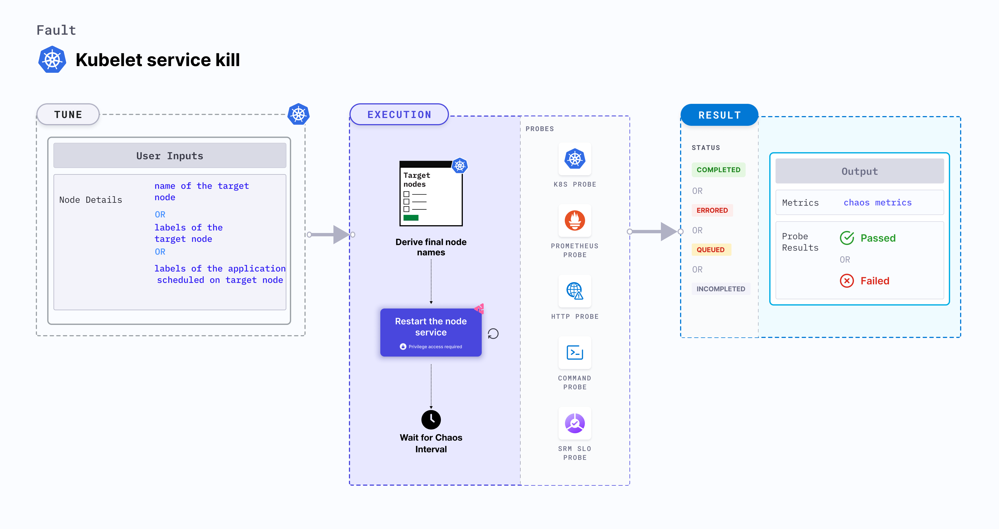

Kubelet service kill makes the application unreachable on the account of the node turning unschedulable (in **NotReady** state).
- Kubelet service is stopped (or killed) on a node to make it unschedulable for a specific duration.
- The application node goes back to normal state and services are resumed after the chaos duration.




## Use cases
Kubelet service kill fault determines the resilience of an application when a node becomes unschedulable, that is, **NotReady** state.

### Permissions required

Below is a sample Kubernetes role that defines the permissions required to execute the fault.

```
apiVersion: rbac.authorization.k8s.io/v1
kind: Role
metadata:
  namespace: hce
  name: kubelet-service-kill
spec:
  definition:
    scope: Namespaced # Supports Cluster mode too
permissions:
  - apiGroups: [""]
    resources: ["pods"]
    verbs: ["create", "delete", "get", "list", "patch", "deletecollection", "update"]
  - apiGroups: [""]
    resources: ["events"]
    verbs: ["create", "get", "list", "patch", "update"]
  - apiGroups: [""]
    resources: ["chaosEngines", "chaosExperiments", "chaosResults"]
    verbs: ["create", "delete", "get", "list", "patch", "update"]
  - apiGroups: [""]
    resources: ["pods/log"]
    verbs: ["get", "list", "watch"]
  - apiGroups: [""]
    resources: ["pods/exec"]
    verbs: ["get", "list", "create"]
  - apiGroups: ["batch"]
    resources: ["jobs"]
    verbs: ["create", "delete", "get", "list", "deletecollection"]
  - apiGroups: [""]
    resources: ["nodes"]
    verbs: ["get", "list"]
```

### Prerequisites
- Kubernetes > 1.16 is required to execute this fault.
- Node specified in the <code>TARGET_NODE</code> environment variable (the node for which Docker service would be killed) should be cordoned before executing the chaos fault. This ensures that the fault resources are not scheduled on it or subject to eviction. This is achieved using the following steps:
  - Get node names against the applications pods using command <code>kubectl get pods -o wide</code>.
  - Cordon the node using command <code>kubectl cordon &lt;nodename&gt;</code>.
- The target nodes should be in the ready state before and after injecting chaos.

### Mandatory tunables
   <table>
      <tr>
        <th> Tunable </th>
        <th> Description </th>
        <th> Notes </th>
      </tr>
      <tr>
        <td> TARGET_NODE </td>
        <td> Name of the target node. </td>
        <td> For example, <code>node-1</code>. For more information, go to <a href = "https://developer.harness.io/docs/chaos-engineering/use-harness-ce/chaos-faults/kubernetes/node/common-tunables-for-node-faults#target-single-node">target node.</a></td>
      </tr>
      <tr>
        <td> NODE_LABEL </td>
        <td> Node label used to filter the target node if <code>TARGET_NODE</code> environment variable is not set. </td>
        <td> It is mutually exclusive with the <code>TARGET_NODE</code> environment variable. If both are provided, the fault uses <code>TARGET_NODE</code>. For more information, go to <a href="https://developer.harness.io/docs/chaos-engineering/use-harness-ce/chaos-faults/kubernetes/node/common-tunables-for-node-faults#target-nodes-with-labels">node label.</a></td>
      </tr>
    </table>

### Optional tunables

   <table>
      <tr>
        <th> Tunable </th>
        <th> Description </th>
        <th> Notes </th>
      </tr>
      <tr>
        <td> TOTAL_CHAOS_DURATION </td>
        <td> Duration that you specify, through which chaos is injected into the target resource (in seconds). </td>
        <td> Default: 60 s. For more information, go to <a href = "https://developer.harness.io/docs/chaos-engineering/use-harness-ce/chaos-faults/common-tunables-for-all-faults#duration-of-the-chaos">duration of the chaos.</a></td>
      </tr>
      <tr>
        <td> LIB_IMAGE </td>
        <td> Image used to inject chaos. </td>
        <td> Default: <code>harness/chaos-go-runner:main-latest</code>. For more information, go to <a href = "https://developer.harness.io/docs/chaos-engineering/use-harness-ce/chaos-faults/common-tunables-for-all-faults#image-used-by-the-helper-pod">image used by the helper pod.</a></td>
      </tr>
      <tr>
        <td> RAMP_TIME </td>
        <td> Period to wait before and after injecting chaos (in seconds). </td>
        <td> For example, 30 s. For more information, go to <a href = "/docs/chaos-engineering/use-harness-ce/chaos-faults/common-tunables-for-all-faults#ramp-time">ramp time.</a></td>
      </tr>
    </table>

### Kill kubelet service

Name of the target node. Tune it by using the `TARGET_NODE` environment variable.

The following YAML snippet illustrates the use of this environment variable:

[embedmd]:# (./static/manifests/kubelet-service-kill/kubelet-service-kill.yaml yaml)
```yaml
# kill the kubelet service of the target node
apiVersion: litmuschaos.io/v1alpha1
kind: ChaosEngine
metadata:
  name: engine-nginx
spec:
  engineState: "active"
  annotationCheck: "false"
  chaosServiceAccount: litmus-admin
  experiments:
  - name: kubelet-service-kill
    spec:
      components:
        env:
        # name of the target node
        - name: TARGET_NODE
          value: 'node01'
        - name: TOTAL_CHAOS_DURATION
          VALUE: '60'
```
