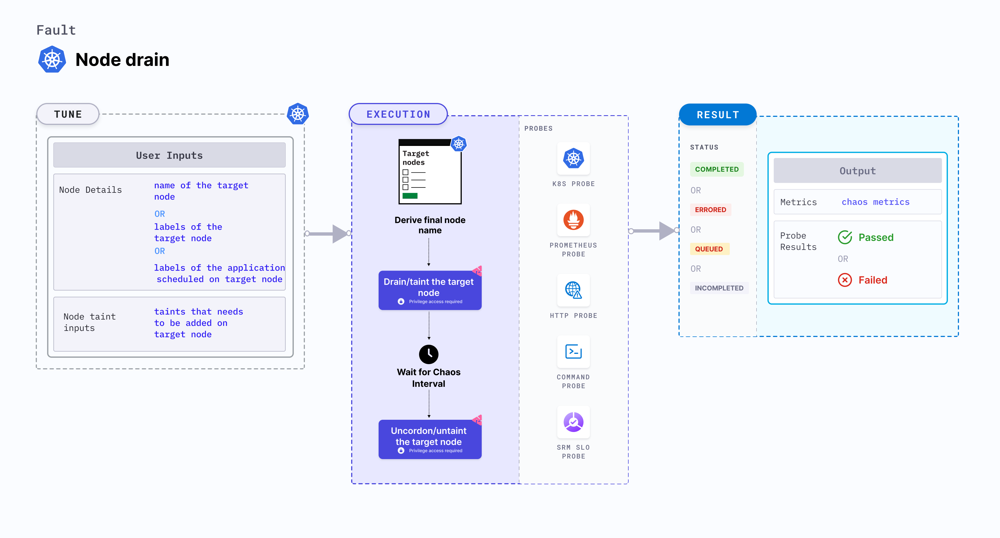

Node drain drains the node of all its resources running on it. Due to this, services running on the target node should be rescheduled to run on other nodes.




## Use cases
- Node drain fault drains all the resources running on a node.
- It determines the resilience of the application when the application replicas scheduled on a node are removed.
- It validates the application failover capabilities when a node suddenly becomes unavailable.
- It simulates node maintenance activity (hardware refresh, OS patching, Kubernetes upgrade).
- It verifies resource budgeting on cluster nodes (whether request (or limit) settings are honored on available nodes).
- It verifies whether topology constraints are adhered to (node selectors, tolerations, zone distribution, affinity(or anti-affinity) policies) or not.

### Permissions required

Below is a sample Kubernetes role that defines the permissions required to execute the fault.

```
apiVersion: rbac.authorization.k8s.io/v1
kind: Role
metadata:
  namespace: hce
  name: node-drain
spec:
  definition:
    scope: Cluster
permissions:
  - apiGroups: [""]
    resources: ["pods"]
    verbs: ["create", "delete", "get", "list", "patch", "deletecollection", "update"]
  - apiGroups: [""]
    resources: ["events"]
    verbs: ["create", "get", "list", "patch", "update"]
  - apiGroups: [""]
    resources: ["chaosEngines", "chaosExperiments", "chaosResults"]
    verbs: ["create", "delete", "get", "list", "patch", "update"]
  - apiGroups: [""]
    resources: ["pods/log"]
    verbs: ["get", "list", "watch"]
  - apiGroups: [""]
    resources: ["pods/exec"]
    verbs: ["get", "list", "create"]
  - apiGroups: ["batch"]
    resources: ["jobs"]
    verbs: ["create", "delete", "get", "list", "deletecollection"]
  - apiGroups: [""]
    resources: ["nodes"]
    verbs: ["get", "list", "patch", "update"]
  - apiGroups: [""]
    resources: ["pod eviction"]
    verbs: ["get", "list", "create]
```

### Prerequisites
- Kubernetes > 1.16
- Node specified in the <code>TARGET_NODE</code> environment variable should be cordoned before executing the chaos fault. This ensures that the fault resources are not scheduled on it (or subject to eviction). This is achieved by the following steps:
  - Get node names against the applications pods using command <code>kubectl get pods -o wide</code>.
  - Cordon the node using command <code>kubectl cordon &lt;nodename&gt;</code>.
- The target nodes should be in the ready state before and after injecting chaos.

### Mandatory tunables

   <table>
      <tr>
        <th> Tunable </th>
        <th> Description </th>
        <th> Notes </th>
      </tr>
      <tr>
        <td> TARGET_NODES </td>
        <td> Comma-separated list of nodes subject to node CPU hog. </td>
        <td> For more information, go to <a href = "https://developer.harness.io/docs/chaos-engineering/use-harness-ce/chaos-faults/kubernetes/node/common-tunables-for-node-faults#target-multiple-nodes">target nodes.</a></td>
      </tr>
      <tr>
        <td> NODE_LABEL </td>
        <td> It contains the node label that is used to filter the target nodes.</td>
        <td>It is mutually exclusive with the <code>TARGET_NODES</code> environment variable. If both are provided, <code>TARGET_NODES</code> takes precedence. For more information, go to <a href="https://developer.harness.io/docs/chaos-engineering/use-harness-ce/chaos-faults/kubernetes/node/common-tunables-for-node-faults#target-nodes-with-labels">node label.</a></td>
      </tr>
    </table>

### Optional tunables

   <table>
      <tr>
        <th> Tunable </th>
        <th> Description </th>
        <th> Notes </th>
      </tr>
      <tr>
        <td> TOTAL_CHAOS_DURATION </td>
        <td> Duration that you specify, through which chaos is injected into the target resource (in seconds). </td>
        <td> Default: 60 s. For more information, go to <a href = "https://developer.harness.io/docs/chaos-engineering/use-harness-ce/chaos-faults/common-tunables-for-all-faults#duration-of-the-chaos">duration of the chaos.</a></td>
      </tr>
      <tr>
        <td> NODES_AFFECTED_PERC </td>
        <td> Percentage of total nodes to target, that takes numeric values only. </td>
        <td> Default: 0 (corresponds to 1 node). For more information, go to <a href = "https://developer.harness.io/docs/chaos-engineering/use-harness-ce/chaos-faults/kubernetes/node/common-tunables-for-node-faults#node-affected-percentage">node affected percentage.</a></td>
      </tr>
      <tr>
        <td> SEQUENCE </td>
        <td> Sequence of chaos execution for multiple target pods. </td>
        <td> Default: parallel. Supports serial sequence as well. For more information, go to <a href = "https://developer.harness.io/docs/chaos-engineering/use-harness-ce/chaos-faults/common-tunables-for-all-faults#sequence-of-chaos-execution"> sequence of chaos execution.</a></td>
      </tr>
    </table>

### Drain node

Name of the target node. Tune it by using the `TARGET_NODE` environment variable.

The following YAML snippet illustrates the use of this environment variable:

[embedmd]:# (./static/manifests/node-drain/node-drain.yaml yaml)
```yaml
# drain the targeted node
apiVersion: litmuschaos.io/v1alpha1
kind: ChaosEngine
metadata:
  name: engine-nginx
spec:
  engineState: "active"
  annotationCheck: "false"
  chaosServiceAccount: litmus-admin
  experiments:
  - name: node-drain
    spec:
      components:
        env:
        # name of the target node
        - name: TARGET_NODE
          value: 'node01'
        - name: TOTAL_CHAOS_DURATION
          VALUE: '60'
```
