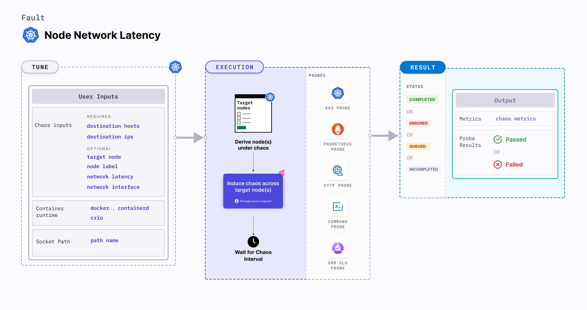

Node network latency is a Kubernetes node-level chaos fault that induces packet latency across the entire node. Similar to pod network latency, this fault uses traffic control (tc) along with netem rules to inject network latency.



## Use cases
Node network latency:
- Simulates a degraded network at the node level, causing potential disruptions to all pods running on the affected node.
- Tests the node and inter-node communication resilience against packet latency.
- Simulates scenarios where specific nodes might experience network problems due to issues like faulty NICs or network misconfigurations.

### Permissions required

Below is a sample Kubernetes role that defines the permissions required to execute the fault.

```
apiVersion: rbac.authorization.k8s.io/v1
kind: Role
metadata:
  namespace: hce
  name: node-network-latency
spec:
  definition:
    scope: Cluster
permissions:
  - apiGroups: [""]
    resources: ["pods"]
    verbs: ["create", "delete", "get", "list", "patch", "deletecollection", "update"]
  - apiGroups: [""]
    resources: ["events"]
    verbs: ["create", "get", "list", "patch", "update"]
  - apiGroups: [""]
    resources: ["chaosEngines", "chaosExperiments", "chaosResults"]
    verbs: ["create", "delete", "get", "list", "patch", "update"]
  - apiGroups: [""]
    resources: ["pods/log"]
    verbs: ["get", "list", "watch"]
  - apiGroups: [""]
    resources: ["pods/exec"]
    verbs: ["get", "list", "create"]
  - apiGroups: ["batch"]
    resources: ["jobs"]
    verbs: ["create", "delete", "get", "list", "deletecollection"]
  - apiGroups: [""]
    resources: ["nodes"]
    verbs: ["get", "list"]
```

### Prerequisites
- Kubernetes > 1.16
- Nodes should be in a healthy state before and after injecting chaos.

### Optional tunables
<table>
    <thead>
        <tr>
            <th>Tunable</th>
            <th>Description</th>
            <th>Notes</th>
        </tr>
    </thead>
    <tbody>
        <tr>
            <td>NODE_LABEL</td>
            <td>Label of the node on which to induce network latency.</td>
            <td>If not provided, the chaos operator selects nodes based on other criteria. For more information, go to <a href = "/docs/chaos-engineering/use-harness-ce/chaos-faults/kubernetes/node/common-tunables-for-node-faults#target-nodes-with-labels">target nodes with labels.</a></td>
        </tr>
        <tr>
            <td> TARGET_NODES </td>
            <td> Comma-separated list of nodes subject to chaos.</td>
            <td> For example, <code>node-1,node-2</code>. For more information, go to <a href = "/docs/chaos-engineering/use-harness-ce/chaos-faults/kubernetes/node/common-tunables-for-node-faults#target-multiple-nodes">target nodes.</a></td>
        </tr>
        <tr>
            <td> NODES_AFFECTED_PERC </td>
            <td> Percentage of the total nodes to target. It takes numeric values only. </td>
            <td> Default: 0 (corresponds to 1 node). For more information, go to <a href = "https://developer.harness.io/docs/chaos-engineering/use-harness-ce/chaos-faults/kubernetes/node/common-tunables-for-node-faults#node-affected-percentage">node affected percentage.</a></td>
        </tr>
        <tr>
            <td>SOCKET_PATH</td>
            <td>Path of the containerd or crio or docker socket file.</td>
            <td>Defaults to <code>/run/containerd/containerd.sock</code>. For other runtimes, refer to the respective socket paths. For more information, go to <a href = "#container-runtime-and-socket-path"> socket path.</a></td>
        </tr>
        <tr>
            <td>CONTAINER_RUNTIME</td>
            <td>Container runtime interface for the cluster.</td>
            <td>Default: containerd. Supports docker, containerd, and crio. For more information, go to <a href = "#container-runtime-and-socket-path"> container runtime.</a></td>
        </tr>
        <tr>
            <td>DESTINATION_HOSTS</td>
            <td>DNS names or FQDN names of the services and ports whose accessibility is impacted.</td>
            <td>If not provided, network chaos is induced for all destinations or <code>DESTINATION_IPS</code> if defined. For more information, go to <a href = "#destination-ips-and-destination-hosts"> destination hosts.</a></td>
        </tr>
        <tr>
            <td>DESTINATION_IPS</td>
            <td>Comma-separated IP addresses and ports of services, pods, or CIDR blocks whose accessibility is impacted.</td>
            <td>If not provided, network chaos is induced for all destinations. For more information, go to <a href = "#destination-ips-and-destination-hosts"> destination IPs.</a></td>
        </tr>
        <tr>
            <td>NETWORK_INTERFACE</td>
            <td>Name of the ethernet interface considered for shaping traffic.</td>
            <td>Default is typically <code>eth0</code>. For more information, go to <a href = "#network-interface"> network interface.</a></td>
        </tr>
        <tr>
            <td>NETWORK_LATENCY</td>
            <td>Packet latency (in ms) across the node.</td>
            <td>Default: 2000. For more information, go to <a href = "#network-packet-latency"> network packet latency.</a></td>
        </tr>
        <tr>
            <td>RAMP_TIME</td>
            <td>Period to wait before and after injecting chaos (in seconds).</td>
            <td>For example, 30 s. For more information, go to <a href = "/docs/chaos-engineering/use-harness-ce/chaos-faults/common-tunables-for-all-faults#ramp-time">ramp time.</a></td>
        </tr>
    </tbody>
</table>

:::tip
If the environment variables `DESTINATION_HOSTS` or `DESTINATION_IPS` are left empty, the default behaviour is to target all hosts. To limit the impact on all the hosts, you can specify the IP addresses of the service (use commas to separate multiple values) or the DNS or the FQDN names of the services in `DESTINATION_HOSTS`.
:::

### Network packet latency

Network packet latency (in ms) injected into the entire node. Tune it by using the `NETWORK_LATENCY` environment variable.

The following YAML snippet illustrates the use of these environment variables:

[embedmd]:# (./static/manifests/node-network-latency/network-latency.yaml yaml)
```yaml
# it injects network-latency for the ingress/egress traffic
apiVersion: litmuschaos.io/v1alpha1
kind: ChaosEngine
metadata:
  name: engine-nginx
spec:
  engineState: "active"
  annotationCheck: "false"
  appinfo:
    appns: "default"
    applabel: "app=nginx"
    appkind: "deployment"
  chaosServiceAccount: litmus-admin
  experiments:
  - name: node-network-latency
    spec:
      components:
        env:
        # network packet latency percentage
        - name: NETWORK_LATENCY
          value: '2000'
        - name: TOTAL_CHAOS_DURATION
          value: '60'
```

### Destination IPs and destination hosts

Default IPs and hosts affected by the network fault. Use `DESTINATION_IPS` and `DESTINATION_HOSTS` environment variables to specify the IPs and hosts.

- `DESTINATION_IPS`: IP addresses of the services or pods or the CIDR blocks (range of IPs) whose accessibility is impacted.
- `DESTINATION_HOSTS`: DNS names or FQDN names of the services and ports whose accessibility is impacted.

The following YAML snippet illustrates the use of these environment variables:

[embedmd]:# (./static/manifests/node-network-latency/destination-ips-and-hosts.yaml yaml)
```yaml
# it injects the chaos for the ingress/egress traffic for specific ips/hosts
apiVersion: litmuschaos.io/v1alpha1
kind: ChaosEngine
metadata:
  name: engine-nginx
spec:
  engineState: "active"
  annotationCheck: "false"
  appinfo:
    appns: "default"
    applabel: "app=nginx"
    appkind: "deployment"
  chaosServiceAccount: litmus-admin
  experiments:
  - name: node-network-latency
    spec:
      components:
        env:
        # supports comma separated destination ips
        - name: DESTINATION_IPS
          value: '8.8.8.8,192.168.5.6'
        # supports comma separated destination hosts
        - name: DESTINATION_HOSTS
          value: 'nginx.default.svc.cluster.local'
        - name: TOTAL_CHAOS_DURATION
```

### Network interface

Name of the ethernet interface considered to shape the traffic. Its default value is `eth0`. Tune it by using the `NETWORK_INTERFACE` environment variable.

The following YAML snippet illustrates the use of this environment variable:

[embedmd]:# (./static/manifests/node-network-latency/network-interface.yaml yaml)
```yaml
# provide the network interface
apiVersion: litmuschaos.io/v1alpha1
kind: ChaosEngine
metadata:
  name: engine-nginx
spec:
  engineState: "active"
  annotationCheck: "false"
  appinfo:
    appns: "default"
    applabel: "app=nginx"
    appkind: "deployment"
  chaosServiceAccount: litmus-admin
  experiments:
  - name: node-network-latency
    spec:
      components:
        env:
        # name of the network interface
        - name: NETWORK_INTERFACE
          value: 'eth0'
        - name: TOTAL_CHAOS_DURATION
          value: '60'
```

### Container runtime and socket path

The `CONTAINER_RUNTIME` and `SOCKET_PATH` environment variables to set the container runtime and socket file path, respectively.

- `CONTAINER_RUNTIME`: Supports `docker`, `containerd`, and `crio` runtimes. The default value is `containerd`.
- `SOCKET_PATH`: Contains path of containerd socket file by default(`/run/containerd/containerd.sock`). For `docker`, specify the path as `/var/run/docker.sock`. For `crio`, specify the path as `/var/run/crio/crio.sock`.

The following YAML snippet illustrates the use of these environment variables:

[embedmd]:# (./static/manifests/node-network-latency/container-runtime-and-socket-path.yaml yaml)
```yaml
## provide the container runtime and socket file path
apiVersion: litmuschaos.io/v1alpha1
kind: ChaosEngine
metadata:
  name: engine-nginx
spec:
  engineState: "active"
  annotationCheck: "false"
  appinfo:
    appns: "default"
    applabel: "app=nginx"
    appkind: "deployment"
  chaosServiceAccount: litmus-admin
  experiments:
  - name: node-network-latency
    spec:
      components:
        env:
        # runtime for the container
        # supports docker, containerd, crio
        - name: CONTAINER_RUNTIME
          value: 'containerd'
        # path of the socket file
        - name: SOCKET_PATH
          value: '/run/containerd/containerd.sock'
        - name: TOTAL_CHAOS_DURATION
          VALUE: '60'
```
