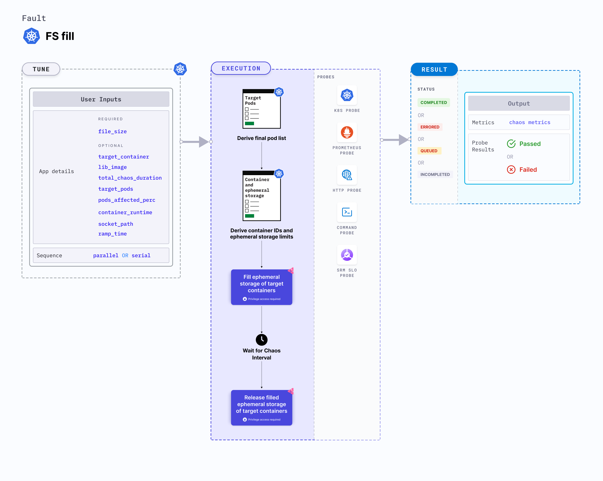

FS fill is a Kubernetes pod-level chaos fault that applies FS stress by filling the pod's ephemeral storage. This fault evicts the application pod if its capacity exceeds the pod's ephemeral storage limit.



## Use cases
FS fill:
- Tests the ephemeral storage limits and ensures that the parameters are sufficient.
- Determines the resilience of the application to unexpected storage exhaustion.
- Evaluates the application's resilience to FS stress or replica evictions.
- Verifies file system performance, and thin-provisioning support.
- Verifies space reclamation (UNMAP) capabilities on storage.

### Permissions required

Below is a sample Kubernetes role that defines the permissions required to execute the fault.

```
apiVersion: rbac.authorization.k8s.io/v1
kind: Role
metadata:
  namespace: hce
  name: fs-fill
spec:
  definition:
    scope: Cluster # Supports "Namespaced" mode too
permissions:
  - apiGroups: [""]
    resources: ["pods"]
    verbs: ["create", "delete", "get", "list", "patch", "deletecollection", "update"]
  - apiGroups: [""]
    resources: ["events"]
    verbs: ["create", "get", "list", "patch", "update"]
  - apiGroups: [""]
    resources: ["pods/log"]
    verbs: ["get", "list", "watch"]
  - apiGroups: [""]
    resources: ["deployments, statefulsets"]
    verbs: ["get", "list"]
  - apiGroups: [""]
    resources: ["replicasets, daemonsets"]
    verbs: ["get", "list"]
  - apiGroups: [""]
    resources: ["chaosEngines", "chaosExperiments", "chaosResults"]
    verbs: ["create", "delete", "get", "list", "patch", "update"]
  - apiGroups: ["batch"]
    resources: ["jobs"]
    verbs: ["create", "delete", "get", "list", "deletecollection"]
```

### Prerequisites
- Kubernetes > 1.16
- The application pods should be in the running before and after injecting chaos.

### Mandatory tunables

   <table>
      <tr>
        <th> Tunable </th>
        <th> Description </th>
        <th> Notes </th>
      </tr>
      <tr>
        <td> FILL_SIZE </td>
        <td> File system space to be filled in bytes. Specify in bytes (without unit), kilobytes (k/K/KB), megabytes (m/M/MB), gigabytes (g/G/GB). Example: <code>100M</code>, <code>1G</code>, etc </td>
        <td> For more information, go to <a href="#fs-fill">fill size</a></td>
      </tr>
      <tr>
        <td> FILE_PATH </td>
        <td> Container path to be filled </td>
        <td> For more information, go to <a href="#fs-fill">file path</a></td>
      </tr>
    </table>

### Optional tunables
   <table>
      <tr>
        <th> Tunable </th>
        <th> Description </th>
        <th> Notes </th>
      </tr>
      <tr>
        <td> TARGET_CONTAINER </td>
        <td> Name of the container subject to FS fill </td>
        <td> If it is not provided, the first container in the target pod will be subject to chaos. For more information, go to <a href="/docs/chaos-engineering/use-harness-ce/chaos-faults/kubernetes/pod/container-kill/#kill-specific-container">kill specific container</a></td>
      </tr>
      <tr>
        <td> LIB_IMAGE </td>
        <td> Image used to run the chaos command </td>
        <td> Default: <code>harness/chaos-go-runner:main-latest</code>. For more information, go to <a href = "/docs/chaos-engineering/use-harness-ce/chaos-faults/common-tunables-for-all-faults#image-used-by-the-helper-pod">image used by the helper pod.</a></td>
      </tr>
      <tr>
        <td> TOTAL_CHAOS_DURATION </td>
        <td> Duration for which to insert chaos (in seconds). </td>
        <td> Default: 60 s. For more information, go to <a href="/docs/chaos-engineering/use-harness-ce/chaos-faults/common-tunables-for-all-faults#duration-of-the-chaos">duration of the chaos</a></td>
      </tr>
      <tr>
        <td> TARGET_PODS </td>
        <td> Comma-separated list of application pod names subject to FS fill chaos. </td>
        <td> If not provided, the fault selects the target pods randomly based on provided appLabels. For more information, go to <a href="/docs/chaos-engineering/use-harness-ce/chaos-faults/kubernetes/pod/common-tunables-for-pod-faults#target-specific-pods">target specific pods</a></td>
      </tr>
      <tr>
        <td> PODS_AFFECTED_PERC </td>
        <td> Percentage of total pods to target. Provide numeric values. </td>
        <td> Default: 0 (corresponds to 1 replica). For more information, go to <a href="/docs/chaos-engineering/use-harness-ce/chaos-faults/kubernetes/pod/common-tunables-for-pod-faults#pod-affected-percentage">pod affected percentage</a></td>
      </tr>
      <tr>
        <td> CONTAINER_RUNTIME </td>
        <td> Container runtime interface for the cluster. </td>
        <td> Default: containerd. Supports docker, containerd and crio. For more information, go to <a href="#container-runtime-and-socket-path">container runtime </a> </td>
      </tr>
      <tr>
        <td> SOCKET_PATH </td>
        <td> Path to the containerd/crio/docker socket file. </td>
        <td> Default: <code>/run/containerd/containerd.sock</code>. For more information, go to <a href="#container-runtime-and-socket-path">socket path </a></td>
      </tr>
      <tr>
        <td> RAMP_TIME </td>
        <td> Period to wait before injecting chaos (in seconds). </td>
        <td> For example, 30 s. For more information, go to <a href="/docs/chaos-engineering/use-harness-ce/chaos-faults/common-tunables-for-all-faults#ramp-time">ramp time</a></td>
      </tr>
      <tr>
        <td> SEQUENCE </td>
        <td> Sequence of chaos execution for multiple target pods. </td>
        <td> Default: parallel. Supports serial and parallel. For more information, go to <a href="/docs/chaos-engineering/use-harness-ce/chaos-faults/common-tunables-for-all-faults#sequence-of-chaos-execution">sequence of chaos execution</a></td>
      </tr>
    </table>


### FS fill

- `FILL_SIZE`: Size of ephemeral storage to be filled inside the target pod. Specify in bytes (without unit), kilobytes (k/K/KB), megabytes (m/M/MB), gigabytes (g/G/GB). Example: `100M`, `1G`, etc.
- `FILE_PATH`: Container path to be filled. It should be a valid directory path inside the target container.

The following YAML snippet illustrates the use of this environment variable:

[embedmd]: # "./static/manifests/fs-fill/fs-fill.yaml yaml"

```yaml
apiVersion: litmuschaos.io/v1alpha1
kind: ChaosEngine
metadata:
  name: engine-nginx
spec:
  engineState: "active"
  annotationCheck: "false"
  appinfo:
    appns: "default"
    applabel: "app=nginx"
    appkind: "deployment"
  chaosServiceAccount: litmus-admin
  experiments:
    - name: fs-fill
      spec:
        components:
          env:
            # space to be filled in bytes
            # or specify the size in K, KB, M, MB, G, GB
            - name: FILL_SIZE
              value: "500M"
            # container path to be filled
            - name: FILE_PATH
              value: "/tmp"
            - name: TOTAL_CHAOS_DURATION
              VALUE: "60"
```

### Container runtime and socket path

The `CONTAINER_RUNTIME` and `SOCKET_PATH` environment variables set the container runtime and socket file path, respectively.

- `CONTAINER_RUNTIME`: It supports `docker`, `containerd`, and `crio` runtimes. The default value is `containerd`.
- `SOCKET_PATH`: It contains path of containerd socket file by default(`/run/containerd/containerd.sock`). For `docker`, specify path as `/var/run/docker.sock`. For `crio`, specify path as `/var/run/crio/crio.sock`.

The following YAML snippet illustrates the use of these environment variables:

[embedmd]: # "./static/manifests/fs-fill/container-runtime-and-socket-path.yaml yaml"

```yaml
## provide the container runtime and socket file path
apiVersion: litmuschaos.io/v1alpha1
kind: ChaosEngine
metadata:
  name: engine-nginx
spec:
  engineState: "active"
  annotationCheck: "false"
  appinfo:
    appns: "default"
    applabel: "app=nginx"
    appkind: "deployment"
  chaosServiceAccount: litmus-admin
  experiments:
    - name: fs-fill
      spec:
        components:
          env:
            # runtime for the container
            # supports docker, containerd, crio
            - name: CONTAINER_RUNTIME
              value: "containerd"
            # path of the socket file
            - name: SOCKET_PATH
              value: "/run/containerd/containerd.sock"
            - name: FILL_SIZE
              value: "500M"
            - name: FILE_PATH
              value: "/tmp"

```
