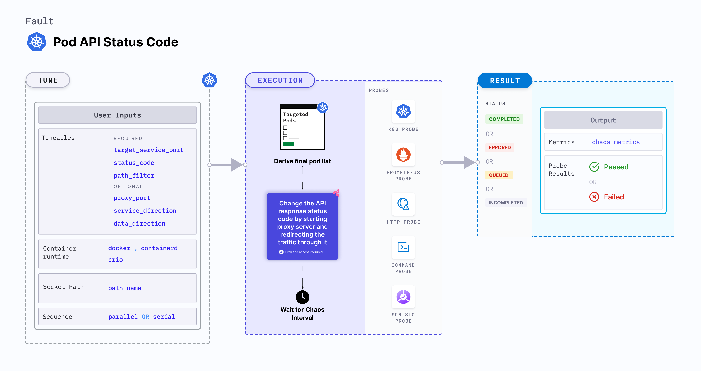

import CommonNote from './shared/common-note.md'
import ConfTLS from './shared/configure-tls.md'

Pod API status code is a Kubernetes pod-level chaos fault that change the API response status code and optionally api response body through path filtering. This is achieved by starting the proxy server and redirecting the traffic through the proxy server.

<CommonNote />



## Use cases
Pod API status code:
- It can be used to test the error handling capabilities of API and client applications. By changing the API response status code to different error codes, such as 400 (Bad Request) or 500 (Internal Server Error), you can evaluate how well your application handles and responds to various error scenarios.
- Simulates situations where the API may be temporarily unavailable or rate-limited by returning temporary error codes like 503 (Service Unavailable) or 429 (Too Many Requests).
- It can be used for content filtering, by selectively filter or block certain responses. For example, you can change the status code to 404 (Not Found) for specific paths or patterns, indicating that the requested resource does not exist.

### Permissions required

Below is a sample Kubernetes role that defines the permissions required to execute the fault.

```
apiVersion: rbac.authorization.k8s.io/v1
kind: Role
metadata:
  namespace: hce
  name: pod-api-status-code
spec:
  definition:
    scope: Cluster # Supports "Namespaced" mode too
permissions:
  - apiGroups: [""]
    resources: ["pods"]
    verbs: ["create", "delete", "get", "list", "patch", "deletecollection", "update"]
  - apiGroups: [""]
    resources: ["events"]
    verbs: ["create", "get", "list", "patch", "update"]
  - apiGroups: [""]
    resources: ["pods/log"]
    verbs: ["get", "list", "watch"]
  - apiGroups: [""]
    resources: ["deployments, statefulsets"]
    verbs: ["get", "list"]
  - apiGroups: [""]
    resources: ["replicasets, daemonsets"]
    verbs: ["get", "list"]
  - apiGroups: [""]
    resources: ["chaosEngines", "chaosExperiments", "chaosResults"]
    verbs: ["create", "delete", "get", "list", "patch", "update"]
  - apiGroups: ["batch"]
    resources: ["jobs"]
    verbs: ["create", "delete", "get", "list", "deletecollection"]
```

### Prerequisites
- Kubernetes> 1.17
- The application pods should be in the running state before and after injecting chaos.

### Mandatory tunables

   <table>
      <tr>
        <th> Tunable </th>
        <th> Description </th>
        <th> Notes </th>
      </tr>
      <tr>
        <td> TARGET_CONTAINER </td>
        <td> Name of the container subject to changes in the API status code. </td>
        <td> None. For more information, go to <a href="/docs/chaos-engineering/use-harness-ce/chaos-faults/kubernetes/pod/common-tunables-for-pod-faults#target-specific-container">target specific container</a></td>
      </tr>
      <tr>
        <td> NODE_LABEL </td>
        <td> Node label used to filter the target node if <code>TARGET_NODE</code> environment variable is not set. </td>
        <td> It is mutually exclusive with the <code>TARGET_NODE</code> environment variable. If both are provided, the fault uses <code>TARGET_NODE</code>. For more information, go to <a href="/docs/chaos-engineering/use-harness-ce/chaos-faults/kubernetes/node/common-tunables-for-node-faults#target-nodes-with-labels">node label.</a></td>
      </tr>
      <tr>
        <td> TARGET_SERVICE_PORT </td>
        <td> Port of the target service.</td>
        <td> Defaults to port 80. For more information, go to <a href="#target-service-port">target service port</a>.</td>
      </tr>
      <tr>
        <td> STATUS_CODE </td>
        <td> Modified status code for the API response. </td>
        <td> For more information, go to <a href="#status-code">status code </a>. </td>
      </tr>
    </table>

### Optional tunables
  <table>
      <tr>
        <th> Tunable </th>
        <th> Description </th>
        <th> Notes </th>
      </tr>
      <tr>
        <td> PATH_FILTER </td>
        <td> API path or route used for the filtering. </td>
        <td> Targets all paths if not provided. For more information, go to <a href="#path-filter">path filter </a>.</td>
      </tr>
      <tr>
        <td> HEADERS_FILTERS </td>
        <td> Filters for HTTP request headers accept multiple comma-separated headers in the format <code>key1:value1,key2:value2</code>. </td>
        <td> For more information, go to <a href="#advanced-filters">header filters</a>.</td>
      </tr>
      <tr>
        <td> METHODS </td>
        <td> The HTTP request method type accepts comma-separated HTTP methods in upper cases, such as "GET,POST". </td>
        <td> For more information, go to <a href="#advanced-filters">methods</a>.</td>
      </tr>
      <tr>
        <td> QUERY_PARAMS </td>
        <td> HTTP request query parameter filters accept multiple comma-separated query parameters in the format of <code>param1:value1,param2:value2</code>. </td>
        <td> For more information, go to <a href="#advanced-filters">query params</a>.</td>
      </tr>
<tr>
        <td> SOURCE_HOSTS </td>
        <td> Includes comma-separated source host names as filters, indicating the origin of the HTTP request. This is specifically relevant to the "ingress" type. </td>
        <td> For more information, go to <a href="#advanced-filters">source hosts</a>.</td>
      </tr>
      <tr>
        <td> SOURCE_IPS </td>
        <td> This includes comma-separated source IPs as filters, indicating the origin of the HTTP request. This is specifically relevant to the "ingress" type. </td>
        <td> For more information, go to <a href="#advanced-filters">source ips</a>.</td>
      </tr>
      <tr>
        <td> DESTINATION_HOSTS </td>
        <td> Comma-separated destination host names are used as filters, indicating the hosts on which you call the API. This specification applies exclusively to the "egress" type. </td>
        <td> For more information, go to <a href="#advanced-filters">destination hosts</a>.</td>
      </tr>
      <tr>
        <td> DESTINATION_IPS </td>
        <td> Comma-separated destination IPs are used as filters, indicating the hosts on which you call the API. This specification applies exclusively to the "egress" type. </td>
        <td> For more information, go to <a href="#advanced-filters">destination hosts</a>.</td>
      </tr>
      <tr>
        <td> RESPONSE_BODY </td>
        <td> String body to overwrite the HTTP response body. If not provided it will return the original response body </td>
        <td> Default: empty body. For more information, go to <a href="#advanced-fault-tunables"> response body</a>.</td>
      </tr>
      <tr>
        <td> LIB_IMAGE </td>
        <td> Image used to inject chaos. </td>
        <td> Default: <code>harness/chaos-go-runner:main-latest</code>. For more information, go to <a href = "/docs/chaos-engineering/use-harness-ce/chaos-faults/common-tunables-for-all-faults#image-used-by-the-helper-pod">image used by the helper pod.</a></td>
      </tr>
      <tr>
        <td> PROXY_PORT </td>
        <td> Port where the proxy listens for requests.</td>
        <td> Default: 20000. For more information, go to <a href="#advanced-fault-tunables">proxy port</a>.</td>
      </tr>
      <tr>
        <td> SERVICE_DIRECTION </td>
        <td> Direction of the flow of control, ingress or egress </td>
        <td> Default: `ingress`. For more information, go to <a href="#advanced-fault-tunables">service direction </a>.</td>
      </tr>
      <tr>
        <td> DATA_DIRECTION </td>
        <td> API payload type, request or response </td>
        <td> Default: `both`. For more information, go to <a href="#advanced-fault-tunables">data direction </a>.</td>
      </tr>
      <tr>
        <td> DESTINATION_PORTS </td>
        <td> comma-separated list of the destination service or host ports for which `egress` traffic should be affected </td>
        <td> Default: 80,443. For more information, go to <a href="#destination-ports">destination ports</a></td>
      </tr>
      <tr>
        <td> HTTPS_ENABLED </td>
        <td> facilitate HTTPS support for both incoming and outgoing traffic </td>
        <td> Default: false. For more information, go to <a href="#https">HTTPS</a></td>
      </tr>
      <tr>
        <td> CA_CERTIFICATES </td>
        <td> These CA certificates are used by the proxy server to generate the server certificates for the TLS handshake between the target application and the proxy server. </td>
        <td> These CA certificates must also be added to the target application's root certificate. For more information, go to <a href="/docs/chaos-engineering/use-harness-ce/chaos-faults/kubernetes/pod/pod-api-status-code#using-self-signed-certificates">CA certificates.</a></td>
        </tr>
      <tr>
        <td> SERVER_CERTIFICATES </td>
        <td> These server certificates are used by the proxy server for the TLS handshake between the target application and the proxy server. </td>
        <td> The corresponding CA certificates should be loaded as root certificates inside the target application. For more information, go to <a href="/docs/chaos-engineering/use-harness-ce/chaos-faults/kubernetes/pod/pod-api-status-code#using-self-signed-certificates">server certificates.</a></td>
      </tr>
      <tr>
        <td> HTTPS_ROOT_CERT_PATH </td>
        <td> Provide the root CA certificate directory path </td>
        <td> This setting must be configured if the root CA certificate directory differs from /etc/ssl/certs. Please refer to https://go.dev/src/crypto/x509/root_linux.go to understand the default certificate directory based on various Linux distributions. For more information, go to <a href="#https">HTTPS</a></td>
      </tr>
      <tr>
        <td> HTTPS_ROOT_CERT_FILE_NAME </td>
        <td> Provide the root CA certificate file name </td>
        <td> This setting must be configured if the root CA certificate file name differs from ca-certificates.crt. Please refer to https://go.dev/src/crypto/x509/root_linux.go to understand the default certificate file names based on various Linux distributions. For more information, go to <a href="#https">HTTPS</a></td>
      </tr>
      <tr>
        <td> NETWORK_INTERFACE </td>
        <td> Network interface used for the proxy.</td>
        <td> Default: `eth0`. For more information, go to <a href="#advanced-fault-tunables">network interface </a>.</td>
      </tr>
      <tr>
        <td> CONTAINER_RUNTIME </td>
        <td> Container runtime interface for the cluster</td>
        <td> Default: containerd. Support values: docker, containerd and crio. For more information, go to <a href="#container-runtime-and-socket-path">container runtime </a>. </td>
      </tr>
      <tr>
        <td> SOCKET_PATH </td>
        <td> Path of the containerd or crio or docker socket file. </td>
        <td> Default: <code>/run/containerd/containerd.sock</code>. For more information, go to <a href="/docs/chaos-engineering/use-harness-ce/chaos-faults/kubernetes/pod/pod-api-modify-body#container-runtime-and-socket-path">socket path </a>.</td>
      </tr>
      <tr>
        <td> TOTAL_CHAOS_DURATION </td>
        <td> Duration of chaos injection (in seconds). </td>
        <td> Default: 60 s. For more information, go to <a href="/docs/chaos-engineering/use-harness-ce/chaos-faults/common-tunables-for-all-faults#duration-of-the-chaos">duration of the chaos </a>.</td>
      </tr>
      <tr>
        <td> TARGET_PODS </td>
        <td> Comma-separated list of application pod names subject to pod HTTP modify body.</td>
        <td> If not provided, the fault selects target pods randomly based on provided appLabels. For more information, go to <a href="/docs/chaos-engineering/use-harness-ce/chaos-faults/kubernetes/pod/common-tunables-for-pod-faults#target-specific-pods"> target specific pods</a>.</td>
      </tr>
      <tr>
        <td> PODS_AFFECTED_PERC </td>
        <td> Percentage of total pods to target. Provide numeric values. </td>
        <td> Default: 0 (corresponds to 1 replica). For more information, go to <a href="/docs/chaos-engineering/use-harness-ce/chaos-faults/kubernetes/pod/common-tunables-for-pod-faults#pod-affected-percentage">pod affected percentage </a>.</td>
      </tr>
      <tr>
        <td> RAMP_TIME </td>
        <td> Period to wait before and after injecting chaos (in seconds). </td>
        <td> For example, 30 s. For more information, go to <a href="/docs/chaos-engineering/use-harness-ce/chaos-faults/common-tunables-for-all-faults#ramp-time">ramp time</a>.</td>
      </tr>
      <tr>
        <td> SEQUENCE </td>
        <td> Sequence of chaos execution for multiple target pods. </td>
        <td> Default: parallel. Supports serial and parallel. For more information, go to <a href="/docs/chaos-engineering/use-harness-ce/chaos-faults/common-tunables-for-all-faults#sequence-of-chaos-execution">sequence of chaos execution</a>.</td>
      </tr>
    </table>

### Target service port

Port of the targeted service. Tune it by using the `TARGET_SERVICE_PORT` environment variable.

The following YAML snippet illustrates the use of this environment variable:

[embedmd]: # "./static/manifests/pod-api-status-code/target-service-port.yaml yaml"

```yaml
## provide the port of the targeted service
apiVersion: litmuschaos.io/v1alpha1
kind: ChaosEngine
metadata:
  name: engine-nginx
spec:
  engineState: "active"
  annotationCheck: "false"
  appinfo:
    appns: "default"
    applabel: "app=nginx"
    appkind: "deployment"
  chaosServiceAccount: litmus-admin
  experiments:
    - name: pod-api-status-code
      spec:
        components:
          env:
            # provide the port of the targeted service
            - name: TARGET_SERVICE_PORT
              value: "80"
            # provide the status code
            - name: STATUS_CODE
              value: "500"
            - name: PATH_FILTER
              value: '/status'
```

### Status code

Status code to be modified for the HTTP response. Tune it by using the `STATUS_CODE` environment variable.

The following YAML snippet illustrates the use of this environment variable:

[embedmd]: # "./static/manifests/pod-api-status-code/status-code.yaml yaml"

```yaml
## modified status code for the http response
apiVersion: litmuschaos.io/v1alpha1
kind: ChaosEngine
metadata:
  name: engine-nginx
spec:
  engineState: "active"
  annotationCheck: "false"
  appinfo:
    appns: "default"
    applabel: "app=nginx"
    appkind: "deployment"
  chaosServiceAccount: litmus-admin
  experiments:
    - name: pod-api-status-code
      spec:
        components:
          env:
            # modified status code for the http response
            - name: STATUS_CODE
              value: "500"
            # provide the port of the targeted service
            - name: TARGET_SERVICE_PORT
              value: "80"
            - name: PATH_FILTER
              value: '/status'
```

### Path filter

API sub path (or route) to filter the API calls. Tune it by using the `PATH_FILTER` environment variable.

The following YAML snippet illustrates the use of this environment variable:

[embedmd]: # "./static/manifests/pod-api-status-code/path-filter.yaml yaml"

```yaml
## provide api path filter
apiVersion: litmuschaos.io/v1alpha1
kind: ChaosEngine
metadata:
  name: engine-nginx
spec:
  engineState: "active"
  annotationCheck: "false"
  appinfo:
    appns: "default"
    applabel: "app=nginx"
    appkind: "deployment"
  chaosServiceAccount: litmus-admin
  experiments:
    - name: pod-api-status-code
      spec:
        components:
          env:
            # provide the api path filter
            - name: PATH_FILTER
              value: '/status'
            # provide the status code
            - name: STATUS_CODE
              value: "500"
            # provide the port of the targeted service
            - name: TARGET_SERVICE_PORT
              value: "80"
```

### Destination ports

A comma-separated list of the destination service or host ports for which `egress` traffic should be affected as a result of chaos testing on the target application. Tune it by using the `DESTINATION_PORTS` environment variable.

:::note
It is applicable only for the egress `SERVICE_DIRECTION`.
:::

The following YAML snippet illustrates the use of this environment variable:

[embedmd]: # "./static/manifests/pod-api-status-code/destination-ports.yaml yaml"

```yaml
## provide destination ports
apiVersion: litmuschaos.io/v1alpha1
kind: ChaosEngine
metadata:
  name: engine-nginx
spec:
  engineState: "active"
  annotationCheck: "false"
  appinfo:
    appns: "default"
    applabel: "app=nginx"
    appkind: "deployment"
  chaosServiceAccount: litmus-admin
  experiments:
    - name: pod-api-status-code
      spec:
        components:
          env:
            # provide destination ports
            - name: DESTINATION_PORTS
              value: '80,443'
            # provide the api path filter
            - name: PATH_FILTER
              value: '/status'
            # provide the status code
            - name: STATUS_CODE
              value: "500"
            # provide the port of the targeted service
            - name: TARGET_SERVICE_PORT
              value: "80"
```

### HTTPS

To enable HTTPS support for both incoming and outgoing traffic between the target and the proxy, set the `HTTPS_ENABLED` field to `true`. The next step is to configure TLS, for which you can follow one of the ways: **Using self-signed certificate** or **using trusted certificate**.

<ConfTLS />

### Advanced fault tunables

- `PROXY_PORT`: Port where the proxy listens for requests and responses.
- `SERVICE_DIRECTION`: Direction of the flow of control, either ingress or egress. It supports `ingress`, `egress` values.
- `DATA_DIRECTION`: API payload type, request, or response. It supports `request`, `response`, and `both` values.
- `NETWORK_INTERFACE`: Network interface used for the proxy.
- `RESPONSE_BODY`: It can be used to override the response body. It should be provided in `/<regex>/<replacement>` format. If not provided, it will return the original response body.

The following YAML snippet illustrates the use of this environment variable:

[embedmd]:# (./static/manifests/pod-api-status-code/advanced-fault-tunables.yaml yaml)
```yaml
# it injects the api modify body fault
apiVersion: litmuschaos.io/v1alpha1
kind: ChaosEngine
metadata:
  name: engine-nginx
spec:
  engineState: "active"
  annotationCheck: "false"
  appinfo:
    appns: "default"
    applabel: "app=nginx"
    appkind: "deployment"
  chaosServiceAccount: litmus-admin
  experiments:
    - name: pod-api-status-code
      spec:
        components:
          env:
            # provide the proxy port
            - name: PROXY_PORT
              value: '20000'
            # provide the connection type
            - name: SERVICE_DIRECTION
              value: 'ingress'
            # provide the payload type
            - name: DATA_DIRECTION
              value: 'both'
            # provide the network interface
            - name: NETWORK_INTERFACE
              value: 'eth0'
            # provide the api path filter
            - name: PATH_FILTER
              value: '/status'
            # provide the port of the targeted service
            - name: TARGET_SERVICE_PORT
              value: "80"
            - name: STATUS_CODE
              value: "500"
            - name: RESPONSE_BODY
              value: '/.+/test'

```

### Advanced filters

- `HEADERS_FILTERS`: The HTTP request headers filters, that accept multiple comma-separated headers in the format of `key1:value1,key2:value2`.
- `METHODS`: The HTTP request method type filters, that accept comma-separated HTTP methods in upper case, that is, `GET,POST`.
- `QUERY_PARAMS`: The HTTP request query parameters filter, accepts multiple comma-separated query parameters in the format of `param1:value1,param2:value2`.
- `SOURCE_HOSTS`: Comma-separated source host names filters, indicating the origin of the HTTP request. This is relevant to the `ingress` type, specified by `SERVICE_DIRECTION` environment variable.
- `SOURCE_IPS`: Comma-separated source IPs filters, indicating the origin of the HTTP request. This is specifically relevant to the `ingress` type, specified by `SERVICE_DIRECTION` environment variable.
- `DESTINATION_HOSTS`: Comma-separated destination host names filters, indicating the hosts on which you call the API. This specification applies exclusively to the `egress` type, specified by `SERVICE_DIRECTION` environment variable.
- `DESTINATION_IPS`: Comma-separated destination IPs filters, indicating the hosts on which you call the API. This specification applies exclusively to the `egress` type, specified by `SERVICE_DIRECTION` environment variable.

The following YAML snippet illustrates the use of this environment variable:

[embedmd]:# (./static/manifests/pod-api-status-code/advanced-filters.yaml yaml)
```yaml
# it injects the api status code fault
apiVersion: litmuschaos.io/v1alpha1
kind: ChaosEngine
metadata:
  name: engine-nginx
spec:
  engineState: "active"
  annotationCheck: "false"
  appinfo:
    appns: "default"
    applabel: "app=nginx"
    appkind: "deployment"
  chaosServiceAccount: litmus-admin
  experiments:
    - name: pod-api-status-code
      spec:
        components:
          env:
            # provide the headers filters
            - name: HEADERS_FILTERS
              value: 'key1:value1,key2:value2'
            # provide the methods filters
            - name: METHODS
              value: 'GET,POST'
            # provide the query params filters
            - name: QUERY_PARAMS
              value: 'param1:value1,param2:value2'
            # provide the source hosts filters
            - name: SOURCE_HOSTS
              value: 'host1,host2'
            # provide the source ips filters
            - name: SOURCE_IPS
              value: 'ip1,ip2'
            # provide the connection type
            - name: SERVICE_DIRECTION
              value: 'ingress'
            # provide the port of the targeted service
            - name: TARGET_SERVICE_PORT
              value: "80"
            - name: STATUS_CODE
              value: "500"
```

### Container runtime and socket path

The `CONTAINER_RUNTIME` and `SOCKET_PATH` environment variable to set the container runtime and socket file path, respectively.

- `CONTAINER_RUNTIME`: It supports `docker`, `containerd`, and `crio` runtimes. The default value is `containerd`.
- `SOCKET_PATH`: It contains path of containerd socket file by default(`/run/containerd/containerd.sock`). For `docker`, specify path as `/var/run/docker.sock`. For `crio`, specify path as `/var/run/crio/crio.sock`.

The following YAML snippet illustrates the use of these environment variables:

[embedmd]: # "./static/manifests/pod-api-status-code/container-runtime-and-socket-path.yaml yaml"

```yaml
## provide the container runtime and socket file path
apiVersion: litmuschaos.io/v1alpha1
kind: ChaosEngine
metadata:
  name: engine-nginx
spec:
  engineState: "active"
  annotationCheck: "false"
  appinfo:
    appns: "default"
    applabel: "app=nginx"
    appkind: "deployment"
  chaosServiceAccount: litmus-admin
  experiments:
    - name: pod-api-status-code
      spec:
        components:
          env:
            # runtime for the container
            # supports docker, containerd, crio
            - name: CONTAINER_RUNTIME
              value: "containerd"
            # path of the socket file
            - name: SOCKET_PATH
              value: "/run/containerd/containerd.sock"
            # provide the port of the targeted service
            - name: TARGET_SERVICE_PORT
              value: "80"
            # provide the api path filter
            - name: PATH_FILTER
              value: '/status'
            - name: STATUS_CODE
              value: "500"
```
