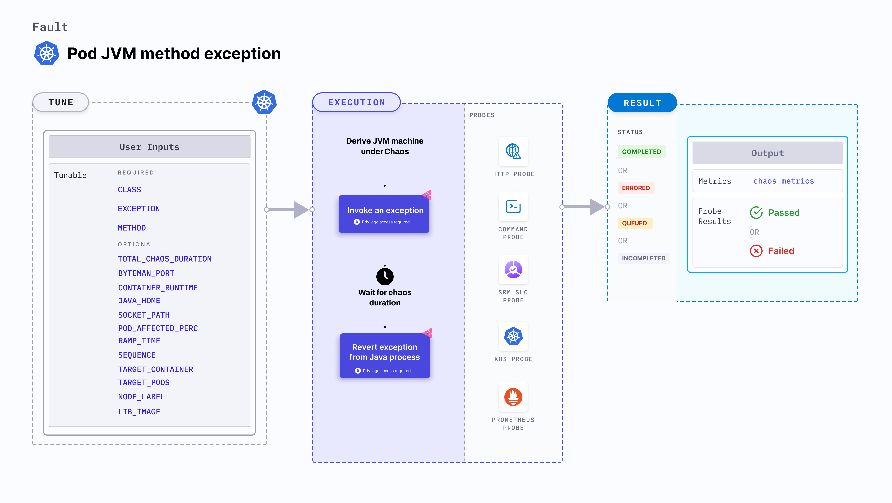

Pod JVM method exception injects chaos into a Java application executing in a Kubernetes pod by invoking an exception.

:::tip
JVM chaos faults use the [Byteman utility](https://byteman.jboss.org/) to inject chaos faults into the JVM.
:::



## Use cases
Pod JVM method exception:
- Determines the performance and resilience of an application (or service) on encountering exceptions.
- Determines how efficiently an application recovers the services.

### Mandatory tunables
<table>
  <tr>
    <th> Tunable </th>
    <th> Description </th>
    <th> Notes </th>
  </tr>
  <tr>
    <td> CLASS </td>
    <td> Specify as <b>packageName.className</b> that specifies the class in which you define the exception. </td>
    <td> For example, <code>org.framework.appName.system.WelcomeController</code>. For more information, go to <a href= "#class-name">class name.</a></td>
  </tr>
  <tr>
    <td> EXCEPTION </td>
    <td> The exception you want to throw to the Java application. </td>
    <td> For example, <code>NullPointerException("Something went wrong!")</code>. For more information, go to <a href= "#exception">exception name.</a></td>
  </tr>
  <tr>
    <td> METHOD </td>
    <td> The method to which exception is applied. </td>
    <td> For example, <code>Welcome</code>. For more information, go to <a href= "#method ">method name.</a></td>
  </tr>
</table>

### Optional tunables
<table>
  <tr>
    <th> Tunable </th>
    <th> Description </th>
    <th> Notes </th>
  </tr>
  <tr>
    <td> TOTAL_CHAOS_DURATION </td>
    <td> Duration through which chaos is injected into the target resource. Should be provided in <code>[numeric-hours]h[numeric-minutes]m[numeric-seconds]s</code> format. </td>
    <td> Default: <code>30s</code>. Examples: <code>1m25s</code>, <code>1h3m2s</code>, <code>1h3s</code>. For more information, go to <a href="/docs/chaos-engineering/use-harness-ce/chaos-faults/common-tunables-for-all-faults/#duration-of-the-chaos"> duration of the chaos.</a></td>
  </tr>
  <tr>
    <td> POD_AFFECTED_PERC </td>
    <td> Percentage of total pods to target. Provide numeric values. </td>
    <td> Default: 0 (corresponds to 1 replica). For more information, go to <a href="/docs/chaos-engineering/chaos-faults/kubernetes/pod/common-tunables-for-pod-faults#pod-affected-percentage">pods affected percentage </a> </td>
    </tr>
  <tr>
    <td> JAVA_HOME </td>
    <td> Path to the Java installation directory. </td>
    <td> For example, /tmp/dir/jdk. </td>
  </tr>
  <tr>
    <td> BYTEMAN_PORT </td>
    <td> Port used by the Byteman agent. </td>
    <td> Default: <code>9091</code>. </td>
  </tr>
  <tr>
    <td> CONTAINER_RUNTIME </td>
    <td> Container runtime interface for the cluster</td>
    <td> Default: containerd. Support values: docker, containerd and crio. For more information, go to <a href="/docs/chaos-engineering/use-harness-ce/chaos-faults/kubernetes/pod/pod-api-modify-body#container-runtime-and-socket-path">container runtime</a>.</td>
    </tr>
    <tr>
    <td> SOCKET_PATH </td>
    <td> Path of the containerd or crio or docker socket file. </td>
    <td> Default: <code>/run/containerd/containerd.sock</code>. For more information, go to <a href="/docs/chaos-engineering/use-harness-ce/chaos-faults/kubernetes/pod/pod-api-modify-body#container-runtime-and-socket-path">socket path</a>.</td>
    </tr>
  <tr>
    <td> RAMP_TIME </td>
    <td> Period to wait before and after injecting chaos. Should be provided in <code>[numeric-hours]h[numeric-minutes]m[numeric-seconds]s</code> format. </td>
    <td> Default: <code>0s</code>. Examples: <code>1m25s</code>, <code>1h3m2s</code>, <code>1h3s</code>. For more information, go to <a href= "/docs/chaos-engineering/use-harness-ce/chaos-faults/common-tunables-for-all-faults#ramp-time">ramp time.</a></td>
  </tr>
  <tr>
    <td> SEQUENCE </td>
    <td> Sequence of chaos execution for multiple target pods. </td>
    <td> Default: parallel. Supports serial and parallel. For more information, go to <a href="/docs/chaos-engineering/use-harness-ce/chaos-faults/common-tunables-for-all-faults#sequence-of-chaos-execution">sequence of chaos execution</a>.</td>
    </tr>
  <tr>
    <td> TARGET_CONTAINER </td>
    <td> Name of the container subject to API header modification. </td>
    <td> None. For more information, go to <a href="/docs/chaos-engineering/use-harness-ce/chaos-faults/kubernetes/pod/common-tunables-for-pod-faults#target-specific-container">target specific container</a></td>
    </tr>
  <tr>
    <td> TARGET_PODS </td>
    <td> Comma-separated list of application pod names subject to pod HTTP modify body.</td>
    <td> If not provided, the fault selects target pods randomly based on provided appLabels. For more information, go to <a href="/docs/chaos-engineering/use-harness-ce/chaos-faults/kubernetes/pod/common-tunables-for-pod-faults#target-specific-pods"> target specific pods</a>.</td>
    </tr>
  <tr>
    <td> NODE_LABEL </td>
    <td> Node label used to filter the target node if <code>TARGET_NODE</code> environment variable is not set. </td>
    <td> It is mutually exclusive with the <code>TARGET_NODE</code> environment variable. If both are provided, the fault uses <code>TARGET_NODE</code>. For more information, go to <a href="/docs/chaos-engineering/use-harness-ce/chaos-faults/kubernetes/node/common-tunables-for-node-faults#target-nodes-with-labels">node label.</a></td>
    </tr>
  <tr>
    <td> LIB_IMAGE </td>
    <td> Image used to inject chaos. </td>
    <td> Default: <code>harness/chaos-go-runner:main-latest</code>. For more information, go to <a href = "/docs/chaos-engineering/use-harness-ce/chaos-faults/common-tunables-for-all-faults#image-used-by-the-helper-pod">image used by the helper pod.</a></td>
    </tr>
</table>

### Parameters

The following YAML snippet illustrates the use of these tunables.

[embedmd]:# (./static/manifests/pod-jvm-method-exception/params.yaml yaml)
```yaml
apiVersion: litmuschaos.io/v1alpha1
kind: KubernetesChaosExperiment
metadata:
  name: pod-jvm-method-exception
  namespace: hce
          env:
            - name: TOTAL_CHAOS_DURATION
              value: "60"
            - name: POD_AFFECTED_PERCENTAGE
              value: ""
            - name: BYTEMAN_PORT
              value: "9091"
            - name: JAVA_HOME
              value: ""
            - name: METHOD  #mandatory
              value: "welcome"
            - name: CLASS   #mandatory
              value: org.framework.appName.system.WelcomeController
            - name: EXCEPTION  #mandatory
              value: "NullPointerException("Something went wrong!")"
            - name: CONTAINER_RUNTIME
              value: containerd
            - name: SOCKET_PATH
              value: /run/containerd/containerd.sock
            - name: LIB_IMAGE
              value: docker.io/harness/chaos-ddcr-faults:1.49.2
            - name: RAMP_TIME
              value: ""
            - name: SEQUENCE
              value: parallel
            - name: TARGET_CONTAINER
              value: ""
            - name: TARGET_PODS
              value: ""
            - name: NODE_LABEL
              value: ""
```

