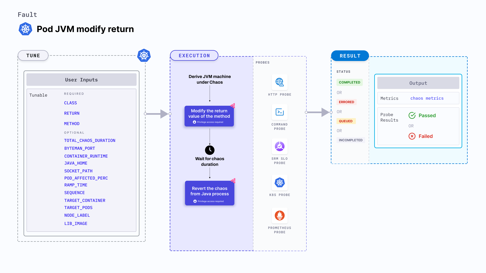

Pod JVM modify return modifies the return value of a method in a Java application executing on a Kubernetes pod, for a specific duration.

:::tip
JVM chaos faults use the [Byteman utility](https://byteman.jboss.org/) to inject chaos faults into the JVM.
:::



## Use cases
Pod JVM modify return:
- Helps test the functionality of snippets of code by replacing specific portions of the request or response body to simulate different scenarios and validate how your application handles different data variations.
- Helps obscure or redact personally identifiable information (PII), such as email addresses or phone numbers, before logging or transmitting the data for security and privacy compliance.
- Determines how efficiently an application recovers and returns to normalcy.

### Permissions required
Below is a sample Kubernetes role that defines the permissions required to execute the fault.

```yaml
apiVersion: rbac.authorization.k8s.io/v1
kind: Role
metadata:
  namespace: hce
  name: pod-jvm-modify-return
spec:
  definition:
    scope: Namespaced
permissions:
  - apiGroups: [""]
    resources: ["pods"]
    verbs: ["create", "delete", "get", "list", "patch", "deletecollection", "update"]
  - apiGroups: [""]
    resources: ["events"]
    verbs: ["create", "get", "list", "patch", "update"]
  - apiGroups: [""]
    resources: ["pods/log"]
    verbs: ["get", "list", "watch"]
  - apiGroups: [""]
    resources: ["deployments, statefulsets"]
    verbs: ["get", "list"]
  - apiGroups: [""]
    resources: ["chaosEngines", "chaosExperiments", "chaosResults"]
    verbs: ["create", "delete", "get", "list", "patch", "update"]
  - apiGroups: ["batch"]
    resources: ["jobs"]
    verbs: ["create", "delete", "get", "list", "deletecollection"]
```

### Mandatory tunables
<table>
  <tr>
    <th> Tunable </th>
    <th> Description </th>
    <th> Notes </th>
  </tr>
<tr>
    <td> CLASS </td>
    <td> Specify as <b>packageName.className</b> that specifies the class in which you define the target method. </td>
    <td> For example, <code>org.framework.appName.system.WelcomeController</code>. </td>
  </tr>
  <tr>
    <td> METHOD </td>
    <td> The method whose return value is modified. </td>
    <td> For example, <code>Welcome</code>. </td>
  </tr>
  <tr>
    <th> RETURN </th>
    <td> The modified return value of the method. </td>
    <td> For example, <code>"modified string"</code>. </td>
  </tr>
</table>

### Optional tunables
<table>
  <tr>
    <th> Tunable </th>
    <th> Description </th>
    <th> Notes </th>
  </tr>
    <tr>
    <td> TOTAL_CHAOS_DURATION </td>
    <td> Duration through which chaos is injected into the target resource. Should be provided in <code>[numeric-hours]h[numeric-minutes]m[numeric-seconds]s</code> format. </td>
    <td> Default: <code>30s</code>. Examples: <code>1m25s</code>, <code>1h3m2s</code>, <code>1h3s</code>. For more information, go to <a href="/docs/chaos-engineering/use-harness-ce/chaos-faults/common-tunables-for-all-faults/#duration-of-the-chaos"> duration of the chaos.</a></td>
  </tr>
  <tr>
    <td> POD_AFFECTED_PERC </td>
    <td> Percentage of total pods to target. Provide numeric values. </td>
    <td> Default: 0 (corresponds to 1 replica). For more information, go to <a href="/docs/chaos-engineering/use-harness-ce/chaos-faults/kubernetes/pod/common-tunables-for-pod-faults#pod-affected-percentage">pods affected percentage </a> </td>
    </tr>
  <tr>
    <td> JAVA_HOME </td>
    <td> Path to the Java installation directory. </td>
    <td> For example, /tmp/dir/jdk. </td>
  </tr>
  <tr>
    <td> BYTEMAN_PORT </td>
    <td> Port used by the Byteman agent. </td>
    <td> Default: <code>9091</code>. </td>
  </tr>
  <tr>
    <td> CONTAINER_RUNTIME </td>
    <td> Container runtime interface for the cluster</td>
    <td> Default: containerd. Support values: docker, containerd and crio. For more information, go to <a href="/docs/chaos-engineering/use-harness-ce/chaos-faults/kubernetes/pod/pod-api-modify-body#container-runtime-and-socket-path">container runtime</a>.</td>
    </tr>
    <tr>
    <td> SOCKET_PATH </td>
    <td> Path of the containerd or crio or docker socket file. </td>
    <td> Default: <code>/run/containerd/containerd.sock</code>. For more information, go to <a href="/docs/chaos-engineering/use-harness-ce/chaos-faults/kubernetes/pod/pod-api-modify-body#container-runtime-and-socket-path">socket path</a>.</td>
    </tr>
  <tr>
    <td> RAMP_TIME </td>
    <td> Period to wait before and after injecting chaos. Should be provided in <code>[numeric-hours]h[numeric-minutes]m[numeric-seconds]s</code> format. </td>
    <td> Default: <code>0s</code>. Examples: <code>1m25s</code>, <code>1h3m2s</code>, <code>1h3s</code>. For more information, go to <a href= "/docs/chaos-engineering/use-harness-ce/chaos-faults/common-tunables-for-all-faults#ramp-time">ramp time.</a></td>
  </tr>
  <tr>
    <td> SEQUENCE </td>
    <td> Sequence of chaos execution for multiple target pods. </td>
    <td> Default: parallel. Supports serial and parallel. For more information, go to <a href="/docs/chaos-engineering/use-harness-ce/chaos-faults/common-tunables-for-all-faults#sequence-of-chaos-execution">sequence of chaos execution</a>.</td>
    </tr>
  <tr>
    <td> TARGET_CONTAINER </td>
    <td> Name of the container subject to API header modification. </td>
    <td> None. For more information, go to <a href="/docs/chaos-engineering/use-harness-ce/chaos-faults/kubernetes/pod/common-tunables-for-pod-faults#target-specific-container">target specific container</a></td>
    </tr>
  <tr>
    <td> TARGET_PODS </td>
    <td> Comma-separated list of application pod names subject to pod HTTP modify body.</td>
    <td> If not provided, the fault selects target pods randomly based on provided appLabels. For more information, go to <a href="/docs/chaos-engineering/use-harness-ce/chaos-faults/kubernetes/pod/common-tunables-for-pod-faults#target-specific-pods"> target specific pods</a>.</td>
    </tr>
  <tr>
    <td> NODE_LABEL </td>
    <td> Node label used to filter the target node if <code>TARGET_NODE</code> environment variable is not set. </td>
    <td> It is mutually exclusive with the <code>TARGET_NODE</code> environment variable. If both are provided, the fault uses <code>TARGET_NODE</code>. For more information, go to <a href="/docs/chaos-engineering/use-harness-ce/chaos-faults/kubernetes/node/common-tunables-for-node-faults#target-nodes-with-labels">node label.</a></td>
    </tr>
  <tr>
    <td> LIB_IMAGE </td>
    <td> Image used to inject chaos. </td>
    <td> Default: <code>harness/chaos-go-runner:main-latest</code>. For more information, go to <a href = "/docs/chaos-engineering/use-harness-ce/chaos-faults/common-tunables-for-all-faults#image-used-by-the-helper-pod">image used by the helper pod.</a></td>
    </tr>
</table>

### Parameters

The following YAML snippet illustrates the use of these tunables:

[embedmd]:# (./static/manifests/pod-jvm-modify-return/params.yaml yaml)
```yaml
apiVersion: litmuschaos.io/v1alpha1
kind: KubernetesChaosExperiment
metadata:
  name: pod-jvm-modify-return
  namespace: hce
spec:
  tasks:
     - definition:
        chaos:
          env:
            - name: TOTAL_CHAOS_DURATION
              value: "60"
            - name: POD_AFFECTED_PERCENTAGE
              value: ""
            - name: BYTEMAN_PORT
              value: "9091"
            - name: JAVA_HOME
              value: ""
            - name: METHOD   #mandatory
              value: ""
            - name: CLASS    #mandatory
              value: ""
            - name: RETURN    #mandatory
              value: modifiedValue
            - name: CONTAINER_RUNTIME
              value: containerd
            - name: SOCKET_PATH
              value: /run/containerd/containerd.sock
            - name: LIB_IMAGE
              value: docker.io/harness/chaos-ddcr-faults:1.49.2
            - name: RAMP_TIME
              value: ""
            - name: SEQUENCE
              value: parallel
            - name: TARGET_CONTAINER
              value: ""
            - name: TARGET_PODS
              value: ""
            - name: NODE_LABEL
              value: ""
```