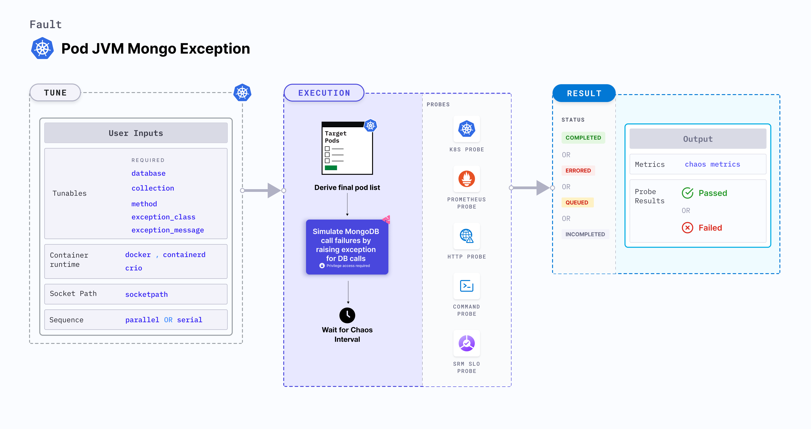

Pod JVM Mongo Exception fault simulates MongoDB calls failures by raising exceptions for db calls executed by the Java process running inside a Kubernetes pod. This helps test the application's behavior and resilience against database-related errors.

:::tip
JVM chaos faults use the [Byteman utility](https://byteman.jboss.org/) to inject chaos faults into the JVM.
:::



### Use cases
Pod JVM Mongo exception:
- Validate the application's resilience by simulating MongoDB exceptions to ensure it can recover gracefully, retry operations, or switch to backup databases without affecting functionality.
- Assess if the monitoring systems and alerting mechanisms can accurately detect and report db exceptions in real-time.
- Trigger exception-handling paths in the application to ensure coverage of edge cases related to db query failures during testing.

### Permissions required
Below is a sample Kubernetes role that defines the permissions required to execute the fault.

```yaml
apiVersion: rbac.authorization.k8s.io/v1
kind: Role
metadata:
  namespace: hce
  name: pod-jvm-mongo-exception
spec:
  definition:
    scope: Namespaced
permissions:
  - apiGroups: [""]
    resources: ["pods"]
    verbs: ["create", "delete", "get", "list", "patch", "deletecollection", "update"]
  - apiGroups: [""]
    resources: ["events"]
    verbs: ["create", "get", "list", "patch", "update"]
  - apiGroups: [""]
    resources: ["pods/log"]
    verbs: ["get", "list", "watch"]
  - apiGroups: [""]
    resources: ["deployments, statefulsets"]
    verbs: ["get", "list"]
  - apiGroups: [""]
    resources: ["chaosEngines", "chaosExperiments", "chaosResults"]
    verbs: ["create", "delete", "get", "list", "patch", "update"]
  - apiGroups: ["batch"]
    resources: ["jobs"]
    verbs: ["create", "delete", "get", "list", "deletecollection"]
```

### Mandatory tunables
<table>
  <tr>
    <th> Tunable </th>
    <th> Description </th>
    <th> Notes </th>
  </tr>
  <tr>
    <td> DATABASE </td>
    <td> The name of the mongodb database to be targeted. </td>
    <td> For more information, go to <a href= "#parameters">Parameters</a></td>
  </tr>
  <tr>
    <td> COLLECTION </td>
    <td> The name of the mongodb collection to be targeted. </td>
    <td> For more information, go to <a href= "#parameters">Parameters</a></td>
  </tr>
  <tr>
    <td> METHOD </td>
    <td> The name of the mongodb method to be targeted. </td>
    <td> For more information, go to <a href= "#parameters">Parameters</a></td>
  </tr>
 <tr>
    <td> EXCEPTION_CLASS </td>
    <td> The name of the exception class. </td>
    <td> For more information, go to <a href= "#parameters">Parameters</a></td>
  </tr>
 <tr>
    <td> EXCEPTION_MESSAGE </td>
    <td> The exception message to be raised. </td>
    <td> For more information, go to <a href= "#parameters">Parameters</a></td>
  </tr>
</table>

### Optional tunables
<table>
  <tr>
    <th> Tunable </th>
    <th> Description </th>
    <th> Notes </th>
  </tr>
 <tr>
    <td> TOTAL_CHAOS_DURATION </td>
    <td> Duration through which chaos is injected into the target resource. Should be provided in <code>[numeric-hours]h[numeric-minutes]m[numeric-seconds]s</code> format. </td>
    <td> Default: <code>30s</code>. Examples: <code>1m25s</code>, <code>1h3m2s</code>, <code>1h3s</code>. For more information, go to <a href="/docs/chaos-engineering/use-harness-ce/chaos-faults/common-tunables-for-all-faults/#duration-of-the-chaos"> duration of the chaos.</a></td>
  </tr>
  <tr>
    <td> TRANSACTION_PERCENTAGE </td>
    <td> The percentage of total mongodb calls to be targeted. </td>
    <td> Supports percentage in (0.00,1.00] range. If not provided, it targets all mongodb queries. For more information, go to <a href= "#parameters">Parameters</a></td>
  </tr>
  <tr>
    <td> POD_AFFECTED_PERCENTAGE </td>
    <td> Percentage of total pods to target. Provide numeric values. </td>
    <td> Default: 0 (corresponds to 1 replica). For more information, go to <a href="/docs/chaos-engineering/chaos-faults/use-harness-ce/kubernetes/pod/common-tunables-for-pod-faults#pod-affected-percentage">pods affected percentage. </a> </td>
    </tr>
  <tr>
    <td> JAVA_HOME </td>
    <td> Path to the Java installation directory. </td>
    <td> For example, /tmp/dir/jdk. </td>
  </tr>
  <tr>
    <td> BYTEMAN_PORT </td>
    <td> Port used by the Byteman agent. </td>
    <td> Default: <code>9091</code>. </td>
  </tr>
  <tr>
    <td> CONTAINER_RUNTIME </td>
    <td> Container runtime interface for the cluster. </td>
    <td> Default: containerd. Support values: docker, containerd and crio. For more information, go to <a href="/docs/chaos-engineering/use-harness-ce/chaos-faults/kubernetes/pod/pod-api-modify-body#container-runtime-and-socket-path">container runtime</a>.</td>
    </tr>
    <tr>
    <td> SOCKET_PATH </td>
    <td> Path of the containerd or crio or docker socket file. </td>
    <td> Default: <code>/run/containerd/containerd.sock</code>. For more information, go to <a href="/docs/chaos-engineering/use-harness-ce/chaos-faults/kubernetes/pod/pod-api-modify-body#container-runtime-and-socket-path">socket path</a>.</td>
    </tr>
  <tr>
    <td> RAMP_TIME </td>
    <td> Period to wait before and after injecting chaos. Should be provided in <code>[numeric-hours]h[numeric-minutes]m[numeric-seconds]s</code> format. </td>
    <td> Default: <code>0s</code>. Examples: <code>1m25s</code>, <code>1h3m2s</code>, <code>1h3s</code>. For more information, go to <a href= "/docs/chaos-engineering/use-harness-ce/chaos-faults/common-tunables-for-all-faults#ramp-time">ramp time.</a></td>
  </tr>
  <tr>
    <td> SEQUENCE </td>
    <td> Sequence of chaos execution for multiple target pods. </td>
    <td> Default: parallel. Supports serial and parallel. For more information, go to <a href="/docs/chaos-engineering/use-harness-ce/chaos-faults/common-tunables-for-all-faults#sequence-of-chaos-execution">sequence of chaos execution</a>.</td>
    </tr>
  <tr>
    <td> TARGET_CONTAINER </td>
    <td> Name of the container subject to API header modification. </td>
    <td> None. For more information, go to <a href="/docs/chaos-engineering/use-harness-ce/chaos-faults/kubernetes/pod/common-tunables-for-pod-faults#target-specific-container">target specific container</a></td>
    </tr>
  <tr>
    <td> TARGET_PODS </td>
    <td> Comma-separated list of application pod names subject to pod HTTP modify body.</td>
    <td> If not provided, the fault selects target pods randomly based on provided appLabels. For more information, go to <a href="/docs/chaos-engineering/use-harness-ce/chaos-faults/kubernetes/pod/common-tunables-for-pod-faults#target-specific-pods"> target specific pods</a>.</td>
    </tr>
  <tr>
    <td> NODE_LABEL </td>
    <td> It filters the target pods that are scheduled on nodes matching the specified `NODE_LABEL`. </td>
    <td> For more information, go to <a href="/docs/chaos-engineering/use-harness-ce/chaos-faults/kubernetes/node/common-tunables-for-node-faults#target-nodes-with-labels">node label.</a></td>
    </tr>
  <tr>
    <td> LIB_IMAGE </td>
    <td> Image used to inject chaos. </td>
    <td> Default: <code>harness/ddcr-faults:main-latest</code>. For more information, go to <a href = "/docs/chaos-engineering/use-harness-ce/chaos-faults/common-tunables-for-all-faults#image-used-by-the-helper-pod">image used by the helper pod.</a></td>
    </tr>
</table>

### Parameters

The following YAML snippet illustrates the use of these tunables:

[embedmd]:# (./static/manifests/pod-jvm-mongo-exception/params.yaml yaml)
```yaml
kind: KubernetesChaosExperiment
apiVersion: litmuschaos.io/v1alpha1
metadata:
  name: pod-jvm-mongo-exception
  namespace: hce
spec:
  tasks:
    - definition:
        chaos:
          env:
            - name: TOTAL_CHAOS_DURATION
              value: "60"
            # name of the mongodb database to be targeted
            - name: DATABASE
              value: "library"
            # name of the mongodb collection to be targeted
            - name: COLLECTION
              value: "books"
            # name of the mongodb method to be targeted
            - name: METHOD
              value: "find"
            # name of the exception class
            - name: EXCEPTION_CLASS
              value: "IllegalArgumentException"
            # provide the exception message
            - name: EXCEPTION_MESSAGE
              value: "CHAOS BOOM!"
            # provide the transaction percentage
            - name: TRANSACTION_PERCENTAGE
              value: "50"
```