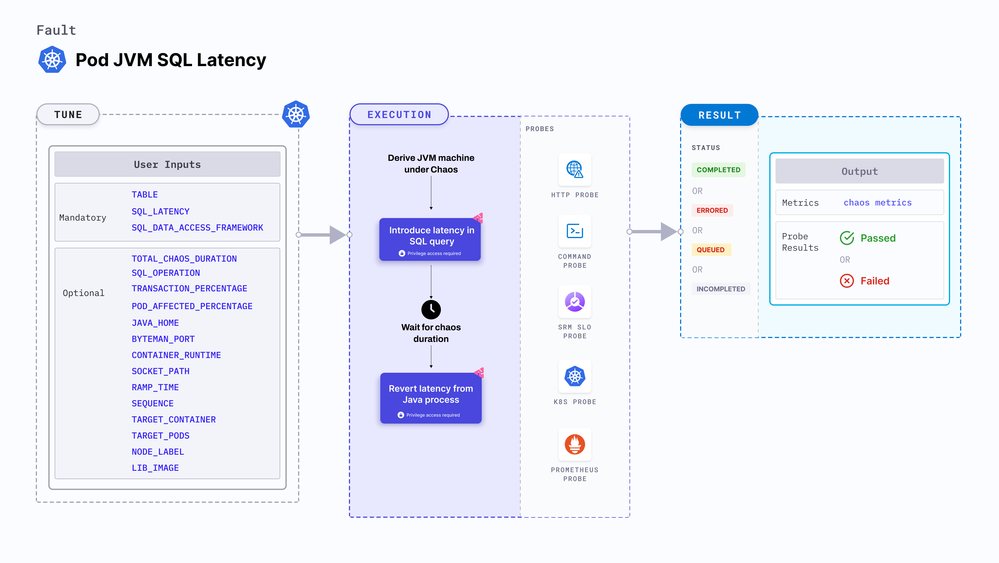

Pod JVM SQL Latency fault introduces latency in the SQL queries executed by the Java process running inside a Kubernetes pod. This helps simulate delays in database interactions, enabling testing of the application's behavior under slow database response conditions and validating the impact of latency on overall system performance and user experience

:::tip
JVM chaos faults use the [Byteman utility](https://byteman.jboss.org/) to inject chaos faults into the JVM.
:::



### Use cases
Pod JVM sql latency:
- Simulate database latency to evaluate how the application handles slower SQL queries, assess system performance under delayed database responses, and identify potential bottlenecks in handling high volumes of requests.
- Test the impact of SQL query latency on the end-user experience, ensuring the application behaves gracefully under slower response times. This can include validating timeouts, retries, or fallback mechanisms to maintain a seamless user experience.
- Ensure that the application can handle delayed SQL queries without failing. Test timeout configurations, error-handling strategies, and automatic recovery processes to verify that the system can withstand latency-induced delays without causing critical failures.

### Mandatory tunables
<table>
  <tr>
    <th> Tunable </th>
    <th> Description </th>
    <th> Notes </th>
  </tr>
  <tr>
    <td> TABLE </td>
    <td> The name of the SQL table to be targeted. </td>
    <td> For more information, go to <a href= "#parameters">Parameters</a></td>
  </tr>
  <tr>
    <td> SQL_DATA_ACCESS_FRAMEWORK </td>
    <td> The name of the data access framework. </td>
    <td> It supports MYSQL5, MYSQL8, and HIBERNATE types. For more information, go to <a href= "#parameters">Parameters</a></td>
  </tr>
 <tr>
    <td> SQL_LATENCY </td>
    <td> The latency to be injected into the SQL queries (in ms)</td>
    <td> For more information, go to <a href= "#parameters">Parameters</a></td>
  </tr>
</table>

### Optional tunables
<table>
  <tr>
    <th> Tunable </th>
    <th> Description </th>
    <th> Notes </th>
  </tr>
 <tr>
    <td> TOTAL_CHAOS_DURATION </td>
    <td> Duration through which chaos is injected into the target resource. Should be provided in <code>[numeric-hours]h[numeric-minutes]m[numeric-seconds]s</code> format. </td>
    <td> Default: <code>30s</code>. Examples: <code>1m25s</code>, <code>1h3m2s</code>, <code>1h3s</code>. For more information, go to <a href="/docs/chaos-engineering/use-harness-ce/chaos-faults/common-tunables-for-all-faults/#duration-of-the-chaos"> duration of the chaos.</a></td>
  </tr>
  <tr>
    <td> SQL_OPERATION </td>
    <td> The type of SQL query to be targeted. </td>
    <td> If not provided it will target all sql queries. Examples: <code>select</code>. For more information, go to <a href= "#parameters">Parameters</a></td>
  </tr>
  <tr>
    <td> TRANSACTION_PERCENTAGE </td>
    <td> The percentage of total sql queries to be targeted. </td>
    <td> Supports percentage in (0.00,1.00] range. If not provided it will target all sql queries. For more information, go to <a href= "#parameters">Parameters</a></td>
  </tr>
  <tr>
    <td> POD_AFFECTED_PERCENTAGE </td>
    <td> Percentage of total pods to target. Provide numeric values. </td>
    <td> Default: 0 (corresponds to 1 replica). For more information, go to <a href="/docs/chaos-engineering/chaos-faults/use-harness-ce/kubernetes/pod/common-tunables-for-pod-faults#pod-affected-percentage">pods affected percentage </a> </td>
    </tr>
  <tr>
    <td> JAVA_HOME </td>
    <td> Path to the Java installation directory. </td>
    <td> For example, /tmp/dir/jdk. </td>
  </tr>
  <tr>
    <td> BYTEMAN_PORT </td>
    <td> Port used by the Byteman agent. </td>
    <td> Default: <code>9091</code>. </td>
  </tr>
  <tr>
    <td> CONTAINER_RUNTIME </td>
    <td> Container runtime interface for the cluster</td>
    <td> Default: containerd. Support values: docker, containerd and crio. For more information, go to <a href="/docs/chaos-engineering/use-harness-ce/chaos-faults/kubernetes/pod/pod-api-modify-body#container-runtime-and-socket-path">container runtime</a>.</td>
    </tr>
    <tr>
    <td> SOCKET_PATH </td>
    <td> Path of the containerd or crio or docker socket file. </td>
    <td> Default: <code>/run/containerd/containerd.sock</code>. For more information, go to <a href="/docs/chaos-engineering/use-harness-ce/chaos-faults/kubernetes/pod/pod-api-modify-body#container-runtime-and-socket-path">socket path</a>.</td>
    </tr>
  <tr>
    <td> RAMP_TIME </td>
    <td> Period to wait before and after injecting chaos. Should be provided in <code>[numeric-hours]h[numeric-minutes]m[numeric-seconds]s</code> format. </td>
    <td> Default: <code>0s</code>. Examples: <code>1m25s</code>, <code>1h3m2s</code>, <code>1h3s</code>. For more information, go to <a href= "/docs/chaos-engineering/use-harness-ce/chaos-faults/common-tunables-for-all-faults#ramp-time">ramp time.</a></td>
  </tr>
  <tr>
    <td> SEQUENCE </td>
    <td> Sequence of chaos execution for multiple target pods. </td>
    <td> Default: parallel. Supports serial and parallel. For more information, go to <a href="/docs/chaos-engineering/use-harness-ce/chaos-faults/common-tunables-for-all-faults#sequence-of-chaos-execution">sequence of chaos execution</a>.</td>
    </tr>
  <tr>
    <td> TARGET_CONTAINER </td>
    <td> Name of the container subject to API header modification. </td>
    <td> None. For more information, go to <a href="/docs/chaos-engineering/use-harness-ce/chaos-faults/kubernetes/pod/common-tunables-for-pod-faults#target-specific-container">target specific container</a></td>
    </tr>
  <tr>
    <td> TARGET_PODS </td>
    <td> Comma-separated list of application pod names subject to pod HTTP modify body.</td>
    <td> If not provided, the fault selects target pods randomly based on provided appLabels. For more information, go to <a href="/docs/chaos-engineering/use-harness-ce/chaos-faults/kubernetes/pod/common-tunables-for-pod-faults#target-specific-pods"> target specific pods</a>.</td>
    </tr>
  <tr>
    <td> NODE_LABEL </td>
    <td> It filters the target pods that are scheduled on nodes matching the specified `NODE_LABEL`. </td>
    <td> For more information, go to <a href="/docs/chaos-engineering/use-harness-ce/chaos-faults/kubernetes/node/common-tunables-for-node-faults#target-nodes-with-labels">node label.</a></td>
    </tr>
  <tr>
    <td> LIB_IMAGE </td>
    <td> Image used to inject chaos. </td>
    <td> Default: <code>harness/ddcr-faults:main-latest</code>. For more information, go to <a href = "/docs/chaos-engineering/use-harness-ce/chaos-faults/common-tunables-for-all-faults#image-used-by-the-helper-pod">image used by the helper pod.</a></td>
    </tr>
</table>

### Parameters

The following YAML snippet illustrates the use of these tunables:

[embedmd]:# (./static/manifests/pod-jvm-sql-latency/params.yaml yaml)
```yaml
kind: KubernetesChaosExperiment
apiVersion: litmuschaos.io/v1alpha1
metadata:
  name: pod-jvm-sql-latency
  namespace: hce
spec:
  tasks:
    - definition:
        chaos:
          env:
            - name: TOTAL_CHAOS_DURATION
              value: "60"
            # provide the sql table name
            - name: TABLE
              value: "product"
            # provide the sql operation name
            # it supports select, insert, update, delete, replace types
            - name: SQL_OPERATION
              value: "select"
            # name of the data access framework
            # it supports MYSQL5, MYSQL8, HIBERNATE types
            - name: SQL_DATA_ACCESS_FRAMEWORK
              value: "MYSQL8"
            # provide the latency in ms
            - name: SQL_LATENCY
              value: "2000" #in ms
            # provide the transaction percentage
            - name: TRANSACTION_PERCENTAGE
              value: "50"
```