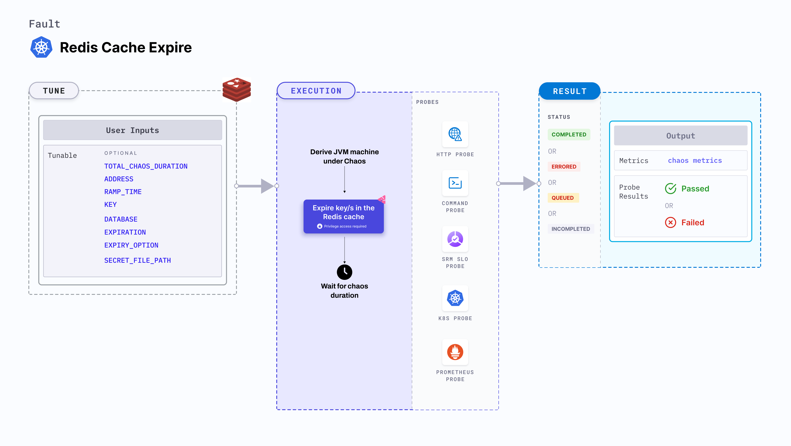

import AuthenticationDetails from './shared/redis-auth.md'

Redis cache expire expires a given key (or all keys) for a specified duration. During this period of chaos, you can't access the keys associated with the cache.



## Use cases

Redis cache expire determines the resilience of Redis-dependant applications against frequent cache expiry.

<AuthenticationDetails />

### Optional tunables

<table>
  <tr>
    <th> Tunable </th>
    <th> Description </th>
    <th> Notes </th>
  </tr>
  <tr>
    <td> TOTAL_CHAOS_DURATION </td>
    <td> Duration through which chaos is injected into the target resource. Should be provided in <code>[numeric-hours]h[numeric-minutes]m[numeric-seconds]s</code> format. </td>
    <td> Default: <code>30s</code>. Examples: <code>1m25s</code>, <code>1h3m2s</code>, <code>1h3s</code>. For more information, go to <a href="/docs/chaos-engineering/use-harness-ce/chaos-faults/common-tunables-for-all-faults#duration-of-the-chaos">duration.</a></td>
  </tr>
  <tr>
    <td> RAMP_TIME </td>
    <td> Period to wait before and after injecting chaos. Should be provided in <code>[numeric-hours]h[numeric-minutes]m[numeric-seconds]s</code> format. </td>
    <td> Default: <code>0s</code>. Examples: <code>1m25s</code>, <code>1h3m2s</code>, <code>1h3s</code>. For more information, go to <a href="/docs/chaos-engineering/use-harness-ce/chaos-faults/common-tunables-for-all-faults#ramp-time">ramp time</a>. </td>
  </tr>
  <tr>
    <td> ADDRESS </td>
    <td> The address of the Redis server. </td>
    <td> If your Redis server doesn't require authentication, directly provide the address. </td>
  </tr>
  <tr>
    <td> KEY </td>
    <td> The key to expire in the Redis cache. </td>
    <td> For empty value, all the keys are expired. For more information, go to <a href="#key"> key</a>. </td>
  </tr>
  <tr>
    <td> DATABASE </td>
    <td> Redis database where the key exists. </td>
    <td> Default: 0. </td>
  </tr>
  <tr>
    <td> EXPIRATION </td>
    <td> The duration after which the key expires. </td>
    <td> Default: 0. </td>
  </tr>
  <tr>
    <td> EXPIRY_OPTION </td>
    <td> The options to expire a Redis key. Refer <a href="https://redis.io/docs/latest/commands/expire/#options"> here </a> for more information. </td>
    <td> Supports one of: NX, XX, GT and LT. </td>
  </tr>
  <tr>
    <td> SECRET_FILE_PATH </td>
    <td> Path to the file that contains the secret. </td>
    <td> If a password or certificate is required alongside the address, use the <a href="#redis-authentication">secret file approach</a>. </td>
  </tr>
</table>

### Parameters

The following YAML snippet illustrates the use of these tunables:

[embedmd]:# (./static/manifests/redis-cache-expire/params.yaml yaml)
```yaml
apiVersion: litmuchaos.io/v1alpha1
kind: K8sFault
metadata:
  name: redis-cache-expire
      env:
        - name: TOTAL_CHAOS_DURATION
          value: "60" # in seconds
        - name: RAMP_TIME
          value: ""
        - name: ADDRESS
          value: ""
        - name: KEY
          value: ""
        - name: DATABASE
          value: "0"
        - name: EXPIRATION
          value: ""
        - name: EXPIRY_OPTION
          value: ""
        - name: SECRET_FILE_PATH  #if authentication required
          value: /tmp/redis-secret.yaml
```