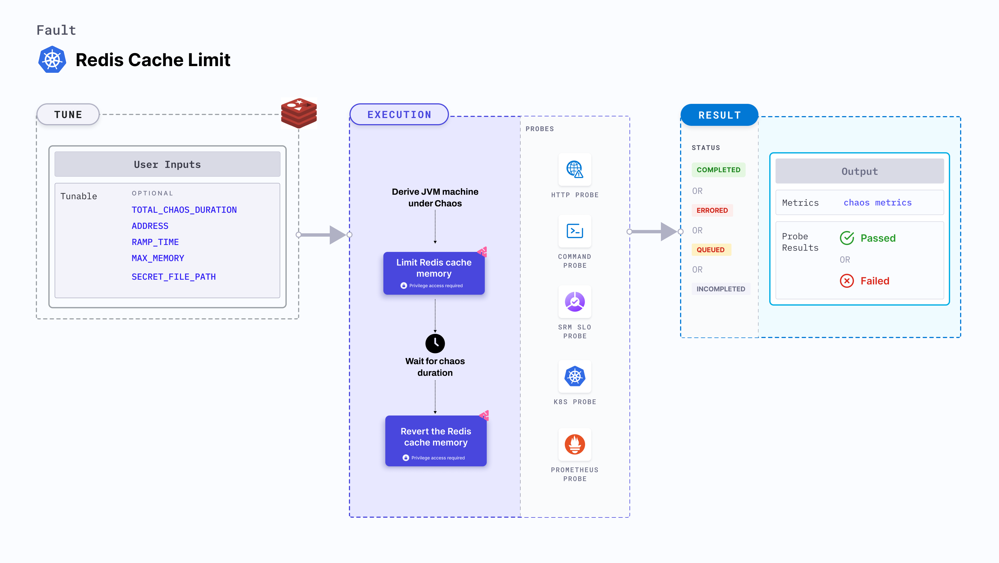

import AuthenticationDetails from './shared/redis-auth.md'

Redis cache limit fault limits the amount of memory used by a Redis cache and restores it after the chaos duration.



## Use cases
Redis cache limit determines the resilience of Redis-dependant applications on frequent cache misses that occur due to a low cache size.

<AuthenticationDetails />

### Optional tunables

<table>
  <tr>
    <th> Tunable </th>
    <th> Description </th>
    <th> Notes </th>
  </tr>
  <tr>
    <td> TOTAL_CHAOS_DURATION </td>
    <td> Duration through which chaos is injected into the target resource. Should be provided in <code>[numeric-hours]h[numeric-minutes]m[numeric-seconds]s</code> format. </td>
    <td> Default: <code>30s</code>. Examples: <code>1m25s</code>, <code>1h3m2s</code>, <code>1h3s</code>. For more information, go to <a href="/docs/chaos-engineering/use-harness-ce/chaos-faults/common-tunables-for-all-faults#duration-of-the-chaos">duration.</a></td>
  </tr>
  <tr>
    <td> RAMP_TIME </td>
    <td> Period to wait before and after injecting chaos. Should be provided in <code>[numeric-hours]h[numeric-minutes]m[numeric-seconds]s</code> format. </td>
    <td> Default: <code>0s</code>. Examples: <code>1m25s</code>, <code>1h3m2s</code>, <code>1h3s</code>. For more information, go to <a href="/docs/chaos-engineering/use-harness-ce/chaos-faults/common-tunables-for-all-faults#ramp-time">ramp time</a>. </td>
  </tr>
  <tr>
    <td> ADDRESS </td>
    <td> The address of the Redis server. </td>
    <td> If your Redis server doesn't require authentication, directly provide the address. </td>
  </tr>
  <tr>
    <td> MAX_MEMORY </td>
    <td> The percentage of existing Redis maximum memory or an absolute amount (in MB, KB, GB) that should be used by Redis.</td>
    <td> Default: 50%. </td>
  </tr>
  <tr>
    <td> SECRET_FILE_PATH </td>
    <td> Path to the file that contains the secret. </td>
    <td> If a password or certificate is required alongside the address, use the <a href="#redis-authentication">secret file approach</a>. </td>
  </tr>
</table>

### Parameters

The following YAML snippet illustrates the use of these tunables:

[embedmd]:# (./static/manifests/pod-redis-cache-limit/params.yaml yaml)
```yaml
apiVersion: litmuchaos.io/v1alpha1
kind: K8sFault
metadata:
  name: redis-cache-limit
      env:
        - name: TOTAL_CHAOS_DURATION
          value: "60" # in seconds
        ## Period to wait before and after injection of chaos in sec
        - name: RAMP_TIME
          value: ""
        - name: ADDRESS
          value: ""
        - name: MAX_MEMORY
          value: "50%"
        - name: SECRET_FILE_PATH
          value: ""
```
