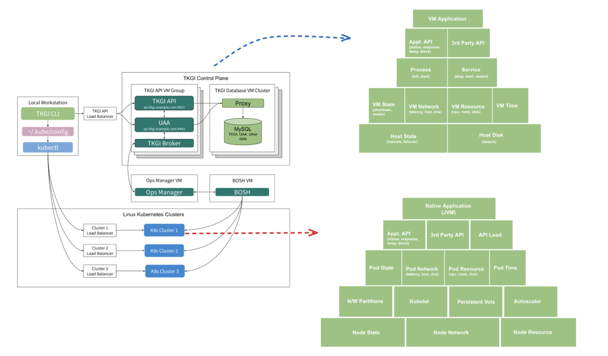

This topic describes HCE's fault injection approach on [Tanzu Kubernetes Grid-based](https://tanzu.vmware.com/kubernetes-grid)(TKGi) infrastructure. It describes the chaos components installed in the cluster, their deployment architecture, and various deployment modes of the Kubernetes chaos infrastructure.

## Overview
You can execute chaos experiments on various layers of your infrastructure to determine the resilience of your TKGi-based microservices. You can start from the application process layer (supported for JVM-based apps currently) and move down to the underlying host infrastructure.

Harness provides out-of-the-box faults for different target types as well as automatically validates the resilience of the services with performance metrics, status endpoints, health check scripts, and so on using [**resilience probes**](/docs/chaos-engineering/concepts/explore-concepts/resilience-probes/).

You can combine the chaos experiments with custom actions such as load generation when you execute these experiments as part of the Harness pipelines.

The diagram below describes how the TKGi control plane interacts with JVM applications to execute chaos experiments.

### Chaos components in TKGi-based fault

You will learn about the Kubernetes chaos infrastructure components involved in fault injection against:
1. Microservices hosted in the cluster;
2. Infrastructure components that constitute the cluster.

You will also learn how the components mentioned earlier can be leveraged to inject faults into cloud-based infrastructure and managed services.

:::tip
Components involved in chaos against the TKGi control plane, that is, the VMs, are the same ones as described in [deployment model for Cloud Foundry chaos](/docs/chaos-engineering/use-harness-ce/chaos-faults/cloud-foundry/CF%20chaos%20components%20and%20their%20deployment%20architecture#run-lci-in-diego-cells-hosting-the-app-instances).
:::

#### Subscriber
A stateless deployment that runs continuously within a dedicated namespace on your Kubernetes cluster.
    - It is responsible for claiming experiment tasks from the Harness control plane, starting the experiment process, and reporting the status and the outcome back to the control plane.
    - It helps with asset discovery, that is, provides the list of workloads in the cluster when you request it, thereby facilitating chaos target selection while creating an experiment.
    - The subscriber uses an in-out mechanism to reach the control plane. It only makes outbound requests (polls) for a task (task can be type discovery, experiment execution, abort, and so on).
    - It does not need any open ports on the cluster side.
    - The subscriber's requests to the control plane are authenticated using a unique combination of cluster ID and access token.

#### Custom controllers
Stateless deployments that watch for CRUD events on the chaos custom resources (CRs) and reconcile them.
    - These CRs contain the fault and hypothesis validation, that is, the probe specification.
    - There are two types of controllers:
        1. Controller that reconciles the overall workflow (or experiment);
        2. Controller that reconciles a specific fault within the experiment.
    - Together, these controllers are responsible for orchestrating the experiment.
    - The controllers also patch the status and results of the experiment (or fault) execution into the custom resources.
    - These events serve as the basis and trigger the subscriber's information relay to the control plane.

#### Transient chaos pods
Pods that are launched just in time with the desired privileges to inject the chaos processes into the target containers.
    - These pods exist only for the period specified in the `CHAOS_DURATION` fault parameter.
    - The number of transient pods is determined by the nature of the fault you inject and the blast radius for the fault.
    - Typically, the upper limit for the number of transient pods is the number of nodes in the cluster.

#### Exporter
Optional stateless deployment that generates Prometheus metrics on the chaos actions in the cluster.
For example, the status of the current fault injection, probe success percentages for executed faults, aggregate fault count, and so on.