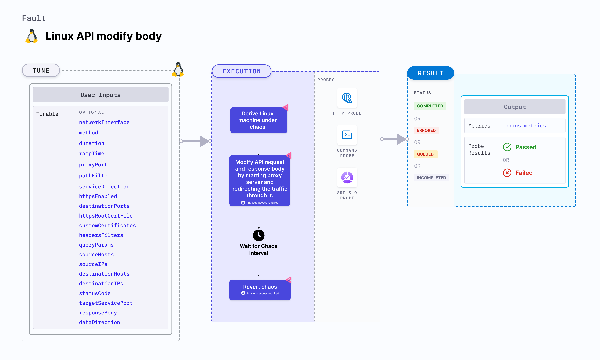

import Ossupport from './shared/note-supported-os.md'
import FaultPermissions from './shared/fault-permissions.md'

Linux API modify body modifies the API request and response body by replacing any portions that match a specified regular expression with a provided value. This is achieved by starting the proxy server and redirecting the traffic through the proxy server.



## Use cases
Linux API modify body:
- Tests API, by replacing specific portions of the request or response body to simulate different scenarios and validate how your application handles different data variations.
- Simulate error conditions and test the error handling capabilities of API by replacing specific patterns in the response body with error messages or custom error codes to test error handling and reporting mechanisms are in place.
- Obscure or redact personally identifiable information (PII), such as email addresses or phone numbers, before logging or transmitting the data for security and privacy compliance.

<Ossupport />

<FaultPermissions />

### Optional tunables
<table>
  <tr>
    <th> Tunable </th>
    <th> Description </th>
    <th> Notes </th>
  </tr>
  <tr>
      <td> networkInterface </td>
      <td> Network interface used for the proxy when the <code>SERVICE_DIRECTION</code> is ingress.</td>
      <td> Default: `eth0`. For more information, go to <a href="#advanced-fault-tunables">network interface </a>.</td>
    </tr>
  <tr>
    <td> duration </td>
    <td> Duration through which chaos is injected into the target resource. Should be provided in <code>[numeric-hours]h[numeric-minutes]m[numeric-seconds]s</code> format. </td>
    <td> Default: <code>30 s</code>. Examples: <code>1m25s</code>, <code>1h3m2s</code>, <code>1h3s</code>. For more information, go to <a href="/docs/chaos-engineering/use-harness-ce/chaos-faults/common-tunables-for-all-faults#duration-of-the-chaos">duration of the chaos </a>. </td>
  </tr>
  <tr>
    <td> rampTime </td>
    <td> Period to wait before and after injecting chaos. Should be provided in <code>[numeric-hours]h[numeric-minutes]m[numeric-seconds]s</code> format. </td>
    <td> Default: <code>0s</code>. Examples: <code>1m25s</code>, <code>1h3m2s</code>, <code>1h3s</code>. For more information, go to <a href="/docs/chaos-engineering/use-harness-ce/chaos-faults/common-tunables-for-all-faults#ramp-time">ramp time</a>. </td>
  </tr>
  <tr>
      <td> targetServicePort </td>
      <td> Port of the target service used when the <code>serviceDirection</code> is ingress.</td>
      <td> Default: 80. For more information, go to <a href="#target-service-port">target service port</a>.</td>
    </tr>
  <tr>
      <td> proxyPort </td>
      <td> Port where the proxy listens for requests. </td>
      <td> Default: 20000. For more information, go to <a href="#advanced-fault-tunables">proxy port</a>.</td>
  </tr>
  <tr>
      <td> pathFilter </td>
      <td> API path or route used for the filtering. </td>
      <td> Targets all paths if not provided. For more information, go to <a href="#path-filter">path filter </a>.</td>
  </tr>
  <tr>
      <td> serviceDirection </td>
      <td> Direction of the flow of control, `ingress` or `egress`.</td>
      <td> Default: `ingress`. For more information, go to <a href="#advanced-fault-tunables">service direction </a>.</td>
  </tr>
  <tr>
      <td> httpsEnabled </td>
      <td> Facilitate HTTPS support for both incoming and outgoing traffic. </td>
      <td> Default: false. For more information, go to <a href="#https">HTTPS</a>. </td>
  </tr>
  <tr>
      <td> destinationPorts </td>
      <td> Comma-separated list of the destination service or host ports for which `egress` traffic should be affected. </td>
      <td> Default: 80,8443. For more information, go to <a href="#destination-ports">destination ports</a></td>
  </tr>
  <tr>
      <td> httpsRootCertFile </td>
      <td> Provide the root CA certificate file name. </td>
      <td> This setting must be configured if the root CA certificate file name differs from ca-certificates.crt. Go to [root Linux] (https://go.dev/src/crypto/x509/root_linux.go) for the default certificate file names based on various Linux distributions. For more information, go to <a href="#https">HTTPS. </a></td>
  </tr>
  <tr>
      <td> customCertificates </td>
      <td> Provide the custom certificates for the proxy server to serve as intermediate certificates for HTTPS communication. </td>
      <td> HTTPS communication necessitates its use as intermediate certificates by the proxy server. These certificates should be loaded into the target application. For more information, go to <a href="#https">HTTPS. </a></td>
  </tr>
  <tr>
      <td> headersFilters </td>
      <td> Filters for HTTP request headers accept multiple comma-separated headers in the format <code>key1:value1,key2:value2</code>.</td>
      <td> For more information, go to <a href="#advanced-filters">headers filters</a>.</td>
  </tr>
  <tr>
      <td> methods </td>
      <td> The HTTP request method type accepts comma-separated HTTP methods in upper cases, such as "GET,POST". </td>
      <td> For more information, go to <a href="#advanced-filters">methods</a>.</td>
  </tr>
  <tr>
      <td> queryParams </td>
      <td> HTTP request query parameter filters accept multiple comma-separated query parameters in the format of <code>param1:value1,param2:value2</code>. </td>
      <td> For more information, go to <a href="#advanced-filters">query params</a>.</td>
  </tr>
  <tr>
      <td> sourceHosts </td>
      <td> Includes comma-separated source host names as filters, indicating the origin of the HTTP request. This is specifically relevant to the "ingress" type. </td>
      <td> For more information, go to <a href="#advanced-filters">source hosts</a>.</td>
  </tr>
  <tr>
      <td> sourceIPs </td>
      <td> This includes comma-separated source IPs as filters, indicating the origin of the HTTP request. This is specifically relevant to the "ingress" type. </td>
      <td> For more information, go to <a href="#advanced-filters">source IPs</a>.</td>
  </tr>
  <tr>
      <td> destinationHosts </td>
      <td> Comma-separated destination host names are used as filters, indicating the hosts on which you call the API. This specification applies exclusively to the "egress" type. </td>
      <td> For more information, go to <a href="#advanced-filters">destination hosts</a>.</td>
  </tr>
  <tr>
    <td> destinationIPs </td>
    <td> Comma-separated destination IPs are used as filters, indicating the hosts on which you call the API. This specification applies exclusively to the "egress" type.</td>
    <td> For more information, go to <a href="#advanced-filters">destination hosts</a>.</td>
  </tr>
  <tr>
    <td> responseBody </td>
    <td>  String body to overwrite the HTTP response body.</td>
    <td> If no value is provided, response will be an empty body. Default is an empty body. For more information, go to <a href="#advanced-fault-tunables">response body </a></td>
  </tr>
  <tr>
    <td> dataDirection </td>
    <td> The direction in which the API modification is done. </td>
    <td> Supports values <code>request</code>, <code>response</code> and <code>both</code>. </td>
  </tr>
</table>

### Target service port

Port of the target service. Tune it by using the `targetServicePort` input variable.

The following YAML snippet illustrates the use of this input variable:

[embedmd]: # "./static/manifests/linux-api-modify-body/target-service-port.yaml yaml"

```yaml
## provide the port of the target service
apiVersion: litmuschaos.io/v1alpha1
kind: ChaosEngine
metadata:
  name: engine-nginx
spec:
  engineState: "active"
  annotationCheck: "false"
  appinfo:
    appns: "default"
    applabel: "app=nginx"
    appkind: "deployment"
  chaosServiceAccount: litmus-admin
  experiments:
    - name: linux-api-modify-body
      spec:
        components:
          env:
            - name: responseBody
              value: "/.+/test"
            # provide the port of the target service
            - name: targetServicePort
              value: 80
            - name: pathFilter
              value: '/status'
            - name: statusCode
              value: 404
```

### Path filter

API sub-path (or route) to filter the API calls. Tune it by using the `pathFilter` input variable.

The following YAML snippet illustrates the use of this input variable:

[embedmd]: # "./static/manifests/linux-api-modify-body/path-filter.yaml yaml"

```yaml
## provide api path filter
apiVersion: litmuschaos.io/v1alpha1
kind: ChaosEngine
metadata:
  name: engine-nginx
spec:
  engineState: "active"
  annotationCheck: "false"
  appinfo:
    appns: "default"
    applabel: "app=nginx"
    appkind: "deployment"
  chaosServiceAccount: litmus-admin
  experiments:
    - name: linux-api-modify-body
      spec:
        components:
          env:
            - name: responseBody
              value: "/.+/test"
            # provide the api path filter
            - name: pathFilter
              value: '/status'
            # provide the port of the target service
            - name: targetServicePort
              value: 80
            - name: statusCode
              value: 404
```

### Destination ports

Comma-separated list of the destination service or host ports for which `egress` traffic takes affect as a result of applying chaos on the target application. Tune it by using the `destinationPorts` input variable.

:::tip
It is applicable only when `serviceDirection` input variables has the value `egress`.
:::

The following YAML snippet illustrates the use of this input variable:

[embedmd]: # "./static/manifests/linux-api-modify-body/destination-ports.yaml yaml"

```yaml
## provide destination ports
apiVersion: litmuschaos.io/v1alpha1
kind: ChaosEngine
metadata:
  name: engine-nginx
spec:
  engineState: "active"
  annotationCheck: "false"
  appinfo:
    appns: "default"
    applabel: "app=nginx"
    appkind: "deployment"
  chaosServiceAccount: litmus-admin
  experiments:
    - name: linux-api-modify-body
      spec:
        components:
          env:
            - name: responseBody
              value: "/.+/test"
            # provide destination ports
            - name: destinationPorts
              value: '80,443'
            # provide the api path filter
            - name: pathFilter
              value: '/status'
            # provide the port of the target service
            - name: targetServicePort
              value: 80
```

### HTTPS

Enable the HTTPS support for both incoming and outgoing traffic by setting the `httpsEnabled` field to `true`. Its usage varies depending on whether it is applied to `ingress` or `egress` scenario.

#### Ingress

Set this parameter if the HTTPS URL of the target application includes a port whose format is `https://<hostname>:port`. However, if the HTTPS URL is in the format `https://<hostname>` without a port, this setting is not required.

#### Egress

For outbound traffic, set `httpsEnabled` to `true` to enable HTTPS support for external services. This enables using TLS certificates for the proxy within the target application.

- If the HTTP client in the target application is configured to reload certificates with each API call, set `httpsEnabled` to `true`. You won't need to provide `customCertificates` input variable.
- However, if the root CA certificate file path is not `/etc/ssl/certs/ca-certificates.crt`, provide it using `httpsRootCertFile` input variable.
- If the HTTP client in the target application isn't configured to reload certificates with each API call, provide the `customCertificates` input variable to the chaos experiment. There is no need to set `httpsRootCertFile` input variable. The same custom certificates should be loaded into the target application.
- You can generate custom certificates using the following commands:

   ```bash
   openssl req -x509 -newkey rsa:4096 -keyout key.pem -out cert.crt -days 365 -nodes -subj '/CN=*'
   cat key.pem cert.crt > ca-cert.pem
   cat ca-cert.pem | base64 # provide it inside the customCertificates input variable
   ```
  Load the `cert.crt` into the target application and provide the base64 encoded value of `ca-cert.pem` to the `customCertificates` input variable.

The following YAML snippet illustrates the use of this input variable:

[embedmd]: # "./static/manifests/linux-api-modify-body/https-enabled.yaml yaml"

```yaml
## enable https support
apiVersion: litmuschaos.io/v1alpha1
kind: ChaosEngine
metadata:
  name: engine-nginx
spec:
  engineState: "active"
  annotationCheck: "false"
  appinfo:
    appns: "default"
    applabel: "app=nginx"
    appkind: "deployment"
  chaosServiceAccount: litmus-admin
  experiments:
    - name: linux-api-modify-body
      spec:
        components:
          env:
            - name: responseBody
              value: "/.+/test"
            # enable https support
            - name: httpsEnabled
              value: 'true'
            - name: customCertificates
              value: 'Y3VzdG9tIGNlcnRpZmljYXRlcwo='
            # provide the api path filter
            - name: pathFilter
              value: '/status'
            # provide the port of the targeted service
            - name: targetServicePort
              value: 80
            - name: statusCode
              value: 404
```

### Advanced fault tunables

- **proxyPort**: Port where the proxy listens for requests and responses.
- **serviceDirection**: Direction of the flow of control, either `ingress` or `egress`.
- **networkInterface**: Network interface used for the proxy.
- **responseBody**: String body that overwrites the API request and response body.
- **dataDirection**: The direction in which the data is to be modified. Supports values `request`, `response` and `both`.

The following YAML snippet illustrates the use of this input variable:

[embedmd]:# (./static/manifests/linux-api-modify-body/advanced-fault-tunables.yaml yaml)
```yaml
# it injects the api modify body fault
apiVersion: litmuschaos.io/v1alpha1
kind: ChaosEngine
metadata:
  name: engine-nginx
spec:
  engineState: "active"
  annotationCheck: "false"
  appinfo:
    appns: "default"
    applabel: "app=nginx"
    appkind: "deployment"
  chaosServiceAccount: litmus-admin
  experiments:
    - name: linux-api-modify-body
      spec:
        components:
          env:
            - name: responseBody
              value: "/.+/test"
            # provide the proxy port
            - name: proxyPort
              value: '20000'
            # provide the connection type
            - name: serviceDirection
              value: 'ingress'
            # provide the network interface
            - name: networkInterface
              value: 'eth0'
            # provide the api path filter
            - name: pathFilter
              value: '/status'
            # provide the port of the target service
            - name: targetServicePort
              value: 80
            - name: dataDirection
              value: "both"
```

### Advanced filters

- **headersFilters**: The HTTP request headers filters, that accept multiple comma-separated headers in the format of `key1:value1,key2:value2`.
- **methods**: The HTTP request method type filters, that accept comma-separated HTTP methods in upper case, that is, `GET,POST`.
- **queryParams**: The HTTP request query parameters filter, accepts multiple comma-separated query parameters in the format of `param1:value1,param2:value2`.
- **sourceHosts**: Comma-separated source host names filters, indicating the origin of the HTTP request. This is relevant to the `ingress` type, specified by `SERVICE_DIRECTION` input variable.
- **sourceIPs**: Comma-separated source IPs filters, indicating the origin of the HTTP request. This is specifically relevant to the `ingress` type, specified by `serviceDirection` input variable.
- **destinationHosts**: Comma-separated destination host names filters, indicating the hosts on which you call the API. This specification applies exclusively to the `egress` type, specified by `serviceDirection` input variable.
- **destinationIPs**: Comma-separated destination IPs filters, indicating the hosts on which you call the API. This specification applies exclusively to the `egress` type, specified by `serviceDirection` input variable.

The following YAML snippet illustrates the use of this input variable:

[embedmd]:# (./static/manifests/linux-api-modify-body/advanced-filters.yaml yaml)
```yaml
# it injects the api modify body fault
apiVersion: litmuschaos.io/v1alpha1
kind: ChaosEngine
metadata:
  name: engine-nginx
spec:
  engineState: "active"
  annotationCheck: "false"
  appinfo:
    appns: "default"
    applabel: "app=nginx"
    appkind: "deployment"
  chaosServiceAccount: litmus-admin
  experiments:
    - name: linux-api-modify-body
      spec:
        components:
          env:
            - name: responseBody
              value: "/.+/test"
            # provide the headers filters
            - name: headersFilters
              value: 'key1:value1,key2:value2'
            # provide the methods filters
            - name: methods
              value: 'GET,POST'
            # provide the query params filters
            - name: queryParams
              value: 'param1:value1,param2:value2'
            # provide the source hosts filters
            - name: sourceHosts
              value: 'host1,host2'
            # provide the source ips filters
            - name: sourceIPs
              value: 'ip1,ip2'
            # provide the connection type
            - name: serviceDirection
              value: 'ingress'
            # provide the port of the target service
            - name: targetServicePort
              value: 80
```
