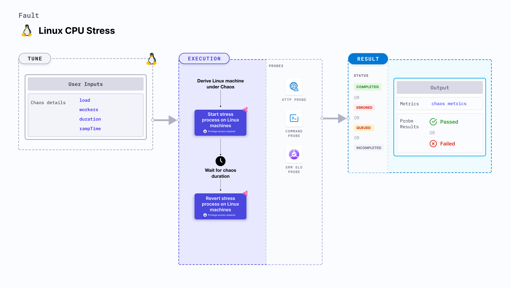

import Ossupport from './shared/note-supported-os.md'
import FaultPermissions from './shared/fault-permissions.md'


Linux CPU stress fault applies stress on the CPU of the target Linux machines for a specific duration.



## Use cases
- Induces CPU stress on the target Linux machines.
- Simulates a lack of CPU for processes running on the application, which degrades their performance.
- Simulates slow application traffic or exhaustion of the resources, leading to degradation in the performance of processes on the machine.

<Ossupport />

<FaultPermissions />

### External packages
This fault uses [`stress-ng`](https://github.com/ColinIanKing/stress-ng), which is installed as part of the infrastructure installation.


### Optional tunables
<table>
  <tr>
    <th> Tunable </th>
    <th> Description </th>
    <th> Notes </th>
  </tr>
  <tr>
    <td> load </td>
    <td> Percentage load to be exerted on a single CPU core. </td>
    <td> Default: 100 %. 0 refers to no load and 100 refers to full load. </td>
  </tr>
  <tr>
    <td> workers </td>
    <td> Number of worker processes to start. Corresponds to the number of CPU cores to consume. </td>
    <td> Default: 1. </td>
  </tr>
  <tr>
    <td> duration </td>
    <td> Duration through which chaos is injected into the target resource. Should be provided in <code>[numeric-hours]h[numeric-minutes]m[numeric-seconds]s</code> format. </td>
    <td> Default: <code>30s</code>. Examples: <code>1m25s</code>, <code>1h3m2s</code>, <code>1h3s</code> </td>
  </tr>
  <tr>
    <td> rampTime </td>
    <td> Period to wait before and after injecting chaos. Should be provided in <code>[numeric-hours]h[numeric-minutes]m[numeric-seconds]s</code> format. </td>
    <td> Default: <code>0s</code>. Examples: <code>1m25s</code>, <code>1h3m2s</code>, <code>1h3s</code> </td>
  </tr>
</table>

### Workers

The `workers` input variable utilizes a specific number of workers for the CPU stress fault.

The following YAML snippet illustrates the use of this input variable:

[embedmd]:# (./static/manifests/linux-cpu-stress/workers.yaml yaml)
```yaml
# workers to utilize
apiVersion: litmuchaos.io/v1alpha1
kind: LinuxFault
metadata:
  name: linux-cpu-stress
  labels:
    name: cpu-stress
spec:
  stressChaos/inputs:
    workers: 1
    load: 100
```

### Load percentage

The `load` input variable exerts the CPU load (in percentage) per core.

:::tip
- The load generated by the stress process may vary based on factors like overall processor load and the responsiveness of the system scheduler.
- Harness recommends allocating a number of CPUs equal to or greater than the total number of logical CPU cores.
:::

The following YAML snippet illustrates the use of this input variable:

[embedmd]:# (./static/manifests/linux-cpu-stress/load.yaml yaml)
```yaml
# percentage load to exert per core
apiVersion: litmuchaos.io/v1alpha1
kind: LinuxFault
metadata:
  name: linux-cpu-stress
  labels:
    name: cpu-stress
spec:
  stressChaos/inputs:
    workers: 3
    load: 70
```
