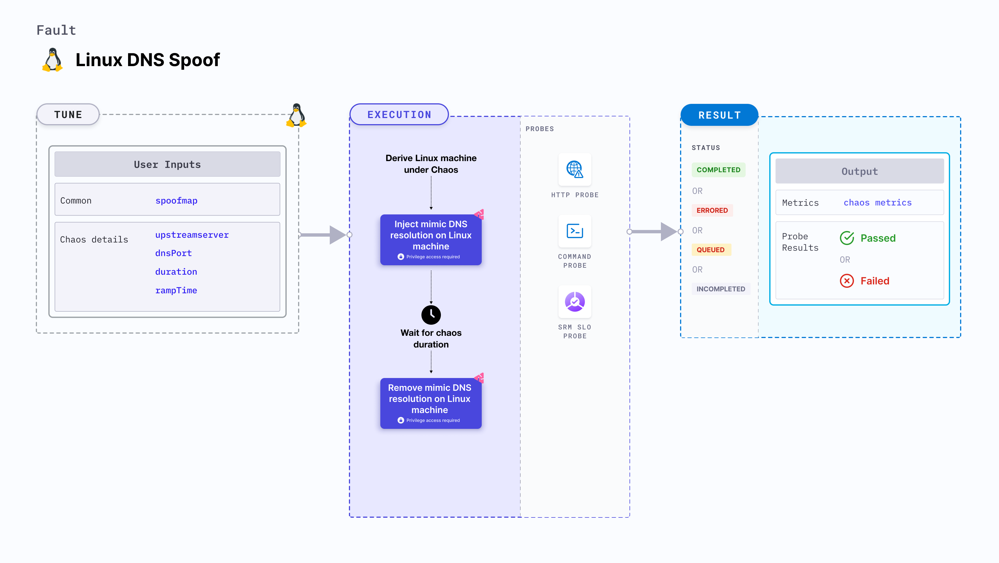

import Ossupport from './shared/note-supported-os.md'
import FaultPermissions from './shared/fault-permissions.md'


Linux DNS spoof injects chaos to mimic DNS resolution on a Linux machine.



## Use cases

- Induces DNS spoof on the target Linux machines.
- Resolves DNS target host names (or domains) to other IPs provided as user input.

<Ossupport />

<FaultPermissions />

### Mandatory tunables
<table>
  <tr>
    <th> Tunable </th>
    <th> Description </th>
    <th> Notes </th>
  </tr>
  <tr>
    <td> spoofMap </td>
    <td> Map of the target host names. </td>
    <td> For example, '&#123;"abc.com":"spoofabc.com"&#125;' where key is the host name to be spoofed and value is the host name to which the key is spoofed. </td>
  </tr>
</table>

### Optional tunables
<table>
  <tr>
    <th> Tunable </th>
    <th> Description </th>
    <th> Notes </th>
  </tr>
  <tr>
    <td> upstreamServer </td>
    <td> Upstream server for the custom DNS interceptor server. </td>
    <td> Provided if there is no upstream server present with the local DNS resolver. </td>
  </tr>
  <tr>
    <td> dnsPort </td>
    <td> UDP port for the DNS interceptor server. </td>
    <td> Default: <code>53</code> </td>
  </tr>
  <tr>
    <td> duration </td>
    <td> Duration through which chaos is injected into the target resource. Should be provided in <code>[numeric-hours]h[numeric-minutes]m[numeric-seconds]s</code> format. </td>
    <td> Default: <code>30s</code>. Examples: <code>1m25s</code>, <code>1h3m2s</code>, <code>1h3s</code> </td>
  </tr>
  <tr>
    <td> rampTime </td>
    <td> Period to wait before and after injecting chaos. Should be provided in <code>[numeric-hours]h[numeric-minutes]m[numeric-seconds]s</code> format. </td>
    <td> Default: <code>0s</code>. Examples: <code>1m25s</code>, <code>1h3m2s</code>, <code>1h3s</code> </td>
  </tr>
</table>

### SpoofMap

The `spoofMap` input variable maps the domain names to the target host names. For example, `{"abc.com":"spoofabc.com"}` where the key is the host name to be spoofed and the value is the host name to which the key is spoofed (or redirected).

The following YAML snippet illustrates the use of this input variable:

[embedmd]:# (./static/manifests/linux-dns-spoof/spoofMap.yaml yaml)
```yaml
# target host names for spoofing
apiVersion: litmuchaos.io/v1alpha1
kind: LinuxFault
metadata:
  name: linux-dns-spoof
  labels:
    name: dns-spoof
spec:
  dnsChaos/inputs:
    spoofMap: '{"abc.com":"spoofabc.com"}'
```
