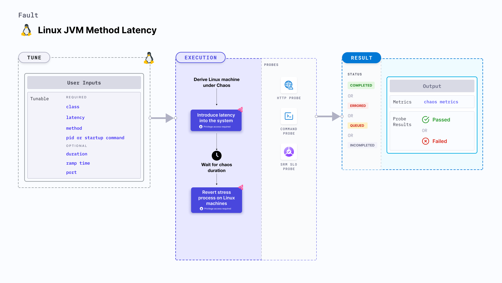

import Ossupport from './shared/note-supported-os.md'
import FaultPermissions from './shared/fault-permissions.md'

Linux JVM method latency slows down the Java application by introducing delays in executing the method calls.

:::tip
- JVM chaos faults use the [Byteman utility](https://byteman.jboss.org/) to inject chaos faults into the JVM.
- Provide **read** and **execute** permissions to the `/etc/linux-chaos-infrastructure/byteman` directory.
:::



## Use cases
Linux JVM method latency:
- Determines the performance bottlenecks of the application.
- Tests the system's ability to handle heavy payloads.
- Evaluates the application's behavior in high-stress cases.
- Determines how quickly an application returns to normalcy after the delay.
- Determines the performance and resilience of the dependant application (or services) running on Linux.

<Ossupport />

<FaultPermissions />

### Mandatory tunables
<table>
  <tr>
    <th> Tunable </th>
    <th> Description </th>
    <th> Notes </th>
  </tr>
  <tr>
    <td> class </td>
    <td> Specify as <b>packageName.className</b> that specifies the class in which you define the exception. </td>
    <td> For example, <code>org.framework.appName.system.WelcomeController</code>. For more information, go to <a href="#class-name"> class name.</a></td>
  </tr>
  <tr>
    <td> latency </td>
    <td> The delay you want to introduce in the application (in ms). </td>
    <td> Default: 2000 ms. For more information, go to <a href="#latency"> latency.</a></td>
  </tr>
  <tr>
    <td> method </td>
    <td> The method to which exception is applied. </td>
    <td> For example, <code>Welcome</code>. For more information, go to <a href="#method"> method name.</a></td>
  </tr>
  <tr>
    <td> pid </td>
    <td> The process ID that Byteman uses to target the service. This is mutually exclusive with <code>startupCommand</code>. If <code>pid</code> is specified (other than 0), <code>startupCommand</code> is not required.</td>
    <td> For example, <code>6429</code>. For more information, go to <a href="#pid"> process Id.</a></td>
  </tr>
  <tr>
    <td> startupCommand </td>
    <td> The command used to start the Java process. A substring match is used with the given command for all processes. This is mutually exclusive with <b>pid</b>.</td>
    <td> If <code>startupCommand</code> is specified, you need to set <code>pid</code> to 0. For example, <code>/usr/local/bin/pet-clinic.jar</code>. For more information, go to <a href="#startup-command"> startup command.</a></td>
  </tr>
</table>

### Optional tunables
<table>
  <tr>
    <th> Tunable </th>
    <th> Description </th>
    <th> Notes </th>
  </tr>
  <tr>
    <td> duration </td>
    <td> Duration through which chaos is injected into the target resource. Should be provided in <code>[numeric-hours]h[numeric-minutes]m[numeric-seconds]s</code> format.</td>
    <td> Default: <code>30s</code>. Examples: <code>1m25s</code>, <code>1h3m2s</code>, <code>1h3s</code>. For more information, go to <a href="/docs/chaos-engineering/use-harness-ce/chaos-faults/common-tunables-for-all-faults/#duration-of-the-chaos"> duration of the chaos.</a></td>
  </tr>
  <tr>
    <td> rampTime </td>
    <td> Period to wait before and after injecting chaos. Should be provided in <code>[numeric-hours]h[numeric-minutes]m[numeric-seconds]s</code> format. </td>
    <td> Default: <code>0s</code>. Examples: <code>1m25s</code>, <code>1h3m2s</code>, <code>1h3s</code>. For example, 30s. For more information, go to <a href= "/docs/chaos-engineering/use-harness-ce/chaos-faults/common-tunables-for-all-faults#ramp-time">ramp time.</a></td>
  </tr>
  <tr>
    <td> port </td>
    <td> Port used by the Byteman agent. </td>
    <td> Default: <code>9091</code>. </td>
  </tr>
</table>

### Class name

The `class` input variable targets the class name where the exception is present. Specify it in the format `packageName.className`.

The following YAML snippet illustrates the use of this input variable:

[embedmd]:# (./static/manifests/linux-jvm-method-latency/class-name.yaml yaml)
```yaml
apiVersion: litmuchaos.io/v1alpha1
kind: LinuxFault
metadata:
  name: linux-jvm-method-latency
  labels:
    name: jvm-method-latency
spec:
  jvmChaos/inputs:
    duration: 30s
    port: 9091
    pid: 1
    class: "org.framework.appName.system.WelcomeController"
    method: ""
    latency: 2000
    rampTime: ""
```

### Latency

The delay introduced in the Java application, in milliseconds. Its default value is 2000 ms.

The following YAML snippet illustrates the use of this input variable:

[embedmd]:# (./static/manifests/linux-jvm-method-latency/latency.yaml yaml)
```yaml
apiVersion: litmuchaos.io/v1alpha1
kind: LinuxFault
metadata:
  name: linux-jvm-method-latency
  labels:
    name: jvm-method-latency
spec:
  jvmChaos/inputs:
    duration: 30s
    port: 9091
    pid: 1
    class: "org.framework.appName.system.WelcomeController"
    method: ""
    latency: 2000
    rampTime: ""
```

### Method

The method name on which you apply the `exception` input variable.

The following YAML snippet illustrates the use of this input variable:

[embedmd]:# (./static/manifests/linux-jvm-method-latency/method.yaml yaml)
```yaml
apiVersion: litmuchaos.io/v1alpha1
kind: LinuxFault
metadata:
  name: linux-jvm-method-latency
  labels:
    name: jvm-method-latency
spec:
  jvmChaos/inputs:
    duration: 30s
    port: 9091
    pid: 1
    class: ""
    method: "Welcome"
    latency: 2000
    startupCommand: ""
    rampTime: ""
```

### Pid

The process ID used by Byteman to target the services of the Java application. This is mutually exclusive with the `Startup command` input variable.

The following YAML snippet illustrates the use of this input variable:

[embedmd]:# (./static/manifests/linux-jvm-method-latency/pid.yaml yaml)
```yaml
apiVersion: litmuchaos.io/v1alpha1
kind: LinuxFault
metadata:
  name: linux-jvm-method-latency
  labels:
    name: jvm-method-latency
spec:
  jvmChaos/inputs:
    duration: 30s
    port: 9091
    pid: 2
    class: ""
    method: ""
    latency: 2000
    rampTime: ""
```

### Startup command

The command used to start the Java process. A substring match is used with the given command for all processes. This is mutually exclusive with the `pid` input variable.

The following YAML snippet illustrates the use of this input variable:

[embedmd]:# (./static/manifests/linux-jvm-method-latency/startup-command.yaml yaml)
```yaml
apiVersion: litmuchaos.io/v1alpha1
kind: LinuxFault
metadata:
  name: linux-jvm-method-latency
  labels:
    name: jvm-method-latency
spec:
  jvmChaos/inputs:
    duration: 30s
    port: 9091
    pid: 0
    class: "org.framework.appName.system.WelcomeController"
    method: ""
    latency: 2000
    startupCommand: "/usr/bin/pet-clinic.jar"
    rampTime: ""
```