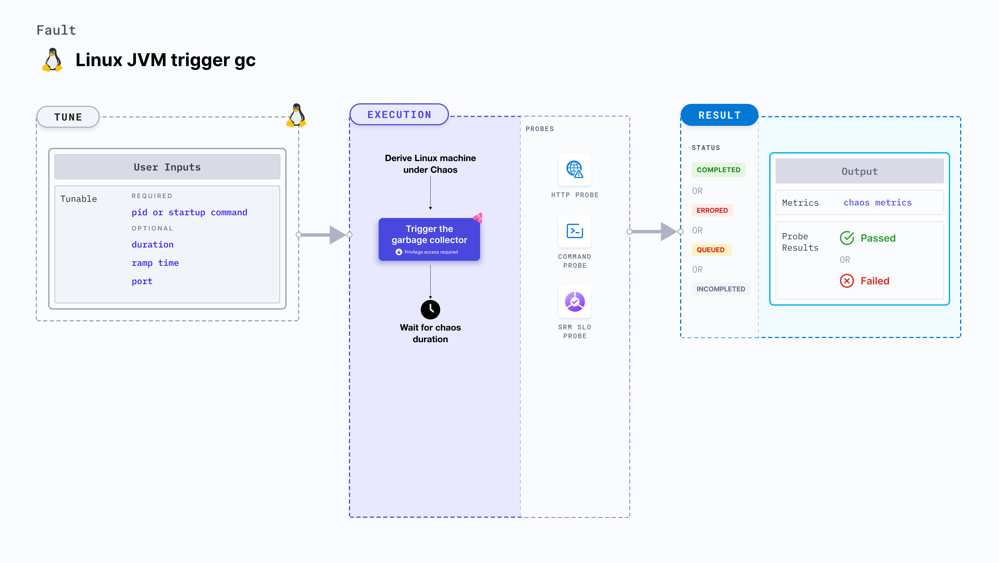

import Ossupport from './shared/note-supported-os.md'
import FaultPermissions from './shared/fault-permissions.md'

Linux JVM trigger gc triggers the garbage collector on a specific process in Java that causes unused (or out of scope) objects, variables and so on to be garbage collected and recycled, thereby freeing up memory space. It is used to determine the performance and resilience of the application (or services) running on Linux machines.

:::tip
JVM chaos faults use the [Byteman utility](https://byteman.jboss.org/) to inject chaos faults into the JVM.
:::



## Use cases
Linux JVM trigger gc:
- Determines how the application behaves when memory space is freed up randomly for a brief period.
- Determines how efficiently an application recovers and returns to normalcy.

<Ossupport />

<FaultPermissions />

### Mandatory tunables
<table>
  <tr>
    <th> Tunable </th>
    <th> Description </th>
    <th> Notes </th>
  </tr>
  <tr>
    <td> pid </td>
    <td> The process Id that Byteman uses to target the service. This is mutually exclusive with <b>Startup command</b>. If <code>startupCommand</code> is specified, <code>pid</code> is specified as 0.</td>
    <td> For example, <code>6429</code>. For more information, go to <a href="#pid"> process ID</a>.</td>
  </tr>
  <tr>
    <td> startupCommand </td>
    <td> The command used to start the Java process. A substring match is used with the given command for all processes. This is mutually exclusive with <b>pid</b>.</td>
    <td> For example, <code>/usr/local/bin/pet-clinic.jar</code>. For more information, go to <a href= "#startup-command">startup command.</a></td>
  </tr>
</table>

### Optional tunables
<table>
  <tr>
    <th> Tunable </th>
    <th> Description </th>
    <th> Notes </th>
  </tr>
  <tr>
    <td> duration </td>
    <td> Duration through which chaos is injected into the target resource. Should be provided in <code>[numeric-hours]h[numeric-minutes]m[numeric-seconds]s</code> format. </td>
    <td> Default: <code>30s</code>. Examples: <code>1m25s</code>, <code>1h3m2s</code>, <code>1h3s</code>. For more information, go to <a href="/docs/chaos-engineering/use-harness-ce/chaos-faults/common-tunables-for-all-faults/#duration-of-the-chaos"> duration of the chaos.</a></td>
  </tr>
  <tr>
    <td> port </td>
    <td> Port used by the Byteman agent. </td>
    <td> Default: <code>9091</code>. </td>
  </tr>
  <tr>
    <td> rampTime </td>
    <td> Period to wait before and after injecting chaos. Should be provided in <code>[numeric-hours]h[numeric-minutes]m[numeric-seconds]s</code> format. </td>
    <td> Default: <code>0s</code>. Examples: <code>1m25s</code>, <code>1h3m2s</code>, <code>1h3s</code>. For more information, go to <a href= "/docs/chaos-engineering/use-harness-ce/chaos-faults/common-tunables-for-all-faults#ramp-time">ramp time.</a></td>
  </tr>
</table>

### Startup command

The `startupCommand` input variable is used to start the Java process. A substring match is used with the given command for all processes. This is mutually exclusive with the `pid` input variable.

The following YAML snippet illustrates the use of this input variable:

[embedmd]:# (./static/manifests/linux-jvm-trigger-gc/startup-command.yaml yaml)
```yaml
apiVersion: litmuchaos.io/v1alpha1
kind: LinuxFault
metadata:
  name: linux-jvm-trigger-gc
  labels:
    name: jvm-trigger-gc
spec:
  jvmChaos/inputs:
    duration: 30s
    port: 9091
    pid: 0
    startupCommand: "/usr/bin/pet-clinic.jar"
    rampTime: ""
```

### Pid

The process ID used by Byteman to target the services of the Java application. This is mutually exclusive with the `startupCommand` input variable.

The following YAML snippet illustrates the use of this input variable:

[embedmd]:# (./static/manifests/linux-jvm-trigger-gc/pid.yaml yaml)
```yaml
apiVersion: litmuchaos.io/v1alpha1
kind: LinuxFault
metadata:
  name: linux-jvm-trigger-gc
  labels:
    name: jvm-trigger-gc
spec:
  jvmChaos/inputs:
    duration: 30s
    port: 9091
    pid: 1
    startupCommand: ""
    rampTime: ""
```