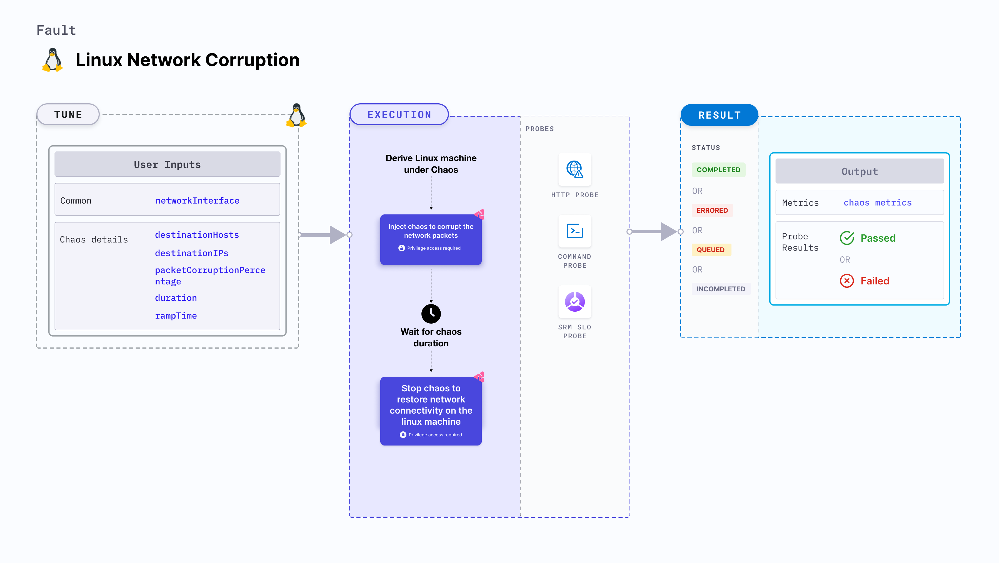

import Ossupport from './shared/note-supported-os.md'
import FaultPermissions from './shared/fault-permissions.md'


Linux network corruption injects chaos to disrupt network connectivity by corrupting the network requests on a Linux machine.



## Use cases
Linux network corruption:
- Induces network corruption on the target Linux machines.
- Simulates network corruption by corrupting responses to incoming requests on the machine.

<Ossupport />

<FaultPermissions />

### Mandatory tunables
<table>
  <tr>
    <th> Tunable </th>
    <th> Description </th>
    <th> Notes </th>
  </tr>
  <tr>
    <td> networkInterfaces </td>
    <td> Comma-separated values of target network interfaces. </td>
    <td> For example, <code>eth0,ens192</code> </td>
  </tr>
</table>

### Optional tunables
<table>
  <tr>
    <th> Tunable </th>
    <th> Description </th>
    <th> Notes </th>
  </tr>
  <tr>
    <td> destinationHosts </td>
    <td> List of target host names or keywords. For example, <code>google.com,litmuschaos.io</code> </td>
    <td> If neither <code>destinationHosts</code> nor <code> destinationIPs</code> is present, the fault injects chaos for all host names/domains. </td>
  </tr>
  <tr>
    <td> destinationIPs </td>
    <td> List of comma-separated target IPs. Also supports a list of target destination ports for a given IP, that are separated by a pipe (<code>|</code>). For example, <code>1.1.1.1,35.24.108.92|3000|8080</code>. </td>
    <td> If neither <code>destinationHosts</code> nor <code> destinationIPs</code> is provided, all host names/domains are targeted. </td>
  </tr>
  <tr>
    <td> packetCorruptionPercentage </td>
    <td> Percentage of packets to corrupt. For example, <code> 50 </code>. </td>
    <td> Default: 100 % </td>
  </tr>
  <tr>
    <td> sourcePorts </td>
    <td> Source ports to be filtered for chaos. For example, <code> 5000,8080 </code> </td>
    <td> Alternatively, the ports can be whitelisted, that is, filtered to be exempt from chaos. Prepend a <code>!</code> to the list of ports to be exempted. For example, <code> !5000,8080 </code> </td>
  </tr>
  <tr>
    <td> destinationPorts </td>
    <td> Destination ports to be filtered for chaos. For example, <code> 5000,8080 </code> </td>
    <td> Alternatively, the ports can be whitelisted, that is, filtered to be exempt from chaos. Prepend a <code>!</code> to the list of ports to be exempted. For example, <code> !5000,8080 </code>. </td>
  </tr>
  <tr>
    <td> whitelistSSH </td>
    <td> Specifies whether the SSH connectivity should be retained during the chaos in the target machine. </td>
    <td> Default: <code>true</code>. Supports one of: <code>true</code>, <code>false</code></td>
  </tr>
  <tr>
    <td> duration </td>
    <td> Duration through which chaos is injected into the target resource. Should be provided in <code>[numeric-hours]h[numeric-minutes]m[numeric-seconds]s</code> format. </td>
    <td> Default: <code>30s</code>. Examples: <code>1m25s</code>, <code>1h3m2s</code>, <code>1h3s</code> </td>
  </tr>
  <tr>
    <td> rampTime </td>
    <td> Period to wait before and after injecting chaos. Should be provided in <code>[numeric-hours]h[numeric-minutes]m[numeric-seconds]s</code> format. </td>
    <td> Default: <code>0s</code>. Examples: <code>1m25s</code>, <code>1h3m2s</code>, <code>1h3s</code> </td>
  </tr>
</table>

### Destination hosts

The `destinationHosts` input variable subjects the comma-separated target host names to chaos.

The following YAML snippet illustrates the use of this input variable:

[embedmd]:# (./static/manifests/linux-network-corruption/destination-hosts.yaml yaml)
```yaml
apiVersion: litmuchaos.io/v1alpha1
kind: LinuxFault
metadata:
  name: linux-network-corruption
  labels:
    name: network-corruption
spec:
  networkChaos/inputs:
    destinationHosts: 'google.com'
    networkInterfaces: "eth0"
```

### Destination IPs

The `destinationIPs` input variable subjects the comma-separated names of the target IPs to chaos. You can specify the ports to be targeted for an IP by using a pipe (`|`) as a separator. Providing ports is optional, omitting them will affect all the ports associated with the destination IPs.

The following YAML snippet illustrates the use of this input variable:

[embedmd]:# (./static/manifests/linux-network-corruption/destination-ips.yaml yaml)
```yaml
apiVersion: litmuchaos.io/v1alpha1
kind: LinuxFault
metadata:
  name: linux-network-corruption
  labels:
    name: network-corruption
spec:
  networkChaos/inputs:
    destinationIPs: '1.1.1.1,192.168.5.6|80|8080'
    networkInterfaces: "eth0"
```

### Source and destination ports

By default, the network experiments disrupt traffic for all the source and destination ports. Tune the interruption of specific port(s) using `sourcePorts` and `destinationPorts` inputs, respectively.

- `sourcePorts`: Ports of the target application whose accessibility is impacted.
- `destinationPorts`: Ports of the destination services or pods or the CIDR blocks(range of IPs) whose accessibility is impacted.

The following YAML snippet illustrates the use of this input variable:

[embedmd]:# (./static/manifests/linux-network-corruption/source-and-destination-ports.yaml yaml)
```yaml
apiVersion: litmuchaos.io/v1alpha1
kind: LinuxFault
metadata:
  name: linux-network-corruption
  labels:
    name: network-corruption
spec:
  networkChaos/inputs:
    destinationIPs: '1.1.1.1'
    networkInterfaces: "eth0"
    sourcePorts: "8080,3000"
    destinationPorts: "5000,3000"
```

### Ignore source and destination ports

By default, the network experiments disrupt traffic for all the source and destination ports. Ignore the specific ports using `sourcePorts` and `destinationPorts` inputs, respectively.

- `sourcePorts`: Provide source ports that are not subject to chaos as comma-separated values preceded by `!`.
- `destinationPorts`: Provide destination ports that are not subject to chaos as comma-separated values preceded by `!`.

The following YAML snippet illustrates the use of this input variable:

[embedmd]:# (./static/manifests/linux-network-corruption/ignore-source-and-destination-ports.yaml yaml)
```yaml
apiVersion: litmuchaos.io/v1alpha1
kind: LinuxFault
metadata:
  name: linux-network-corruption
  labels:
    name: network-corruption
spec:
  networkChaos/inputs:
    destinationIPs: '1.1.1.1'
    networkInterfaces: "eth0"
    sourcePorts: "!8080,3000"
    destinationPorts: "!5000,3000"
```

### Packet corruption percentage

The `packetCorruptionPercentage` input variable corrupts a specific percentage of data packets.

The following YAML snippet illustrates the use of this input variable:

[embedmd]:# (./static/manifests/linux-network-corruption/packet-corruption-percentage.yaml yaml)
```yaml
apiVersion: litmuchaos.io/v1alpha1
kind: LinuxFault
metadata:
  name: linux-network-corruption
  labels:
    name: network-corruption
spec:
  networkChaos/inputs:
    packetCorruptionPercentage: '50'
    networkInterfaces: "eth0"
```
