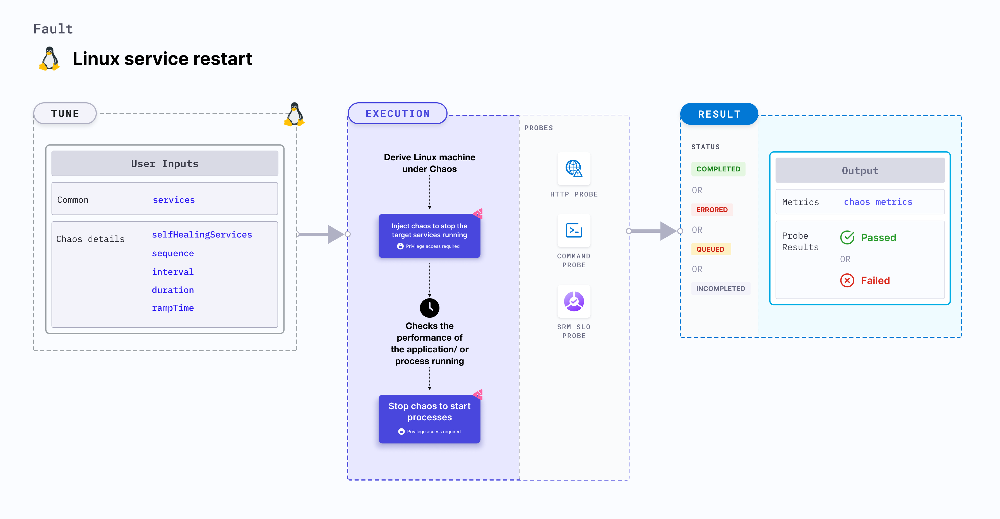

import Ossupport from './shared/note-supported-os.md'
import FaultPermissions from './shared/fault-permissions.md'


Linux service restart stops the target system services running in a Linux machine.
- It determines the performance and resilience of the application (or services) running on Linux machines.



## Use cases
- Service restart determines the resilience of an application upon random halts.
- Determines how efficiently an application recovers and restarts the services.

<Ossupport />

<FaultPermissions />

### Mandatory tunables
<table>
  <tr>
    <th> Tunable </th>
    <th> Description </th>
    <th> Notes </th>
  </tr>
  <tr>
    <td> services </td>
    <td> Names of the target services. </td>
    <td> For example <code>nginx,apache2,sshd</code> </td>
  </tr>
</table>

### Optional tunables
<table>
  <tr>
    <th> Tunable </th>
    <th> Description </th>
    <th> Notes </th>
  </tr>
  <tr>
    <td> selfHealingServices </td>
    <td> Set to <code>true</code> if the service restarts on its own upon stopping it. </td>
    <td> Defaults to <code>false</code>. </td>
  </tr>
  <tr>
    <td> sequence </td>
    <td> Sequence in which the services will be stopped. </td>
    <td> Supports <code>serial</code> and <code>parallel</code>. Defaults to <code>parallel</code>. </td>
  </tr>
  <tr>
    <td> interval </td>
    <td> Duration of a single iteration of chaos. Should be less than or equal to the <code>duration</code> input. Should be provided in <code>[numeric-hours]h[numeric-minutes]m[numeric-seconds]s</code> format.</td>
    <td> Default: <code>30s</code>. Examples: <code>1m25s</code>, <code>1h3m2s</code>, <code>1h3s</code> </td>
  </tr>
  <tr>
    <td> duration </td>
    <td> Duration through which chaos is injected into the target resource. Should be provided in <code>[numeric-hours]h[numeric-minutes]m[numeric-seconds]s</code> format. </td>
    <td> Default: <code>30s</code>. Examples: <code>1m25s</code>, <code>1h3m2s</code>, <code>1h3s</code> </td>
  </tr>
  <tr>
    <td> rampTime </td>
    <td> Period to wait before and after injecting chaos. Should be provided in <code>[numeric-hours]h[numeric-minutes]m[numeric-seconds]s</code> format. </td>
    <td> Default: <code>0s</code>. Examples: <code>1m25s</code>, <code>1h3m2s</code>, <code>1h3s</code> </td>
  </tr>
</table>

### Services

The `services` input variable targets services to be stopped.

The following YAML snippet illustrates the use of this input variable:

[embedmd]:# (./static/manifests/linux-service-restart/services.yaml yaml)
```yaml
# specify target services
apiVersion: litmuchaos.io/v1alpha1
kind: LinuxFault
metadata:
  name: linux-service-restart
  labels:
    name: service-restart
spec:
  serviceRestartChaos/inputs:
    services: "apache2,nginx"
    duration: 30s
```

### Self-healing services

The `selfHealingServices` input variable restarts the services on their own after the service was stopped.

The following YAML snippet illustrates the use of this input variable:

[embedmd]:# (./static/manifests/linux-service-restart/self-healing-services.yaml yaml)
```yaml
# specify self healing services
apiVersion: litmuchaos.io/v1alpha1
kind: LinuxFault
metadata:
  name: linux-service-restart
  labels:
    name: service-restart
spec:
  serviceRestartChaos/inputs:
    services: "apache2,nginx"
    selfHealingServices: true
    duration: 30s
```

### Sequence

The `sequence` input variable stops the services. Services can be stopped in parallel, that is, all services can be stopped at once for every iteration of chaos or serially, that is, one after the other for every iteration of chaos.

The following YAML snippet illustrates the use of this input variable:

[embedmd]:# (./static/manifests/linux-service-restart/sequence.yaml yaml)
```yaml
# specify chaos sequence
apiVersion: litmuchaos.io/v1alpha1
kind: LinuxFault
metadata:
  name: linux-service-restart
  labels:
    name: service-restart
spec:
  serviceRestartChaos/inputs:
    services: "apache2,nginx"
    sequence: "serial"
    duration: 30s
```

### Interval

The `interval` input variable specifies the duration of a single iteration of chaos, which is less than or equal to `duration`, and denotes the entire duration of the fault execution. You can tune multiple iterations of the chaos injection.

The following YAML snippet illustrates the use of this input variable:

[embedmd]:# (./static/manifests/linux-service-restart/interval.yaml yaml)
```yaml
# three iterations of chaos
apiVersion: litmuchaos.io/v1alpha1
kind: LinuxFault
metadata:
  name: linux-service-restart
  labels:
    name: service-restart
spec:
  serviceRestartChaos/inputs:
    services: "apache2,nginx"
    sequence: "parallel"
    duration: 30s
    interval: 10s
```
