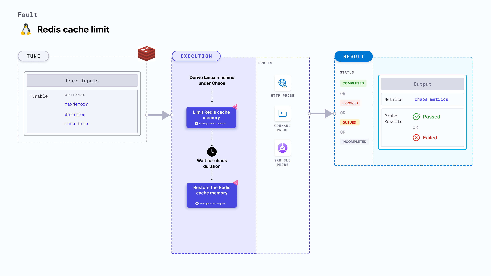

import Ossupport from './shared/note-supported-os.md'
import FaultPermissions from './shared/fault-permissions.md'
import AuthenticationDetails from './shared/redis-auth.md'

Redis cache limit fault limits the amount of memory used by a Redis cache. The original limit is restored after the chaos duration.



## Use cases
Determines the resilience of Redis-dependant applications on frequent cache misses that occur due to a low cache size.

<Ossupport />

<FaultPermissions />

<AuthenticationDetails />

### Optional tunables

<table>
  <tr>
    <th> Tunable </th>
    <th> Description </th>
    <th> Notes </th>
  </tr>
  <tr>
    <td> address </td>
    <td> The address of the Redis server. </td>
    <td> If a password or certificate is also required alongside the address, please use the <a href="#redis-authentication">secret file approach</a>. </td>
  </tr>
  <tr>
    <td> maxMemory </td>
    <td> The percentage of existing Redis maxMemory or an absolute amount (in MB, KB, GB) that should be used by Redis.</td>
    <td> Default: 50 %. For more information, go to <a href="#maximum-memory">maximum memory.</a> </td>
  </tr>
  <tr>
    <td> duration </td>
    <td> Duration through which chaos is injected into the target resource. Should be provided in <code>[numeric-hours]h[numeric-minutes]m[numeric-seconds]s</code> format. </td>
    <td> Default: <code>30s</code>. Examples: <code>1m25s</code>, <code>1h3m2s</code>, <code>1h3s</code>. For more information, go to <a href="/docs/chaos-engineering/use-harness-ce/chaos-faults/common-tunables-for-all-faults#duration-of-the-chaos">duration.</a></td>
  </tr>
  <tr>
    <td> rampTime </td>
    <td> Period to wait before and after injecting chaos. Should be provided in <code>[numeric-hours]h[numeric-minutes]m[numeric-seconds]s</code> format. </td>
    <td> Default: <code>0s</code>. Examples: <code>1m25s</code>, <code>1h3m2s</code>, <code>1h3s</code>. For more information, go to <a href="/docs/chaos-engineering/use-harness-ce/chaos-faults/common-tunables-for-all-faults#ramp-time">ramp time</a>. </td>
  </tr>
</table>

### Maximum memory

The `maxMemory` input variable indicates the percentage of Redis cache memory or absolute memory used by Redis to limit during the chaos duration. Its default value is 50 %.

The following YAML snippet illustrates the use of this input variable:

[embedmd]:# (./static/manifests/redis-cache-limit/max-memory.yaml yaml)
```yaml
apiVersion: litmuchaos.io/v1alpha1
kind: LinuxFault
metadata:
  name: redis-cache-limit
  labels:
    name: cache-limit
spec:
  redisChaos/inputs:
    duration: "30s"
    maxMemory: "50%"
    rampTime: ""
```
